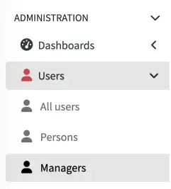
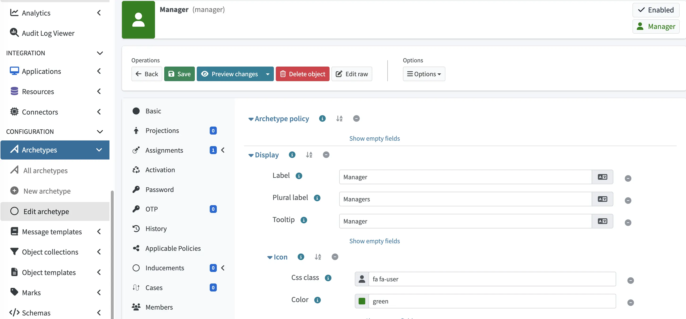

= Add Menu Categories Using Archetypes
:toc: top
:icons: font
:page-description: This guide explains how to add menu categories to the midPoint GUI using archetypes.
:page-keywords: midPoint, archetype, menu category, admin GUI, configuration
:experimental:

This how-to guide explains how to add menu categories to the midPoint GUI using archetypes.

== Introduction

You can use archetypes to create dedicated menu subcategories in the midPoint GUI main navigation menu.
This allows you to provide users with focused entry points to specific groups of objects (for example, managers, contractors, or service accounts) while also using the archetypes to define their policy, display, and lifecycle characteristics.

You can apply menu subcategories to most object types, most commonly `UserType`, `RoleType`, `OrgType`, and `ServiceType`. For the full list of supported holder types, refer to xref:/midpoint/reference/schema/archetypes/[].

In general, you can use the following configuration patterns to define menu categories:

* **Archetype-based** — Recommended when objects need a persistent classification that drives policy, display, and lifecycle behavior.
* **Object collection-based** — Suitable for ad-hoc xref:/midpoint/reference/admin-gui/collections-views/[views] defined by a filter rather than object membership.

This guide covers the archetype-based approach but it also uses object collection views to reference archetypes in the system configuration.

In this how-to, we will create a new [.nowrap]#icon:user[] btn:[Managers]# menu category under the [.nowrap]#icon:user[] btn:[Users]# section of the main navigation menu.

== Prerequisites

* A running midPoint instance.
* Administrative privileges sufficient to create archetypes and modify xref:/midpoint/reference/concepts/system-configuration-object/[`systemConfiguration`].
* Optional: familiarity with the midPoint XML schema for the manual configuration paths.

== Configuration overview

Implementing a menu category via archetypes requires the following configuration steps:

. Define an archetype that targets a specific holder type and carries the display metadata (label, icon, colour).
. Register the archetype in `systemConfiguration` under `adminGuiConfiguration/objectCollectionViews` so it surfaces in the navigation menu.

[[archetype_configuration]]
== Step 1 — Configure archetype

=== Configure the holder type

The holder type binds the archetype to a specific object class (for example, `UserType`).
It determines which object types can be assigned the archetype and, consequently, where the category will appear in the GUI.

[NOTE]
====
Holder type assignments cannot currently be configured through the GUI. XML editing is required.
====

In the archetype that you want to use as your menu category, paste the following XML snippet to configure the holder type.
Replace `UserType` with the desired holder type.
In the GUI, you can do this by opening the archetype and clicking [.nowrap]#icon:edit[] btn:[Edit raw]#.

.Holder type configuration in XML
[source,xml]
----
<archetype>
    ...
    <assignment>
        <identifier>holderType</identifier>
        <activation>
            <effectiveStatus>enabled</effectiveStatus>
        </activation>
        <assignmentRelation>
            <holderType>UserType</holderType>
        </assignmentRelation>
    </assignment>
    ...
</archetype>
----

For details on assignment relations, see xref:/midpoint/reference/schema/archetypes/configuration/#assignment-relation[].

=== Configure display attributes

Display the attributes that control how the archetype is rendered in the menu and in the object detail views, i.e., label, plural label, tooltip, and icon. These can be configured either through the GUI or directly in XML.

==== GUI

. Open the target archetype and click [.nowrap]#icon:circle[] btn:[Archetype policy]#.
. Expand the *Archetype policy* > *Display* section and set the following:
+
[%autowidth]
|===
| Attribute | Example value

| Label         | Manager
| Plural label  | Managers
| Tooltip       | Manager
|===

. Expand the *Icon* section and set the following:
+
[%autowidth]
|===
| Attribute | Example value

| CSS class | `fa fa-user`
| Color     | `green`
|===

+

. [.nowrap]#icon:save[] btn:[Save]# the archetype.

==== XML

[source,xml]
----
<archetype>
    ...
    <archetypePolicy>
        <display>
            <label>
                <t:orig>Manager</t:orig>
                <t:norm>manager</t:norm>
                <t:translation>
                    <t:key>Manager.label</t:key>
                </t:translation>
            </label>
            <pluralLabel>
                <t:orig>Managers</t:orig>
                <t:norm>managers</t:norm>
                <t:translation>
                    <t:key>Managers.pluralLabel</t:key>
                </t:translation>
            </pluralLabel>
            <tooltip>Manager</tooltip>
            <icon>
                <cssClass>fa fa-user</cssClass>
                <color>green</color>
            </icon>
        </display>
    </archetypePolicy>
    ...
</archetype>
----

[TIP]
====
The `cssClass` attribute accepts any link:https://fontawesome.com/[Font Awesome] icon class as well as classes from the link:https://github.com/Evolveum/font-evosome[Evolveum font-evosome] icon set. The `color` attribute accepts any valid CSS color value, including named colors and RGB hexadecimal notation (for example, `#3a8a3a`).
====

== Step 2 — Register the archetype in system configuration

Once the archetype is defined, it must be referenced from `systemConfiguration` so that the GUI renders it as a menu category.

////
=== GUI

. Navigate to [.nowrap]#icon:cog[] btn:[System]# > [.nowrap]#icon:desktop[] btn:[Admin GUI Configuration]# > *Object Collection views*.
. Next to the *Object collection view*, click icon:plus-circle[] to add a new view and complete the *Basic* section:
+
[%autowidth]
|===
| Attribute | Example value

| Identifier | Manager
| Type       | User
|===

. In the **Collection** section, click **Edit** next to **Collection ref** and select the archetype created in .
. Click **Done** and [.nowrap]#icon:save[] btn:[Save]# the system configuration.
////

In `objectCollectionViews`, add a new `objectCollectionView` element that references the archetype created in the <<archetype_configuration,previous step>>.
The `type` element must match the holder type defined in the archetype (in this example, it is `UserType`), while the `collectionRef` element must reference the archetype's OID.

.Example XML configuration for objectCollectionViews
[source,xml]
----
<systemConfiguration>
    ...
    <adminGuiConfiguration>
        <objectCollectionViews>
            ...
            <!-- Reference to the archetype created in Step 1 -->
            <objectCollectionView>
                <type>UserType</type>
                <collection>
                    <collectionRef
                        oid="73732a88-3a9e-456e-9db8-1212107b39c2"
                        relation="org:default"
                        type="c:ArchetypeType"/>
                </collection>
            </objectCollectionView>
            ...
        </objectCollectionViews>
    </adminGuiConfiguration>
    ...
</systemConfiguration>
----

== Verification

After applying the configuration:

* The new category appears under the corresponding object type in the main navigation menu, rendered with the configured label, and icon.
* The category is offered as a selectable archetype on the **New user** (or equivalent) creation screen.

[NOTE]
====
Menu changes may be cached in your user session. If the new category does not appear immediately, log out and log back in to force the GUI configuration to reload.
====

== Related topics

* xref:/midpoint/reference/schema/archetypes/[]
* xref:/midpoint/reference/admin-gui/admin-gui-config/[]
* xref:/midpoint/reference/admin-gui/collections-views/[] — An alternative pattern based on filter-defined collections rather than archetype membership.
