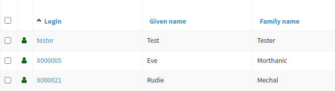

= Admin GUI Configuration - Examples
:page-nav-title: Configuration - Examples
:page-keywords: [ "adminGuiConfig", "examples" ]
:page-toc: top
:page-upkeep-status: green

== Display Some Default Panels Only

Suppose you want to display only "Basic", "Password", "Activation" and "Assignment" panels in the user details page.
Then you can define a role according the example.

.Example
[%collapsible]
====
[source,xml]
----
<role>
     ...
     <adminGuiConfiguration>
        <objectDetails>
            <objectDetailsPage>
              <type>c:UserType</type>
              <panel>
                <identifier>projections</identifier>
                <visibility>hidden</visibility>
              </panel>
              <panel>
                <identifier>focusCases</identifier>
                <visibility>hidden</visibility>
              </panel>
              <panel>
                <identifier>history</identifier>
                <visibility>hidden</visibility>
              </panel>
              <panel>
                <identifier>focusTriggers</identifier>
                <visibility>hidden</visibility>
              </panel>
              <panel>
                <identifier>personas</identifier>
                <visibility>hidden</visibility>
              </panel>
              <panel>
                <identifier>userDelegations</identifier>
                <visibility>hidden</visibility>
              </panel>
              <panel>
                <identifier>delegatedToMe</identifier>
                <visibility>hidden</visibility>
              </panel>
            </objectDetailsPage>
        </objectDetails>
    </adminGuiConfiguration>
</role>
----
====

If user has this role assigned, he will see basic, password, activation and assignments panels only.
The projections, history and other menu links will be hidden.

Of course, if the user has other roles that give him access to more panels, than he will see these tabs as well.

== Customize assignments views

There are several options how to customize assignments views.

.Example: Hiding "All assignments" panel.
[%collapsible]
====
[source,xml]
----
<adminGuiConfiguration>
    <objectDetails>
        <objectDetailsPage>
          <type>c:UserType</type>
          <panel>
              <identifier>assignments</identifier>
              <panel>
                  <identifier>allAssignments</identifier>
                  <visibility>hidden</visibility>
              </panel>
            </panel>
        </objectDetailsPage>
    </objectDetails>
</adminGuiConfiguration>
----
====

.Example: Hiding "All assignments" panel and showing its contents in "Assignments" directly
[%collapsible]
====
[source,xml]
----
<adminGuiConfiguration>
    <objectDetails>
        <objectDetailsPage>
          <type>c:UserType</type>
          <panel>
              <identifier>assignments</identifier>
              <panelType>allAssignments</panelType>
              <panel>
                  <identifier>allAssignments</identifier>
                  <visibility>hidden</visibility>
              </panel>
            </panel>
        </objectDetailsPage>
    </objectDetails>
</adminGuiConfiguration>
----
====

.Example: Change display name and icon for "Service assignments".
[%collapsible]
====
[source,xml]
----
<adminGuiConfiguration>
  <objectDetails>
    <objectDetailsPage>
      <type>c:UserType</type>
      <panel>
          <identifier>assignments</identifier>
          <panel>
              <identifier>serviceAssignments</identifier>
              <display>
                <label>Applications</label>
                <icon>
                  <cssClass>fa fa-gamepad</cssClass>
                </icon>
              </display>
          </panel>
        </panel>
    </objectDetailsPage>
  </objectDetails>
</adminGuiConfiguration>
----
====

.Example: Define custom collection for role assignments with default role panel.
[%collapsible]
====
[source,xml]
----
<adminGuiConfiguration>
  <objectDetails>
    <objectDetailsPage>
      <type>c:UserType</type>
      <panel>
          <identifier>assignments</identifier>
          <panel>
              <identifier>custom-role-assignments</identifier>
              <display>
                  <label>My own role assignments</label>
                  <tooltip>Custom assignments table requests</tooltip>
              </display>
              <panelType>roleAssignments</panelType>
              <listView>
                  <identifier>role-assignmnets-view</identifier>
                  <type>c:AssignmentType</type>
                  <collection>
                      <collectionRef oid="e97b857f-3228-4df5-a920-67157b77d736" relation="org:default" type="c:ObjectCollectionType">
                          <!-- Custom collection definigion (mainly filtering) -->
                      </collectionRef>
                  </collection>
              </listView>
            </panel>
        </panel>
    </objectDetailsPage>
  </objectDetails>
</adminGuiConfiguration>
----
====

.Example: Customize role assignment details by creating virtual sections.
[%collapsible]
====
[source,xml]
----
<adminGuiConfiguration>
  <objectDetails>
    <objectDetailsPage>
      <type>c:UserType</type>
      <panel>
          <identifier>assignments</identifier>
          <panel>
              <identifier>roleAssignments</identifier>
              <container>
                  <identifier>basicAssignmentAttributes</identifier>
                  <display>
                      <label>Description attributes</label>
                  </display>
                  <item>
                      <path>assignment/documentation</path>
                  </item>
                  <item>
                      <path>assignment/description</path>
                  </item>
              </container>
              <panelType>roleAssignments</panelType>
          </panel>
        </panel>
    </objectDetailsPage>
  </objectDetails>
</adminGuiConfiguration>
----
====

.Example: Customize assignment menu - show only role and org assignments on top level.
[%collapsible]
====
[source,xml]
----
<adminGuiConfiguration>
  <objectDetails>
    <objectDetailsPage>
      <type>c:UserType</type>
      <panel>
          <identifier>assignments</identifier>
          <visibility>hidden</visibility>
      </panel>
      <panel>
          <identifier>top-role-assignments</identifier>
          <display>
            <label>Roles</label>
            <icon>
              <cssClass>fe fe-role</cssClass>
            </icon>
          </display>
          <panelType>roleAssignments</panelType>
      </panel>
      <panel>
          <identifier>top-org-assignments</identifier>
          <display>
            <label>Orgs</label>
            <icon>
              <cssClass>fa fa-building</cssClass>
            </icon>
          </display>
          <panelType>orgAssignments</panelType>
      </panel>
    </objectDetailsPage>
  </objectDetails>
</adminGuiConfiguration>
----
====

== Customize All Accesses panel

All accesses panel displays all direct and indirect assignments in more "business" language.
It displays how the assignment was assigned and why.
It displays full path how the target role is assigned for indirect assignments - it means all the higher level roles and ORGs from the top level directly assigned to the user.

Technically - the panel displays structure from roleMembershipRef user attribute.

In default configuration midPoint displays all assignments.
But, not every assignment of role may represent access.
E.g. assignment with relation owner may or may not define access.
This depends on your organization environment.

MidPoint allows engineers to modify the All Accesses panel.
This example hides original All accesses panel and creates custom panel filtered to assignments with relation=default.
It adds relation column to the panel's view.

.Example: Filtering set of assignments and adding custom column
[%collapsible]
====
[source,xml]
----
    <panel>
        <identifier>igaAccesses</identifier>
        <documentation>Hide original All Acesses panel</documentation>
        <visibility>hidden</visibility>
    </panel>

    <panel>
        <identifier>all-accesses-custom</identifier>
        <documentation>Custom all accesses panel - filtered to relation=default and added relation column</documentation>
        <display>
            <label>All Accesses</label>
        </display>
        <displayOrder>25</displayOrder>
        <panelType>userAllAccesses</panelType>
        <listView>
            <identifier>addedRelationView</identifier>
            <column>
                <name>relationColumnName</name>
                <display>
                    <label>Relation</label>
                </display>
                <export>
                    <expression>
                        
                    </expression>
                </export>
            </column>
            <includeDefaultColumns>true</includeDefaultColumns>
            <type>c:ObjectReferenceType</type>
            <collection>
                <filter>
                    <q:text>. matches (relation = org:default)</q:text>
                </filter>
            </collection>
        </listView>
    </panel>
----
====

In case there is a need to filter assignments by some of the target object attributes, it is possible to use the following filter configuration.

.Example: Filtering set of assignments which target objects are members of the archetype with "archetype1" name
[%collapsible]
====
[source,xml]
----
    <panel>
        <identifier>all-accesses-custom</identifier>
        ....
        <panelType>userAllAccesses</panelType>
        <listView>
            <identifier>addedRelationView</identifier>
            <type>c:ObjectReferenceType</type>
            <collection>
                <filter>
                    <q:text>. matches (targetType = RoleType and @ matches (. type RoleType and archetypeRef/@/name = "archetype1"))</q:text>
                </filter>
            </collection>
        </listView>
    </panel>
----
====

== Virtual sections for different panel

Suppose you need to somehow re-arrange basic properties for object, or have a lot of extension attributes which need to be divided to different sections.
It is possible to use _virtual sections_ for different panels.
Below are some examples:

.Example: Virtual sections for user basic panel.
[%collapsible]
====
[source,xml]
----
<adminGuiConfiguration>
  <objectDetails>
    <objectDetailsPage>
      <type>c:UserType</type>
      <panel>
          <identifier>basic</identifier>
          <container>
              <identifier>basicAttributes</identifier>
              <display>
                  <label>Basic attributes</label>
              </display>
              <item>
                  <path>familyName</path>
              </item>
              <item>
                  <path>givenName</path>
              </item>
              <item>
                  <path>fullName</path>
              </item>
          </container>
          <container>
              <identifier>contactAttributes</identifier>
              <display>
                  <label>Contact attributes</label>
              </display>
              <item>
                  <path>emailAddress</path>
              </item>
              <item>
                  <path>telephoneNumber</path>
              </item>
              <item>
                  <path>employeeNumber</path>
              </item>
          </container>
          <panelType>basic</panelType>
      </panel>
    </objectDetailsPage>
  </objectDetails>
</adminGuiConfiguration>
----
====

.Example: Custom panel with multi-value extension attribute
[%collapsible]
====
[source,xml]
----
<adminGuiConfiguration>
  <objectDetails>
    <objectDetailsPage>
      <type>c:UserType</type>
      <panel>
          <identifier>address-panel</identifier>
          <description>Custom panel for multivalue extension attribute address</description>
          <display>
              <label>Address</label>
              <icon>
                  <cssClass>fa fa-map-o</cssClass>
              </icon>
          </display>
          <container>
              <identifier>address</identifier>
              <display>
                  <label>Address</label>
              </display>
              <path xmlns:ext="http://example.com/midpoint">c:extension/ext:address</path>
          </container>
          <panelType>formPanel</panelType>
      </panel>
    </objectDetailsPage>
  </objectDetails>
</adminGuiConfiguration>
----
====

.Example: Virtual section on role assignment details panel
[%collapsible]
====
[source,xml]
----
<adminGuiConfiguration>
  <objectDetails>
    <objectDetailsPage>
      <type>c:UserType</type>
      <panel>
          <identifier>assignments</identifier>
          <panel>
              <identifier>roleAssignments</identifier>
              <container>
                  <identifier>basicAssignmentAttributes</identifier>
                  <display>
                      <label>Description attributes</label>
                  </display>
                  <item>
                      <path>assignment/documentation</path>
                  </item>
                  <item>
                      <path>assignment/description</path>
                  </item>
              </container>
              <panelType>roleAssignments</panelType>
          </panel>
        </panel>
    </objectDetailsPage>
  </objectDetails>
</adminGuiConfiguration>
----
====

== Change order in menu link

.Example: Change ordering of the menu links in details panel.
[%collapsible]
====
[source,xml]
----
<adminGuiConfiguration>
  <objectDetails>
    <objectDetailsPage>
      <type>c:UserType</type>
      <panel>
          <identifier>password</identifier>
          <displayOrder>11</displayOrder>
      </panel>
      <panel>
          <identifier>activation</identifier>
          <displayOrder>12</displayOrder>
      </panel>
    </objectDetailsPage>
  </objectDetails>
</adminGuiConfiguration>
----
====

== Change default panel

Set another panel as `basic` panel to be shown as a default panel after opening user details page.

.Example
[%collapsible]
====
[source,xml]
----
<adminGuiConfiguration>
  <objectDetails>
    <objectDetailsPage>
      <type>c:UserType</type>
      <panel>
          <identifier>password</identifier>
          <default>true</default>
      </panel>
      <panel>
          <identifier>basic</identifier>
          <default>false</default>
      </panel>
    </objectDetailsPage>
  </objectDetails>
</adminGuiConfiguration>
----
====

== Configure fullText search item on the members basic search panel

Search configuration will be applied on the organization members panel.
Such configuration gives the possibility to use fullText search together with specific member filters (such as scope, relation, direct/indirect etc.)
Be aware that fullText must be enabled to make this configuration work.

.Example
[%collapsible]
====
[source,xml]
----
    <adminGuiConfiguration>
        <objectDetails>
            <objectDetailsPage>
                <type>c:OrgType</type>
                <panel>
                    <identifier>orgMembers</identifier>
                    <listView>
                        <searchBoxConfiguration>
                            <defaultMode>basic</defaultMode>
                            <searchItems>
                                <searchItem>
                                    <filter>
                                        <q:text>. fullText $valueParam</q:text>
                                    </filter>
                                    <display>
                                        <label>Fulltext filter</label>
                                    </display>
                                    <parameter>
                                        <name>valueParam</name>
                                        <type>string</type>
                                    </parameter>
                                </searchItem>
                            </searchItems>
                        </searchBoxConfiguration>
                    </listView>
                </panel>
            </objectDetailsPage>
        </objectDetails>
    </adminGuiConfiguration>
----
====

== New Custom Form in a Role

// TODO: intro, context ?

Possible visibility values are:

[%autowidth]
|===
| Value | Description

| automatic
| The element will be visible if the authorisations of the current user allows to see (at least a part) of the content that the element displays.

| visible
| The element will be always visible.

| vacant
| The element will not be visible.
Not even if the authorizations allow to see its content.
But if any other role specifies the element as visible or automatic then it will be visible.
This setting is easily overridden.

| hidden
| The element is never visible.
Even if any other role specifies the element as visible, then the element will still remain hidden.
This setting cannot be overridden

|===

Possible widget identifiers on the self dashboard page:

[%autowidth]
|===
| Identifier | Widget

| `http://midpoint.evolveum.com/xml/ns/public/gui/component-3/dashboard/widget#search`
| Search widget

| `http://midpoint.evolveum.com/xml/ns/public/gui/component-3/dashboard/widget#myWorkItems`
| User work items data widget

| `http://midpoint.evolveum.com/xml/ns/public/gui/component-3/dashboard/widget#shortcuts`
| Dashboard links widget

| `http://midpoint.evolveum.com/xml/ns/public/gui/component-3/dashboard/widget#myRequests`
| User requests data widget

| `http://midpoint.evolveum.com/xml/ns/public/gui/component-3/dashboard/widget#myAssignments`
| User assignments data widget

| `http://midpoint.evolveum.com/xml/ns/public/gui/component-3/dashboard/widget#myAccounts`
| User accounts data widget

|===

== Custom columns configuration

To customize columns in the object list table, please, see the following example

.Example
[%collapsible]
====
[source,xml]
----
<!-- configuring custom columns for the user objects table -->

<adminGuiConfiguration>
   <objectCollectionViews>
      <objectCollectionView>
         <identifier>allUsers</identifiers>
         <!-- use your existing objectCollectionView identifier
         or allUsers to override default user list columns -->
         <type>UserType</type>
         <column>
            <name>nameColumn</name>
            <path>name</path>
            <display>
               <label>Login</label>
            </display>
         </column>
         <column>
            <name>givenNameColumn</name>
            <path>givenName</path>
            <previousColumn>nameColumn</previousColumn>
         </column>
         <column>
            <name>familyNameColumn</name>
            <path>familyName</path>
            <previousColumn>givenNameColumn</previousColumn>
         </column>
      </objectCollectionView>
   </objectCollectionViews>
</adminGuiConfiguration>
----
====

Column can be configured with the following attributes

[%autowidth]
|===
| Attribute | Description

| `name`
| Column name (identifier).
This element is not displayed to the user.
It is used for identification of the column and referencing (e.g. previous column).
The column definitions that have the same name in different layers (global, role, user) will be merged together.

| `description`
| Free-form description.
It is not displayed to the user.
It is supposed to be used by system administrators to explain the purpose of the configuration.

| `path`
| Path of the item (property) that this form display or that is taken as an primary input for the expression (planned for future).
Even if expression is used to display the column value, we need some reference field that will be used to sort the table when sorting by this column is selected.
We cannot sort by the output of the expression as that is not stored in the repo.

| `display`
a| Specification of column display properties.
This can be used to override the default column label or presentation style. `display` attribute can contain:

* `label`

* `tooltip` (not implemented yet)

* `help` (not implemented yet)

* `cssStyle` (not implemented yet)

* `cssClass` (not implemented yet)

| `visibility`
| Defines, whether this column will be visible or it will be hidden. +
If not specified then it defaults to automatic visibility.

| `previousColumn`
| Name of the column that has to be displayed before this column.
This value defines ordering in which the columns should be displayed.
The first column has no value in this element.
If there are multiple columns that specify the same preceding columns then the implementation may choose any ordering of such columns.
However, the algorithm should be deterministic: the same ordering should be used every time (alphabeting ordering based on `path` or displayOrder from the schema are good candidates for deterministic ordering).

|===

== Organizational Structure GUI Page Customization

// TODO: intro, context?

.Example
[%collapsible]
====
[source,xml]
----
    <adminGuiConfiguration>
        <objectCollectionViews>
            <objectCollectionView>
                <identifier>orgMember</identifier>
                <type>OrgType</type>
                <additionalPanels>
                    <memberPanel>
                        <searchBoxConfiguration>
                            <defaultScope>oneLevel</defaultScope> <!-- or "subtree" -->
                            <defaultObjectType>UserType</defaultObjectType>
                        </searchBoxConfiguration>
                        <disableSorting>true</disableSorting>
                    </memberPanel>
                </additionalPanels>
            </objectCollectionView>
        </objectCollectionViews>
    </adminGuiConfiguration>
----
====

== Default settings for object details pages

This part of the configuration is already included in the initial system configuration object.

.Example
[%collapsible]
====
[source,xml]
----
    <adminGuiConfiguration>
        <objectDetails>
            <defaultSettings>
                <pagingOptions>
                    <availablePageSize>10</availablePageSize>
                    <availablePageSize>20</availablePageSize>
                    <availablePageSize>50</availablePageSize>
                    <availablePageSize>100</availablePageSize>
                </pagingOptions>
            </defaultSettings>
            ....
        </objectDetails>
    </adminGuiConfiguration>
----
====

== Overriding default paging settings for 'All Assignments' panel on the User details page

This example shows how the default paging settings can be overridden for the 'All Assignments' panel on the User details page.
The page size component will contain the values 10, 30, 60, 80, 100 with the default page size set to 30.

.Example
[%collapsible]
====
[source,xml]
----
    <adminGuiConfiguration>
        <objectDetails>
            <objectDetailsPage>
                <type>c:UserType</type>
                <panel>
                    <identifier>assignments</identifier>
                    <panel>
                        <identifier>allAssignments</identifier>
                        <listView>
                            <paging>
                                <maxSize>30</maxSize>
                            </paging>
                            <pagingOptions>
                                <availablePageSize>10</availablePageSize>
                                <availablePageSize>30</availablePageSize>
                                <availablePageSize>60</availablePageSize>
                                <availablePageSize>80</availablePageSize>
                            </pagingOptions>
                        </listView>
                    </panel>
                </panel>
            </objectDetailsPage>
        </objectDetails>
    </adminGuiConfiguration>
----
====

== Default settings for object collection views

This part of the configuration is already included in the initial system configuration object.

.Example
[%collapsible]
====
[source,xml]
----
    <adminGuiConfiguration>
        <objectCollectionViews>
            <defaultSettings>
                <pagingOptions>
                    <availablePageSize>10</availablePageSize>
                    <availablePageSize>20</availablePageSize>
                    <availablePageSize>50</availablePageSize>
                    <availablePageSize>100</availablePageSize>
                </pagingOptions>
            </defaultSettings>
            ....
        </objectCollectionViews>
    </adminGuiConfiguration>
----
====

== Overriding default paging settings for 'Persons' collection view

This example shows how the default paging settings can be overridden for the 'Persons' collection view.
The page size component will contain the values 50, 100, 150, 200 with the default page size set to 200.

.Example
[%collapsible]
====
[source,xml]
----
    <adminGuiConfiguration>
        <objectCollectionViews>
            <objectCollectionView>
                <description>Persons</description>
                <documentation>This view displays all users with archetype "Person"</documentation>
                <identifier>person-view</identifier>
                <displayOrder>10</displayOrder>
                <type>UserType</type>
                <collection>
                    <collectionRef oid="00000000-0000-0000-0000-000000000702" relation="org:default" type="c:ArchetypeType">
                        <!-- Person -->
                    </collectionRef>
                </collection>
                <paging>
                    <maxSize>200</maxSize>
                </paging>
                <pagingOptions>
                    <availablePageSize>100</availablePageSize>
                    <availablePageSize>150</availablePageSize>
                    <availablePageSize>200</availablePageSize>
                </pagingOptions>
                ....
            </objectCollectionView>
        </objectCollectionViews>
    </adminGuiConfiguration>
----
====

See also: xref:/midpoint/reference/admin-gui/collections-views/[Object Collections and Views]
