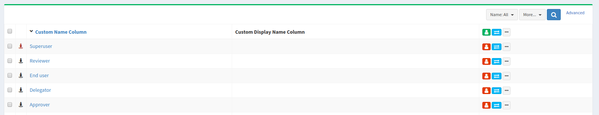

= Admin GUI Configuration 4.0
:page-wiki-name: Admin GUI Configuration
:page-wiki-id: 24085280
:page-wiki-metadata-create-user: semancik
:page-wiki-metadata-create-date: 2017-02-17T11:05:38.577+01:00
:page-wiki-metadata-modify-user: honchar
:page-wiki-metadata-modify-date: 2020-03-10T12:05:23.328+01:00
:page-keywords: [ "adminGuiConfig" ]
:page-upkeep-status: yellow
:page-toc: top

Admin GUI configuration is a specialized data structure that is present in xref:/midpoint/reference/concepts/system-configuration-object/[system configuration object],
in all the role-like objects (roles, orgs, services) and also in the xref:/midpoint/architecture/archive/data-model/midpoint-common-schema/usertype/[user objects].
The admin GUI configuration structure influences how to user interface is displayed.
Despite its name it applies both to the self-service part and administration part of the user interface.

== Basic Structure

The admin GUI configuration structure contains:

* *`objectForms`*: User interface displays forms that use for editing various aspects of the objects.
There is form that display basic properties, assignments, projections, history and so on.
These are usually displayed as tabs on object detail pages in the user interface.
The objectForms part of the admin GUI configuration controls which of these forms/tabs are displayed and which are not.

* `*userDashboard*`: (since midPoint 3.6) This setting controls which widgets are displayed on user dashboard (home screen).

* *`defaultTimezone`*: Defines the timezone that will be used by the user interface to display date and time information.

* `*preferredDataLanguage*`: (since midPoint 3.6) Defines the data language that will use used by the user interface to display content of objects (XML, JSON or YAML)

* `*additionalMenuLink*`: Links that will be displayed as an additional items in the user interface menu.
It can be used to point the user to other services in your deployment.

* *`userDashboardLink`*: Application or shortcut links placed on end-user dashboard.
Note: this configuration will be most likely placed inside the `userDashborad` in the future.
However the compatibility will be maintained and this setting will also remain here.

* *`feedbackMessagesHook`*: Script hook configuration which can be used to modify operation results shown in GUI.

== How It Works

The same admin GUI configuration structure may be specified in xref:/midpoint/reference/concepts/system-configuration-object/[system configuration object], in all the role-like objects (roles, orgs, services) and also in the xref:/midpoint/architecture/archive/data-model/midpoint-common-schema/usertype/[user objects] (starting from midPoint v 4.1: in all AssignmentHolderType objects).
When a specific user logs in, midPoint will process all of user's roles to check for applicable authorizations.
At the same time midPoint also compiles the effective admin GUI configuration.
Following algorithm is used:

* Admin GUI configuration in the xref:/midpoint/reference/concepts/system-configuration-object/[system configuration object] is applied first (if present).

* Admin GUI configuration from all of the active roles, orgs and services is applied on top of that.

** The simple single-valued configuration properties such as default timezone are overwritten.
Therefore the role setting completely overrides the system global setting.
If several roles specify conflicting values then the behavior is unpredictable.
It is a responsibility of midPoint administrator to ensure the consistency.

** Complex configuration structures such as objectForms and dashboard definitions are merged.
The system global definition is merged with the definition from all the roles.

* Admin GUI config provided in the xref:/midpoint/architecture/archive/data-model/midpoint-common-schema/usertype/[user object] is applied last (if present).

The resulting merged configuration is used to display the user interface for a particular user.

This mechanism provides a very flexible customization of user interface.
And the customization is inherently role-based.
This mechanism can be used to display different object detail forms to different users.
E.g. auditors will see the object history tab, but other user will not see it.
Each role can have unique combination of the tabs.
And as we have a merging algorithm in place, if a user has many roles he will see all the tabs specified by all the roles.
Similar approach can be used to pre-define time zones and languages.
If users are placed to organizational units according to their physical location then a time zone can be easily defined in that organizational unit admin GUI configuration.

The last step that applies admin GUI configuration from the user object is meant to store and re-apply user's own preferences about user interface look and feel.
At the time of this writing (midPoint 3.6) it is only partially implemented.

The merged configurations (forms, widgets) have one quite specific characteristic.
If no configuration is present at all, then a default configuration will be used (all default tabs, all default widgets).
However if only a single form or widget is defined then the default configuration is not applied.
All forms/widgets need to be explicitly defined.
The forms have additional setting that includes all the default forms (`includeDefaultForms`) if that is needed.
However, there is no such setting for widgets.
Any number of forms can be combined together as each form is in a separate tab.
But there is only a limited number of widgets and they all are built to have their fixed place.
This may change in the future and the dashboards may become more flexible.
But they are not that flexible yet.
Therefore all the widgets need to be explicitly defined in order to appear in a customized dashboard.

The default (built-in) forms has their URIs that can be used to refer to them (see an example below).
These are the URIs:

[%autowidth]
|===
| Form (tab) | URI | Description

| Basic
| `http://midpoint.evolveum.com/xml/ns/public/gui/component-3#focusTabBasic`
|

| Projections
| `http://midpoint.evolveum.com/xml/ns/public/gui/component-3#focusTabProjections`
|

| Assignments
| `http://midpoint.evolveum.com/xml/ns/public/gui/component-3#focusTabAssignments`
|

| Personas
| `http://midpoint.evolveum.com/xml/ns/public/gui/component-3#focusTabPersonas`
|

| Tasks
| `http://midpoint.evolveum.com/xml/ns/public/gui/component-3#focusTabTasks`
|

| Request a role
| `http://midpoint.evolveum.com/xml/ns/public/gui/component-3#focusTabRequestRole`
|

| History
| `http://midpoint.evolveum.com/xml/ns/public/gui/component-3#focusTabObjectHistory`
|

| Inducements
| `http://midpoint.evolveum.com/xml/ns/public/gui/component-3#focusTabInducements`
|

| Governance
| `http://midpoint.evolveum.com/xml/ns/public/gui/component-3#focusTabGovernance`
|

| Delegations
| `http://midpoint.evolveum.com/xml/ns/public/gui/component-3#focusTabDelegations`
|

| Delegated to me
| `http://midpoint.evolveum.com/xml/ns/public/gui/component-3#focusTabDelegatedToMe`
|

| Policy constraints
| `http://midpoint.evolveum.com/xml/ns/public/gui/component-3#focusTabPolicyConstraints`
|

| Policy rules
| `http://midpoint.evolveum.com/xml/ns/public/gui/component-3#focusTabPolicyRules`
|

| `Applicable policies`
| `http://midpoint.evolveum.com/xml/ns/public/gui/component-3#focusTabApplicablePolicies`
|

| `Consents`
| `http://midpoint.evolveum.com/xml/ns/public/gui/component-3#focusTabConsents`
|

| Members
| `http://midpoint.evolveum.com/xml/ns/public/gui/component-3#focusTabMembers`
|

3+| *Form (tab) authorizations for Task objects*

| Basic
| `http://midpoint.evolveum.com/xml/ns/public/gui/component-3#taskTabBasic`
| a separate Basic tab authorization for Task object is introduced not to confuse midPoint users by the name of #focusTabBasic authorization

| Schedule
| `http://midpoint.evolveum.com/xml/ns/public/gui/component-3#taskTabSchedule`
|

| Work management
| `http://midpoint.evolveum.com/xml/ns/public/gui/component-3#taskTabWorkManagement`
|

| Cleanup policies
| `http://midpoint.evolveum.com/xml/ns/public/gui/component-3#taskTabCleanupPolicies`
|

| Subtasks
| `http://midpoint.evolveum.com/xml/ns/public/gui/component-3#taskTabSubtasks`
|

| Operation statistics
| `http://midpoint.evolveum.com/xml/ns/public/gui/component-3#taskTabOperationStatistics`
|

| Environmental performance
| `http://midpoint.evolveum.com/xml/ns/public/gui/component-3#taskTabEnvironmentalPerformance`
|

| Operation
| `http://midpoint.evolveum.com/xml/ns/public/gui/component-3#taskTabOperation`
|

| Internal performance
| `http://midpoint.evolveum.com/xml/ns/public/gui/component-3#taskTabInternalPerformance`
|

| Result
| `http://midpoint.evolveum.com/xml/ns/public/gui/component-3#taskTabResult`
|

| Errors
| `http://midpoint.evolveum.com/xml/ns/public/gui/component-3#taskTabErrors`
|

3+| *Form (tab) authorizations for Archetype objects*

| Archetype policy
| `http://midpoint.evolveum.com/xml/ns/public/gui/component-3#archetypeTabArchetypePolicy`
|

3+| *Form (tab) authorizations for Case objects*

| Workitems
| `http://midpoint.evolveum.com/xml/ns/public/gui/component-3#caseTabWorkitems`
|

| Child cases
| `http://midpoint.evolveum.com/xml/ns/public/gui/component-3#caseTabChildCases`
|

| Approval
| `http://midpoint.evolveum.com/xml/ns/public/gui/component-3#caseTabApproval`
|

|===

== Examples

=== Show Only Some Default Forms

Suppose you want to show only "Basic" and "Assignment" tabs in the user details page.
The you can define a role like this:

[source,xml]
----
<role>
     ...
     <adminGuiConfiguration>
        <objectForms>
            <objectForm>
                <type>c:UserType</type>
                <formSpecification>
                    <panelUri>http://midpoint.evolveum.com/xml/ns/public/gui/component-3#focusTabBasic</panelUri>
                </formSpecification>
            </objectForm>
            <objectForm>
                <type>c:UserType</type>
                <formSpecification>
                    <panelUri>http://midpoint.evolveum.com/xml/ns/public/gui/component-3#focusTabAssignments</panelUri>
                </formSpecification>
            </objectForm>
        </objectForms>
    </adminGuiConfiguration>
</role>
----

If user has this role the he will see only basic tab and assignments.
The projections, history and other tabs will be hidden.
Of course, if the user has more roles that gives access to more tabs that he will see these tabs as well.

=== New Custom Form in a Role

The following example adds a completely custom user form (Java class).
The form will appear as a new tab in the user details page.
This definition is set in a role, therefore only the users that have this role will see the form.

[source,xml]
----
<role>
     ...
     <adminGuiConfiguration>
        <objectForms>
            <objectForm>
                <type>c:UserType</type>
                <formSpecification>
                    <panelClass>com.piracy.form.PirateUserPanel</panelClass>
                </formSpecification>
            </objectForm>
        </objectForms>
    </adminGuiConfiguration>
</role>
----

The form implemented in the `com.piracy.form.PirateUserPanel` will be used to display user details for all the users that have this role.
There is no `includeDefaultForms` setting.
Therefore the default forms will not be displayed in this case.
User that have just this one role will see just this one custom tab.

=== Hiding User Dashboard Widgets

Following example can be used to customize the look of the user dashboard (home screen).

[source,xml]
----
<role>
     <name>Common User</name>
     ...
     <adminGuiConfiguration>
        <userDashboard>
            <widget>
                <identifier>http://midpoint.evolveum.com/xml/ns/public/gui/component-3/dashboard/widget#shortcuts</identifier>
                <visibility>automatic</visibility>
            </widget>
            <widget>
                <identifier>http://midpoint.evolveum.com/xml/ns/public/gui/component-3/dashboard/widget#myRequests</identifier>
                <visibility>automatic</visibility>
            </widget>
        </userDashboard>
    </adminGuiConfiguration>
</role>
----

The users that have this role will see only a very limited dashboard.
They will see only the shortcuts and "my requests" box.
There will be no search, no work items, not anything else.

Let's have another role:

[source,xml]
----
<role>
     <name>Approver</name>
     ...
     <adminGuiConfiguration>
        <userDashboard>
            <widget>
                <identifier>http://midpoint.evolveum.com/xml/ns/public/gui/component-3/dashboard/widget#myWorkItems</identifier>
                <visibility>automatic</visibility>
            </widget>
        </userDashboard>
    </adminGuiConfiguration>
</role>
----

This role defines just one widget.
Therefore if a user has just this one role then he will see only the workitems widget.
But if the user has both roles then the configuration will be merged and he will see all three widgets.

Possible visibility values are:

[%autowidth]
|===
| automatic
| The element will be visible if the authorisations of the current user allows to see (at least a part) of the content that the element displays.

| visible
| The element will be always visible.

| vacant
| The element will not be visible.
Not even if the authorizations allow to see its content.
But if any other role specifies the element as visible +
or automatic then it will be visible.
This setting is easily overridden.

| hidden
| The element is never visible.
Even if any other role specifies the element as visible then the element will still remain invisible.
This setting cannot be +
overridden

|===

Possible widget identifiers on the self dashboard page:

[%autowidth]
|===
| `http://midpoint.evolveum.com/xml/ns/public/gui/component-3/dashboard/widget#search`
| Search widget

| `http://midpoint.evolveum.com/xml/ns/public/gui/component-3/dashboard/widget#myWorkItems`
| User work items data widget

| `http://midpoint.evolveum.com/xml/ns/public/gui/component-3/dashboard/widget#shortcuts`
| Dashboard links widget

| `http://midpoint.evolveum.com/xml/ns/public/gui/component-3/dashboard/widget#myRequests`
| User requests data widget

| `http://midpoint.evolveum.com/xml/ns/public/gui/component-3/dashboard/widget#myAssignments`
| User assignments data widget

| `http://midpoint.evolveum.com/xml/ns/public/gui/component-3/dashboard/widget#myAccounts`
| User accounts data widget

|===

=== Custom columns configuration

To customize columns in the object list table, please, see use the following example

[source,xml]
----
<!-- configuring custom columns for the RoleType objects table -->

<adminGuiConfiguration>
   <objectLists>
      <objectList>
         <type>c:RoleType</type>
         <column>
            <name>nameColumn</name>
            <path>name</path>
            <display>
               <label>Custom Name Column</label>>
            </display>
         </column>
         <column>
            <name>displayNameColumn</name>
            <path>displayName</path>
            <display>
               <label>Custom Display Name Column</label>>
            </display>
            <previousColumn>nameColumn</previousColumn>
         </column>
      </objectList>
   </objectLists>
</adminGuiConfiguration>
----

Column can be configured with the following attributes

[%autowidth]
|===
| Attribute | Description

| `name`
| `Column name (identifier).
This element is not displayed to the user.
It is used +
for identification of the column and referencing (e.g. previous column).
The column definitions +
that have the same name in different layers (global, role, user) will be merged together.`

| `description`
| `Free-form description.
It is not displayed to the user.
It is supposed to be used by system +
administrators to explain the purpose of the configuration.`

| `path`
| `Path of the item (property) that this form display or that is taken +
as an primary input for the expression (planned for future). +
Even if expression is used to display the column value, we need some reference +
field that will be used to sort the table when sorting by this column is selected. +
We cannot sort by the output of the expression as that is not stored in the repo.`

| `display`
| `Specification of column display properties.
This can be used to override the default column +
label or presentation style.`display attribute can contain:
`label`, `tooltip` (not implemented yet), `help` (not implemented yet),
`cssStyle` (not implemented yet), `cssClass` (not implemented yet)

| `visibility`
| `Defines, whether this column will be visible or it will be hidden. +
If not specified then it defaults to automatic visibility.`

| `previousColumn`
| `Name of the column that has to be displayed before this column.
This value +
defines ordering in which the columns should be displayed.
+
The first column has no value in this element. +
If there are multiple columns that specify the same preceding columns then +
the implementation may choose any ordering of such columns.
However, the +
algorithm should be deterministic: the same ordring should be used every +
time (alphabeting ordering based on "path" or displayOrder from the schema +
are good candidates for deterministic ordering).`

|===

== Custom actions for object lists

Starting from midpoint 3.9, there is a possibility to configure a custom action to be run from the object list table.
This functionality is intended e.g. to start the specified task template for one object or for a group of the selected objects.
To configure custom actions, please, use the following example

[source,xml]
----
<adminGuiConfiguration>
    <objectCollectionViews>
            <objectCollectionView>
                <type>c:UserType</type>
                <action>
                    <name>Custom action</name>
                    <display>
                        <label>Run task template</label>
                    </display>
                    <taskTemplateRef xmlns:tns="http://midpoint.evolveum.com/xml/ns/public/common/common-3" oid="78a39955-743b-480f-86c0-9dbeafdbaba6" relation="org:default" type="tns:TaskType">
                        <!-- Change description task template -->
                    </taskTemplateRef>
                </action>
            </objectCollectionView>
        </objectCollectionViews>
</adminGuiConfiguration>
----

Xml for the task template object you can find by the link:https://github.com/Evolveum/midpoint-samples/blob/master/samples/tasks/templates/task-template-change-description.xml[following link]. After custom action is configured in the admin gui configuration section, you can find action link among menu items on the appropriate type object list panel.image::custom_action_screen.png[]

== Admin GUI Configuration and Authorizations

At the first sight the use of admin GUI configuration to define object forms and dashboard widgets may seem to be redundant.
It may look that xref:/midpoint/reference/security/authorization/[authorization] mechanism provides the same services.
But there are subtle differences.

* The authorization mechanism is designed to answer one very specific question: _can subject S do action A with object O?_ However, in user interface it is often desired to hide information that the user is entitled to see.
E.g. maybe we do not want to display the default _assignments_ tab (even though the user can read assignments) because we want to replace it with a simplified custom tab.
Maybe we do not want to display some dashboard widgets to keep the dashboard simple.
There may be many use cases when authorizations allow something but we still do not want to display it.

* The authorizations are designed for very easy, efficient and unambiguous merging.
The authorizations defined by many roles are all executed together.
It is not good if one authorization allows something (e.g. read access to `assignment` container in the user object) but other authorization subtly influences the decision (e.g. do not display the default assignments tab).
It is best if all authorizations in midPoint remain "positive" (`allow` authorizations).
If we want to follow that principle then we would need special authorization for every little GUI element and typical end user will need to have them all.
This is very likely to multiply the number of required authorization and it might easily make the system unmaintainable.

* The authorizations are designed to be very efficient.
They are evaluated for every operation (even several times in some cases).
We have to do this as authorizations are our security barrier and there must be no way how to go around them.
We do not really want to overuse authorizations as that may impact system performance.
On the other hand, look and feel of user interface is not critical.
We can afford to pre-process the settings and keep a cached copy of the results.
We do not need to re-evaluate it every time.

However, the autorizations and the admin GUI configuration work together in several cases.

Firstly, shortcuts and menu links may explicitly specify an authorization (action) that is required for this shortcut/link to be displayed:

[source,xml]
----
    <adminGuiConfiguration>
        <userDashboardLink>
            <targetUrl>http://example.com/swashbuckle</targetUrl>
            <label>Swashbuckle</label>
            <authorization>http://example.com/xml/ns/autz-1#swashbuckle</authorization>
        </userDashboardLink>
    </adminGuiConfiguration>
----

This link will be displayed only if the user has authorization that allow the action specified in the link.

Secondly, inclusion of default forms and the `automatic` visibility mode of widgets are authorization-sensitive.
This means that form or widget will be displayed only if the user has access to the data that are displayed.

== Localization

Localization service will try to translate all *PolyString* keys automatically with fallback translation with value of key (for example for DisplayType/label).

[source, xml]
----
<display>
    <!-- translated to "Color" -->
    <label>RichHyperlinkType.color</label>
</display>

<display>
    <!-- result will be "Some fallback used if key is not found" -->
    <label>
        <t:orig>
            ignored polystring origin
        </t:orig>
        <t:translation>
            <t:key>RichHyperlinkType.color1</t:key>
            <t:fallback>Some fallback used if key is not found</t:fallback>
        </t:translation>
    </label>
</display>

<display>
    <!-- translation service will obviously fail to translate, result will be "not translated at all" -->
    <label>not translated at all</label>
</display>
----

== Feedback Messages Hook

Feedback messages hook configuration allows operation result preprocessing before it's shown in GUI.
Currently processed OperationResultType is set as "input" variable available in script.
Script should return OperationResultType.
If script returns null, then result is dropped and not shown on page.
To see changes made in this part of configuration, user needs to do logout/login as they are cached in session.

[source,xml]
----
<adminGuiConfiguration>
   <feedbackMessagesHook>
      <operationResultHook>
         
      </operationResultHook>
   </feedbackMessagesHook>
</adminGuiConfiguration>
----

== Security

Some parts of admin GUI configuration may contain xref:/midpoint/reference/expressions/expressions/[expressions]. Expressions are pieces of code that are executed inside midPoint server.
As such expressions has to be inherently trusted.
Therefore do not allow untrusted users to define sensitive parts of admin GUI configuration.

== See Also

* xref:/midpoint/reference/concepts/system-configuration-object/[System Configuration Object]

* xref:/midpoint/reference/security/authorization/[Authorization]

* xref:/midpoint/reference/admin-gui/collections-views/show-only-active-users/[Show Only Active Users HOWTO]