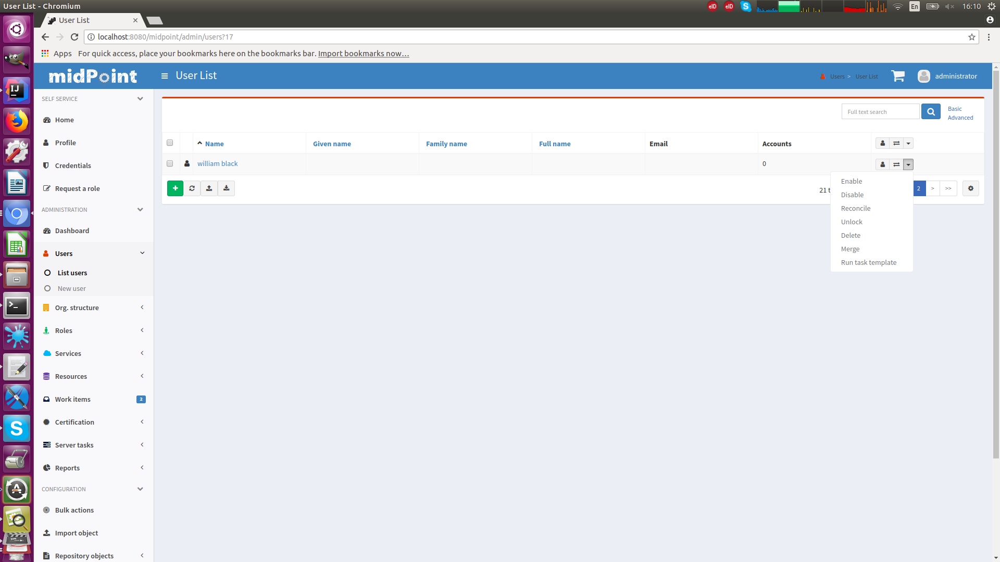

= Admin GUI Configuration
:page-wiki-name: Admin GUI Configuration
:page-wiki-id: 24085280
:page-wiki-metadata-create-user: semancik
:page-wiki-metadata-create-date: 2017-02-17T11:05:38.577+01:00
:page-wiki-metadata-modify-user: honchar
:page-wiki-metadata-modify-date: 2020-03-10T12:05:23.328+01:00
:page-keywords: [ "adminGuiConfig" ]
:page-upkeep-status: yellow
:page-toc: top

Admin GUI configuration is a specialized data structure that is present in xref:/midpoint/reference/concepts/system-configuration-object/[system configuration object], in all the role-like objects (roles, orgs, services), in the xref:/midpoint/architecture/archive/data-model/midpoint-common-schema/usertype/[user objects] and partially also in archetype objects. The admin GUI configuration structure influences how to user interface is displayed.
Despite its name it applies both to the self-service part and administration part of the user interface.

== Basic Structure

The admin GUI configuration structure contains:

* `*additionalMenuLink*`: Links that will be displayed as an additional items in the user interface menu.
It can be used to point the user to other services in your deployment.

* `*userDashboardLink*`: DEPRECATED (DO NOT USE ANYMORE, see `homePage` configuration)

* `*objectCollectionViews*`: Specifies the set of pages that are used for displaying lists of objects such as Users, Roles, Orgs, ... Influences a list of links in sidebar menu for particular object. E.g. defining objectCollection for _Employees_ will create new link in sidebar menu under the _Users_, after clicking on the link, filtered list of the _Employees_ is shown

* `*objectDetails*`: Specifies the look and feel of the pages for displaying object details and editing of objects such as User, Role, Org,...

* `*homePage*`: Defines how the xref:/midpoint/reference/admin-gui/self-service/#home-page[Home dashboard] (Self-service) looks, which widgets are shown, which links, etc.

* `*accessRequest*`: Specifies customizations for xref:/midpoint/reference/admin-gui/request-access/[Request access] process, which steps are visible, which not, how the role catalog looks, ...

* `*selfProfilePage*`: Specifies customizations for xref:/midpoint/reference/admin-gui/self-service/[Self-service Profile], which panels are shown, which attributes, collections, virtual sections, ...

* `*userDashboard*`: DEPRECATED (DO NOT USE ANYMORE, see `homePage`)

* `*defaultTimezone*`: Defines the timezone that will be used by the user interface to display date and time information.

* `*preferredDataLanguage*`: Defines the data language that will use used by the user interface to display content of objects (XML, JSON or YAML)

* `*feedbackMessagesHook*`: Configuration for modifying of feedback messages showed in GUI.

Since midPoint 4.4, the look and feel of GUI has been significantly changed. The aim was to provide better user experience and more configuration options. The old look is still available in midPoint for preview. It can be turned on in adminGuiConfiguration setting `useNewDesign` property to _false_. However, bugs and improvements will be fixed and implemented only for the new look and the old look will be completely removed in release 4.6. Old look is no more supported Please, migrate your configuration as soon as possible.

== How It Works

The same admin GUI configuration structure may be specified in xref:/midpoint/reference/concepts/system-configuration-object/[system configuration object], in all the role-like objects (roles, orgs, services) and also in the xref:/midpoint/architecture/archive/data-model/midpoint-common-schema/usertype/[user objects] (starting from midPoint v 4.1: in all AssignmentHolderType objects). Some parts of admin GUI configuration, such as `*objectDetails*` can be specified also in archetypes, more specifically in `archetypePolicy` (archetypePolicy/adminGuiConfiguration).
When a specific user logs in, midPoint will process all of user's roles to check for applicable authorizations.
At the same time midPoint also compiles the effective admin GUI configuration.
Following algorithm is used:

* Admin GUI configuration in the xref:/midpoint/reference/concepts/system-configuration-object/[system configuration object] is applied first (if present).

* Admin GUI configuration from all active roles, orgs and services is applied on top of that. If the adminGuiConfiguration is specified in archetype directly (not in the archetypePolicy/adminGuiConfiguration), then this configuration is applied in this step too.

** The simple single-valued configuration properties such as default timezone are overwritten.
Therefore, the role setting completely overrides the system global setting.
If several roles specify conflicting values then the behavior is unpredictable.
It is a responsibility of midPoint administrator to ensure the consistency.

** Complex configuration structures such as objectDetails and dashboard definitions are merged.
The system global definition is merged with the definition from all the roles.

* Admin GUI configuration provided in the xref:/midpoint/architecture/archive/data-model/midpoint-common-schema/usertype/[user object] is applied last (if present).

The resulting merged configuration is used to display the user interface for a particular user. If the object to be displayed contains archetype definition (it has archetype assigned) then the admin GUI configuration from archetype (more specifically from archetypePolicy/adminGuiConfiguration) is applied at the moment the object is going to be displayed.

This mechanism provides a very flexible customization of user interface.
And the customization is inherently role-based.
This mechanism can be used to display different object detail forms to different users.
E.g. auditors will see the object history panel, but other user will not see it.
Each role can have unique combination of the panels.
And as we have a merging algorithm in place, if a user has many roles he will see all the panels specified by all the roles.
Similar approach can be used to pre-define time zones and languages.
If users are placed to organizational units according to their physical location then a time zone can be easily defined in that organizational unit admin GUI configuration.

The step that applies admin GUI configuration from the user object is meant to store and re-apply user's own preferences about user interface look and feel.
It is only partially implemented.

== Object details

Object details configuration influences the look and feel of the pages for creating and editing object. MidPoint comes with default panels and default pre-defined configuration for each object available to edit and create in GUI. It is basic configuration which might be adjusted according to customer's needs. Custom configuration defined by customer is merged with default pre-defined configuration according to the rules described in _How it works_.

Comparing the behavior before 4.4, there is a change in merging mechanism. Before 4.4 if any customization was made, it meant that the default configuration wasn't taken into the account while displaying the corresponding page. Since 4.4 this behavior was changed, so any custom configuration is additional to one coming with midPoint by default. If the behavior or settings of the default panel needs to be changed, it is done with adjusting such configuration. To be able to adjust and override default configuration the `identifier` have to be specified and correctly used.

Every configurable feature containing `identifier` requires to have the identifier filled in. According to the identifier, configurations for same feature are merged. There are system defined default identifiers used for default panels which can be used to override behavior of default panels, e.g. visibility, virtual sections, etc.

Basis structure for object details configuration is:

* `*type*`: Defines for which type is the configuration used.

* `*summaryPanel*`: Specify the look and feel of the summary panel. Currently it is supported only partially.

* `*saveMethod*`: Specifies the method how page save/preview buttons are shown and processed. Only few options are supported and might be changed in the future.

* `*panel*`: Definition of individual panels which will be used on details page. According to the panel definition, also link in the detail menu to corresponding panel is generated. One panel can be nested to another. In such a case, link in the detail navigation menu will be shown as a submenu under the link of the parent panel.

=== Panel configuration

`Panel` configuration contains information about two things:

* How to generate the menu on the details page, such as label, icon, hierarchy.

* Which panel will be shown after navigating to it using menu on the details page. Some panels are built-in and may be used as is, they might be customized directly in `panel` configuration, or the whole new custom panel can be implemented and used.

Following tables described basic configuration options for panels:
[%autowidth]

|===
| Property | Mandatory | Type | Description

| identifier
| YES
| String
| Must be defined. Identifiers are used by merging algorithm. According to them, the configuration from different places (different roles, system configuration, archetypes) are merged together. Without identifier defined, it is not possible to merge the configurations correctly.
Default panels have system defined identifiers stated in the table below.
(TODO pointer to table)

| description
| NO
| String
| Free-form description (comment) intended for system administrator. Description will NOT be displayed as any part of the UI feature. The purpose is to explain the purpose or configuration details.

| display
| Yes
| DisplayType
| It is used to display the link in the menu. Currently, only `label` and `icon/cssClass` are used.

| visibility
| NO
| UserInterfaceElementVisibilityType
| Defines if the panel, and thus link in the menu on details page will be visible. Default value is automatic. If the panel should not be accessible, the value has to be set to `hidden`,

| displayOrder
| NO
| Integer
| It is used to specify order of the links in menu on details page.
If there is a need to change the order of the link in the menu on details page, the `displayOrder` has to be set.
E.g. on user details page, `Projections` are displayed as a second link in the menu.
If they should be displayed later, it has to be configured.

| applicableForOperation
| NO
| OperationTypeType
| Used to distinguish in which situation the panel will be visible.
If nothing specified, configuration will be applicable for both add and modify operations.
E.g. there might be panels applicable only when modifying user.
In such a case, `applicableForOperation` must be set to `modify`.

| container
| NO
| VirtualContainersSpecificationType
| Used to specify custom grouping of the attributes.
According to it, virtual containers/sections are then generated in GUI.
As an example, the user might need to reorganize attributes to some logic block such as personal info, basic info, additional info.
Each of this section should have only attributes which belong to it, e.g. given name, family name, date of the birth are attributes corresponding to the personal info.
Basic info section will contain attributes describing organizationalUnit, emailAddress or job position and additional info will contain attributes about user's nickname and so on.

| panelType
| NO
| String
| Unique identifier pointing to the panel which will be shown. There are built-in panels in midPoint mostly mentioned in the table (see chapter xref:#_built_in_panel_types[Built-in panel types] below), but also custom panel can be implemented and used here.

| listView
| NO
| GuiObjectListViewType
| Specification of an explicit or implicit object collection that will be used to select objects in this view.
If no collection is specified then all objects of a particular type has to be displayed. Definition of object type using `type` element is mandatory in that case.

| panel
| NO
| ContainerPanelConfigurationType
| Sub-panel definition. If defined, it will be placed as a submenu of parent panel configuration in the menu on details page.

| default
| NO
| Boolean
| If the panel is set to default = true, that after navigating to object details, this panel will be shown by default.
Only one panel can be default. In midPoint, each object type has its default panel defined. If there is a wish to change it, make sure there is only one panel set to default = true at the end.

| preview
| NO
| Boolean
| If true, the panel is used on dashboard page and has a light view (e.g. no checkbox or menu items columns on the list view panels)

| action
| NO
| GuiActionType
| Since 4.6: implemented the possibility to apply some action to the panel (e.g. redirection action for the dashboard widget panel which redirects the user to the specified in action page/panel)
|===

It is very important to be aware of difference between `identifier` and `panelType`. The attribute `identifier` points to the concrete instance of the panel idenfied by the `identifier`. This `identifier` is used to identify the same panel across different places where is might be configured and according to the `identifier` all related configurations are merged. The attribute `panelType` represents the type of the panel which will be instantiated and used to represent data. There might be different `panel` configurations with different `identifier` for the same `panelType`. In such a case, different menu links on details page will be generated and each will display instantiated `panelType` with the corresponding configuration in `panel`.

[#_built_in_panel_types]
==== Built-in panel types

MidPoint itself comes with default panels with the identifiers specified. Those are stated in the tables below divided by the types for which they apply.
As one of the options, the panels can be used and displayed on the self Dashboard page. It's considered that the object to which the panel is applied is principal focus. The statistic widgets on the self Dashboard page usually don't require object type to be specified, they are used just to display some information or to redirect the user to the appropriate page/panel.

Type-independent panels:
[%autowidth]

|===
| Panel | Identifier | Description | Default order

| Link widget
| `linkWidget`
| Panel displaying some statistic or configured data, works as a link to redirect the user to the specified page/panel.
|
|===

Panels applicable for all AssignmentHolderType object (except ResourceType):
[%autowidth]

|===
| Panel | Identifier | Description | Default order | Panel type

| Basic
| `basic`
| Panel displaying default properties, such as name, fullName, ...
| 10
| basic

| Role memberships
|
| Panel for all memberships
|
| roleMemberships
|===

Panels applicable for all FocusType objects:
[%autowidth]

|===
| Panel | Identifier | Description | Default order

| Projections
| `projections`
| Table with listed projections and possibility to show projection details.
| 20

| Assignments
| `assignments`
| No panel at all, just to group different types of assignments under one details navigation
| 30

| All assignments
| `allAssignments`
| Panel for all assignments. In details menu present as a submenu of `assignments`
| 10

| Construction assignments
| `constructionAssignments`
| Panel for resource assignments. In details menu present as a submenu of `assignments`
| 50

| Indirect assignments
| `indirectAssignments`
| Panel showing direct and also indirect assignments. In details menu present as a submenu of `assignments`
|

| Data protection assignments
| `dataProtectionAssignments`
| Experimental, showing data protection assignments. In details menu present as a submenu of `assignments`
|

| Org assignments
| `orgAssignments`
| Panel for org assignments. In details menu present as a submenu of `assignments`
| 30

| Role assignments
| `roleAssignments`
| Panel for role assignments. In details menu present as a submenu of `assignments`
| 20

| Service assignments
| `serviceAssignments`
| Panel for service assignments. In details menu present as a submenu of `assignments`
| 40

| Policy assignments
| `policyAssignments`
| Panel for policy assignments. In details menu present as a submenu of `assignments`
| 45

| Password
| `password`
| Password panel, might be grouped under credentials in the future
| 50

| Activation
| `activation`
|
| 40

| Cases
| `focusCases`
| Table of cases related to the object. E.g. waiting approval cases for user, etc.
| 70

| History
| `history`
| History panel for object.
| 60

| Triggers
| `focusTriggers`
| Table of triggers related to the object.
| 110
|===

Panel applicable for all AbstractRoleType objects:

[%autowidth]
|===
| Panel | Identifier | Description | Default order

| Applicable policies
| `applicablePolicies`
|
| 60

| Inducements
| `inducements`
| No panel at all, just to group different types of inducements under one details navigation
| 70

| Policy rule assignments
| `policyRuleAssignments`
| Policy ryle related assignments.In details menu present as a submenu of `assignments`.
| 60

| Focus mappings assignments
| `focusMappingsAssignments`
| Focus mappings assignments. In details menu present as a submenu of `assignments`.
| 70

| All inducements
| `allInducements`
|
| 10

| Construction inducements
| `constructionInducements`
|
| 50

| Focus mappings inducements
| `focusMappingsInducements`
|
| 80

| Induced entitlements
| `inducedEntitlements`
|
| 70

| Org inducements
| `orgInducements`
|
| 30

| Policy rule inducements
| `policyRuleInducements`
|
| 60

| Role inducements
| `roleInducements`
|
| 20

| Service inducements
| `serviceInducements`
|
| 40

| Induced by roles
| `inducedBy`
| Table of roles that induce this role.
| 130
|===

Panels applicable only for users:
[%autowidth]

|===
| Panel | Identifier | Description | Default order

| All Accesses
| `igaAccesses`
|
|

| Consent assignments
| `gdprAssignments`
| Experimental, consent related assignments. In details menu present as a submenu of `assignments`.
|

| Personas
| `personas`
|
| 80

| Delegations
| `userDelegations`
|
| 90

| Delegated to me
| `delegatedToMe`
|
| 100
|===

Panels applicable only for roles:

[%autowidth]
|===
| Panel | Identifier | Description | Default order

| Role members
| `roleMembers`
|
| 80

| Role governance
| `roleGovernance`
|
| 90
|===

Panels applicable only for services:

[%autowidth]
|===
| Panel | Identifier | Description | Default order

| Service members
| `serviceMembers`
|
| 80

| Service governance
| `serviceGovernance`
|
| 90

|===

Panels applicable only for policies:

[%autowidth]
|===
| Panel | Identifier | Description | Default order

| Policy members
| `policyMembers`
|
| 80

| Policy governance
| `policyGovernance`
|
| 90

|===

Panels applicable only for archetypes:

[%autowidth]
|===
| Panel | Identifier | Description | Default order

| Archetype members
| `archetypeMembers`
|
| 80

| Archetype governance
| `archetypeGovernance`
|
| 90

| Archetype policy
| `archetypePolicy`
|
| 140
|===

Panels applicable only for organizations:

[%autowidth]
|===
| Panel | Identifier | Description | Default order

| Org members
| `orgMembers`
|
| 60

| Org governance
| `orgGovernance`
|
| 70
|===

Panels applicable only for cases:

[%autowidth]
|===
| Panel | Identifier | Description

| Approval case
| `approvalCase`
|

| Case work item
| `caseWorkItems`
|

| Child cases
| `childCases`
|

| Manual case
| `manualCase`
|

| Operation request case
| `operationRequestCase`
|
|===

Panels applicable only for object collections:

[%autowidth]
|===
| Panel | Identifier | Description | Default order

| Base collection
| `baseCollection`
|
| 40

| Default view
| `defaultView`
|
| 50

| Domain
| `domain`
|
| 60

| Collection options
| `objectCollectionOptions`
|
| 70
|===

Panels applicable only for object templates:
[%autowidth]

|===
| Panel | Identifier | Description | Default order

| Object template items
| `objectTemplateItems`
|
| 30

| Iteration specification
| `iterationSpecification`
|
| 20

| Object template mappings
| `objectTemplateMappings`
|
| 40
|===

Panels applicable only for reports:

[%autowidth]
|===
| Panel | Identifier | Description | Default order

| Collection parameter
| `reportCollectionParameter`
|
| 90

| Collection subreport
| `reportCollectionSubreport`
|
| 100

| Collection view
| `reportCollectionView`
|
| 80
|===

Panels applicable only for tasks:

[%autowidth]
|===
| Panel | Identifier | Description | Default order

| Statistics
| `statistics`
|
| 50

| Activity
| `activity`
|
| 15

| Control flow
| `controlFlow`
| Show under `Activity` details menu
| 20

| Distribution
| `distribution`
| Show under `Activity` details menu
| 20

| Environmental performance
| `environmentalPerformance`
| Shown under `Performance` details menu
| 50

| Task errors
| `taskErrors`
|
| 50

| Internal performance
| `internalPerformance`
| Shown under `Performance` details menu
| 50

| Operations
| `operation`
|
| 60

| Performance
| `performance`
| No panel at all, used only to group different types od statistics
| 50

| Reporting
| `reporting`
| Show under `Activity` details menu
| 50

| Results
| `results`
|
| 70

| Schedule
| `schedule`
|
| 15

| Subtasks and worker threads
| `subtasks`
|
| 50

| Work
| `work`
| Specific work definition configured in archetype is displayed.
| 10
|===

Panels applicable only for system configuration:

[%autowidth]
|===
| Panel | Identifier | Description | Default order

| Additional menu links
| `additionalMenuLinkPanel`
|
| 20

| Appenders
| `appendersPanel`
|
| 40

| Class loggers
| `classLoggersPanel`
|
| 20

| Configurable user dashboards
| `configurableUserDashboardPanel`
|
| 60

| Custom transports
| `customTransportPanel`
|
| 50

| Event handler
| `eventHandlerPanel`
|
| 10

| File transports
| `fileTransportPanel`
|
| 40

| Global policy rules
| `globalPolicyRulePanel`
|
| 20

| Legacy notifications UI
| `legacyNotificationPanel`
|
| 100

| Logging configuration
| `loggingPanel`
|
| 10

| Mail transports
| `mailTransportPanel`
|
| 20

| Object collections views
| `objectCollectionViewsPanel`
|
| 40

| Object details
| `objectDetailsPanel`
|
| 50

| Object policies
| `objectPolicyPanel`
|
| 10

| Profiling configuration
| `profilingPanel`
|
| 10

| Relations configuration
| `relationsPanel`
|
| 30

| SMS transports
| `smsTransportPanel`
|
| 30

| Subsystem logging
| `subSystemLoggersPanel`
|
|

| User dashboard links
| `userDashboardLinkContentPanel`
|
| 30
|===

=== Object details for resource

For configuration of object details for resource (ResourceType) use tag `resourceDetailsPage` insteadof `objectDetailsPage`. Configuration contains all attribute as configuration for `objectDetailsPage` and additionally contains attribute `connectorRef` that define connector of resource fow which configuration of admin gui applies. We can use classic reference, or we can use filter in reference that will be resolved during processing of configuration.

.Example with oid for connectorType
[source, xml]
----
<systemConfiguration>
   ...
    <adminGuiConfiguration>
        <objectDetails>
            <resourceDetailsPage>
                ...
                <connectorRef type="ConnectorType" oid="OID_OF_CONNECTOR_TYPE"/>
            </resourceDetailsPage>
        </objectDetails>
    </adminGuiConfiguration>
    ...
<systemConfiguration>
----

.Example with filter
[source, xml]
----
<systemConfiguration>
   ...
    <adminGuiConfiguration>
        <objectDetails>
            <resourceDetailsPage>
                ...
                <connectorRef type="ConnectorType">
                    <resolutionTime>run</resolutionTime>
                    <filter>
                        <q:text>connectorType = "com.evolveum.polygon.connector.ldap.ad.AdLdapConnector" and available = true</q:text>
                    </filter>
                </connectorRef>
            </resourceDetailsPage>
        </objectDetails>
    </adminGuiConfiguration>
    ...
<systemConfiguration>
----
You can use in filter attribute `available`, that can help you during updating of connector version, because only newest version of connector and connector added to directory in midPoint home directory contain value true.

We can omit attribute `connectorRef` and we write configuration for all resources. When system configuration contains configurations for specific resource and for all resources, then final configuration will be merged of these two configurations.

Panels applicable only for resources (detail page):
[%autowidth]

|===
| Panel | Identifier

| Resource details
| `resourceDetails`

| Connector configuration
| `resourceConnectorConfiguration`

| Resource tasks
| `resourceTasks`

| Resource accounts
| `resourceAccounts`

| Resource entitlements
| `resourceEntitlement`

| Resource generics
| `resourceGenerics`

| Resource objects
| `resourceUncategorized`

| Schema handling
| `schemaHandling`

| Object types
| `resourceObjectTypes`

| Association types
| `associationTypes`

| Connector statistics
| `resourceConnector`

| Schema
| `resourceSchema`

|===

=== Wizard panels

Panel for wizard contains same configuration structure as xref:/midpoint/reference/admin-gui/admin-gui-config/#panel-configuration[panel configuration]. We can use configuration for collection with definitions for columns, or we can use container configuration for wizard panel, which show panel with form.

Very important attribute is _applicableForOperation_, that have to have value *_wizard_* for wizard panels.
This value specifies that the panel will only be used in the wizard and this panel will not appear in the detail menu.

Example of configuration for wizard panel, which display form with basic configuration of resource object type (visible only attributes _displayName_, _description_, _kind_, _intent_, _securityPolicyRef_ and _default_):

.Example
[%collapsible]
====
[source,xml]
----
...
    <resourceDetailsPage>
        <panel>
            <identifier>rw-type-basic</identifier>
            <container>
                <identifier>basic</identifier>
                    <display>
                        <label>PageResource.wizard.step.objectType.basicSettings</label>
                    </display>
                    <item>
                        <path>schemaHandling/objectType/displayName</path>
                        <visibility>visible</visibility>
                    </item>
                    <item>
                        <path>schemaHandling/objectType/description</path>
                        <visibility>visible</visibility>
                    </item>
                    <item>
                        <path>schemaHandling/objectType/kind</path>
                        <visibility>visible</visibility>
                    </item>
                    <item>
                        <path>schemaHandling/objectType/intent</path>
                        <visibility>visible</visibility>
                    </item>
                    <item>
                        <path>schemaHandling/objectType/securityPolicyRef</path>
                        <visibility>visible</visibility>
                    </item>
                    <item>
                        <path>schemaHandling/objectType/default</path>
                        <visibility>visible</visibility>
                    </item>
                </container>
                <container>
                    <visibility>hidden</visibility>
                    <path>schemaHandling/objectType</path>
                </container>
                <panelType>rw-type-basic</panelType>
            </panel>
        ...
    </resourceDetailsPage>
...
----
====

Panels applicable for resource wizard:
[%autowidth]

|===
| Panel | Identifier | Description

| Basic information
| `rw-basic`
| Basic information about your resource

| Connector configuration
| `rw-connectorConfiguration`
| Configuration for connector

| Connector configuration for discovery
| `rw-connectorConfiguration-discovery`
| Necessary configuration for discovery of next possible configuration by connector

| Connector configuration after discovering
| `rw-connectorConfiguration-partial`
| Configuration after discovering that can contains suggestions for configuration attributes

| Resource object types
| `rw-types`
| Panel display a table with all the objects available in the selected resource, manage existing or create a new one

| Basic information about the object type
| `rw-type-basic`
| Basic configuration of resource object type

| Resource object type data
| `rw-type-delineation`
| Panel for delineate the boundary of objects that belong to resource object type and contains supporting instructions regarding classification of objects into types

| Midpoint object type data
| `rw-type-focus`
| Panel for the necessary fields to specify focus objects corresponding to given resource object type

| Administrative status configuration
| `rw-activation-administrativeStatus`
| Defines the "administrative state" of the object

| Existence configuration
| `rw-activation-existence`
| Determines whether the resource object should exist or not

| Lockout status configuration
| `rw-activation-lockoutStatus`
| Lock-out means that the account was temporarily disabled

| Valid from configuration
| `rw-activation-validFrom`
| Definition of the circumstances for the start of the object's validity

| Valid to configuration
| `rw-activation-validTo`
| Definition of the circumstances for the end of the object's validity

| Associations
| `rw-associations`
| Panel display table of associations for selected object type, you can delete or modify existing or create new association

| Configuration of the association
| `rw-association`
| Configuration of the settings for association

| Inbound mappings
| `rw-attribute-inbounds`
| Table of inbound mappings of selected object type

| Configuration of inbound mapping
| `rw-attribute-inbound`
| Definition of the resource attribute from which the data wil be provisioned, and midPoint attribute which they will be provisioned to. Panel was removed from 4.8.

| Main configuration of inbound mapping
| `rw-attribute-inbound-main`
| Available from 4.8. Definition of the resource attribute from which the data wil be provisioned, and midPoint attribute which they will be provisioned to. Contains attributes name, source, target, ref (resource attribute), strength, expression and condition

| Optional configuration of inbound mapping
| `rw-attribute-inbound-optional`
| Available from 4.8. Definition of the resource attributes description, exclusive, authoritative, channel and except channel

| Outbound mappings
| `rw-attribute-outbounds`
| Table of outbound mappings of selected object type

| Configuration of outbound mapping
| `rw-attribute-outbound`
| Definition of from which attribute(s) in midPoint the data will be provisioned to which attribute on resource. Panel was removed from 4.8.

| Main configuration of outbound mapping
| `rw-attribute-outbound-main`
| Available from 4.8. Definition of from which attribute(s) in midPoint the data will be provisioned to which attribute on resource. Contains attributes name, source, ref (resource attribute), strength, expression and condition

| Optional configuration of outbound mapping
| `rw-attribute-outbound-optional`
| Available from 4.8. Definition of the resource attributes description, exclusive, authoritative, channel and except channel

| Limitations of the override
| `rw-attribute-limitations`
| Configuration of the limitations, that are used to restrict some properties of an attribute

| Attributes
| `rw-attributes`
| Attributes table of selected object type

| Configuration of the override
| `rw-attribute`
| Configuration of the basic settings for override attribute

| Credentials configuration
| `rw-credentials`
| Configuration of the credentials that defines how account credentials are synchronized for current object type

| Reactions
| `rw-synchronization-reactions`
| Table of synchronization reactions of selected object type

| Main settings of reaction
| `rw-synchronization-reaction-main`
| Basic main configuration about the reaction

| Optional reaction configuration
| `rw-synchronization-reaction-optional`
| Panel contains more advanced optional configuration for enrichment of the synchronization reaction

| Correlation rules
| `rw-correlationRules`
| Table of correlation rules of selected object type

| Correlators
| `rw-correlators`
| Table of correlators of selected correlation rule

| Main configuration of activation inbound mapping
| `rw-activation-inbound-main`
| Available from 4.8. Definition is same as for `rw-attribute-inbound-main`

| Optional configuration of activation inbound mapping
| `rw-activation-inbound-optional`
| Available from 4.8. Definition is same as for `rw-attribute-inbound-optional`

| Main configuration of activation outbound mapping
| `rw-activation-outbound-main`
| Available from 4.8. Definition is same as for `rw-attribute-outbound-main`

| Optional configuration of activation outbound mapping
| `rw-activation-outbound-optional`
| Available from 4.8. Definition is same as for `rw-attribute-outbound-optional`

| Configuration of redefined mapping
| `rw-activation-predefined`
| Available from 4.8. Configuration one from predefined mapping processing, as _disable instead of delete_, _delayed delete_ and _pre-provisioning_

| Main configuration of credentials inbound mapping
| `rw-credentials-inbound-main`
| Available from 4.8. Definition is same as for `rw-attribute-inbound-main`

| Optional configuration of credentials inbound mapping
| `rw-credentials-inbound-optional`
| Available from 4.8. Definition is same as for `rw-attribute-inbound-optional`

| Main configuration of credentials outbound mapping
| `rw-credentials-outbound-main`
| Available from 4.8. Definition is same as for `rw-attribute-outbound-main`

| Optional configuration of credentials outbound mapping
| `rw-credentials-outbound-optional`
| Available from 4.8. Definition is same as for `rw-attribute-outbound-optional`
|===

Panels applicable for role wizard:

[%autowidth]
|===
| Panel | Identifier | Description

| Basic information
| `arw-basic`
| Basic information about your abstract role

| Select application
| `apprw-access`
| Select application your role will grant access to

| Select application roles
| `brw-access`
| Select application roles your role will include

| Configure governance
| `arw-governance`
| Select governance users of your new role

| Configure members
| `arw-members`
| Select members of your new role

| Construction resource
| `arw-construction-resource`
| Select resource in which your role will manage access

| Resource object type
| `arw-construction-objectType`
| Select type of object your role will modify

| Association
| `arw-construction-associations`
| Select object(s) on resource to be associated with the user when your role is assigned

| Outbound mappings
| `arw-construction-mappings`
| Create mappings for setting specific values when your role is assigned

| Outbound mappings basic information
| `arw-construction-mapping`
| Basic information about outbound mapping created in panel `Outbound mappings`. Panel was removed from 4.8.

| Main configuration of outbound mapping
| `arw-construction-mapping-main`
| Available from 4.8. Definition of the resource attribute from which the data wil be provisioned, and midPoint attribute which they will be provisioned to. Contains attributes name, source, target, ref (resource attribute), strength, expression and condition

| Optional configuration of outbound mapping
| `arw-construction-mapping-optional`
| Available from 4.8. Definition of the resource attributes description, exclusive, authoritative, channel and except channel
|===

=== Assignment Panels: Switching Data Provider

It is possible to switch implementation of data provider (search engine) in
assignment panels. Currently, we support two implementations:

`InMemoryAssignmentDataProviderType`::
  (default) It is in-memory data provider, which was present in previous versions
  of midPoint. Search is performed only in-memory, so no fulltext or filtering
  on assignment target properties is available.

 `RepositoryAssignmentDataProviderType`::
   Search is backed by repository, which allows using full text search for
   referenced objects and filtering on indexed assignment target properties.
   Since search is repository-indexed any unsaved changes may not be reflected
   in search, and newly added assignments are always present in result set.

IMPORTANT: Repository Search Provider is mainly intended for All Assignments panel,
we do not recommend enabling it for other assignments panels, because they may
be using not indexed properties.

In order to enable repository search, you need to modify panel configuration
for specific assignment panel.
The configuration is done by setting `xsi:type` of `panel -> listView -> dataProvider` container.

.Enabling repository search for Users -> Assignments -> All
[%collapsible]
====
[source, xml]
----
<systemConfiguration>
   ...
    <adminGuiConfiguration>
        <objectDetails>
            <objectDetailsPage>
                <type>c:UserType</type>
                <panel>
                    <identifier>assignments</identifier>
                    <panel>
                        <identifier>allAssignments</identifier>
                        <listView>
                            <dataProvider xsi:type="c:RepositoryAssignmentDataProviderType"/>
                        </listView>
                    </panel>
                </panel>
            </objectDetailsPage>
        </objectDetails>
    </adminGuiConfiguration>
    ...
<systemConfiguration>
----
====

== Custom actions for object lists

MidPoint has an option to configure a custom action to be run from the object list table.
This functionality is intended e.g. to start the specified task template for one object or for a group of the selected objects.
To configure custom actions, please, use the following example

.Example
[%collapsible]
====
[source,xml]
----
<adminGuiConfiguration>
    <objectCollectionViews>
            <objectCollectionView>
                <type>c:UserType</type>
                <action>
                    <name>Custom action</name>
                    <display>
                        <label>Run task template</label>
                    </display>
                    <taskTemplateRef xmlns:tns="http://midpoint.evolveum.com/xml/ns/public/common/common-3" oid="78a39955-743b-480f-86c0-9dbeafdbaba6" relation="org:default" type="tns:TaskType">
                        <!-- Change description task template -->
                    </taskTemplateRef>
                </action>
            </objectCollectionView>
        </objectCollectionViews>
</adminGuiConfiguration>
----
====

You can find configuration of task template object at link:https://github.com/Evolveum/midpoint-samples/blob/master/samples/tasks/templates/task-template-change-description.xml[following link].

After custom action is configured in the admin gui configuration section, you can find action link among menu items in the appropriate type object list panel.

=== Limitations

1. The user must be authorized to get the task template (sufficient in `execution` phase) and to create the new task object.
2. The user must have all the authorizations required for the task template to execute.
In particular, if there is a Groovy code there, the `execute-script` authorization must be present.
See also bug:MID-7831[] and bug:MID-6913[].
(As this is very strong authorization, be sure to provide it to trustworthy users only!)

== Admin GUI Configuration and Authorizations

At the first sight the use of admin GUI configuration to define object forms and dashboard widgets may seem to be redundant.
It may look that xref:/midpoint/reference/security/authorization/[authorization] mechanism provides the same services.
But there are subtle differences.

* The authorization mechanism is designed to answer one very specific question: _can subject S do action A with object O?_ However, in user interface it is often desired to hide information that the user is entitled to see.
E.g. maybe we do not want to display the default _assignments_ tab (even though the user can read assignments) because we want to replace it with a simplified custom tab.
Maybe we do not want to display some dashboard widgets to keep the dashboard simple.
There may be many use cases when authorizations allow something, but we still do not want to display it.

* The authorizations are designed for very easy, efficient and unambiguous merging.
The authorizations defined by many roles are all executed together.
It is not good if one authorization allows something (e.g. read access to `assignment` container in the user object) but other authorization subtly influences the decision (e.g. do not display the default assignments tab).
It is best if all authorizations in midPoint remain "positive" (`allow` authorizations).
If we want to follow that principle then we would need special authorization for every little GUI element and typical end user will need to have them all.
This is very likely to multiply the number of required authorizations, and it might easily make the system unmaintainable.

* The authorizations are designed to be very efficient.
They are evaluated for every operation (even several times in some cases).
We have to do this as authorizations are our security barrier and there must be no way how to go around them.
We do not really want to overuse authorizations as that may impact system performance.
On the other hand, look and feel of user interface is not critical.
We can afford to pre-process the settings and keep a cached copy of the results.
We do not need to re-evaluate it every time.

However, the authorizations and the admin GUI configuration work together in several cases.
E.g. end-users and administrators, both have the `basic` panel in the profile visible, but the attributes which are seen by end-users or administrators might differ.

== Feedback Messages Hook

Feedback messages hook configures how operation results are displayed in GUI.
Contains elements 'operationResultHook' and 'stackTraceVisibility'.

It can also be used to change what's displayed in operation results via options `showOnlyUserFriendlyMessages`, `disableOperationResultDownload` and `displayOnlyTopLevelOperationResult`.

=== Operation Result Hook
'operationResultHook' attribute allows operation result preprocessing before it's shown in GUI.
Currently processed OperationResultType is set as "input" variable available in script.
Script should return OperationResultType.
If script returns null, then result is dropped and not shown on page.
To see changes made in this part of configuration, user needs to do logout/login as they are cached in session.

.Example
[%collapsible]
====
[source,xml]
----
<adminGuiConfiguration>
   <feedbackMessagesHook>
      <operationResultHook>
         
      </operationResultHook>
   </feedbackMessagesHook>
</adminGuiConfiguration>
----
====

=== Stack Trace Visibility
'stackTraceVisibility' attribute configure visibility for stack trace in feedback messages of GUI.
Relevant values are 'visible' and 'hidden'. Default value is 'visible'.

[source,xml]
----
<adminGuiConfiguration>
   <feedbackMessagesHook>
      <stackTraceVisibility>hidden</stackTraceVisibility>
   </feedbackMessagesHook>
</adminGuiConfiguration>
----

== Customizing classpath scanning

Different panels and pages are searched via annotations on classes, e.g. `@PageDescriptor`, `@PanelInstance`, and others.
In versions prior 4.5 (4.4.2) whole classpath was used to search for such annotated classes
which resulted in less than ideal performance of the scanning process.
In midPoint version 4.5 (4.4.2) and newer default search scope is package `com.evolveum.midpoint`.

It is possible to extend the search scope by setting the property `midpoint.additionalPackagesToScan` to comma separated package names.
This is required for xref:/midpoint/reference/deployment/maven-overlay-project/[midPoint Overlays]
with custom GUI pages and forms.

The property can be set in one of the following ways:

* Using command line argument:
** You can use JVM argument like `-Dmidpoint.additionalPackagesToScan=my.package`.
If using `midpoint.sh` or `start.sh`, this can be also provided with `JAVA_OPTS` environment variable.
The variable can also be set in `setenv.sh` file (see xref:/midpoint/install/bare-installation/distribution/#post-installation[this] for more).

** You can also use application argument `--midpoint.additionalPackagesToScan=my.package`,
which can be provided as an argument to `midpoint.sh` or `start.sh` scripts.

+
--
Either of this can be also set in service configuration for midPoint (e.g. `ExecStart` for systemd),
just remember that `-Dkey=val` form goes *before* the `-jar` option while `--key=val` form goes
*after* the `-jar` option and its `midpoint.war` parameter.

You can find more information in xref:/midpoint/operations-manual/#changing-the-midpoint-embedded-tomcat-configuration[this part] of the Operation manual.
--

* Using `application.yml` (or `application.properties`) file in xref:/midpoint/reference/deployment/midpoint-home-directory/[midPoint home directory].
E.g. for YAML format the file `${midpoint.home}/application.yml` may look like this:
+
[source,yaml]
----
midpoint:
  additionalPackagesToScan: org.example.acme,com.acme
----
+
This file complements the default built-in midPoint configuration.

* Finally, you can add the configuration directly into the overlay project.
This is more convenient for the user of the JAR/WAR file as they don't need to take any additional action.
To do this you need to add properties or YAML file into the root of the classpath, which typically
is `src/main/resources` directory.
+
Here, a little knowlege of midPoint structure is needed, concretely - midPoint uses `application.yml` file.
We can't put the same file into overlay's `src/main/resources` because it would overwrite the default one.
There is a couple of options:

** You can use `application.yml`, but first copy its content from midPoint sources - the file can be found in `gui/admin-gui/src/main/resources/application.yml`.
Then put your options inside it, in case of `midpoint.additionalPackagesToScan` you can just add
the lines (see the YAML example above) at the end.
+
This works, but it can be annoying when upgrading the overlay to the new midPoint version
as it may contain some changes to the default configuration which you should copy again.
There are better ways.

** Use `application-default.yml` instead - this one complements the default configuration.
It is the same as adding `${midpoint.home}/application.yml` in the example above and the content
of the file is exactly the same.
This still allows using the `${midpoint.home}/application.yml` file for other purposes,
but you don't have to worry about the GUI component scanning anymore.

** Finally, knowing that midPoint uses `application.yml` and Spring Boot also recognizes
`application.properties` you can use the latter file - which also has a bit simpler content
(although arguably less structured):
+
[source,properties]
----
midpoint.additionalPackagesToScan=org.example.acme,com.acme
----
+
Both YAML and properties files are merged nicely, but the option with `application-default.yml`
is still the preferred one.
If you really want to use properties format, name the file `application-default.properties` instead.
That clearly shows it is an additional configuration file to complement the existing configuration.

All these options use the Spring Boot mechanism called https://docs.spring.io/spring-boot/docs/current/reference/html/features.html#features.external-config[Externalized Configuration].

[TIP]
====
Long story short - the best way to specify the property in overlay project is adding
`application-default.yml` (or `application-default.properties`) under `src/main/resources` directory
in your overlay project sources.

See the overlay example https://github.com/Evolveum/midpoint-overlay-example/tree/master/src/main/resources[here].
====

== Security

Some parts of admin GUI configuration may contain xref:/midpoint/reference/expressions/expressions/[expressions]. Expressions are pieces of code that are executed inside midPoint server.
As such expressions has to be inherently trusted.
Therefore, do not allow untrusted users to define sensitive parts of admin GUI configuration.

== Application of GUI Configuration and Authorization Changes

Historically, any changes of admin GUI configuration and user authorizations required logout and login of the user.
Now, the changes specified below cause the user session or sessions to be automatically refreshed.
This means that on the very next access that follows after the change, the session (technically speaking, the compiled user profile) is refreshed.

The following changes are applied in this way:

* any changes to assignments, activation, and/or admin GUI configuration in:
** the user,
** abstract roles (role, org, archetype, ...) directly or indirectly assigned to the user,
* any changes in the admin GUI configuration in system configuration,
* activation and deactivation of roles and users based on validFrom and/or validTo data.

[NOTE]
====
Time-based activations (`validFrom`/`validTo` in users, roles, or assignments) are supported via xref:/midpoint/reference/tasks/specific/focus-validity-scan/[Validity Scanner] task which updates these objects.
Therefore, time-based activations are not applied immediately on the `validFrom` or `validTo` time, but during the next run of *Validity Scanner*, which runs every 15 minutes by default.
====

=== Limitations

The following changes are _not_ guaranteed to be applied immediately:

* changes that affect the list of roles indirectly assigned to the user (e.g. changes in metaroles).

If the user is deactivated in the sense of setting `activation/effectiveStatus`, it is logged out automatically on his/her next action in GUI.
However, if the deactivation is indirectly via losing all authorizations, the 403 page is shown instead.

Admin GUI configuration is currently not refreshed immediately if changes were done on objects referenced via collectionRef.
For example change in archetype in `archetypePolicy/display/*` that is referenced in `objectCollectionViews` in system configuration will not be applied immediately.
For more information see bug:MID-9776[].

=== Implementation Details

Technically, the compiled user profile is invalidated on the changes listed above:
MidPoint watches changes to `assignment`, `activation`, and `adminGuiConfiguration` on the logged-in principal objects, and any roles that were directly or indirectly assigned to him at the time of last compiled profile computation.
On the next logged-in user action in the GUI, the compiled GUI profiles is recomputed and the GUI-related changes are applied.
The list of roles which affect the GUI is updated.

== See Also

* xref:./admin-gui-config-examples.adoc[Admin GUI Configuration - Examples]

* xref:/midpoint/reference/concepts/system-configuration-object/[System Configuration Object]

* xref:/midpoint/reference/security/authorization/[Authorization]

* xref:/midpoint/reference/admin-gui/collections-views/show-only-active-users/[Show Only Active Users HOWTO]
