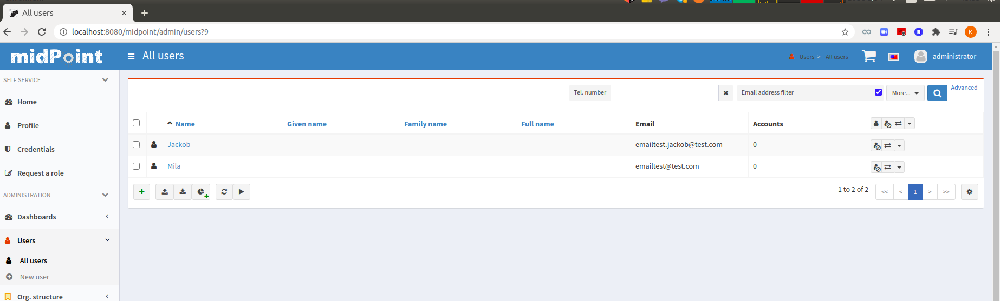
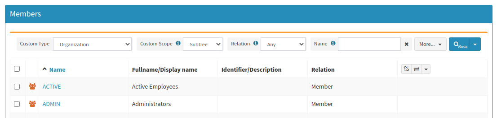

= Object Collections and Views Configuration
:page-nav-title: Configuration
:page-display-order: 50
:page-wiki-name: Object Collections and Views Configuration
:page-wiki-id: 30245468
:page-wiki-metadata-create-user: semancik
:page-wiki-metadata-create-date: 2019-04-24T14:36:12.315+02:00
:page-wiki-metadata-modify-user: lskublik
:page-wiki-metadata-modify-date: 2021-02-26T14:25:04.587+01:00
:page-since: "4.0"
:page-toc: top

== Introduction

MidPoint objects are quite a social animals.
They like to be grouped together.
There is often need to show collections of objects, such as employees, active users, new proposed roles and so on.
MidPoint has a flexible search and filter functionality that can be used for this purpose.
However, those collections are used so often that they deserve a special place in the system.
Those collections deserve its own definition, its own name and its own form of presentation.
That is the reason why midPoint supports functionality for object collections and views.

Collections and views are two concepts that are very related, but still somehow distinct:

* *Object collection* is a core midPoint concept.
There is a special object type (ObjectCollectionType) that is used to define a collection.
It is first-class midPoint object.
Collection defines which objects belong to the collection.
The plan is that collections can be used in the entire midPoint system, e.g. collections can be used in xref:/midpoint/reference/security/authorization/[authorizations], xref:/midpoint/reference/roles-policies/policy-rules/[policy rules] may be applied to them and so on.
Some midPoint objects can act as an implicit collections, especially xref:/midpoint/reference/schema/archetypes/[archetypes] and xref:/midpoint/reference/org/organizational-structure/[organizational units]. Object collections are designed to be solid and stable.
Something that midPoint policies can rely on.

* *View* is a user interface concept.
View specifies how a particular collection should be displayed.
It defines the columns that should be displayed, default sorting, pre-defined filter properties and so on.
Views are designed to be flexible, customizable.
E.g. views can be adjusted and overridden in xref:/midpoint/reference/admin-gui/admin-gui-config/[admin GUI configuration].

Although collections and view have different purposes, and they are based on different mechanisms, they are almost always used together.

== Object Collection

Object collection is a special midPoint object.
The collection usually specifies a search filter that is used to find all the objects that belong to the collection:

[source,xml]
----
<objectCollection oid="9276c3a6-5790-11e9-a931-efe1b34f25f6">
    <name>Active Users</name>
    <type>UserType</type>
    <filter>
        <q:text>activation/effectiveStatus="enabled"</q:text>
    </filter>
</objectCollection>
----

Simply speaking this is effectively a _named object filter_. The filter is specified in a single place in the object collection definition.
Then the definition is reused in all other places.

It may seem that this is a very little functionality to justify its own object.
However, most of the functionality is still not implemented.
See xref:/midpoint/features/planned/object-collections-and-views/[Object Collections and Views Improvements] page for the details.

=== Collection domain

A collection domain defines the context or parent set from which a collection is derived.
For example, a collection of _non-compliant roles_ might have a domain of _all roles_.

Collection domains are particularly useful in xref:/midpoint/reference/admin-gui/dashboards/[dashboards].
Using collection domains enables collections to compute percentages (e.g., _2% of all users are inactive_) and relative metrics (e.g., _10% of roles violate segregation-of-duties policies_).
These metrics are critical for compliance reporting, as they quantify risks or deviations from policy.
Based on the calculated ratios, policy rules can also trigger further actions, such as notifying managers about the need for remediation.

=== Derived Object Collection

Some collections are often based on other collections.
For example _active employees_ collection may be based on _employee_ archetype:

[source,xml]
----
<objectCollection>
    <name>Active employees</name>
    <type>UserType</type>
    <filter>
        <q:text>activation/effectiveStatus="enabled"</q:text>
    </filter>
    <baseCollection>
            <collectionRef oid="7135e68c-ee53-11e8-8025-170b77da3fd6" type="ArchetypeType"/> <!-- Employee archetype -->
    </baseCollection>
</objectCollection>
----

This makes it easy to maintain the collections, as the definitions do not need to be copied in the collections.
The collections can refer to each other.
Therefore, if one definition changes, all the collections take notice.

=== Configuration Consistency

The use of collections in midPoint 4.0 is somehow limited.
In future midPoint releases, Collections may be reused in authorizations and policy rules.
E.g. It would be nice to use just "employees" as a criterion in xref:/midpoint/reference/security/authorization/[authorizations] instead of copying the search filter everywhere.
Similarly, this collection may be reused in policy rule specifications.
In the future there may be scanner tasks that scan just the objects that belong to the collections, bulk actions for the collections and similar improvements.

Reusing the definition on many places is not just convenience.
It is important for consistency of configuration.
Nothing in the IDM world is really constant.
E.g. the definition what is an _employee_ may change in time.
If object collection is used properly, then that definition needs to be updated in just one place.
All the authorizations, views and dashboards should adapt automatically.

== Views

View is a concept from the presentation layer.
Simply speaking, a view specifies details of how a specific collection should be presented.
Views are defined in xref:/midpoint/reference/admin-gui/admin-gui-config/[admin GUI configuration] data structures:

[source,xml]
----
<adminGuiConfiguration>
    <objectCollectionViews>
        <objectCollectionView>
            <identifier>active-users</identifier>
            <display>
                <label>Active users</label>
            </display>
            <column>
                <!-- customization of table columns may be here -->
            </column>
            <type>UserType</type>
            <collection>
                <collectionRef oid="9276c3a6-5790-11e9-a931-efe1b34f25f6" type="ObjectCollectionType"/> <!-- Active users object collection -->
            </collection>
        </objectCollectionView>
    </objectCollectionViews>
</adminGuiConfiguration>
----

Once the view is defined it will be used by the user interface in all the appropriate places.
One of the view representation in GUI is a left-side menu item which midPoint creates for each configured collection view.
This menu item will lead then a user to the page with objects collection defined by view.
Admin GUI configuration merging mechanism allows to hide the defined object collection view for different users.
E.g. in order to hide a view in GUI, the corresponding _visibility_ setting should be set to _hidden_ value.
Be aware that the view visibility also influences the _Object collection_ search item options on the default objects list page (e.g. on All users, All roles page etc.).
E.g. if Person view is hidden, then _Object collection_ search item will not contain _Person_ option for filtering.

Views drive user experience with details such as labels, icons, colors, columns and so on.
Views specify presentation details, while collections define the "policies".
Concerns are neatly separated.
The motivation to have presentation properties separate from the collection is the fact, that the same collection is often displayed in a different ways to different people.
Business people will be interested in just the basic important details about users.
Security personnel will want to see status of the user and risk level.
System administrators will be interested in the number of accounts and technical details.
And so on.
Placing definition of view in xref:/midpoint/reference/admin-gui/admin-gui-config/[admin GUI configuration] makes it easy to specify all those details in the appropriate roles.
Therefore, all the roles will have they own customized presentation of the data.

=== Views And Implicit Collections

Some midPoint objects can be considered collections of their own, especially xref:/midpoint/reference/schema/archetypes/[archetypes]. We want to make things simple and elegant whenever possible.
Therefore, archetypes can be used instead of a collection in the view definition:

[source,xml]
----
<adminGuiConfiguration>
    <objectCollectionViews>
        <objectCollectionView>
            <identifier>all-employees</identifier>
            <type>UserType</type>
            <collection>
                <collectionRef oid="7135e68c-ee53-11e8-8025-170b77da3fd6" type="ArchetypeType"/> <!-- Employee archetype -->
            </collection>
        </objectCollectionView>
    </objectCollectionViews>
</adminGuiConfiguration>
----

This is also the simplest way how to get archetypes into midPoint menu.
The archetypes are *not*  published into the menu by default, because that is seldom what people really need.
There may be archetypes that are just being prepared for use, or archetypes that are used so rarely that there is no point to pollute very limited real estate of system menu with them.
Archetypes are not added often, therefore it is not any great burden to create a view for them.
Especially in this case when they can be used as an implicit collection.

Since midPoint 4.4, views containing reference to the Archetype are also used while new object is going to be created. Instead of redirecting to default object form for new object, template preview is shown first. All views configured for specific type using Archetype as a collection are collected and shown. Only after concrete _template_ for the new object is selected, the form is shown. Selected template (based on the archetype) might influence how the form will look since it is possible to adjust object details configuration in archetype.

There is also experimental functionality allowing to hide and show the collection views for different types of operation. For example, when there is a case that _All users_ menu item should be shown, but no default user might be created, following configuration can be used:

[source,xml]
----
<adminGuiConfiguration>
    <objectCollectionViews>
        <objectCollectionView>
            <identifier>allUsers</identifier>
            <applicableForOperation>modify</applicableForOperation>
            <type>UserType</type>
        </objectCollectionView>
    </objectCollectionViews>
</adminGuiConfiguration>
----

=== Default Collection Views (since midPoint 4.4)

MidPoint comes with default collections defined for most of the objects. These default collection are based on object type, e.g. there is a default collection for all users in midPoint available in menu by default. Table below shows list of default collections and their identifiers. These identifiers are then used to adjust the default collection view. E.g. there is a need to add custom column to the default users list, new action needs to be defined for default roles list, etc. To be able to correctly merge configurations from different places for the same collection view, identifiers are mandatory and every single collection view definition has to have it defined.

[%autowidth]
|===
| Identifier | Menu item

| allUsers
| All users

| allOrgs
| All organizations

| allRoles
| All roles

| allServices
| All services

| allResources
| All resource

| allCases
| All cases

| allTasks
| All tasks

| allReports
| All reports

| allArchetypes
| All archetypes

| allObjectCollections
| All object collections

| allObjectTemplates
| All object templates

|===

== Search configuration

There is a possibility to configure how the search panel on the object list panel should look.
The responsible object for search configuration is SearchBoxConfigurationType.
which can be part either of object collection configuration, or object list configuration.

The following properties within `SearchBoxConfigurationType` can be configured:

[%autowidth]
|===
| XML tag name | Possible values | Description | Deprecated

| defaultMode
| basic +
advanced +
fulltext +
oid +
axiomQuery
| Basic search mode. Ability to select the items and specify values for them. +
Advanced search mode.Ability to create complex query using a query language. +
Fulltext search mode. Single input field used to search over several fields. +
Oid search mode. Single input field used to search by oid over whole database. +
Query DSL search mode. Ability to create complex query using a query DSL. +
As default mode is used 'fullText', when fullText is configured, or 'basic'.

Value of 'defaultMode' have to be in 'allowedMode', otherwise value will be ignored.
|

| allowedMode
| basic, advanced, fulltext, oid, axiomQuery
| Configuration for allowed search modes for search.

All search mode are allowed by default.
|

| defaultScope
|
oneLevel
| The scope of the search box.
Scope may not be applicable to all types of lists/views.
E.g. it does not make sense for flat searches.
Therefore, some views may not even display scope selection at all.
One level search will only traverse flat, one-level part of the hierarchy.
This is ordinary search scope for non-hierarchical data.
But when used in organizational hierarchies, then this search scope will be limited only to a single organizational level.
Subtree search will traverse entire subtree.
This scope makes no sense for non-hierarchical data.
But when used in organizational hierarchies, then this search scope will be span entire subtree with all sub-organizations.
| *true* (use _scopeConfiguration_ instead)

| defaultObjectType
| E.g. UserType or RoleType.
| Default type of object for search boxes that support object type selection.
Setting it to ObjectType should display all objects.
Type selection may not be applicable to all types of lists/views.
E.g. it does not make sense for lists that only contain objects of a single type.
Therefore, some views may not even display object type selection at all.
| *true* (use _objectTypeConfiguration_ instead)

| searchItems
|

| The list of searchable properties which should be displayed on the search panel.
Search item is presented with a SearchItemType type, there is a possibility to configure search item path, filter, description and display name (pls, see the following example for more info)
|

| allowToConfigureSearchItems
| true, false
| The flag to display/hide configuration button (More dropdown button) on the search panel.
|

| scopeConfiguration
| ScopeSearchItemConfigurationType
| Configuration for the scope of the search box.
Scope may not be applicable to all types of lists/views.
E.g. it does not make sense for flat searches.
Therefore, some views may not even display scope selection at all.
|

| objectTypeConfiguration
| ObjectTypeSearchItemConfigurationType
| Configuration for default type of object for search boxes that support object type selection.
E.g. UserType or RoleType.
Setting it to ObjectType should display all objects.
Type selection may not be applicable to all types of lists/views.
E.g. it does not make sense for lists that only contain objects of a single type.
Therefore, some views may not even display object type selection at all.
|

| relationConfiguration
| RelationSearchItemConfigurationType
| Configuration for the relation of the search box.
Relation may not be applicable to all types of lists/views.
E.g. it does not make sense for flat searches.
Therefore, some views may not even display relation selection at all.
|

| indirectConfiguration
| IndirectSearchItemConfigurationType
| Configuration for the indirect of the search box.
Relation may not be applicable to all types of lists/views.
E.g. it does not make sense for flat searches.
Therefore, some views may not even display indirect selection at all.
|

| projectConfiguration
| UserInterfaceFeatureType
| Configuration for the project/org search item.
Project/Org is applicable only to role members table.
|

| tenantConfiguration
| UserInterfaceFeatureType
| Configuration for the tenant search item.
Tenant is applicable only to role members table.
|

|===

`ScopeSearchItemConfigurationType`, `ObjectTypeSearchItemConfigurationType`, `RelationSearchItemConfigurationType` and `IndirectSearchItemConfigurationType` are extension of `UserInterfaceFeatureType`, so we can configure _visibility_, _display/label_ and _display/help_. Also, these types contain _defaultValue_ element and `ObjectTypeSearchItemConfigurationType` and `RelationSearchItemConfigurationType` contains element for supported values.

The example of search panel configuration for Users list page:

[source,xml]
----
<objectCollectionView>
    <searchBoxConfiguration>
        <searchItems>
            <searchItem>
                <filter>
                    <q:text>emailAddress contains "emailtest"</q:text>
                </filter>
                <display>
                    <label>Email address filter</label>
                </display>
            </searchItem>
            <searchItem>
                <path>telephoneNumber</path>
                <description>Search item for search by telephone number</description>
                <display>
                    <label>Tel. number</label>
                </display>
            </searchItem>
        </searchItems>
    </searchBoxConfiguration>
    <type>c:UserType</type>
    <identifier>allUsers</identifier>
</objectCollectionView>
----

The example of search panel configuration for Org member panel:

[source,xml]
----
<objectCollectionView>
    <identifier>orgMember</identifier>
    <type>OrgType</type>
    <additionalPanels>
        <memberPanel>
            <searchBoxConfiguration>
                <scopeConfiguration>
                    <display>
                        <label>Custom Scope</label>
                        <help>Help scope text</help>
                    </display>
                    <defaultValue>subtree</defaultValue>
                </scopeConfiguration>
                <objectTypeConfiguration>
                    <display>
                        <label>Custom Type</label>
                    </display>
                    <defaultValue>OrgType</defaultValue>
                    <supportedTypes>OrgType</supportedTypes>
                    <supportedTypes>UserType</supportedTypes>
                    <supportedTypes>ServiceType</supportedTypes>
                </objectTypeConfiguration>
                <indirectConfiguration>
                    <visibility>hidden</visibility>
                </indirectConfiguration>
            </searchBoxConfiguration>
        </memberPanel>
    </additionalPanels>
</objectCollectionView>
----

The example of the search panel configuration which adds fulltext search item to the Basic search mode panel. Be aware that fulltext search must be enabled as well to make it work.
Use case for such search configuration is described more detailed xref:/midpoint/reference/admin-gui/admin-gui-config/index.adoc#configure-fullText-search-item-on-the-members-basic-search-panel[here].

[source,xml]
----
        <searchBoxConfiguration>
            <defaultMode>basic</defaultMode>
            <searchItems>
                <searchItem>
                    <filter>
                        <q:text>. fullText $valueParam</q:text>
                    </filter>
                    <display>
                        <label>Fulltext filter</label>
                    </display>
                    <parameter>
                        <name>valueParam</name>
                        <type>string</type>
                    </parameter>
                </searchItem>
            </searchItems>
        </searchBoxConfiguration>
----

== Limitations

This feature is available in midPoint 4.0 and later.
While most parts of this functionality are developed and ready to be used, some functionality is still missing.
Therefore, the use of collections and views has some quite significant limitations:

* Cannot be used in authorizations yet.

* Not supported on organizational structure GUI pages.

* Cannot be used in the search bar.

* Not supported for compliance.

* Only partially supported for xref:/midpoint/reference/admin-gui/dashboards/[dashboards] (and even that is experimental).

* No support for policy rules yet.

* Customization of view presentation properties is very limited yet.
E.g. support for search bar configuration is not fully supported yet.

* Support for collection domain is experimental.

* .. and other limitations, there are too many of them to list.

While strictly speaking collections and views are not xref:/midpoint/versioning/experimental/[experimental functionality], the limitations are so severe that almost all support requests may turn out to be a feature/improvement requests instead of bug reports.
Therefore, *link:https://evolveum.com/services/professional-support/[midPoint Platform subscription] is strongly recommended* when using this functionality for production purposes.

++++

++++

== See Also

* xref:/midpoint/features/planned/object-collections-and-views/[Object Collections and Views Improvements]

* xref:/midpoint/reference/roles-policies/policy-rules/[Policy Rules]

* xref:/midpoint/reference/schema/archetypes/[Archetypes]

* xref:/midpoint/features/planned/compliance/[Compliance]

* xref:/midpoint/reference/admin-gui/dashboards/[Customizable Dashboards]
