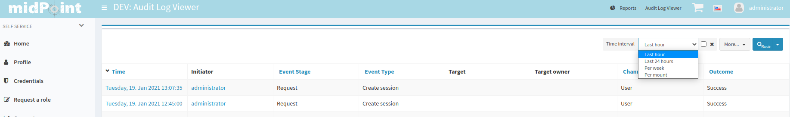

= Example of Audit search panel configuration
:page-nav-title: Example: audit search
:page-wiki-name: Example of Audit search panel configuration

This example describe how to configure time interval search item.

Adding next code to systemConfiguration.

[source,xml]
----
<systemConfiguration>
    <adminGuiConfiguration>
        <objectCollectionViews>
            .
            .
            .
            <objectCollectionView>
                <identifier>auditRecords</identifier>
                <searchBoxConfiguration>
                    <searchItems>
                        <searchItem>
                            <filterExpression>
                                
                            </filterExpression>
                            <displayName>Time interval</displayName>
                            <parameter>
                                <name>timeInterval</name>
                                <type>string</type>
                                <allowedValuesExpression>
                                    
                                </allowedValuesExpression>
                            </parameter>
                        </searchItem>
                    </searchItems>
                </searchBoxConfiguration>
                <type>AuditEventRecordType</type>
            </objectCollectionView>
            .
            .
            .
        </objectCollectionViews>
    </adminGuiConfiguration>
</systemConfiguration>
----

