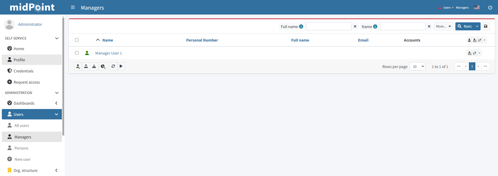
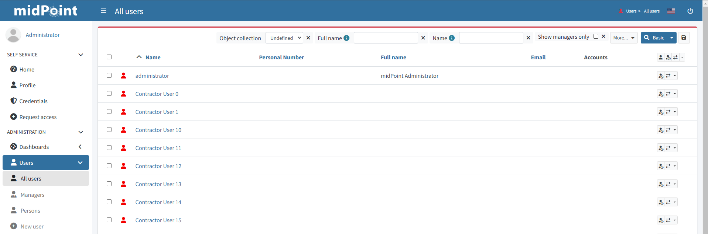
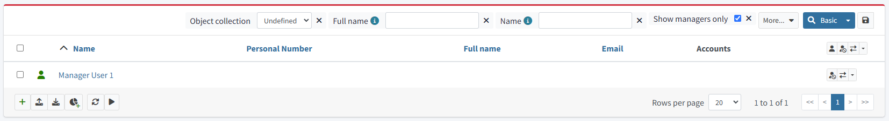

= Example of custom collection view in searchbox
:page-nav-title: Example: Custom collection in searchbox
:page-wiki-name: Example of custom collection view in searchbox

== Introduction

Have you ever wondered how to configure a custom element in the search bar? In the example below you can see how we can embed a custom object collection or query into a sidebar or searchbox panel.

=== Usecase

Our example task is to quickly filter out managers (all that have relation=manager) from all users.

We have 2 ways of dealing with this situation

==== 1. Custom collection under Users
Create a new *objectCollectionView* dedicated to display only accounts that have an assignment with relation "manager". This way you create a subpage/category under "Users" that will show only such users

Paste the code into system configuration
[source,xml]
----
...
<objectCollectionView>
    <identifier>managers-view</identifier>
    <description>Managers</description>
    <documentation>This view displays all users with relation "Manager" assignment</documentation>
    <display>
        <label>Managers</label>
        <singularLabel>Manager</singularLabel>
        <tooltip>All managers in system</tooltip>
        <icon>
            <cssClass>fa fa-user-tie</cssClass>
        </icon>
    </display>
    <displayOrder>10</displayOrder>
    <type>UserType</type>
    <collection>
        <filter>
            <q:text>assignment/targetRef matches ( relation = manager )</q:text>
        </filter>
    </collection>
</objectCollectionView>
...
----

.Custom collection in sidemenu

==== 2. Custom toggle for fast filter in All users
Create a new search panel item dedicated to filter only accounts that have an assignment with relation "manager" quickly.

NOTE: If you want to use this toggle for custom collection (under Users, e.g. Persons, etc.) just take the *<searchBoxConfiguration>* part of code and paste it to desired *objectCollectionView*

Paste the code into system configuration
[source,xml]
----
...
<objectCollectionView>
    <type>UserType</type>
    <identifier>allUsers</identifier>
    <searchBoxConfiguration>
        <searchItems>
            <searchItem>
                <filter>
                    <q:text>assignment/targetRef matches ( relation = manager )</q:text>
                </filter>
                <display>
                    <label>Show managers only</label>
                </display>
                <visibleByDefault>true</visibleByDefault>
            </searchItem>
        </searchItems>
    </searchBoxConfiguration>
</objectCollectionView>
...
----
.Custom toggle in the search bar for "All Users"

.Custom toggle active in the search bar for "All Users"

TIP: For better filtering you can use *roleMembershipRef matches ( relation = manager )* query if you wish to list all managers who got their role with "relation:manager" indirectly (from inducement)
