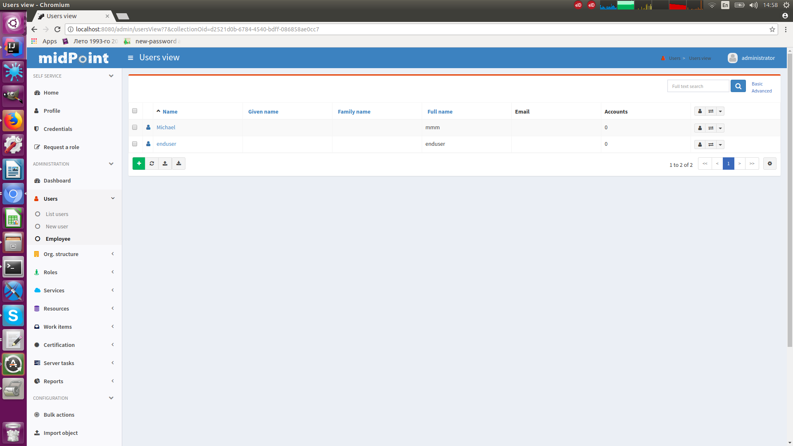

= Show Only Active Users HOWTO
:page-wiki-name: Show Only Active Users HOWTO
:page-wiki-id: 26214493
:page-wiki-metadata-create-user: semancik
:page-wiki-metadata-create-date: 2018-06-21T15:39:42.654+02:00
:page-wiki-metadata-modify-user: vix
:page-wiki-metadata-modify-date: 2019-04-03T14:06:39.695+02:00
:page-upkeep-status: yellow
:page-alias: { "parent" : "/midpoint/guides/" }

There are scenarios, when it is needed to limit the number of objects that users see.
This would normally be done by using xref:/midpoint/reference/security/authorization/[authorizations]. But authorizations have their limits.
For example, we may normally need to allow users to see basic details of almost any objects.
This is often needed because objects may be referenced from tasks, workitems, audit records and so on.
Therefore users must be authorized to read such objects.
On the other hand we do not want users to _list_ all the objects.
But getting and object and listing objects are both considered to be _reading_ by an authorization subsystem.
Therefore there is no way to disable one and enable the other.

But there is an elegant way how to limit listing of objects in midPoint user interface: xref:/midpoint/reference/admin-gui/collections-views/[Object Collections and Views]. This feature was partially implemented in midPoint 3.9 specifically for the purpose of satisfying this use case.
The basic principle is to define a special view containing only those objects that the users can see (e.g. "Employees" view).
The remove authorizations for the pages that list all users.
And leave only authorizations to access that specific view.

== Configuration

Definition of object view in adminGuiConfig in a role:

[source,xml]
----
...
<adminGuiConfiguration>
    <objectLists>
        <objectList>
			<type>UserType</type>
            <name>empls-view</name>
            <display>
                <label>Employee</label>
                <pluralLabel>Employees</pluralLabel>
            </display>
            <collectionRef oid="2c2028c8-755e-11e8-bb29-53818f7c88fb" type="ObjectCollectionType"/>
        </objectList>
    </objectLists>
</adminGuiConfiguration>
...
----

Definition of object collection as a separate midPoint object:

[source,xml]
----
<objectCollection xmlns:q="http://prism.evolveum.com/xml/ns/public/query-3"
		oid="2c2028c8-755e-11e8-bb29-53818f7c88fb">
    <name>empls</name>
    <type>UserType</type>
    <filter>
        <q:text>subtype="EMP"</q:text>
    </filter>
</objectCollection>
----

GUI representation

== Authorizations

Users should be authorized to access the "user view" page: [.underline]#link:http://midpoint.evolveum.com/xml/ns/public/security/authorization-ui-3#usersView[http://midpoint.evolveum.com/xml/ns/public/security/authorization-ui-3#usersView]#

Make sure that users do *not* have authorization to access "All users" page ([.underline]#link:http://midpoint.evolveum.com/xml/ns/public/security/authorization-ui-3#usersAll[http://midpoint.evolveum.com/xml/ns/public/security/authorization-ui-3#usersAll]#).

== See Also

* xref:/midpoint/reference/admin-gui/collections-views/[Object Collections and Views]

* bug:MID-4654[]
