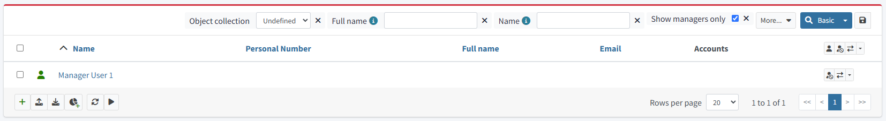

= Add custom quick search filters
:page-nav-title: Custom quick search filters
:page-toc: top
:page-description: Create an object collection view to filter out an organization managers and make the filter easily accessible in the midPoint GUI
:page-moved-from: /midpoint/reference/admin-gui/collections-views/example-searchbox-managers/
:page-wiki-name: Example of custom collection view in searchbox

Have you ever wondered how to configure a custom element in the search bar? Below, you can see how to embed a custom object collection with a user query query into the search panel and the main navigation.

== Use case

The example task is to filter out an organization managers and make the filter easily accessible in the midPoint GUI.

You have two ways of addressing the task.

:sectnums:

== Custom collection under Users in the main navigation

Create a new `objectCollectionView` dedicated to displaying only accounts that are managers of an organization.
This way, you create a new category under "Users" that will show only such users.
Add this configuration to the midPoint system configuration.

.Admin GUI configuration adding a navigation menu item to display only users who are managers of an organization
[source,xml]
----
<systemConfiguration>
    <adminGuiConfiguration>
        <objectCollectionViews>
            <objectCollectionView>
                <identifier>managers-view</identifier>
                <description>Managers</description>
                <documentation>This view displays all users with relation "Manager" assignment</documentation>
                <display>
                    <label>Managers</label>
                    <singularLabel>Manager</singularLabel>
                    <tooltip>All managers in system</tooltip>
                    <icon>
                        <cssClass>fa fa-user-tie</cssClass>
                    </icon>
                </display>
                <displayOrder>10</displayOrder>
                <type>UserType</type>
                <collection>
                    <filter>
                        <q:text>assignment/targetRef matches ( relation = manager and targetType = OrgType )</q:text>
                    </filter>
                </collection>
            </objectCollectionView>
        </objectCollectionViews>
    </adminGuiConfiguration>
</systemConfiguration>
----

.Custom collection in the main navigation menu
image::mngrs-cllctn.png["Custom collection in the main navigation menu"]

== Custom quick search filter

Create a new search panel item dedicated to filtering only accounts that are managers of an organization.

NOTE: If you want to use this quick search filter for a custom collection (under Users, e.g., Persons, etc.), take the `<searchBoxConfiguration>` part of code and put it to desired `objectCollectionView`

Put the code into the system configuration.

.Admin GUI configuration adding a quick search filter to show only users matching the specified criteria
[source,xml]
----
...
<objectCollectionView>
    <type>UserType</type>
    <identifier>allUsers</identifier>
    <searchBoxConfiguration>
        <searchItems>
            <searchItem>
                <filter>
                    <q:text>assignment/targetRef matches ( relation = manager and targetType = OrgType )</q:text>
                </filter>
                <display>
                    <label>Show managers only</label>
                </display>
                <visibleByDefault>true</visibleByDefault>
            </searchItem>
        </searchItems>
    </searchBoxConfiguration>
</objectCollectionView>
...
----
.The custom quick search filter in the search bar for "All Users"
image::mngrs-tggl-1.png["Custom quick search filter active in the search bar for All Users"]

.The custom quick search filter in the search bar for "All Users" is active

TIP: For better filtering, you can use `roleMembershipRef matches ( relation = manager )` query to list all managers who got their role with `relation:manager` indirectly (from inducement)

:sectnums!:
