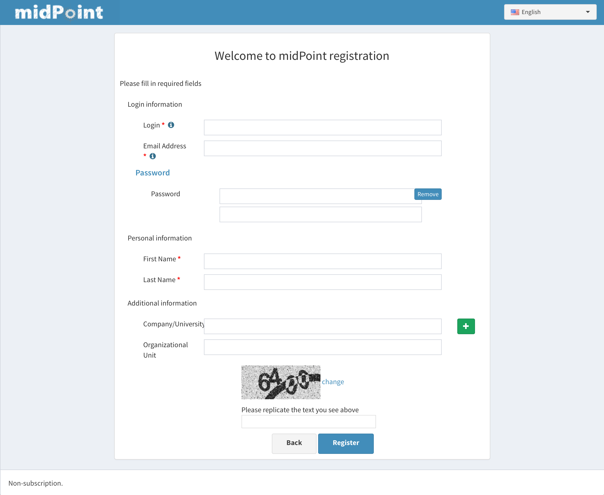

= Custom forms
:page-wiki-name: Custom forms
:page-wiki-id: 24085146
:page-wiki-metadata-create-user: katkav
:page-wiki-metadata-create-date: 2017-01-27T09:41:41.417+01:00
:page-wiki-metadata-modify-user: katkav
:page-wiki-metadata-modify-date: 2017-01-30T11:42:47.269+01:00
:page-toc: top
:page-upkeep-status: yellow

== Introduction

There are situations when using default GUI forms is not suitable for you and your use cases.
The good example could be a registration form.
I can imagine that different organizations have various ideas what they need to have filled by registration process.
To be able to satisfy all of them, how would this form looks like.
Which fields would be shown, which of them would be optional and which of them would be required? Exactly for such reasons midPoint introduces custom forms where you can explicitly define which fields are required, which of them would be shown and so on.

== Implementation

Custom forms are defined using FormType objects.
After the complete definition for custom form is defined, it is needed to reference to this form from the correct place and the result is that the custom form is shown instead of default one.
Most important (and actually supported) attributes are described below:

* *formDefinition* - is used to define the custom form, e.g. in this part attributes which are supposed to be shown are defined.
There can be also additional information such as name of the form etc.

* *formFieldGroup* - specify which attributes are grouped together.
It means that everything defined in one formFiledGroup will be shown in the same "container"

* *formField* - specify configuration for specific attribute.

Both formFieldGroup and formField can have following attributes defined:

* *ref* (ItemPathType) - path to the specific attribute.
e.g. if it is supposed to be custom form for User it can be name, familyName, fullName, extension/ext:myExtensionAttribute, etc.
This ref has to have the name (QName, path) of the real attribute as defined in the schema (extension schema) for this object type to which the form belongs to.

* *display* - specify different display information which override original information as provided in the schema

** *label* - is used as a display name in the generated form

** *help* - is used as a tooltip in the generated form

** *minOccurs* - minimal occurence of the attribute, e.g. if set to the 1, it means that the attribute is required

** *maxOccurs* - maximal occurence of the attribute

== Examples

Following is the example of custom form which can be used as a registration form:

.Custom form definition
[source,xml]
----
<form xmlns="http://midpoint.evolveum.com/xml/ns/public/common/common-3"
      xmlns:q="http://prism.evolveum.com/xml/ns/public/query-3"
      xmlns:c="http://midpoint.evolveum.com/xml/ns/public/common/common-3"
      xmlns:t="http://prism.evolveum.com/xml/ns/public/types-3"
      xmlns:icfs="http://midpoint.evolveum.com/xml/ns/public/connector/icf-1/resource-schema-3"
      xmlns:ri="http://midpoint.evolveum.com/xml/ns/public/resource/instance-3">
   <name>Registration form</name>
   <formDefinition>
      <display>
         <label>Please fill in required fields</label>
      </display>
      <formItems list="true">
         <formFieldGroup>
            <name>Login information</name>
            <formItems list="true">
               <formField>
                  <binding>
					 <c:path>name</c:path>
				  </binding>
                  <display>
                     <label>Login</label>
                     <help>Your login</help>
                     <minOccurs>1</minOccurs>
                  </display>
               </formField>
               <formField>
                 <binding>
					 <c:path>c:emailAddress</c:path>
				  </binding>
                  <display>
                     <label>Email Address</label>
                     <help>Is used to finish registration process</help>
                     <minOccurs>1</minOccurs>
                  </display>
               </formField>
               <formField>
				  <binding>
					 <c:path>c:credentials/password/value</c:path>
				  </binding>
                  <display>
                     <label>Password</label>
                     <help>minimal length 5, use of minimal unique characters 3,...</help>
                     <minOccurs>1</minOccurs>
                  </display>
               </formField>
            </formItems>
         </formFieldGroup>
         <formFieldGroup>
            <name>Personal information</name>
            <formItems list="true">
               <formField>
				  <binding>
					 <c:path>givenName</c:path>
				  </binding>
                  <display>
                     <label>First Name</label>
                     <minOccurs>1</minOccurs>
                  </display>
               </formField>
               <formField>
				  <binding>
					 <c:path>familyName</c:path>
				  </binding>
                  <display>
                     <label>Last Name</label>
                     <minOccurs>1</minOccurs>
                  </display>
               </formField>
            </formItems>
         </formFieldGroup>
         <formFieldGroup>
            <name>Additional information</name>
            <formItems list="true">
               <formField>
				  <binding>
					 <c:path>c:organization</c:path>
				  </binding>

                  <display>
                     <label>Company/University</label>
                  </display>
               </formField>
               <formField>
				  <binding>
					 <c:path>c:organizationalUnit</c:path>
				  </binding>
                  <display>
                     <maxOccurs>1</maxOccurs>
                  </display>
               </formField>
            </formItems>
         </formFieldGroup>
      </formItems>
   </formDefinition>
</form>
----

After xref:/midpoint/reference/misc/self-registration/#self-registration-and-custom-form[referencing this form definition] and applying it for registration, the screen will look like following:

== See also

* xref:/midpoint/reference/misc/self-registration/[Configuring self-registraion]

* xref:/midpoint/reference/security/credentials/password-reset/[Configuring reset password]
