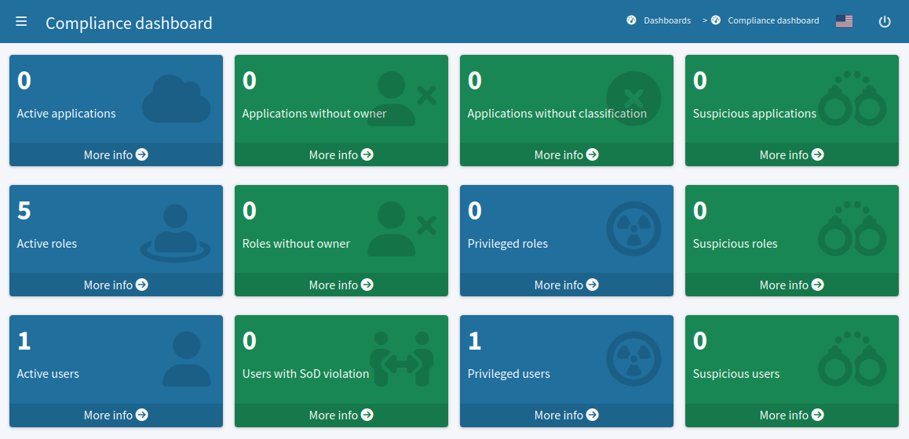

= Compliance Dashboard
:page-keywords: [ 'dashboards', 'dashboard', 'compliance', 'regulation', 'cybersecurity' ]
:page-since: "4.10"
:page-upkeep-status: green

== Description

Compliance dashboard provides aggregated overview of information and metrics related to regulatory compliance of organization.
MidPoint contains a pre-configured dashboard, which provides overview of basic compliance metrics, based on pre-configured policies and policy rules.

Compliance dashboard is a pre-configured object (a.k.a. xref:/midpoint/reference/deployment/ninja/command/initial-objects/[initial object]) in midPoint.
The dashboard can be further extended and customized as needed.

== Mechanism

Functionality of compliance dashboard is heavily based on feature:policy-concept[policies], feature:policy-rule[policy rules] and xref:/midpoint/reference/concepts/mark/[marks], as is described at xref:/midpoint/reference/roles-policies/identity-governance-rules/[] page.
Policy rules, stored in xref:/midpoint/reference/schema/policy/[policy objects] are setting the xref:/midpoint/reference/concepts/mark/[marks], which are used by compliance dashboard for compliance reporting.

== See Also

* xref:https://docs.evolveum.com/midpoint/compliance/[MidPoint Compliance]

* xref:/midpoint/reference/roles-policies/identity-governance-rules/[]

* xref:../[]
