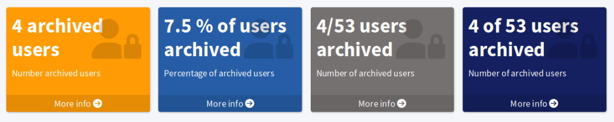

= Advanced dashboard configuration options
:page-nav-title: Advanced configuration
:page-wiki-name: Dashboard configuration
:page-wiki-id: 36569129
:page-wiki-metadata-create-user: lskublik
:page-wiki-metadata-create-date: 2019-08-06T13:26:25.499+02:00
:page-wiki-metadata-modify-user: katkav
:page-wiki-metadata-modify-date: 2020-12-10T12:36:51.667+01:00
:page-toc: top
:page-display-order: 30
:page-keywords: [ 'dashboard', 'dashboards', 'configuration' ]
:search-alias: "dashboard configuration"
:page-upkeep-status: yellow
:experimental:

This article contains advanced configuration options for dashboards and dashboard widgets in particular.
You can use the options to select the data sources for your widgets or adjust the appearance of your dashboard widgets,
including conditioning the appearance so that you get a visual warning when there are, for example, users with too many high-privilege roles.

The widget element can contain three configuration elements: `display`,`data`, and `presentation` which you can use to configure what the widget looks like, whence it takes the data, and how it presents the data to users.

include::../use-idea-for-midpoint-engineering.adoc[]

== Define data sources for widgets

The `data` element defines the source of the data that the widget displays.

To take off lightly, here is the simplest possible example of a widget with an object collection as its data source:

[source,xml]
----
<widget>
    ...
    <data>
        <sourceType>objectCollection</sourceType>
        <collection>
            <collectionRef oid="15de186e-1d8c-11e9-a469-8f5d9cfc0259" type="c:ObjectCollectionType"/>
        </collection>
    </data>
</widget>
----

The table below contains more details about the configuration options you have regarding the data sources.

.Configuration options for the `data` element
[%autowidth]
|===
| Name | Type | Description

| `sourceType`
| `DashboardWidgetSourceType`
a| Specify the type of input data for generating a message shown in the widget.
    Possible options are:

    * `objectCollection`: Content of the widget is based on an object collection.
    * `auditSearch`: Content of the widget is based on the data from an object collection with a filter for xref:/midpoint/reference/security/audit/[audit records].
        See also xref:/midpoint/reference/misc/reports/examples/audit-report-with-changed-attributes/[].
    * `object`: Content of the widget is based on the data from a single object.
        We describe this using `sourceType` and `displaySourceType` in the example beneath the table.

| `displaySourceType`
| `DashboardWidgetSourceType`
| Use this element in asynchronous widgets to select the data source the widget uses for displaying data.

    For asynchronous widgets, set this to `widgetData`.
    Although the widget data source (`sourceType`) may be, e.g., an object collection,
    a report can save the computed data into the widget object
    and the widget can then display the saved data without querying midPoint objects through the collection anew.

    The widget in the GUI usually contains a btn:[More info] button which takes users to a details page with objects queried using the `sourceType` element configuration.

    Refer to the simple example of `sourceType` and `displaySourceType` elements usage beneath the table.
    See also xref:/midpoint/reference/admin-gui/dashboards/dashboard-configuration-intro/#async-widget[] for a full tutorial on the topic.

| `collection`
| `CollectionRefSpecificationType`
| Specify which object collection should the widget use to query midPoint objects.
    The element contains a `collectionRef` element with a reference to the particular collection.

| `objectRef`
| `ObjectReferenceType`
| Specifies a single object as a data source for the widget.

| `storedData`
| `String`
| Specifies a string as a widget data source.
    The string can be stored by a report task.
    Use this configuration for asynchronous widgets.

|===

.An example of a simple asynchronous widget
[source,xml]
----
<widget>
    ...
    <data>
        <sourceType>objectCollection</sourceType> <!--1-->
        <displaySourceType>widgetData</displaySourceType> <!--2-->
        <collection>
            <collectionRef oid="15de186e-1d8c-11e9-a469-8f5d9cfc0259" type="c:ObjectCollectionType"/> <!--3-->
        </collection>
        <storedData>25/25 runnable</storedData>
    </data>
</widget>
----
<1> The source from which the data for the widget to display are computed.
<2> The instruction for the widget to display the data it has saved in itself. These data have been saved to the widget by a report.
<3> The object collection used as the primary source of the widget data.

You can use an `objectCollection`, `auditSearch` or `object` as a data source for asynchronous widgets.
Regardless the widget data source, for asynchronous widgets, you need to use the `displaySourceType` element with the `widgetData` value.

=== Use specific object as a widget data source

Another option is to define a specific `object` as a source.
In this case, a part of the configuration is a reference to the object which is used as a source.
The configuration contains a path to the attribute which is presented in the widget.

.An example of a widget data source for an object type
[source,xml]
----
<widget>
    <c:identifier>report-task-status</c:identifier>
    <data>
        <sourceType>object</sourceType>
        <objectRef oid="ed05a4ae-e39f-465a-bd56-35c41fb97bd1" type="c:TaskType"/>
    </data>
    <presentation>
        <dataField>
            <fieldType>value</fieldType>
            <expression>
                <c:path xmlns:xsi="http://www.w3.org/2001/XMLSchema-instance" xsi:type="t:ItemPathType">$object/executionState</c:path>
            </expression>
        </dataField>
    </presentation>
</widget>
----

In the example above, the selected object is a report task.
The path is set to query the execution status of the task.
The widget may render as follows, for example:

.Dashboard widget showing the execution status of an explicitly selected task.
image::object.png["Dashboard widget showing the execution status of task"]

== Define widget visual and presentation attributes

There are two elements for visual configuration of widgets:

* The `display` element: Use to adjust the appearance of your widgets, such as the default color and icon.
* The `presentation` element: Use to select the data presentation style or condition the appearance based on the data.
    Furthermore, the `view` element within the `presentation` element serves to configure the report that can be created from the dashboard configuration.

=== Visual configuration

The `display` attribute contains configuration of the widget visual side in the GUI.

.Configuration options for the `display` attribute
[%autowidth]
|===
| Name | Type | Description

| `label`
| `String`
| Displayed name of widget.

| `color`
| `String`
| Default background color of the widget.

| `icon/cssClass`
| `String`
| CSS class for widget icon; e.g., `fa fa-user`.

| `cssStyle`
| `String`
| CSS style for the widget; e.g., `color: #444 !important`.

|===

=== Presentation of widget data

The `presentation` element contains options to define how the widget presents the data.
It consists of `dataField` elements using which you adjust the displayed data.

Each `dataField` element has one `fieldType` element that states of what type the field is.
There are two field types currently supported:

* `value`: Use to specify the presentation style of the widget data.
* `unit`: Use to specify the unit for the data.

The other element in `dataField` elements is `expression`:

* In the case of `value`-type field, the `value` of the expression element holds the `proportional` element with the presentation `style` element.
* In the case of `unit`-type field, the `value` of the expression element specifies the literal shown after the number (e.g., _users_, _tasks_, _roles_).

.Data presentation configuration skeleton - two `dataField` elements, one for the value, one for the unit
[source,xml]
----
<presentation>
    <dataField>
        <fieldType>value</fieldType>
        <expression>
            <proportional>
                
            </proportional>
        </expression>
    </dataField>
    <dataField> <!--1-->
        <fieldType>unit</fieldType>
        <expression>
            <value><!-- your custom unit string --></value>
        </expression>
    </dataField>
</presentation>
----
<1> The order of the `dataField` elements is _not_ significant.
    The presentation style dictates how the data is presented.

There are four *presentation style options*:

.Four dashboard widgets showing various available data presentation styles

The available presentation styles are:

* A number of objects in the collection and no information about the collection domain
    ** For example, _8_
    ** ``
* Percentage of objects in the collection as compared with the collection domain
    ** For example, _25%_
    ** ``
* A number of objects in the collection shown with the number of objects in the domain, delimited by the slash (`/`) character
    ** For example, _8/32_
    ** ``
* A number of objects in the collection shown with the number of objects in the domain, delimited by _of_
    ** For example, _8 of 32_
    ** ``

You can see the configuration for the dashboard in the image above in the code below.

.Presentation style configurations
[%collapsible]
====
link:https://github.com/Evolveum/midpoint-samples/blob/master/samples/dashboard/howto/dashboard-widget-data-presentation-styles.xml[Git]

sampleRef::samples/dashboard/howto/dashboard-widget-data-presentation-styles.xml[]
====

==== Variation of Widget Data

The next presentation element is `variation`.
This element allows for conditional variation of the widget appearance.
Variations may change the colors or icons of the widget based on specific conditions.

.Configuration options to define a widget display variation based on a condition
[%autowidth]
|===
| Name | Type | Description

| `condition`
| `ExpressionType`
| Condition for the variation.
The variation activates when the condition evaluates to true.

| `display`
| `DisplayType`
| Display properties are applied when the condition evaluates to true.
    These display properties specify only the presentation aspects that differ from the default presentation.
    For example, if the variation only changes the widget color, only the color needs to be specified here.
    Icons and other visual attributes are taken from the primary widget display properties.

|===

You can use four variables for `condition`:

.Variables on which you can base the variation condition
[%autowidth]
|===
| Name | Type | Description | `sourceType` in data of widget

| `proportional`
| `IntegerStatType`
| Integer stat (statistic) entry.
    This entry contains stat value, together with domain value.
| `objectCollection`, `auditSearch`

| `policySituations`
| `Collection <String>`
| Collection of policy situations
| `objectCollection`

| `object`
| Based on the displayed object in the widget
| Processed object
| `object`

| `storedData`
| `String`
| Data stored in the widget
| `widgetData`

|===

.Example of a variation based on policy situation conditions
[%collapsible]
====
[source,xml]
----
<widget>
    ...
    <presentation>
        <dataField>
            <fieldType>value</fieldType>
            <expression>
                <proportional xmlns:xsi="http://www.w3.org/2001/XMLSchema-instance" xsi:type="c:ProportionalExpressionEvaluatorType">
                    
                </proportional>
            </expression>
        </dataField>
        <dataField>
            <fieldType>unit</fieldType>
            <expression>
                <value>up</value>
            </expression>
        </dataField>
        <variation>
            <condition>
                
            </condition>
            <display>
                <color>#dd4b39</color>
            </display>
        </variation>
    </presentation>
</widget>
----
====

// TODO some simplified example instead of linking the code would be beneficial @dakle 2025-09-15
==== Configure the object collection overview

The last element of the presentation container is `view`.
This element is processed when creating reports.
The main reason to configure the `view` element is to customize the report that is based on the dashboard widget or adjust the object collection screen

In the graphical user interface, the object collection screen is accessible using the btn:[More info] button on the dashboard widget tile .

Refer to these examples of the `view` element usage:

* link:https://github.com/Evolveum/midpoint-samples/blob/master/samples/reports/unchanged-accounts.xml[unchanged-accounts.xml].
* link:https://github.com/Evolveum/midpoint-samples/blob/master/samples/dashboard/dashboard-system-status.xml[dashboard-system-status.xml]

=== Configure policy rules in object collections

You can see the basic configuration for object collections in xref:/midpoint/reference/admin-gui/collections-views/configuration/#object-collection[].
For dashboards, use `policyRule` with `policyThreshold` to define a `policySituation`.

Below is an object collection for resources that are `up`.
The collection contains a policy rule that is triggered by a situation when the amount of resources that are `up` drops below 99.9% of all resources.

.Example Object Collection
[%collapsible]
====
link:https://github.com/Evolveum/midpoint-samples/blob/master/samples/dashboard/object-collection-resource-up.xml[Git]

sampleRef::samples/dashboard/object-collection-resource-up.xml[]
====

The example above contains an specification definition of the xref:/midpoint/reference/admin-gui/collections-views/configuration/#collection-domain[collection domain].
In the case here, the domain contains all the resources in the environment, and the `filter` clause specifies that only those that are `up` should be counted.
The policy rule then computes the ratio of `up` resources to all resources and fires a situation if the ratio drops below the `highWaterMark` value.

This example uses `policyRule` with `policySituation` which can be leveraged for the variation of widget presentation.
When the `policyThreshold` is met, the `policySituation` from `policyRule` triggers the widget variation.

The `policyThreshold` has two important variables: `lowWaterMark` and `highWaterMark`.

* `lowWaterMark` is the lower bound of the threshold, representing the lowest value for which the policy rule is activated.
    The policy rule will trigger for all values starting from this value up to the `highWaterMark` (closed interval).
    ** If no `lowWaterMark` is specified, the policy rule activates for all values up to the `highWaterMark`.

* `highWaterMark` is the upper bound of the threshold, representing the highest value for which the policy rule is activated.
    The policy rule will trigger for all values starting from the `lowWaterMark` up to this value (closed interval).
    ** If no `highWaterMark` is specified, the policy rule activates for all values greater than or equal to the `highWaterMark`.

A policy rule with a threshold that does not have any water marks will never activate.

Both watermark objects are of the `WaterMarkType` type and can contain `count` and `percentage` variables.

== See also

* xref:/midpoint/reference/misc/reports/configuration/dashboard-report/[]
* xref:/midpoint/reference/misc/reports/examples/[]
* xref:/midpoint/reference/admin-gui/collections-views/[]
* xref:/midpoint/reference/schema/archetypes/[]
* xref:/midpoint/reference/misc/notifications/[]
