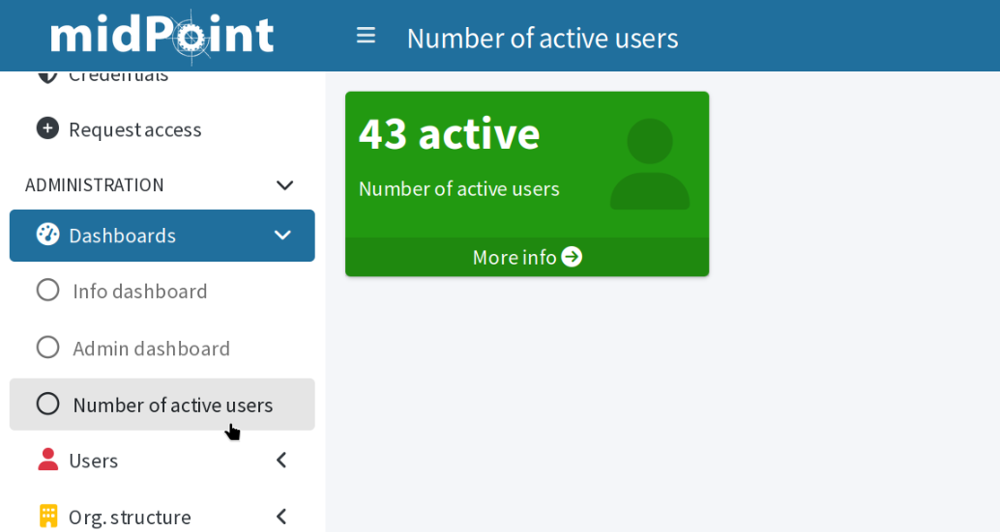

= Create dashboards in midPoint
:page-nav-title: Configure dashboards
:page-wiki-name: Dashboard configuration
:page-wiki-id: 36569129
:page-wiki-metadata-create-user: lskublik
:page-wiki-metadata-create-date: 2019-08-06T13:26:25.499+02:00
:page-wiki-metadata-modify-user: katkav
:page-wiki-metadata-modify-date: 2020-12-10T12:36:51.667+01:00
:page-toc: top
:page-keywords: [ 'dashboard', 'dashboards', 'configuration' ]
:search-alias: "dashboard configuration"
:page-upkeep-status: yellow
:page-upkeep-note: check TODO's after sampleRef is fully in prod remove links
:page-moved-from: /midpoint/guides/dashboards-howto/

This article guides you through the steps required to configure dashboards.
Start with a simple dashboard showing one metric, such as number of active users, then continue adding more advanced pieces, such as percentage of failed resources or accounts violating segregation of duties.

From the data update perspective, dashboard widgets can be xref:../#async-dashboards-and-report[synchronous or asynchronous].
In this guide, you first create a simple synchronous widget.
After that, you will add an asynchronous widget to the dashboard.

[TIP]
====
We recommend using link:https://www.jetbrains.com/idea/[IntelliJ IDEA] with the xref:/midpoint/tools/studio/[midPoint Studio] plugin.
Engineering midPoint with Studio is definitely much easier.
====

== Quick guides to create and deploy dashboards

Before we dive into details, here is a TL;DR version of this article.
The points below summarize the steps to take when deploying dashboards.

=== How to deploy standard dashboards

. Prepare and xref:/midpoint/tools/studio/usage/index.adoc#uploading-midpoint-objects[upload] an object collection with an object filter definition.
. Prepare and upload a dashboard with a widget using the object collection.
. Add a `<configurableUserDashboard>` element to `SystemConfiguration` and upload the configuration.
. Check the configuration:
.. Refresh the GUI (you may need to log out and back in) to apply the system configuration changes.
.. Go to [.nowrap]#icon:tachometer-alt[] *Dashboards*# to see your new dashboard.

=== How to deploy dashboards with asynchronous widgets

. Prepare and xref:/midpoint/tools/studio/usage/index.adoc#uploading-midpoint-objects[upload] an object collection with an object filter definition.
. Prepare and upload a dashboard with a widget using the object collection.
. Prepare and upload a dashboard report.
. Prepare and upload a report task.
. Add a `<configurableUserDashboard>` element to `SystemConfiguration` and upload the configuration.
. Check the configuration:
.. Refresh the GUI (you may need to log out and back in) to apply the system configuration changes.
.. Go to [.nowrap]#icon:tachometer-alt[] *Dashboards*# to see your new dashboard.
    The asynchronous widget cannot show data yet.
.. Run the report task or wait until its scheduled run finishes.
.. Go to [.nowrap]#icon:tachometer-alt[] *Dashboards*# again.
    The asynchronous widget should now display correct data.

When you upload a dashboard with asynchronous widgets, it displays an _Unknown_ value until the report task runs for the first time and saves the computed data to the dashboard widgets.

[TIP]
====
You can get inspiration from link:https://github.com/Evolveum/midpoint-samples/tree/master/samples/dashboard/howto[midPoint configuration samples on GitHub]:

* `collection-enabled-users.xml`: Object collection filtering enabled users.
* `collection-disabled-users.xml`: Object collection filtering disabled users.
* `dashboard-howto-example.xml`: Dashboard definition.
* `report-dashboard-howto-example.xml`: Dashboard report used to update the asynchronous dashboard widgets.
* `task-report-dashboard-howto-example.xml`: Report task used to run the report.
====

== Create your custom dashboard

To create a dashboard, you need to create a dashboard object with an OID, name, label, and widgets.
The name and label are used for the graphical user interface (GUI).

[source,xml]
----
<dashboard oid="8f9f3d5f-a890-452b-8d2b-57b8644c1f04">
     <name>system-status-dashboard</name>
     <display>
         <label>Number of active users</label>
     </display>
     <widget>
        <!--1-->
     </widget>
     <widget>
        <!--2-->
     </widget>
</dashboard>
----
<1> The widget code from the link:#simple-widget[section on a simple widget] goes here.
<2> The widget code from the link:#async-widget[section on an asynchronous widget] goes here.

The dashboard with two widgets is ready but its widgets are not.
Now is the time to create them.

[[simple-widget]]
=== Create a simple widget for the dashboard

Widgets are not separate configuration objects, they go directly into their parent dashboard object.
The first widget we create here is a simple synchronous one;
the data it shows are calculated every time a user loads the screen with the dashboard.
You will see how to create an asynchronous widget in the example for the second widget below.

The first simple widget shows the number of users that are active; for example, active employees as opposed to those on long-term leave.
The widget itself does not query the users.
That is what the object collection is for (see the `collectionRef` element in the code below).

[source,xml]
----
<widget>
    <identifier>active-users</identifier>
    <display>
        <label>Number of active users</label>
        <color>#229911</color>
        <icon>
            <cssClass>fa fa-user</cssClass>
        </icon>
    </display>
    <data>
        <sourceType>objectCollection</sourceType>
        <collection>
            <collectionRef
                oid="0ac5f62a-1d0c-4b0c-afbf-d19bfb1f6112" <!--1-->
                type="ObjectCollectionType"
            />
        </collection>
    </data>
    <presentation>
        <dataField>
            <fieldType>value</fieldType>
            <expression>
                <proportional>
                    
                </proportional>
            </expression>
        </dataField>
        <dataField>
            <fieldType>unit</fieldType>
            <expression>
                <value>active</value>
            </expression>
        </dataField>
    </presentation>
</widget>
----
<1> The object collection OID from the link:#create-collection[section below] goes here.

The dashboard now has one widget.
However, it still has no data to show, because we do not have the object collection yet.

[[create-collection]]
=== Define object collection to count objects of interest

xref:/midpoint/reference/admin-gui/collections-views/[Object collections], as their name suggests, _collect_ or enumerate objects based on a query you define.
Object collections are standalone midPoint objects.

To go with the example of counting active users, create a collection that enumerates objects of the `UserType` type (i.e., users) for which the `activation/effectiveStatus` equals to `enabled`.

[source,xml]
----
<objectCollection oid="0ac5f62a-1d0c-4b0c-afbf-d19bfb1f6112">
    <name>All enabled users</name>
    <type>UserType</type>
    <filter>
        <q:text>activation/effectiveStatus = "enabled"</q:text>
    </filter>
</objectCollection>
----

And this is it.
You are getting closer to your goal:

* Add the OID of the collection above to the `collectionRef` in the link:#simple-widget:[widget].
* Move the widget code to the dashboard object.
* Upload both the collection and the dashboard objects to your midPoint instance.

The only step that remains is to display the dashboard in the midPoint graphical user interface.

=== Add the dashboard to the main menu

To have the new dashboard displayed in the main midPoint menu, you need to add it to the system configuration:

[source,xml]
----
<systemConfiguration>
    ...
    <adminGuiConfiguration>
        <configurableUserDashboard id="999"> <!--1-->
            <identifier>enabled-users-dashboard</identifier>
            <configurableDashboardRef
                oid="8f9f3d5f-a890-452b-8d2b-57b8644c1f04" <!--2-->
                relation="org:default"
                type="c:DashboardType"
            >
            </configurableDashboardRef>
        </configurableUserDashboard>
        <!--3-->
    </adminGuiConfiguration>
    ...
</systemConfiguration>
----
<1> Create a unique integer ID.
<2> The OID of your dashboard goes here.
<3> More `configurableUserDashboard` elements can follow here, one for each dashboard.

Now, you can refresh the GUI (you may need to log out and back in) and go to [.nowrap]#icon:tachometer-alt[] *Dashboards*# to see your new dashboard.

[[async-widget]]
== Create asynchronous widget to reduce system load

Simple widgets like the one above are easy to deploy, but xref:../#asynchronous-dashboards[you may want to use asynchronous widgets] instead.

An asynchronous widget uses a task to recompute the data at an interval of your choosing and holds the result in the widget object.
You can use the same object collection as you do with the synchronous widget above.

[NOTE]
====
Report tasks for asynchronous dashboard update are not to be confused with
xref:/midpoint/reference/tasks/synchronization-tasks/asynchronous-update[asynchronous update tasks] which are used for updating data from resources.
====

=== Configure your widget for asynchronous loading

To configure a widget as asynchronous, you need to adjust the widget data source and create two new pieces of configuration:

* A report which takes the dashboard configuration, triggers the data computation, and saves the results into the dashboard widget objects.
    ** Note that a dashboard report always computes the data for all the widgets in the linked dashboard.
* A report task which runs the report at scheduled intervals to refresh the data.

First, change the widget configuration by adding the `displaySourceType` element so that the report can save the computed data in the widget object:

[source,xml]
----
<widget>
    <identifier>active-users</identifier>
    <display>
        <label>Number of active users</label>
        <color>#883399</color>
        <icon>
            <cssClass>fa fa-user</cssClass>
        </icon>
    </display>
    <data>
        <sourceType>objectCollection</sourceType>
        <displaySourceType>widgetData</displaySourceType> <!--1-->
        <collection>
            <collectionRef
                oid="0ac5f62a-1d0c-4b0c-afbf-d19bfb1f6112" <!--2-->
                type="ObjectCollectionType"
            />
        </collection>
    </data>
    <presentation>
        <dataField>
            <fieldType>value</fieldType>
            <expression>
                <proportional>
                    
                </proportional>
            </expression>
        </dataField>
        <dataField>
            <fieldType>unit</fieldType>
            <expression>
                <value>active</value>
            </expression>
        </dataField>
    </presentation>
</widget>
----
<1> Enable saving data into the widget object
<2> The object collection OID goes here.

=== Create a report connected to your dashboard

Secondly, you need a dashboard report that "runs" the dashboard as if a user has visited it and makes midPoint compute the data in the dashboard.

[NOTE]
====
If you display the dashboard with an asynchronous widget before you create and run the report for the first time,
the widget will show _Unknown_ instead of a meaningful value because midPoint has not yet computed the data to show.
====

See xref:/midpoint/reference/misc/reports/configuration/dashboard-report/[] for instructions on creating a dashboard report.

When configuring the report, use your dashboard as the configuration basis of the report.
After you create the report, you can run it manually to compute the data and verify your configuration.

=== Create a scheduled recurring task to refresh dashboard data regularly

To have the data on the dashboard refreshed regularly, you need a recurring task.

See xref:/midpoint/reference/misc/reports/configuration/report-task-definition/#export-report[] for instructions on creating an export report task.

When configuring the task, you need to use the _report export_ activity and use the OID of the dashboard report you want the task to run.
In most cases, it makes sense to schedule this task to run at regular intervals in order to have the data in the dashboard updated automatically.

Once you have all the pieces in place, upload them to your midPoint instance, refresh the GUI (possibly log out and back in), and see the updated dashboard under [.nowrap]#icon:tachometer-alt[] *Dashboards*#.

== Dashboard widget configuration attributes

This section contains details on possible widget configuration options.

The widget element contains three configuration attributes: `display`,`data`, and `presentation`.

=== Display attribute

The `display` attribute contains configuration of the widget visual side in the GUI.

[%autowidth]
|===
| Name | Type | Description

| `label`
| `String`
| Displayed name of widget.

| `color`
| `String`
| Default color of background for widget.

| `icon/cssClass`
| `String`
| CSS class for widget icon; for example, `fa fa-user`.

| `cssStyle`
| `String`
| CSS style for the widget; for example, `color: #444 !important` to change the font color.

|===

=== Data attribute

The `data` attribute represents the data source that the widget displays.

[%autowidth]
|===
| Name | Type | Description

| `sourceType`
| `DashboardWidgetSourceType`
| Type of widget content data source.
    Specify the type of input data, which midPoint uses for generating a message shown in the widget.
    This is an enumeration type and possible values are:

    * `objectCollection`: Content of the widget is based on object collection.
    * `auditSearch`: Content of the widget is based on the data from an object collection with a filter for audit records.
    * `object`: Content of the widget is based on the data from a single object.
        We describe this using `sourceType` and `displaySourceType` in the example beneath the table.

| `displaySourceType`
| `DashboardWidgetSourceType`
| This attribute is an identifier that overrides `sourceType`.
    You can use it for asynchronous widgets.
    This element is used only for number messages shown in the widget in the GUI.
    The widget in the GUI may contain a link for a redirect to a details page and the used `sourceType`.
    We describe the usage of `sourceType` and `displaySourceType` in the example beneath the table.

| `collection`
| `CollectionRefSpecificationType`
| Specification of an explicit or implicit object collection that is used as a data source for the view.
    Contains variable `collectionRef` which is a reference to the object collection enumerating objects for the widget.

| `objectRef`
| `ObjectReferenceType`
| Specifies a single object as a data source for the widget.

| `storedData`
| `String`
| Specifies a string data as a widget data source.
    This data can be stored by a report task.
    This configuration is used in asynchronous widgets.

|===

===== Using sourceType and displaySourceType

When you configure a simple widget, you can set the `sourceType` to either `objectCollection`, `auditSearch` or `object`.

The `displaySourceType` is important for asynchronous widgets.
In the case of asynchronous widgets, you set `widgetData` as `displaySourceType` and use `objectCollection` as `sourceType`.
This means that the widget shows stored data from the `storedData` attribute, but when you click the widgets, the redirection for object details uses `sourceType`.
`sourceType` is also use by the export report task for generating content in `storedData`.

When you use `objectCollection` or `auditSearch` as a source, midPoint needs a reference to the object collection which contains a filter for the reported data.

The following is an example of widget data source for an object collection:

[source,xml]
----
<widget>
    ...
    <data>
        <sourceType>objectCollection</sourceType>
        <collection>
            <collectionRef oid="15de186e-1d8c-11e9-a469-8f5d9cfc0259" type="c:ObjectCollectionType"/>
        </collection>
    </data>
</widget>
----

Another option is to define a specific `object` as a source.
In this case, a part of the configuration is a reference to the object which is used as a source.
The configuration contains a path to the attribute which is presented in the widget.

An example of a widget data source for an object type:

[source,xml]
----
<widget>
    ...
    <data>
        <sourceType>object</sourceType>
        <objectRef oid="00000000-0000-0000-0000-000000000005" type="c:TaskType"/>
    </data>
</widget>
----

A widget in the GUI with an `object` as a source.
In this case, it is a cleanup task with the path set to the `state` attribute:

image::object.png[]

In the case when you want to set up an asynchronous widget, you can use an `objectCollection`, `auditSearch` or `object` as a source.
However, you have to also use the `widgetData` attribute value for the `displaySourceType` attribute.

An example of a widget data source for widget data (asynchronous widget):

[source,xml]
----
<widget>
    ...
    <data>
        <sourceType>objectCollection</sourceType>
        <displaySourceType>widgetData</displaySourceType>
        <collection>
            <collectionRef oid="15de186e-1d8c-11e9-a469-8f5d9cfc0259" type="c:ObjectCollectionType"/>
        </collection>
        <storedData>25/25 runnable</storedData>
    </data>
</widget>
----

=== Presentation of widget data

// TODO: add configuration examples to each presentation option @dakle 2025-09-07

`presentation` is a container attribute used to define how to present the data.

There are four presentation options:

* percentage (50%)

image::percentage.png[]

* separated with slash (5/10)

image::slash.png[]

* separated with "of" (5 of 10)

image::of.png[]

* only value (5)

image::only-value.png[]

The `presentation` container contains three attributes: `dataField`, `variation` and `view`.

===== The widget data field

The attribute `dataField` describes the properties of a specific widget data field.
Note that the order in the `dataField` elements is _not_ significant.
The field order is given by specific presentation style.

The attributes for `dataField`:

[%autowidth]
|===
| Name | Type | Description

| `fieldType`
| `DashboardWidgetDataFieldType`
| Type of the field.
    MidPoint currently supports `value` and `unit` as the values for the `fieldType` attribute:

    * `value` is the actual value displayed.
    * `unit` defines the unit for the value.

    For example, in a message _5/9 up_ is _5/9_ the `value` and _up_ the `unit`.

| `expression`
| `ExpressionType`
| Expression that produces the value to display in the widget.

|===

For the `fieldType` attribute, when set to `value`, a special type of expression is defined.
In this expression, the attribute `proportional` must be defined along with the attribute `style`.
The attribute `style` is an enumeration type with the following values:

* `percentage` (for example, 50%)
* `value-slash-domain` (for example, 5/10)
* `value-of-domain` (for example, 5 of 10)
* `value-only` (for example, 5)

===== Variation of Widget Data

The next presentation attribute is `variation`.
This attribute allows for conditional variation in how the widget is displayed.
Variations may change the colors or icons of the widget based on specific conditions.
The attributes for `variation` are as follows:

[%autowidth]
|===
| Name | Type | Description

| `condition`
| `ExpressionType`
| Condition for the variation.
The variation will be active if the condition evaluates to true.

| `display`
| `DisplayType`
| Display properties are applied when the condition evaluates to true.
    These display properties specify only the presentation aspects that differ from the usual presentation.
    For example, if the variation only changes the widget color, only the color needs to be specified here.
    Icons and other styles are taken from the primary widget display properties.

|===

You can use four variables for `condition`:

[%autowidth]
|===
| Name | Type | Description | `sourceType` in data of widget

| `proportional`
| `IntegerStatType`
| Integer stat (statistic) entry.
    This entry contains stat value, together with domain value.
| `objectCollection`, `auditSearch`

| `policySituations`
| `Collection <String>`
| Collection of policy situations.
| `objectCollection`

| `object`
| Based on the displayed object in the widget
| Processed object.
| `object`

| `storedData`
| `String`
| Data stored in the widget.
| `widgetData`

|===

// TODO no example, add ??
===== View

The last variable of the presentation container is `view`.
This variable is also processed when creating reports.
The main reason to configure a view is to customize the reported or presented object collection that the dashboard widget is based on.
The widget object collection can be accessed via the GUI btn:[More info] button.

//TODO check after sampleRef is fully in prod
.*Example of `presentation`*:
[%collapsible]
====
[source,xml]
----
<widget>
    ...
    <presentation>
        <dataField>
            <fieldType>value</fieldType>
            <expression>
                <proportional xmlns:xsi="http://www.w3.org/2001/XMLSchema-instance" xsi:type="c:ProportionalExpressionEvaluatorType">
                    
                </proportional>
            </expression>
        </dataField>
        <dataField>
            <fieldType>unit</fieldType>
            <expression>
                <value>up</value>
            </expression>
        </dataField>
        <variation>
            <condition>
                
            </condition>
            <display>
                <color>#dd4b39</color>
            </display>
        </variation>
    </presentation>
</widget>
----
====

=== Configuration details for object collections

You can see the basic configuration for `objectCollection` in xref:/midpoint/reference/admin-gui/collections-views/configuration/#object-collection[].
For the dashboard, you can use `policyRule` with `policyThreshold` to define a `policySituation`.
Here is an example of `objectCollection` for a resource that has the status set to "UP":

//TODO check after sampleRef is fully in prod
.*Example Object Collection*
[%collapsible]
====
link:https://github.com/Evolveum/midpoint-samples/blob/master/samples/dashboard/object-collection-resource-up.xml[Git]

sampleRef::samples/dashboard/object-collection-resource-up.xml[]
====

The variable (collection) _domain_ is a set of objects that represents "all the objects" used in a collection.
For example, for a collection of "up resources", the domain is "all resources."
The domain is filtered using the _filter_ to contain only the specific set of objects needed.

In this example, use _policyRule_ with _policySituation_, which can be leveraged in the variation of widget presentation.
When the _policyThreshold_ is met, the _policySituation_ from _policyRule_ triggers the widget variation.
The _policyThreshold_ has two important variables: _lowWaterMark_ and _highWaterMark_.

_lowWaterMark_ is the lower bound of the threshold, representing the lowest value for which the policy rule is activated.
The policy rule will trigger for all values starting from this value up to the _highWaterMark_ (closed interval).
If no _lowWaterMark_ is specified, the policy rule activates for all values up to the _highWaterMark_.
A policy rule with a threshold that does not have any water marks will never activate.

_highWaterMark_ is the upper bound of the threshold, representing the highest value for which the policy rule is activated.
The policy rule will trigger for all values starting from the _lowWaterMark_ up to this value (closed interval).
If no _highWaterMark_ is specified, the policy rule activates for all values greater than or equal to the _highWaterMark_.

Both variables are of the type _WaterMarkType_, which contains the variables _count_ and _percentage_.

== More configuration examples

=== Simple Example for "Enabled Users Widget"

This section presents a very simple example of an enabled users widget that displays the number of enabled users.

First, create an object collection with a filter for users for which the attribute `activation/effectiveStatus` equals to `enabled`.

//TODO check after sampleRef is fully in prod
.*Example Object Collection*
[%collapsible]
====
link:https://github.com/Evolveum/midpoint-samples/blob/master/samples/dashboard/howto/collection-enabled-users.xml[Git]

sampleRef::samples/dashboard/howto/collection-enabled-users.xml[]
====

And next, create dashboard with one widget for enabled users.

//TODO check after sampleRef is fully in prod
.*Example Dashboard Configuration*
[%collapsible]
====
link:https://github.com/Evolveum/midpoint-samples/blob/master/samples/dashboard/dashboard-asynchronous-widget.xml[Git]

sampleRef::samples/dashboard/dashboard-asynchronous-widget.xml[]
====

Lastly, add the new dashboard to the GUI in system configuration.

After accessing the new dashboard in GUI, you can see your new widget.

image::enabled-users.png[]

[#_asynchronous_widget]
=== Asynchronous widget

To configure an asynchronous widget, use the `displaySourceType` attribute in the widget configuration and set it to `widgetData`.
Set `sourceType` to `objectCollection` to handle redirects to a details page when clicking on the widget details.

Next, configure a dashboard report task to generate and store data in the widget.
Use a dashboard report with the element `storeExportedWidgetData`.

You can use the same collection as in the previous example for enabled users.

//TODO check after sampleRef is fully in prod

.*Example Object Collection*
[%collapsible]
====
link:https://github.com/Evolveum/midpoint-samples/blob/master/samples/dashboard/howto/collection-enabled-users.xml[Git]

sampleRef::samples/dashboard/howto/collection-enabled-users.xml[]
====

Next, create a dashboard.
Add the attribute `displaySourceType` with the value `widgetData`.

//TODO check after sampleRef is fully in prod

.*Example Dashboard Configuration*
[%collapsible]
====
link:https://github.com/Evolveum/midpoint-samples/blob/master/samples/dashboard/dashboard-asynchronous-widget.xml[Git]

sampleRef::samples/dashboard/dashboard-asynchronous-widget.xml[]
====

Finally, create a report for the dashboard.

//TODO check after sampleRef is fully in prod

.*Example Report Configuration*
[%collapsible]
====
link:https://github.com/Evolveum/midpoint-samples/blob/master/samples/dashboard/report-asynchronous-widget.xml[Git]

sampleRef::samples/dashboard/report-asynchronous-widget.xml[]
====

Now run the report, and midPoint processes the source data for the dashboard.
The resulting data are written to the widget in the dashboard.

include::../raw/file-format.adoc[]

Next time you open the widget in the GUI, midPoint does not need to process the source data;
it shows the saved data present in the widget object.

image::enabled-users.png[]

== Dashboard views

A dashboard can provide additional info when users click the btn:[More info] button.
In this case, should you use an `objectCollection` as the data `sourceType`, you would see a table of objects in the collection.
The table can be configured and customized.
This is done via the `view` container.
The screenshot below is from the example dashboard in link:https://github.com/Evolveum/midpoint-samples/tree/master/samples/dashboard[dashboard-system-status.xml]:

image::dashboard-screenshot.png[]

== See also

* xref:/midpoint/reference/misc/reports/configuration/dashboard-report/[]
* xref:/midpoint/reference/misc/reports/examples/[]
* xref:/midpoint/reference/admin-gui/collections-views/[]
* xref:/midpoint/features/planned/compliance/[]
* xref:/midpoint/reference/schema/archetypes/[]
* xref:/midpoint/reference/misc/notifications/[]
