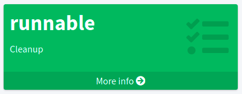
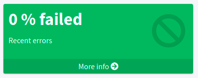
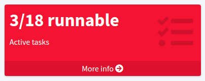
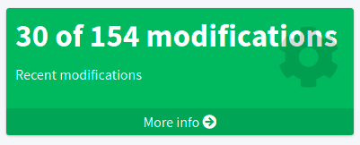
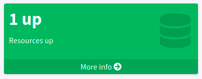
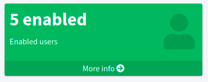
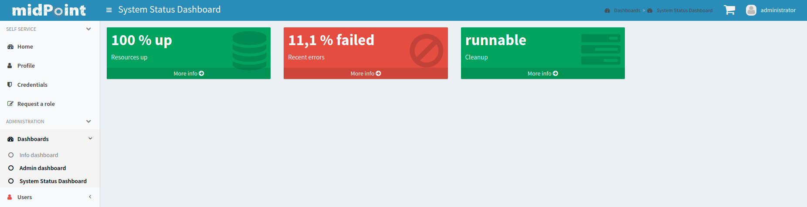

= Advanced midPoint dashboard configuration options
:page-nav-title: Advanced configuration
:page-wiki-name: Dashboard configuration
:page-wiki-id: 36569129
:page-wiki-metadata-create-user: lskublik
:page-wiki-metadata-create-date: 2019-08-06T13:26:25.499+02:00
:page-wiki-metadata-modify-user: katkav
:page-wiki-metadata-modify-date: 2020-12-10T12:36:51.667+01:00
:page-toc: top
:page-keywords: [ 'dashboard', 'dashboards', 'configuration' ]
:search-alias: "dashboard configuration"
:page-upkeep-status: yellow
:page-upkeep-note: check TODO's after sampleRef is fully in prod remove links

This article contains advanced configuration options for dashboards and dashboard widgets in particular.
You can use the options to select the data sources of widgets or adjust the appearance of your dashboard widgets,
including conditioning the appearance so that you get a visual warning when there are users with too many high-privilege roles, for example.

include::use-idea-for-midpoint-engineering.adoc[]

== Dashboard widget configuration attributes

This section contains details on possible widget configuration options.

The widget element contains three configuration attributes: `display`,`data`, and `presentation`.

=== Display attribute

The `display` attribute contains configuration of the widget visual side in the GUI.

.Configuration options for the `display` attribute
[%autowidth]
|===
| Name | Type | Description

| `label`
| `String`
| Displayed name of widget.

| `color`
| `String`
| Default color of background for widget.

| `icon/cssClass`
| `String`
| CSS class for widget icon; for example, `fa fa-user`.

| `cssStyle`
| `String`
| CSS style for the widget; for example, `color: #444 !important` to change the font color.

|===

=== Data attribute

The `data` attribute represents the data source that the widget displays.

.Configuration options for the `data` attribute
[%autowidth]
|===
| Name | Type | Description

| `sourceType`
| `DashboardWidgetSourceType`
| Type of widget content data source.
    Specify the type of input data, which midPoint uses for generating a message shown in the widget.
    This is an enumeration type and possible values are:

    * `objectCollection`: Content of the widget is based on object collection.
    * `auditSearch`: Content of the widget is based on the data from an object collection with a filter for audit records.
    * `object`: Content of the widget is based on the data from a single object.
        We describe this using `sourceType` and `displaySourceType` in the example beneath the table.

| `displaySourceType`
| `DashboardWidgetSourceType`
| This attribute is an identifier that overrides `sourceType`.
    You can use it for asynchronous widgets.
    This element is used only for number messages shown in the widget in the GUI.
    The widget in the GUI may contain a link for a redirect to a details page and the used `sourceType`.
    We describe the usage of `sourceType` and `displaySourceType` in the example beneath the table.

| `collection`
| `CollectionRefSpecificationType`
| Specification of an explicit or implicit object collection that is used as a data source for the view.
    Contains variable `collectionRef` which is a reference to the object collection enumerating objects for the widget.

| `objectRef`
| `ObjectReferenceType`
| Specifies a single object as a data source for the widget.

| `storedData`
| `String`
| Specifies a string data as a widget data source.
    This data can be stored by a report task.
    This configuration is used in asynchronous widgets.

|===

==== Using sourceType and displaySourceType

When you configure a simple widget, you can set the `sourceType` to either `objectCollection`, `auditSearch` or `object`.

The `displaySourceType` is important for asynchronous widgets.
In the case of asynchronous widgets, you set `widgetData` as `displaySourceType` and use `objectCollection` as `sourceType`.
This means that the widget shows stored data from the `storedData` attribute, but when you click the widgets, the redirection for object details uses `sourceType`.
`sourceType` is also use by the export report task for generating content in `storedData`.

When you use `objectCollection` or `auditSearch` as a source, midPoint needs a reference to the object collection which contains a filter for the reported data.

The following is an example of widget data source for an object collection:

[source,xml]
----
<widget>
    ...
    <data>
        <sourceType>objectCollection</sourceType>
        <collection>
            <collectionRef oid="15de186e-1d8c-11e9-a469-8f5d9cfc0259" type="c:ObjectCollectionType"/>
        </collection>
    </data>
</widget>
----

Another option is to define a specific `object` as a source.
In this case, a part of the configuration is a reference to the object which is used as a source.
The configuration contains a path to the attribute which is presented in the widget.

An example of a widget data source for an object type:

[source,xml]
----
<widget>
    ...
    <data>
        <sourceType>object</sourceType>
        <objectRef oid="00000000-0000-0000-0000-000000000005" type="c:TaskType"/>
    </data>
</widget>
----

A widget in the GUI with an `object` as a source.
In this case, it is a cleanup task with the path set to the `state` attribute:

.Dashboard widget showing the status of the task selected by an OID.

In the case when you want to set up an asynchronous widget, you can use an `objectCollection`, `auditSearch` or `object` as a source.
However, you have to also use the `widgetData` attribute value for the `displaySourceType` attribute.

An example of a widget data source for widget data (asynchronous widget):

[source,xml]
----
<widget>
    ...
    <data>
        <sourceType>objectCollection</sourceType>
        <displaySourceType>widgetData</displaySourceType>
        <collection>
            <collectionRef oid="15de186e-1d8c-11e9-a469-8f5d9cfc0259" type="c:ObjectCollectionType"/>
        </collection>
        <storedData>25/25 runnable</storedData>
    </data>
</widget>
----

=== Presentation of widget data

// TODO: add configuration examples to each presentation option @dakle 2025-09-07

`presentation` is a container attribute used to define how to present the data.

There are four presentation options:

* percentage (50%)

* separated with slash (5/10)

* separated with "of" (5 of 10)

* only value (5)

The `presentation` container contains three attributes: `dataField`, `variation` and `view`.

==== The widget data field

The attribute `dataField` describes the properties of a specific widget data field.
Note that the order in the `dataField` elements is _not_ significant.
The field order is given by specific presentation style.

The attributes for `dataField`:

.Configuration options for the `dataField` attribute
[%autowidth]
|===
| Name | Type | Description

| `fieldType`
| `DashboardWidgetDataFieldType`
| Type of the field.
    MidPoint currently supports `value` and `unit` as the values for the `fieldType` attribute:

    * `value` is the actual value displayed.
    * `unit` defines the unit for the value.

    For example, in a message _5/9 up_ is _5/9_ the `value` and _up_ the `unit`.

| `expression`
| `ExpressionType`
| Expression that produces the value to display in the widget.

|===

For the `fieldType` attribute, when set to `value`, a special type of expression is defined.
In this expression, the attribute `proportional` must be defined along with the attribute `style`.
The attribute `style` is an enumeration type with the following values:

* `percentage` (for example, 50%)
* `value-slash-domain` (for example, 5/10)
* `value-of-domain` (for example, 5 of 10)
* `value-only` (for example, 5)

==== Variation of Widget Data

The next presentation attribute is `variation`.
This attribute allows for conditional variation in how the widget is displayed.
Variations may change the colors or icons of the widget based on specific conditions.
The attributes for `variation` are as follows:

.Configuration attributes to define a widget display variation based on a condition
[%autowidth]
|===
| Name | Type | Description

| `condition`
| `ExpressionType`
| Condition for the variation.
The variation will be active if the condition evaluates to true.

| `display`
| `DisplayType`
| Display properties are applied when the condition evaluates to true.
    These display properties specify only the presentation aspects that differ from the usual presentation.
    For example, if the variation only changes the widget color, only the color needs to be specified here.
    Icons and other styles are taken from the primary widget display properties.

|===

You can use four variables for `condition`:

.Variables on which you can base the variation condition
[%autowidth]
|===
| Name | Type | Description | `sourceType` in data of widget

| `proportional`
| `IntegerStatType`
| Integer stat (statistic) entry.
    This entry contains stat value, together with domain value.
| `objectCollection`, `auditSearch`

| `policySituations`
| `Collection <String>`
| Collection of policy situations.
| `objectCollection`

| `object`
| Based on the displayed object in the widget
| Processed object.
| `object`

| `storedData`
| `String`
| Data stored in the widget.
| `widgetData`

|===

// TODO no example, add ??
==== View

The last variable of the presentation container is `view`.
This variable is also processed when creating reports.
The main reason to configure a view is to customize the reported or presented object collection that the dashboard widget is based on.
The widget object collection can be accessed via the GUI btn:[More info] button.

//TODO check after sampleRef is fully in prod
.*Example of `presentation`*:
[%collapsible]
====
[source,xml]
----
<widget>
    ...
    <presentation>
        <dataField>
            <fieldType>value</fieldType>
            <expression>
                <proportional xmlns:xsi="http://www.w3.org/2001/XMLSchema-instance" xsi:type="c:ProportionalExpressionEvaluatorType">
                    
                </proportional>
            </expression>
        </dataField>
        <dataField>
            <fieldType>unit</fieldType>
            <expression>
                <value>up</value>
            </expression>
        </dataField>
        <variation>
            <condition>
                
            </condition>
            <display>
                <color>#dd4b39</color>
            </display>
        </variation>
    </presentation>
</widget>
----
====

=== Configuration details for object collections

You can see the basic configuration for `objectCollection` in xref:/midpoint/reference/admin-gui/collections-views/configuration/#object-collection[].
For the dashboard, you can use `policyRule` with `policyThreshold` to define a `policySituation`.
Here is an example of `objectCollection` for a resource that has the status set to "UP":

//TODO check after sampleRef is fully in prod
.*Example Object Collection*
[%collapsible]
====
link:https://github.com/Evolveum/midpoint-samples/blob/master/samples/dashboard/object-collection-resource-up.xml[Git]

sampleRef::samples/dashboard/object-collection-resource-up.xml[]
====

The variable (collection) _domain_ is a set of objects that represents "all the objects" used in a collection.
For example, for a collection of "up resources", the domain is "all resources."
The domain is filtered using the _filter_ to contain only the specific set of objects needed.

In this example, use _policyRule_ with _policySituation_, which can be leveraged in the variation of widget presentation.
When the _policyThreshold_ is met, the _policySituation_ from _policyRule_ triggers the widget variation.
The _policyThreshold_ has two important variables: _lowWaterMark_ and _highWaterMark_.

_lowWaterMark_ is the lower bound of the threshold, representing the lowest value for which the policy rule is activated.
The policy rule will trigger for all values starting from this value up to the _highWaterMark_ (closed interval).
If no _lowWaterMark_ is specified, the policy rule activates for all values up to the _highWaterMark_.
A policy rule with a threshold that does not have any water marks will never activate.

_highWaterMark_ is the upper bound of the threshold, representing the highest value for which the policy rule is activated.
The policy rule will trigger for all values starting from the _lowWaterMark_ up to this value (closed interval).
If no _highWaterMark_ is specified, the policy rule activates for all values greater than or equal to the _highWaterMark_.

Both variables are of the type _WaterMarkType_, which contains the variables _count_ and _percentage_.

== More configuration examples

=== Simple Example for "Enabled Users Widget"

This section presents a very simple example of an enabled users widget that displays the number of enabled users.

First, create an object collection with a filter for users for which the attribute `activation/effectiveStatus` equals to `enabled`.

//TODO check after sampleRef is fully in prod
.*Example Object Collection*
[%collapsible]
====
link:https://github.com/Evolveum/midpoint-samples/blob/master/samples/dashboard/howto/collection-enabled-users.xml[Git]

sampleRef::samples/dashboard/howto/collection-enabled-users.xml[]
====

And next, create dashboard with one widget for enabled users.

//TODO check after sampleRef is fully in prod
.*Example Dashboard Configuration*
[%collapsible]
====
link:https://github.com/Evolveum/midpoint-samples/blob/master/samples/dashboard/dashboard-asynchronous-widget.xml[Git]

sampleRef::samples/dashboard/dashboard-asynchronous-widget.xml[]
====

Lastly, add the new dashboard to the GUI in system configuration.

After accessing the new dashboard in GUI, you can see your new widget.

.Dashboard widget showing the number of users for which `effectiveStatus` is `enabled`.

[#_asynchronous_widget]
=== Asynchronous widget

To configure an asynchronous widget, use the `displaySourceType` attribute in the widget configuration and set it to `widgetData`.
Set `sourceType` to `objectCollection` to handle redirects to a details page when clicking on the widget details.

Next, configure a dashboard report task to generate and store data in the widget.
Use a dashboard report with the element `storeExportedWidgetData`.

You can use the same collection as in the previous example for enabled users.

//TODO check after sampleRef is fully in prod

.*Example Object Collection*
[%collapsible]
====
link:https://github.com/Evolveum/midpoint-samples/blob/master/samples/dashboard/howto/collection-enabled-users.xml[Git]

sampleRef::samples/dashboard/howto/collection-enabled-users.xml[]
====

Next, create a dashboard.
Add the attribute `displaySourceType` with the value `widgetData`.

//TODO check after sampleRef is fully in prod

.*Example Dashboard Configuration*
[%collapsible]
====
link:https://github.com/Evolveum/midpoint-samples/blob/master/samples/dashboard/dashboard-asynchronous-widget.xml[Git]

sampleRef::samples/dashboard/dashboard-asynchronous-widget.xml[]
====

Finally, create a report for the dashboard.

//TODO check after sampleRef is fully in prod

.*Example Report Configuration*
[%collapsible]
====
link:https://github.com/Evolveum/midpoint-samples/blob/master/samples/dashboard/report-asynchronous-widget.xml[Git]

sampleRef::samples/dashboard/report-asynchronous-widget.xml[]
====

Now run the report, and midPoint processes the source data for the dashboard.
The resulting data are written to the widget in the dashboard.

include::../raw/file-format.adoc[]

Next time you open the widget in the GUI, midPoint does not need to process the source data;
it shows the saved data present in the widget object.

.Asynchronous widget showing the number of users for which `effectiveStatus` is `enabled`.

== Dashboard views

A dashboard can provide additional info when users click the btn:[More info] button.
In this case, should you use an `objectCollection` as the data `sourceType`, you would see a table of objects in the collection.
The table can be configured and customized.
This is done via the `view` container.
The screenshot below is from the example dashboard in link:https://github.com/Evolveum/midpoint-samples/tree/master/samples/dashboard[dashboard-system-status.xml]:

.System status dashboard with widgets showing recent errors, the percentage of resources that are up, and the state of a cleanup task.

== See also

* xref:/midpoint/reference/misc/reports/configuration/dashboard-report/[]
* xref:/midpoint/reference/misc/reports/examples/[]
* xref:/midpoint/reference/admin-gui/collections-views/[]
* xref:/midpoint/features/planned/compliance/[]
* xref:/midpoint/reference/schema/archetypes/[]
* xref:/midpoint/reference/misc/notifications/[]
