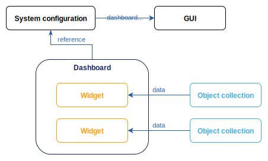
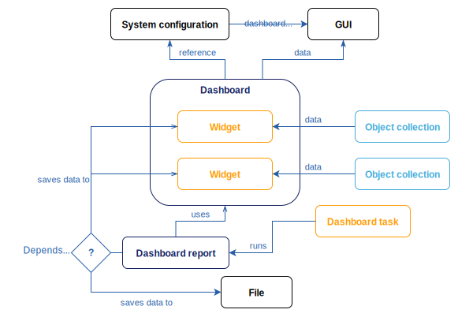

= Dashboards architecture
:page-nav-title: Architecture
:page-toc: top
:page-display-order: 10
:page-keywords: [ 'dashboard', 'dashboards', 'architecture' ]
:page-upkeep-status: green

Connect the dots before building dashboards and understand how dashboards are built from individual widgets or what are the roles of object collections and other midPoint components involved.
You will also learn about the relation between dashboards and reports and how their innate proximity can help you avoid duplicit configurations and elevate the system load when the number and complexity of your dashboards grow.

== What is the architecture behind dashboards

Dashboards consist of widgets which do the actual job of showing you the data.
One dashboard may contain multiple widgets, such as active, suspended, and archived user accounts in three separate widgets.
Widgets are connected to xref:/midpoint/reference/admin-gui/collections-views/[object collections] from which they aggregate the data to show.

.Dashboard architecture

An object collection contains a query to enumerate the objects counted in the dashboard widget.
Those are, for instance, all employees who are on a long-term leave.
An object collection may contain a domain clause defining a superset for the queried objects.
This is useful if you want your dashboard to show, for example, what percentage of all employees (superset) is on a long-term leave (queried objects).

Alternatively, dashboard widgets may load data from audit events.
Refer to the xref:/midpoint/reference/admin-gui/dashboards/configuration/#data-attribute[data attribute specification] for more details on that.

Since dashboards serve for _showing_ data, they need to be accessible in the midPoint graphical user interface (GUI).
When you create a dashboard, you need to add it to the midPoint system configuration so that GUI users can find it under the [.nowrap]#icon:tachometer-alt[] *Dashboards*# menu.

[[async-dashboards-and-report]]
== Reports and asynchronous dashboards

xref:/midpoint/reference/misc/reports/[Reports] and dashboards are separate but related features.
They both show data enumerated by object collections,
but unlike interactive dashboards, reports are static (as in printable).

However, they are used together in a xref:/midpoint/features/synergy/[synergy] for two use cases:
Asynchronously updated dashboards and static reports created from regular dashboards.

.Architecture of dashboards with asynchronous widgets

=== Asynchronous dashboards

When you define widgets in a dashboard in the simplest possible way, they reference an object collection enumerating objects according to the collection query.
Every time a user visits the dashboard in GUI, midPoint executes the query, does all the math, and shows the resulting numbers.
This is fine as long as you do not have too many users or too many complex dashboards.

The way to ease the system load caused by dashboards is to pre-compute the dashboard data once in a while instead of computing them on every load.
That's what asynchronous dashboards are about.
In addition to the dashboard and object collection, you also define a xref:/midpoint/reference/misc/reports/configuration/dashboard-report/[dashboard report] and make it "run" the dashboard in regular intervals using a scheduled xref:/midpoint/reference/misc/reports/configuration/report-task-definition/#export-report[report task].
This way, you make the dashboard calculate the data for all the widgets in the dashboard on a frequency that is manageable for your systems.
Unlike other reports, a dashboard report saves the resulting data in the widgets of the particular dashboard.

=== Static reports created from dashboards

System administrators often like to get a daily report with operational statistics.
If the object collection they are interested in is defined for a dashboard already, they do not need to duplicate all the setup for their static report.
A xref:/midpoint/reference/misc/reports/configuration/dashboard-report/[dashboard report] can use the dashboard object as a configuration and periodically generate a static report with the same data overview as the dashboard presents.
System administrators can then conveniently receive this report, for example, via e-mail in an HTML or CSV format.

