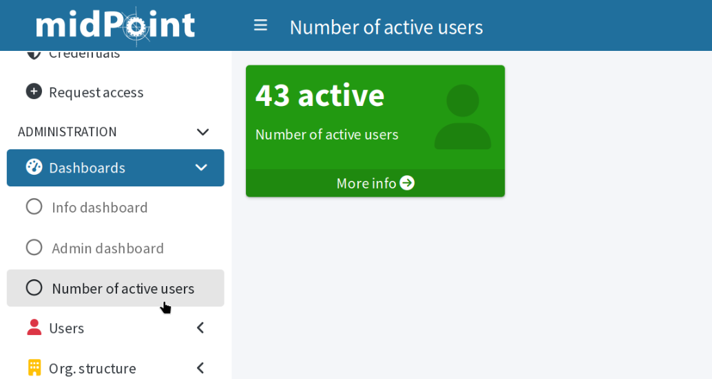

= Dashboards configuration introduction
:page-nav-title: Configuration intro
:page-toc: top
:page-display-order: 20
:page-keywords: [ 'dashboard', 'dashboards', 'configuration' ]
:search-alias: "dashboard configuration"
:page-upkeep-status: green
:page-moved-from: /midpoint/guides/dashboards-howto/

This article guides you through the steps required to configure dashboards.
Start with a simple dashboard showing one metric, such as number of active users, then continue adding more advanced pieces, such as percentage of failed resources or accounts violating segregation of duties.

From the data update perspective, dashboard widgets can be synchronous or asynchronous.
In this guide, you first create a simple synchronous widget.
After that, you will add an asynchronous widget to the dashboard.

Refer to xref:/midpoint/reference/admin-gui/dashboards/dashboard-architecture/#reports-and-async-widgets[] for more details on asynchronous dashboards architecture.

include::../use-idea-for-midpoint-engineering.adoc[]

== Quick guides to create and deploy dashboards

Before we dive into details, here is a TL;DR version of this article.
The points below summarize the steps to take when deploying dashboards.

=== How to deploy standard dashboards

. Prepare and xref:/midpoint/tools/studio/usage/index.adoc#uploading-midpoint-objects[upload] an object collection with an object filter definition.
. Prepare and upload a dashboard with a widget using the object collection.
. Add a `<configurableUserDashboard>` element to `SystemConfiguration` and upload the configuration.
. Check the configuration:
.. Refresh the GUI (you may need to log out and back in) to apply the system configuration changes.
.. Go to [.nowrap]#icon:tachometer-alt[] *Dashboards*# to see your new dashboard.

=== How to deploy dashboards with asynchronous widgets

. Prepare and xref:/midpoint/tools/studio/usage/index.adoc#uploading-midpoint-objects[upload] an object collection with an object filter definition.
. Prepare and upload a dashboard with a widget using the object collection.
. Prepare and upload a dashboard report.
. Prepare and upload a report task.
. Add a `<configurableUserDashboard>` element to `SystemConfiguration` and upload the configuration.
. Check the configuration:
.. Refresh the GUI (you may need to log out and back in) to apply the system configuration changes.
.. Go to [.nowrap]#icon:tachometer-alt[] *Dashboards*# to see your new dashboard.
    The asynchronous widget cannot show data yet.
.. Run the report task or wait until its scheduled run finishes.
.. Go to [.nowrap]#icon:tachometer-alt[] *Dashboards*# again.
    The asynchronous widget should now display correct data.

When you upload a dashboard with asynchronous widgets, it displays an _Unknown_ value until the report task runs for the first time and saves the computed data to the dashboard widgets.

[TIP]
====
You can get inspiration from link:https://github.com/Evolveum/midpoint-samples/tree/master/samples/dashboard/howto[midPoint configuration samples on GitHub]:

* `collection-enabled-users.xml`: Object collection filtering enabled users.
* `collection-disabled-users.xml`: Object collection filtering disabled users.
* `dashboard-howto-example.xml`: Dashboard definition.
* `report-dashboard-howto-example.xml`: Dashboard report used to update the asynchronous dashboard widgets.
* `task-report-dashboard-howto-example.xml`: Report task used to run the report.
====

== Create your custom dashboard

To create a dashboard, you need to create a dashboard object with an OID, name, label, and widgets.
The name and label are used for the graphical user interface (GUI).

[source,xml]
----
<dashboard oid="8f9f3d5f-a890-452b-8d2b-57b8644c1f04">
     <name>system-status-dashboard</name>
     <display>
         <label>Number of active users</label>
     </display>
     <widget>
        <!--1-->
     </widget>
     <widget>
        <!--2-->
     </widget>
</dashboard>
----
<1> The widget code from the link:#simple-widget[section on a simple widget] goes here.
<2> The widget code from the link:#async-widget[section on an asynchronous widget] goes here.

The dashboard with two widgets is ready but its widgets are not.
Now is the time to create them.

[[simple-widget]]
=== Create a simple widget for the dashboard

Widgets are not separate configuration objects, they go directly into their parent dashboard object.
The first widget we create here is a simple synchronous one;
the data it shows are calculated every time a user loads the screen with the dashboard.
You will see how to create an asynchronous widget in the example for the second widget below.

The first simple widget shows the number of users that are active; for example, active employees as opposed to those on long-term leave.
The widget itself does not query the users.
That is what the object collection is for (see the `collectionRef` element in the code below).

[source,xml]
----
<widget>
    <identifier>active-users</identifier>
    <display>
        <label>Number of active users</label>
        <color>#229911</color>
        <icon>
            <cssClass>fa fa-user</cssClass>
        </icon>
    </display>
    <data>
        <sourceType>objectCollection</sourceType>
        <collection>
            <collectionRef
                oid="0ac5f62a-1d0c-4b0c-afbf-d19bfb1f6112" <!--1-->
                type="ObjectCollectionType"
            />
        </collection>
    </data>
    <presentation>
        <dataField>
            <fieldType>value</fieldType>
            <expression>
                <proportional>
                    
                </proportional>
            </expression>
        </dataField>
        <dataField>
            <fieldType>unit</fieldType>
            <expression>
                <value>active</value>
            </expression>
        </dataField>
    </presentation>
</widget>
----
<1> The object collection OID from the link:#create-collection[section below] goes here.

The dashboard now has one widget.
However, it still has no data to show, because we do not have the object collection yet.

[[create-collection]]
=== Define object collection to count objects of interest

xref:/midpoint/reference/admin-gui/collections-views/[Object collections], as their name suggests, _collect_ or enumerate objects based on a query you define.
Object collections are standalone midPoint objects.

To go with the example of counting active users, create a collection that enumerates objects of the `UserType` type (i.e., users) for which the `activation/effectiveStatus` equals to `enabled`.

[source,xml]
----
<objectCollection oid="0ac5f62a-1d0c-4b0c-afbf-d19bfb1f6112">
    <name>All enabled users</name>
    <type>UserType</type>
    <filter>
        <q:text>activation/effectiveStatus = "enabled"</q:text>
    </filter>
</objectCollection>
----

And this is it.
You are getting closer to your goal:

* Add the OID of the collection above to the `collectionRef` in the link:#simple-widget:[widget].
* Move the widget code to the dashboard object.
* Upload both the collection and the dashboard objects to your midPoint instance.

The only step that remains is to display the dashboard in the midPoint graphical user interface.

=== Add the dashboard to the main menu

To have the new dashboard displayed in the main midPoint menu, you need to add it to the system configuration:

[source,xml]
----
<systemConfiguration>
    ...
    <adminGuiConfiguration>
        <configurableUserDashboard id="999"> <!--1-->
            <identifier>enabled-users-dashboard</identifier>
            <configurableDashboardRef
                oid="8f9f3d5f-a890-452b-8d2b-57b8644c1f04" <!--2-->
                relation="org:default"
                type="c:DashboardType"
            >
            </configurableDashboardRef>
        </configurableUserDashboard>
        <!--3-->
    </adminGuiConfiguration>
    ...
</systemConfiguration>
----
<1> Create a unique integer ID. If you leave out the ID, midPoint generates it automatically for you.
<2> The OID of your dashboard goes here.
<3> More `configurableUserDashboard` elements can follow here, one for each dashboard.

Now, you can refresh the GUI (you may need to log out and back in) and go to [.nowrap]#icon:tachometer-alt[] *Dashboards*# to see your new dashboard.

.The dashboards section featuring the custom dashboard from the configuration example provided here.

[[async-widget]]
== Create asynchronous widget to reduce system load

Simple widgets like the one above are easy to deploy,
but you may want to use xref:/midpoint/reference/admin-gui/dashboards/dashboard-architecture/#reports-and-async-widgets[asynchronous widgets] instead.

An asynchronous widget uses a report to recompute the data for the dashboard widgets.
The *report saves the resulting data to the widget object*
which then displays the data without having midPoint enumerate the objects again,
thus *saving the computational resources*.
The report can be run at an interval of your choosing.

When configuring an asynchronous widget,
you can use the same object collection as you do with the synchronous widget above.

[NOTE]
====
Report tasks for asynchronous dashboard update are not to be confused with
xref:/midpoint/reference/tasks/synchronization-tasks/asynchronous-update[asynchronous update tasks] which are used for updating data from resources.
====

[[configure-async-widgets]]
=== Configure your widget for asynchronous loading

To configure a widget as asynchronous, you need to adjust the synchronous widget data source and create two new pieces of configuration:

* A report which takes the dashboard configuration, triggers the data computation, and saves the results into the dashboard widget objects.
    ** Note that a dashboard report always computes the data for all the widgets in the linked dashboard.
* A report task which runs the report at scheduled intervals to refresh the data.

First, modify the widget configuration to include the `displaySourceType` element, allowing the widget to utilize the data that the report has stored in it.

[source,xml]
----
<widget>
    <identifier>active-users</identifier>
    <display>
        <label>Number of active users</label>
        <color>#883399</color>
        <icon>
            <cssClass>fa fa-user</cssClass>
        </icon>
    </display>
    <data>
        <sourceType>objectCollection</sourceType>
        <displaySourceType>widgetData</displaySourceType> <!--1-->
        <collection>
            <collectionRef
                oid="0ac5f62a-1d0c-4b0c-afbf-d19bfb1f6112" <!--2-->
                type="ObjectCollectionType"
            />
        </collection>
    </data>
    <presentation>
        <dataField>
            <fieldType>value</fieldType>
            <expression>
                <proportional>
                    
                </proportional>
            </expression>
        </dataField>
        <dataField>
            <fieldType>unit</fieldType>
            <expression>
                <value>active</value>
            </expression>
        </dataField>
    </presentation>
</widget>
----
<1> Enable the widget to utilize the data that the report has stored in it.
<2> The object collection OID goes here.

=== Create a report connected to your dashboard

Secondly, you need a dashboard report that "runs" the dashboard as if a user has visited it and makes midPoint compute the data in the dashboard.

[NOTE]
====
If you display the dashboard with an asynchronous widget before you create and run the report for the first time,
the widget will show _Unknown_ instead of a meaningful value because midPoint has not yet computed the data to show.
====

See xref:/midpoint/reference/misc/reports/configuration/dashboard-report/[] for instructions on creating a dashboard report.

When configuring the report, use your dashboard as the configuration basis of the report.
After you create the report, you can run it manually to compute the data and verify your configuration.

=== Create a scheduled recurring task to refresh dashboard data regularly

To have the data on the dashboard refreshed regularly, you need a recurring task.

See xref:/midpoint/reference/misc/reports/configuration/report-task-definition/#export-report[] for instructions on creating an export report task.

When configuring the task, you need to use the _report export_ activity and use the OID of the dashboard report you want the task to run.
In most cases, it makes sense to schedule this task to run at regular intervals in order to have the data in the dashboard updated automatically.

include::../dashboards-reports-and-recurring-tasks-config-limitation.adoc[]

Once you have all the pieces in place, upload them to your midPoint instance, refresh the GUI (possibly log out and back in), and see the updated dashboard under [.nowrap]#icon:tachometer-alt[] *Dashboards*#.

== See also

* xref:/midpoint/reference/misc/reports/configuration/dashboard-report/[]
* xref:/midpoint/reference/misc/reports/examples/[]
* xref:/midpoint/reference/admin-gui/collections-views/[]
* xref:/midpoint/reference/schema/archetypes/[]
* xref:/midpoint/reference/misc/notifications/[]
