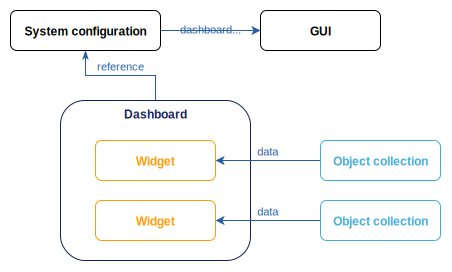
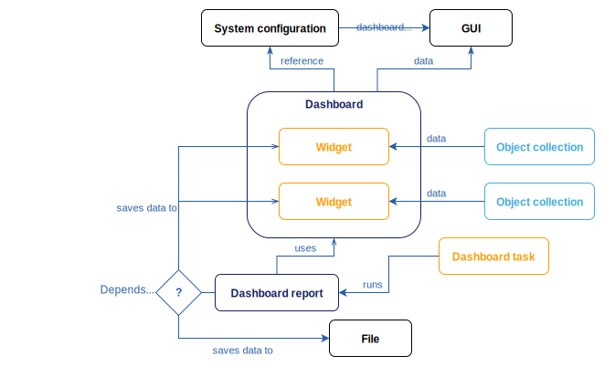

= Visualize custom IGA metrics with dashboards
:page-wiki-name: Customizable Dashboards
:page-wiki-id: 27361691
:page-wiki-metadata-create-user: semancik
:page-wiki-metadata-create-date: 2019-01-31T11:38:34.604+01:00
:page-wiki-metadata-modify-user: semancik
:page-wiki-metadata-modify-date: 2019-02-01T13:16:14.087+01:00
:page-nav-title: Dashboards
:page-keywords: [ 'dashboards', 'dashboard' ]
:search-alias: "dashboards"
:page-upkeep-status: green
:page-toc: top

Dashboards are a fundamental tool for efficient identity governance and administration (IGA) in your organization.
They provide centralized overview of critical metrics, enabling managers to monitor compliance, track operational efficiency, and respond to risks proactively.
You can configure dashboards based on the metrics that are important for you and your stakeholders.

The key motivations for using dashboards:

* Dashboards reduce operational overhead by automating data aggregation and presentation.
* They help you spot potential risks more easily because they can highlight unwanted or non-compliant situations (e.g., users with accumulated high-risk access permissions)
* You can configure as many different dashboards as you need for various roles who are interested in different metrics. For example, a security officer needs different data than the HR personnel.
* You can customize the look and behavior of each dashboard: They can display custom data differently, use distinct color coding to show warnings, and so on.

Dashboards can show the number of active employees, failed resources, suspended tasks, and so on.
You can make dashboards much more powerful than that, though.
When you set them up to use collection domains{empty}footnote:[
A collection domain defines the context or parent set from which a collection is derived.
For example, a collection of _non-compliant roles_ might have a domain of _all roles_.
Using collection domains enables collections to compute percentages (e.g., _2% of all users are inactive_) and relative metrics (e.g., _10% of roles violate segregation-of-duties policies_).
These metrics are critical for compliance reporting, as they quantify risks or deviations from policy.
Based on the calculated ratios, policy rules can also trigger further actions, such as notifying managers about the need for remediation.
]
and connect them with xref:/midpoint/reference/roles-policies/policies/policy-rules/[policy rules] through xref:/midpoint/reference/roles-policies/policies/policy-rules/#object_marks[object marks], you gain the ability to monitor xref:/midpoint/reference/admin-gui/dashboards/compliance-dashboard/[compliance] of your organization and xref:/midpoint/reference/misc/notifications/[receive warnings] that an action is needed to put the situation back in line with requirements.

== How dashboards help you stay compliant

Here is a simplified architectural outline showing how dashboards can help you with compliance through policy rules and notifications:

* Policy Rules  → Object marks → Object collections → Dashboards:
    ** Policy rules define compliance criteria (e.g., _users must not have both finance and HR roles_).
    ** Marks are added to objects that trigger (i.e., usually violate) the policy rule.
    ** Collections aggregate objects marked by the policy rule.
    ** Dashboards display the results, often with thresholds for visual alerts (e.g., _red for critical violations_).
* Notifications:
    ** Thresholds in collections can trigger notifications (e.g., email alerts) when compliance metrics exceed acceptable limits.

This architecture ensures compliance is a dynamic, actionable process integrated into your daily operations.

== What is the architecture behind dashboards

Dashboards consist of widgets which do the actual job of showing you the data.
One dashboard may contain multiple widgets, such as active, suspended, and archived user accounts in three separate widgets.
Widgets are connected to xref:/midpoint/reference/admin-gui/collections-views/[object collections] from which they aggregate the data to show.

An object collection contains a query to enumerate the objects counted in the dashboard widget.
Those are, for instance, all employees who are on a long-term leave.
An object collection may contain a domain clause defining a superset for the queried objects.
This is useful if you want your dashboard to show, for example, what percentage of all employees (superset) is on a long-term leave (queried objects).

Alternatively, dashboard widgets may load data from audit events.

Since dashboards serve for _showing_ data, they need to be accessible in the midPoint graphical user interface (GUI).
When you create a dashboard, you need to add it to the midPoint system configuration so that GUI users can find it under the [.nowrap]#icon:tachometer-alt[] *Dashboards*# menu.

[[async-dashboards-and-report]]
== Asynchronous dashboards and reports

xref:/midpoint/reference/misc/reports/[Reports] and dashboards are separate but related features.
They both show data enumerated by object collections,
but unlike interactive dashboards, reports are static (as in printable).

However, they are used together in a xref:/midpoint/features/synergy/[synergy] for two use cases:
Asynchronously updated dashboards and static reports created from regular dashboards.

=== Asynchronous dashboards

When you define widgets in a dashboard in the simplest possible way, they reference an object collection enumerating objects according to the collection query.
Every time a user visits the dashboard in GUI, midPoint executes the query, does all the math, and shows the resulting numbers.
This is fine as long as you do not have too many users or too many complex dashboards.

The way to ease the system load caused by dashboards is to pre-compute the dashboard data once in a while instead of computing them on every load.
That's what asynchronous dashboards are about.
In addition to the dashboard and object collection, you also define a xref:/midpoint/reference/misc/reports/configuration/dashboard-report/[dashboard report] and make it "run" the dashboard in regular intervals using a scheduled xref:/midpoint/reference/misc/reports/configuration/report-task-definition/#export-report[report task].
This way, you make the dashboard calculate the data for all the widgets in the dashboard on a frequency that is manageable for your systems.
Unlike other reports, a dashboard report saves the resulting data in the widgets of the particular dashboard.

=== Static reports created from dashboards

System administrators often like to get a daily report with operational statistics.
If the object collection they are interested in is defined for a dashboard already, they do not need to duplicate all the setup for their static report.
A xref:/midpoint/reference/misc/reports/configuration/dashboard-report/[dashboard report] can use the dashboard object as a configuration and periodically generate a static report with the same data overview as the dashboard presents.
System administrators can then conveniently receive this report, for example, via e-mail in an HTML or CSV format.

== See Also

* xref:configuration/[]
* xref:/midpoint/guides/dashboards-howto/[]
* xref:/midpoint/reference/admin-gui/collections-views/[]
* xref:/midpoint/features/planned/compliance/[]
* xref:/midpoint/reference/schema/archetypes/[]
* xref:/midpoint/reference/misc/notifications/[]
