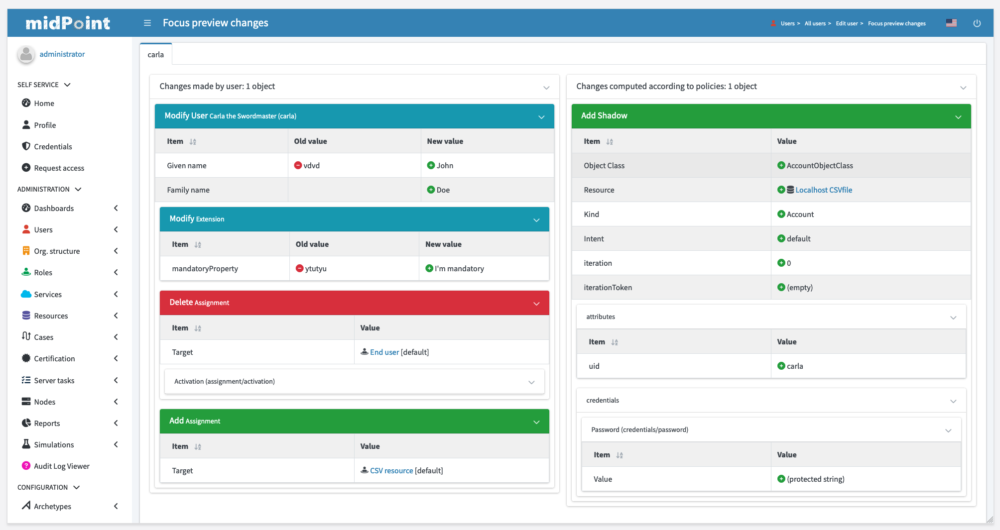
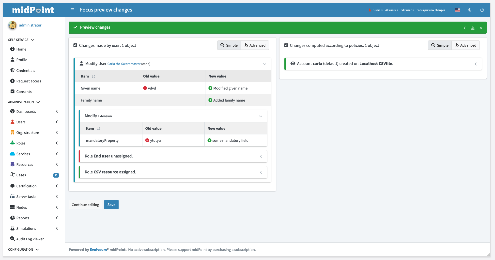
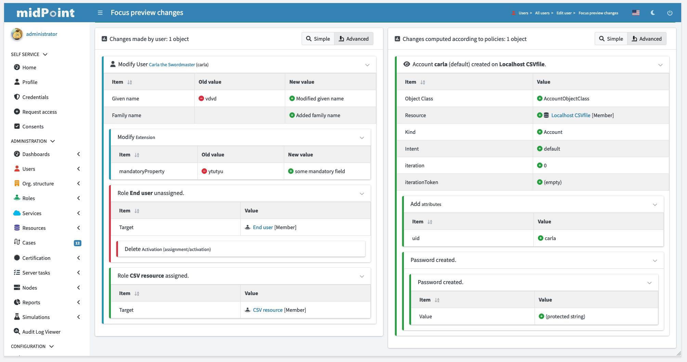

= Delta visualization
:page-toc: top
:page-since: "4.7"
:page-midpoint-feature: true
:page-upkeep-status: green

== Introduction

Object delta objects are being shown on multiple pages (focus preview save, approvals, audit event details, etc.).
Until this release it always displayed whole set of changes with all technical details.

Changes with all details made it harder to read, mainly for less technical users like managers or helpdesk operators.

.Old view

Starting with midPoint 4.7 there will be two options to show object deltas - simple and advanced.

Simple view will hide unnecessary information.
For example when assignment is being added to user, non-technical user reviewing changes doesn't have to see all assignment attributes like subtype, extension, etc.
In case of adding account - user doesn't need to know that it's `InetOrgPerson` with `kind=account` and `intent=default`.
Label "Account *carla* (default) created on *Company OpenLDAP*" should be enough.

Currently, this simplification happens for changes related to:

* Assignments
* Credentials
* Activation
* Shadows

.New simple view

Advanced view will still show all information related to object delta as it used to.

.New advanced view
