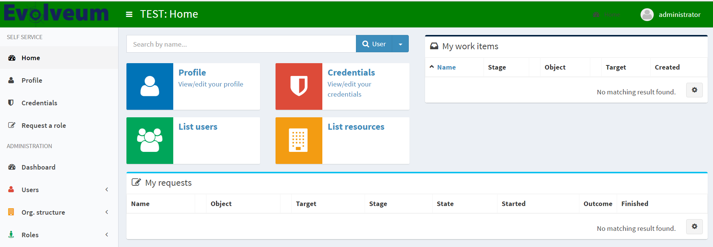

= Deployment Information
:page-wiki-name: Deployment Information Type
:page-wiki-id: 24085176
:page-wiki-metadata-create-user: honchar
:page-wiki-metadata-create-date: 2017-01-30T13:51:10.040+01:00
:page-wiki-metadata-modify-user: vix
:page-wiki-metadata-modify-date: 2019-10-24T13:16:53.820+02:00
:page-upkeep-status: yellow

Intended to store the  information about midPoint deployment: subscription information, deployment name, description, color and so on.
This data may influence the look and feel of the current midPoint instance.

[%autowidth]
|===
| Attribute name | Description

| name
| Short name of this midPoint deployment.
The name will be displayed on a prominent place in the user interface, most likely displayed  as a part of the header (on every page).
The name is usually used to distinguish  between midPoint deployments in the same organization.
Strings such as `DEVEL`, `TEST`, `UAT` are often used.

| description
| Free form description that specifies the details of this deployment.
It may be significantly long (few paragraps).
It has no special purpose other than a form of "on-line" documentation for the deployment.
It will NOT be displayed on every page.
It will most likely be displayed on a system configuration pages or in configuration summaries.

| headerColor
| Specification of a color that will be used as a background for a page header.
The color can be used as a form of easy look and feel customization to match the customer corporate identity.
But perhaps more often the color will be used to distinguish different midPoint environments in the same organization, e.g. green color for devel environment, blue color for testing, etc.

| skin
| Specification of the adminLTE skin that will be applied to the base template.
The base template contains 12 predefined skins including: skin-blue, skin-blue-light skin-yellow, skin-yellow-light, skin-green, skin-green-light, skin-purple, skin-purple-light, skin-red, skin-red-light, skin-black and skin-black-light.

| logo
| Specification of a logo that will be used in the title bar on every screen.
This can be used as an easy customization and point to a customer logo.
Or it may be used as an icon to indicate the environment.
Can be configured with imageUrl attribute or cssClass attribute.
Please, be carefull with the width/height of the logo image, the preferable size is: width up to 300px, height up to 60px.You can either use URL or a relative path.
For custom logos it's best to create a new directory `static-web` under you
xref:/midpoint/reference/deployment/midpoint-home-directory/[`midpoint.home`] directory and use a relative link.

| customerName
| Short name of the organization that is end user of the midPoint deployment.
It is supposed to be a company name, such as "ExAmPLE, Inc." It will be displayed together with subscription information.

| customerUrl
| URL of the customer website.
It will be used as a link target in case that the customer name is displayed as hyperlink.

| partnerName
| Short name of the organization that deployed this midPoint instance.
It is usually the name of Evolveum partner.
It is supposed to be a company name, such as "ExAmPLE, Inc." It will be displayed together with subscription information.

| partnerUrl
| URL of the partner website.
It will be used as a link target in case that the partner name is displayed as hyperlink.

| subscriptionIdentifier
| Identifier of Evolveum subscription contract that applies to this deployment.

|===

Here is a little example how midPoint look can be configured with deployment information type:

[source,xml]
----
<systemConfiguration>
...
<deploymentInformation>
   <headerColor>green</headerColor>
   <name>TEST</name>
   <logo>
      <imageUrl>https://evolveum.com/wp-content/uploads/2015/07/evolveum.png</imageUrl>
<!--  <imageUrl>static-web/evolveum.png</imageUrl> -->
   </logo>
</deploymentInformation>
</systemConfiguration>
----

== See also

* xref:/midpoint/reference/admin-gui/admin-gui-config/[Admin GUI Configuration]
* xref:/midpoint/reference/concepts/system-configuration-object/[System Configuration object]
