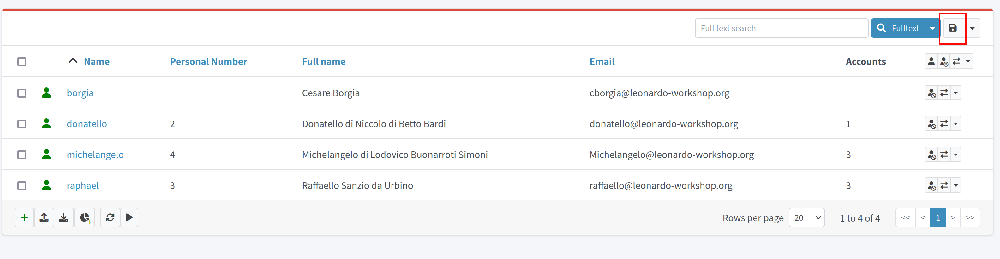
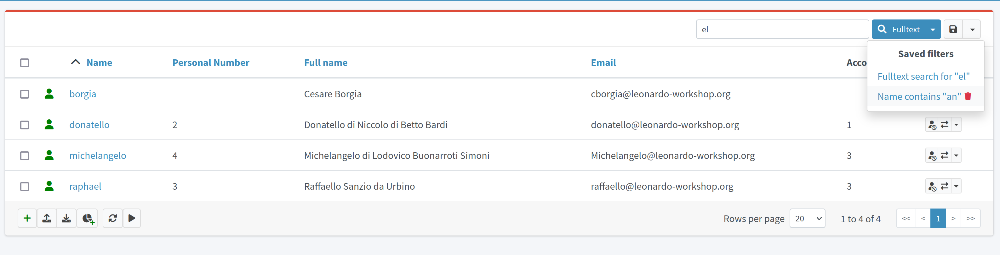

= GUI User Profile
:page-upkeep-status: orange
:page-toc: top

This page describes the possibilities of user profile configuration. For now, it contains only the documentation about saved filters and its usage.

== Saved filters

Saved filters feature is implemented on the pages throughout midPoint where the list of objects of some collection view is displayed (for more information about object collection views, please see xref:/midpoint/reference/admin-gui/collections-views/[Object Collections and Views]).
This can be default object collection view list page (such All users page) or the configured one (e.g. Employees collection view configured for User type).

This feature improves the search of objects in midPoint giving the possibility to save the most often used or the most complicated filters.
Saved once the filter can be reused within multiple user sessions and can be spread among a group of users with the help of admin gui configuration merging mechanism.

To save the filter the user can use the Save filter button on the Search panel (which is situated on the right side of the search panel, next to Search button).

.Save filter button

After the user clicks Save filter button, Save filter popup is displayed where the user should specify the name of the filter and confirm the saving.
The saved filter appears in the drop-down list.
To apply the filter, just select it from the list.
To delete the filter, click the delete icon next to the filter name in dropdown filter list.

.Saved filters list

*_Limitations_*

Save filter functionality is supported on the object list pages which can be reached from the left-side menu (e.g. All users, All roles, etc. and other configured collection views for objects in midPoint).
It is not available if the list of objects is a part of non-list page (e.g. list within user details page).
It is also not supported for some special object types (e.g. certification campaigns, work items).

