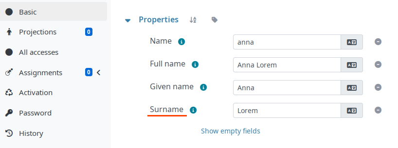

= Custom translations
:page-description: Reference to custom localization of properties in midPoint
:page-keywords: localization, translation, property localization, custom translation, property file, gui, gui translation
:page-toc: top

MidPoint supports custom UI translations without requiring a custom build.

Custom translations can be used to adjust localization of certain properties in a given language.
The property translations are placed in `.properties` files in the `xref:/midpoint/reference/deployment/midpoint-home-directory/[${midpoint.home}]/localization/` directory.
MidPoint loads these files at startup and merges them with the built-in translations.

== Localization property file naming conventions

MidPoint uses two localization resource bundles, each with locale-specific variants:

`schema_<LOCALE>.properties`::
Contains keys for data-model elements: object types, property names, container types, enumeration values, and similar schema-level terms.
Keys follow the pattern `<TypeName>.<propertyName>`, where `<TypeName>` is the XSD type name and `<propertyName>` is the item name.

``Midpoint_<LOCALE>.properties`::
Contains keys for GUI labels, messages, button captions, page titles, operation names, and other UI-level strings.

The filename locale suffix follows the ISO 639 and ISO 3166 conventions;
the suffix must correspond to the locale for which the property file is intended: e.g., `Midpoint_de.properties` for German or `schema_fr_CH.properties` for Swiss French.

A file without a locale suffix (for example, `Midpoint.properties`) serves as the fallback default, affecting all locales that do not provide their own translation for a given key.

== Structure of localization property files

The property localization files are standard Java `.properties` files.
Each line contains one key-value pair, separated by an equals sign (`=`).
Lines beginning with hash (`#`) are comments.
Non-ASCII characters may be escaped as Unicode sequences (for example, `\u010d` for `č`).

.Example `schema_en.properties` localization file
[source,properties]
----
# Use "Surname" instead of "Family name" in all English locales (en_US, en_GB, en_IE, etc.).
UserType.fullName=Surname
----

The above localization override can be seen in the GUI as follows:

.Custom translation for the _Family name_ attribute in English

== Where to find available localization keys

The authoritative source for all built-in keys is the
https://github.com/Evolveum/midpoint-localization[midpoint-localization repository] on GitHub.
It contains the following files relevant to custom translations:

* `localization/schema.properties` — schema keys
* `localization/Midpoint.properties` — GUI keys
* Locale-specific variants of the files, such as `Midpoint_en.properties`, `Midpoint_fr.properties`, etc.
