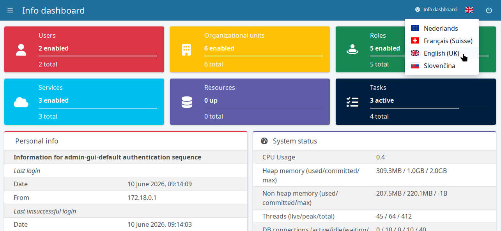

= Language selector configuration
:page-moved-from: /midpoint/reference/admin-gui/localization-configuration/
:page-toc: top
:page-description: Reference to midPoint GUI language selector customization
:page-keywords: localization, translation, language list, locale list, language selector, locale selector

This article explains how to customize the midPoint GUI language and locale selector.

The default list of national flags and languages in the GUI locale selector can be overridden by a custom list.
The custom list of locales can be defined in the `xref:/midpoint/reference/deployment/midpoint-home-directory/[${midpoint.home}]/localization/locale.properties` file.
This file does not exist by default.

[NOTE]
====
Locale is a combination of language and regional formats, such as date and time formats.
For instance, British and US locales use the same language but different date and time formats.
====

The custom language list is used for the locale selectors on the login page and at the top right in the GUI.

There are couple of uses for the custom locale list:

* Display only manually selected localizations in the language menu
* Redefine which national flag shows for which language
* Force a different date & time format for a particular language

Each locale definition must have the following properties:

* `<locale>.name`: Display name of the locale.
* `<locale>.flag`: Country code for the flag icon (based on https://en.wikipedia.org/wiki/ISO_3166-1_alpha-2[ISO 3166-1 alpha-2]).
* `<locale>.default` (optional, `default=false`): If set to `true`, this locale is selected by default on the login page.

The `<locale>` must be an `ll` code or `ll_CC` pair where `ll` is a two-letter ISO 639 language code and `CC` is a two-letter ISO 3166 country code.
See link:https://github.com/unicode-org/cldr[Unicode Common Locale Data Repository (CLDR)].
The available options are limited to languages for which midPoint translation exists.

When only language code is used, the country (region) is inferred (e.g., `US` for `en`)
The country code can be used to force specific regional formats (e.g., `GB` to force European formats in English).

.Example of locale.properties file
[source,properties]
----
en_GB.name=English (UK)
en_GB.flag=gb
en_GB.default=true

fr_FR.name=Français (Suisse)
fr_FR.flag=ch

fr.name=Fran\u00E7ais <1>
fr.flag=fr

nl_BE.name=Nederlands
nl_BE.flag=eu

sk_SK.name=Slovenčina
sk_SK.flag=sk
----
<1> National characters can be written as Unicode strings as well

The configuration above displays as following in the GUI.
Note the European date and time format in the Personal info widget.

.Customized locale list and localized date and time format in GUI

[NOTE]
====
The list in `locale.properties` _overrides_ the default list.
If you define the custom list, you will see _only_ the languages defined in the custom list.
====

