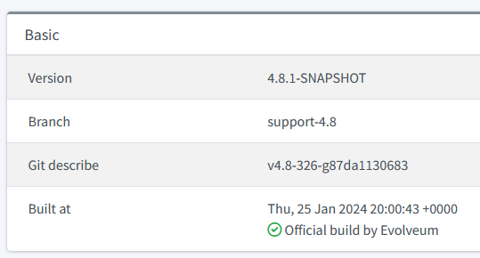
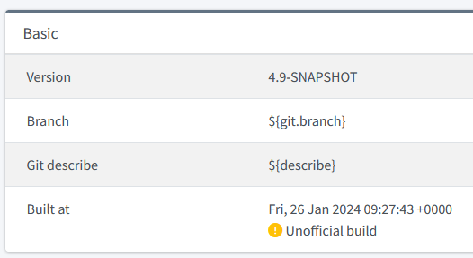
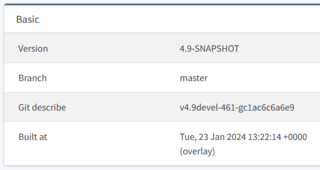

= MidPoint JAR Signature Status

In order to provide an indication of midPoint build origin, the JAR file is signed by us during the build process.
This signature is then checked during the startup of midPoint, and the result is displayed on the About page.
There are currently three options there:

== Official Build

Here `midpoint.jar` has a signature that was made by us, and is valid.

The "Official build by Evolveum" message is displayed, along with the green "tick" icon.

.An example of the official build

== Unofficial Build

Here `midpoint.jar` has either no signature, or an invalid one, or a valid one but not done by us.
It is also possible that there is no `midpoint.jar` here, e.g. if midPoint is run from IDE.

The "Unofficial build" message is displayed, along with the yellow "exclamation mark" icon.

.An example of an unofficial build

== Overlay

As a special case, overlay build cannot be signed by us, as `midpoint.jar` is re-packaged by the overlay build.
To avoid the "Unofficial build" message, the overlay should be marked by the presence of `overlay-info.txt` file.
In such cases, midPoint recognizes it, and displays a special "overlay" message.

.An example of an overlay build

