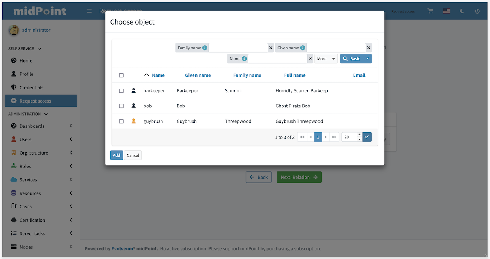

= Request access
:page-toc: top
:page-since: "4.6"
:page-visibility: draft

Request access functionality is a complete rewrite and redesign of midPoint xref:../role-request/index.adoc[role requesting UI].

New UI takes form of proper wizard with up to four steps:

* Person of interest
* Relation
* Role catalog
* Shopping cart (checkout)

First two steps may be hidden, or skipped based on configuration or authorizations of user that is currently logged in.

== Person of interest

.Picture 1: Person of interest
image:step-1-poi.png[Person of interest]

.Picture 2: Selection from group of users

.Picture 3: Manual selection from group of users

.Picture 4: User selected
image:step-1-group-user-selected.png[User selected]

== Relation

.Picture 5: Person of interest
image:step-2-relation.png[Relation]

== Role catalog

.Picture 6: Role catalog
image:step-3-catalog-tiles.png[Role catalog]

.Picture 7: Role catalog in table

.Picture 8: Roles of teammate
image:step-3-roles-of-teammate.png[Roles of teammate]

== Shopping cart (checkout)

.Picture 9: Shopping cart (checkout)

=== Conflict solver

.Picture 10: List of conflicts
image:step-4-conflict-list.png[List of conflicts]

.Picture 11: Solved conflicts

.Picture 12: Edit shopping cart item
image:step-4-checkout-item-edit.png[Edit shopping cart item]