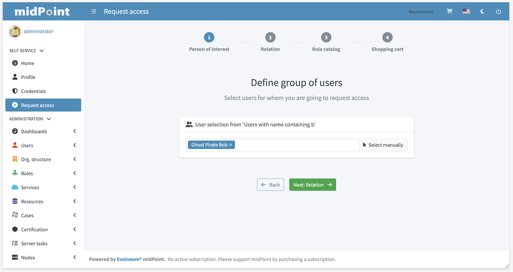

= Request access
:page-toc: top

Many traditional Role-Based Access Control (RBAC) theories seem to be based on assumption that there is some kind of all-knowing authority that knows which user should have which role.
This approach works in some kind of organizations, but in reality such organizations are very rare.
In practice the knowledge about roles and role policies is not centralized.
It is rather distributed among many people in the organization: application owners have part of the knowledge, line managers have more bits of knowledge, other parts are maintained by security officers and other specialists.
It is almost impossible to analyze this knowledge and specify it in a form of an algorithm that a machine can execute.
In addition to that, such policy is constantly changing.
Implementing this a fully-automated system is almost always infeasible.

Therefore, most identity management and governance systems come with an alternative approach: user are requesting role assignment.
The request is then routed through an xref:/midpoint/reference/cases/approval/[approval process]. If the request is approved, then the requested roles are assigned.

However, this approach requires _end users_ to take part in the interaction.
End users are usually not experts on RBAC and they do not have comprehensive knowledge about role design and structures used in the organization.
Therefore, midPoint has a simplified view of <<Role catalog>> that is suitable for end users.
The role catalog is used to present the roles in a similar way as an e-shop presents the products.
The roles are sorted into categories and sub-categories.
The user may browse the role catalog and select the roles.

User interface takes form of proper wizard with up to four steps:

* Person of interest
* Relation
* Role catalog
* Shopping cart (checkout)

First two steps may be hidden, or skipped based on configuration or authorizations of user that is currently logged in.

Configuration and some examples can be found xref:configuration.adoc[here].

== Person of interest

.Person of interest

First step of request access wizard allows user to choose one or more users for whom new roles will be requested.
There are two type of tiles:

* Myself - to select user currently logged in
* Group - defined by collection or query filter. Group allow to select one or more users via autocomplete text field or by clicking *Select manually* button.

Autocomplete search withing group is done using `user/name` property with `norm` poly-string matcher by default.
Autocomplete configuration can be customized using `group/autocompleteConfiguration` configuration option.

Concrete search behaviour can be customized using `autocompleteConfiguration/searchFilterTemplate` where filter with expression can be used.
Filter expression should contain `input` variable which will be replaced by user input.
Such filter will be joined with group defined filter/collection using `and` operator.

Search result items can be also modified using expression defined in `autocompleteConfiguration/displayExpression`.

Minimum number of characters needed to start autocomplete can be configured using `group/autocompleteMinChars`.
Default value is 2.

In following example filter template will create substring search `givenName like '%King *<VALUE_FROM_AUTOCOMPLETE_TEXT>*%'`.
Results will be displayed in format `<USER_NAME> (<USER_OID>)`

[source, xml]
----
<group>
    <searchFilterTemplate>
        <q:substring>
            <q:path>givenName</q:path>
            <expression>
                
            </expression>
        </q:substring>
    </searchFilterTemplate>
    <userDisplayName>
        
    </userDisplayName>
    <autocompleteMinChars>2</autocompleteMinChars>
</group>
----

.Selection from group of users
image::step-1-poi-group.png[Selection from group of users,100%]

.Manual selection from group of users
image::step-1-group-manual-selection.png[Manual selection from group of users,100%]

.User selected

If user can request only for himself then this step is not visible (and skipped).
Restarting _Request access_ wizard and going through _Person of interest_ step again will overwrite previously selected users.

There also can be scenarios when the shopping cart already contains some items and the user wants to add new person of interest.
In this case, when the user selects new person of interest, midPoint will analyze if all items from the shopping cart are allowed to be requested for the newly selected person of interest.
If so, the new person of interest will be added to the shopping cart and the user will be able to proceed the flow.
If some items from the shopping cart are not allowed to be requested for the newly selected person of interest, the wizard will ask if the user wants to clear the shopping cart or to revert the selection of the new person of interest.
The flow will continue based on the selected by the user option.
In case the user selects to clear the shopping cart, all items will be removed and the new person of interest will be added.
In case the user chooses to revert the selection of the new person of interest, the new person of interest will be removed and the user will be able to proceed the flow with the previous person(s) of interest and shopping cart items.

== Relation

.Person of interest

Second step of wizard requires user to choose relation which will be used for new roles.
List of relations is based on static relations and relations defined in system configuration.
Default set of relations is:

* Default
* Manager
* Approver
* Owner

Set of relations, their label and icon can be configured, see xref:../../concepts/relation/index.adoc[Relations] and xref:./configuration.adoc[Configuration].

If there's only one relation to be selected, then this step is not visible (and skipped).

[NOTE]
====
If relations are handled only implicitly via authorizations, then relation step will be visible at least when wizard is initialized.
Reason for this is that until user selects at least one user (person of interest), midpoint is not able to compute available relation list and therefore can't decide whether relation step can be hidden.

In case relation step should be hidden at all times, please configure `defaultRelation` and `allowOtherRelations=false` in request access configuration.
====

== Role catalog

.Role catalog
image::step-3-catalog-tiles.png[Role catalog,100%]

Role catalog displays roles (also organizations and services) that can be assigned to list of users defined earlier.
Catalog can be currently displayed in two ways:

* Tiles (picture above)
* Table (see picture below)

.Role catalog in table
image::step-3-catalog-table.png[Role catalog in table,100%]

NOTE: Green check icon (situated near a role catalog item icon on the tiles view or next to the role catalog item name on the table view) can be in 2 states: either filled in with the green color (meaning that all selected persons of interest have already this item assigned) or just outlined with the green color (meaning that some of the selected persons of interest has this item assigned).
Please, note, that the assignment relations aren't considered when determining the icon state.
This icon gives the general information if the role catalog item is already assigned not depending on the relation.

Both types of view can be enabled or disabled via configuration.
Menu in role catalog consists of 3 types of items also defined in configuration:

* Role catalog defined via org. structure
* Collections of objects
* Roles of teammate

=== Role catalog

Role catalog is defined via reference to organization tree.
Org. tree is then used to load hierarchical menu.
By default, up to 3 levels, all roles on deeper levels are shown in that 3rd level menu.
Assignable roles have to be part of this org. tree.

NOTE: In 4.8 or later number of levels can be configured using `roleCatalogDepth` configuration option.

=== Collection of objects

Collection of objects can be used to create custom menu item representing specific set of object via reference to object collection or using query filter.

=== Roles of teammate

This is custom menu item that uses search for another user and list his assignments.
Roles of teammate option can be disabled via configuration.

Search for teammate will by default create filter using `user/name` property with `norm` poly-string matcher by default.

NOTE: Since 4.8 search behaviour can be customized using `autoCompleteConfiguration` configuration option.

.Roles of teammate

== Shopping cart (checkout)

[NOTE]
.Submitting request
====
If the shopping cart request contains only one person of interest (user), then the request is processed synchronously.
If there are more persons (users) in the shopping cart, then the request is processed asynchronously by creating a task.

The reasoning behind is that in the first case, the request for one user should be processed fast enough, and we're able to display results immediately.
In the second case, the request may take a longer time to process.
We don't want to block the user interface for too long or loose result of the request if the page request times out.
====

.Shopping cart (checkout)
image::step-4-checkout.png[Shopping cart (checkout),100%]

Last step in request access wizard is checkout.
In this step user can finalize whole request, review and solve conflicts if necessary.
If configuration allows comment for this request can be added also with custom validity period for requested items.
This can be done either globally for whole cart or for each item separately.

=== Conflict solver

.List of conflicts
image::step-4-conflict-list.png[List of conflicts,100%]

.Solved conflicts
image::step-4-conflicts-solved.png[Solved conflicts,100%]

.Edit shopping cart item

== Limitations

* Role catalog panel should display only the assignable roles (items) for the selected user(s) on the Persons of interest step.
The current implementation displays the roles (items) which are allowed to be requested only for the first person in the list.
This implementation suppose that sometimes even the items that are not allowed to be requested for some person of interest can get to the shopping cart.
Anyhow, the submitting of the request in this case will fail with the authorization error.
Therefore, the current implementation doesn't have any security impact.
* Role catalog table and search panel is currently not customizable via configuration.

