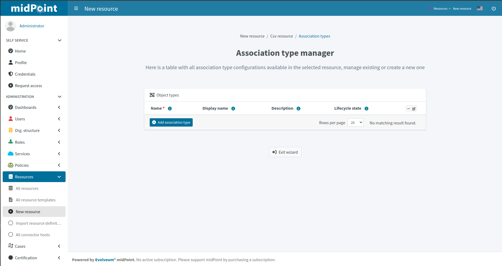
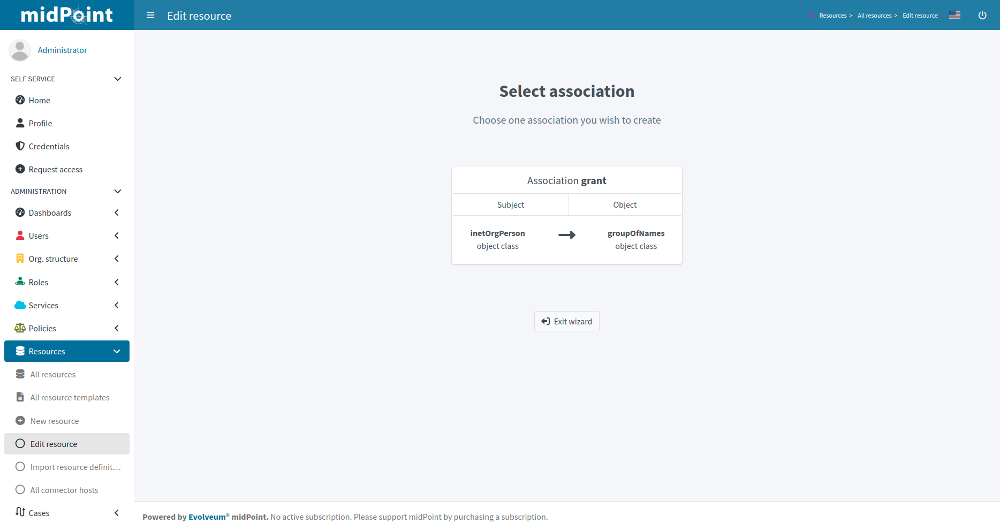
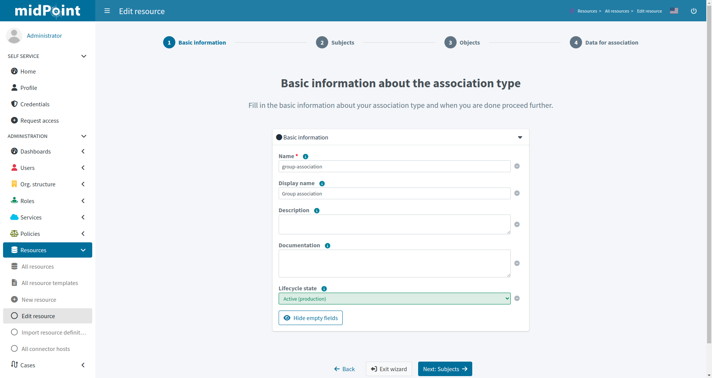
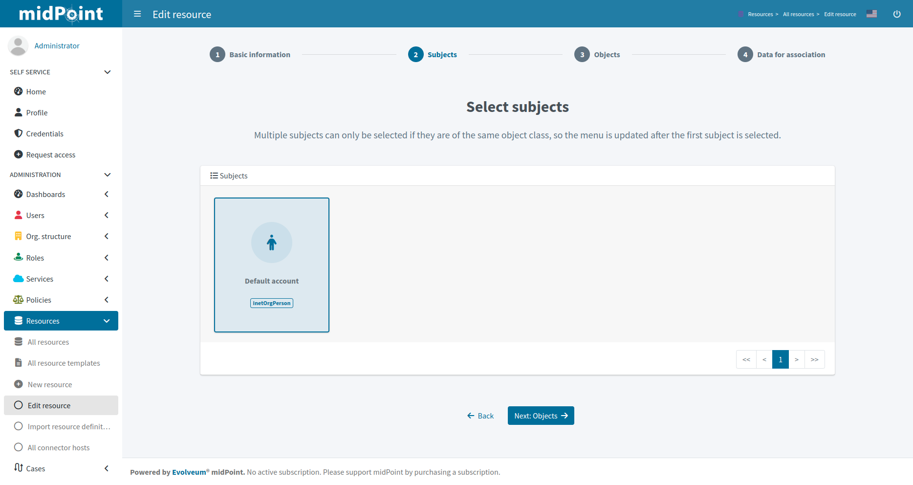
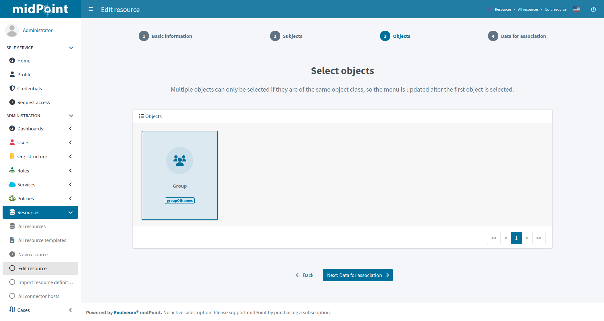
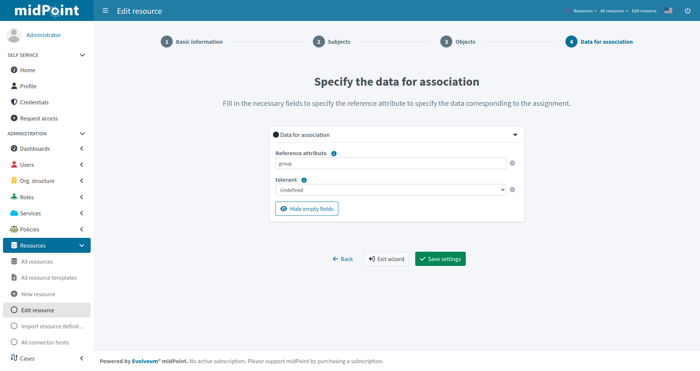
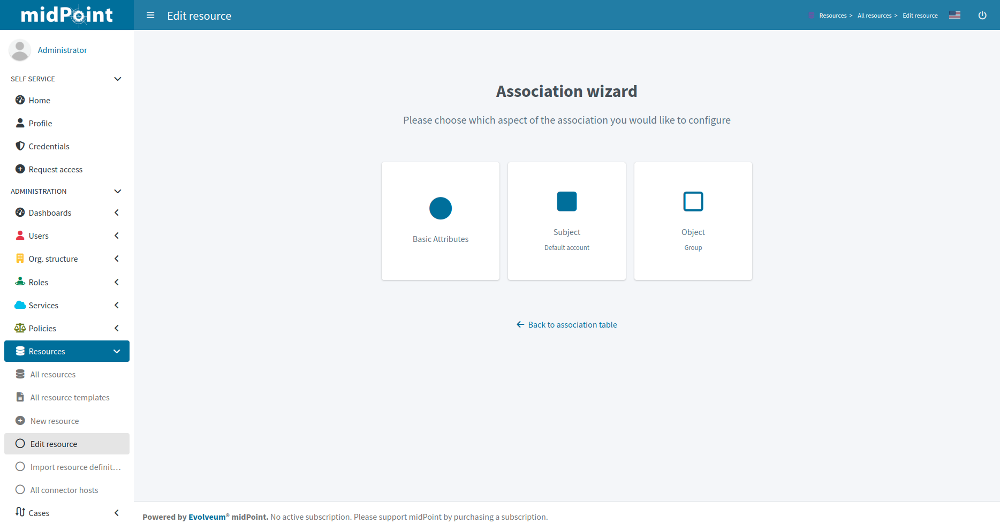

= Resource wizard: Association type configuration
:page-nav-title: Association type configuration
:page-toc: top
:page-since: "4.9"

Associations allow you to configure resource for object type relations.
Typically, this is used to configure how account/group membership is defined and processed.

.See also the following pages for more information:
* xref:/midpoint/reference/resources/entitlements/#association-definition[Association definition]
* xref:/midpoint/reference/resources/entitlements/[Entitlements]

After clicking on btn:[Configure association type], you will see a table of association types.

Click btn:[Add association type] to start configuring new association type.

The first step in creating a new association is to select the type of association (by clicking on it), which is predefined by capabilities or connector.

After selecting the association, you will see a four-step wizard. The first step allows you to configure the basic settings:

* *Name* and *Display name* are used for naming purposes
* *Description* allows a short description to be entered
* *Lifecycle state* allows defining the lifecycle state, e.g. `Proposed` for xref:/midpoint/reference/admin-gui/simulations/[simulation] of the association configuration

Click btn:[Next: Subjects] to continue in the association type definition wizard.

In the second step you have to select the subject (as the object type of the resource) of the association.
If there is only one option, it will be selected and you can proceed to the next step.

Click btn:[Next: Objects] to continue in the association type definition wizard.

The next step is very similar to the previous one, but you select the object (as the object type of the resource) of association.

Click btn:[Next: Data for association] to continue in the association type definition wizard.

Fill in the necessary fields to specify the reference attribute to specify the data corresponding to the association and association tolerance:

* *Reference attribute* name will be predefined by default (but can be changed to a custom name, e.g. instead of `group`, `ldapGroup` can be used).
MidPoint automatically resolves duplicate reference attribute name: if you would define multiple association types, the reference attributes would be `group`, `group1` etc. by default.
* *tolerant* allows specifying how midPoint tolerates associations (membership) with objects other than associated via midPoint.
The default value `Undefined` is the same as `True` and makes midPoint keep the membership even if not defined via midPoint.
`False` would remove such associations when the resource object is reprocessed, e.g. during reconciliation.

TIP: If in doubt, use `Undefined` or `True`.

NOTE: /midpoint/reference/concepts/mark/[] can redefine association (membership) tolerance.

Click btn:[Save settings] to save the association type configuration.

Further configuration is required.

After creating a new association type, you will see a page with three options.
*Basic Attributes* tile represents the two-step wizard that you already see during the creation of the association type,
allowing to access the first and last steps without parts for selecting subjects and objects.

*Subject* tile allows entering xref:./subject/[Subject wizard].

*Object* tile allows to return back to object selection.

include::../configuration-resource-panels.adoc[]

include::../how-to-use-lifecycle-state.adoc[]

include::../limitation-all.adoc[]
