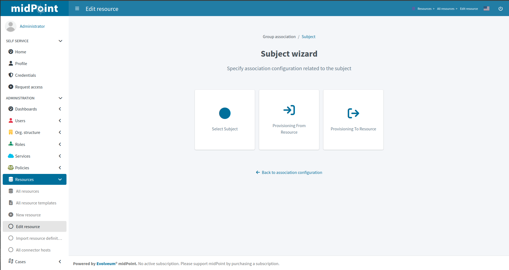

= Resource wizard: Association type subject
:page-nav-title: Subject
:page-toc: top
:page-since: "4.9"

Configuration for a subject starts with a screen with three options.

*Select Subject* tile allows selecting the subject.

xref:./provisioning-from-resource/[Provisioning from resource] and xref:./provisioning-to-resource/[Provisioning to resource] allow accessing configuration parts for provisioning from/to resource.

include::../../configuration-resource-panels.adoc[]

include::../../how-to-use-lifecycle-state.adoc[]

include::../../limitation-all.adoc[]
