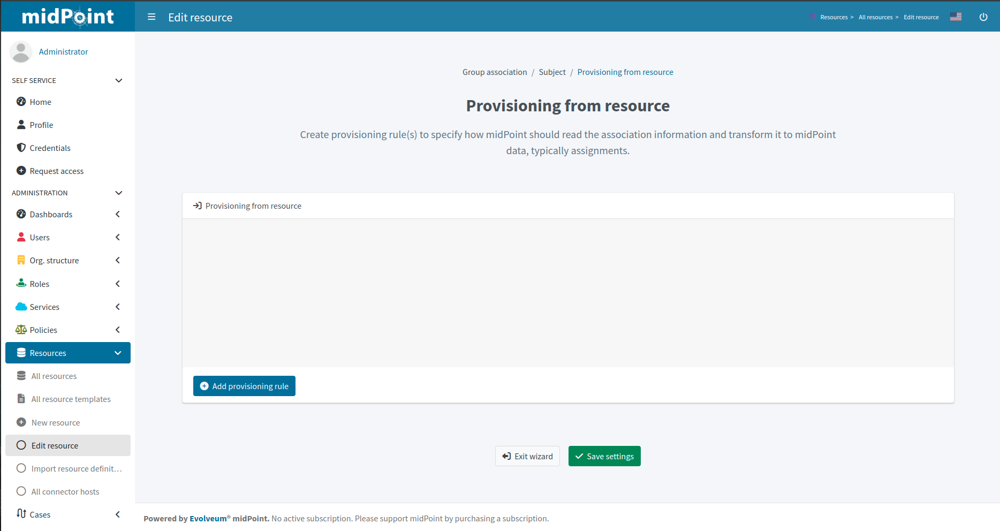
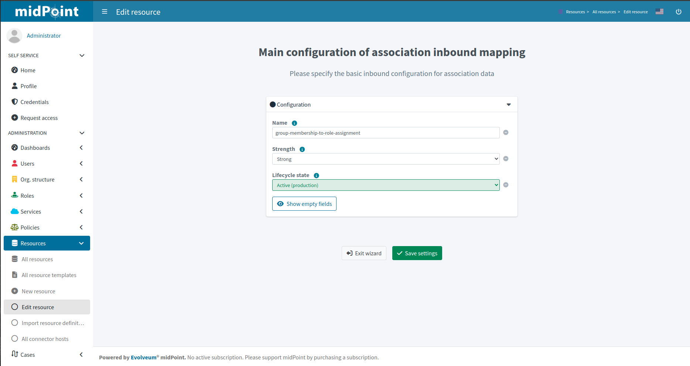
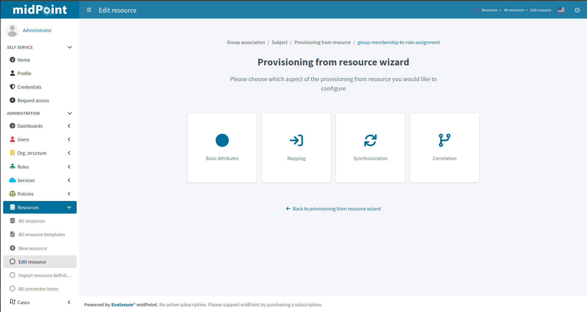
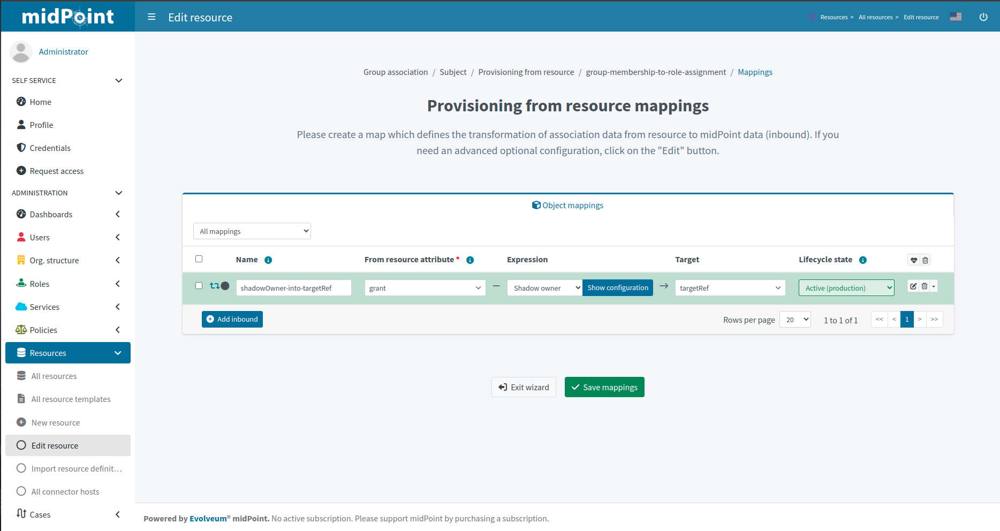
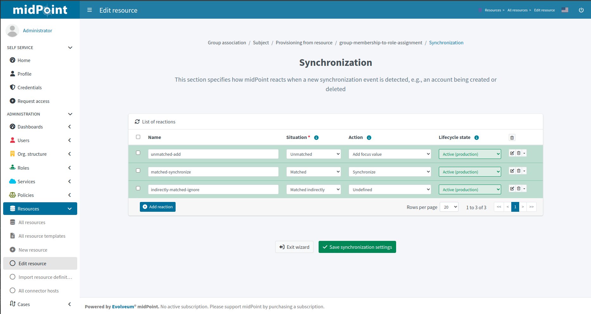
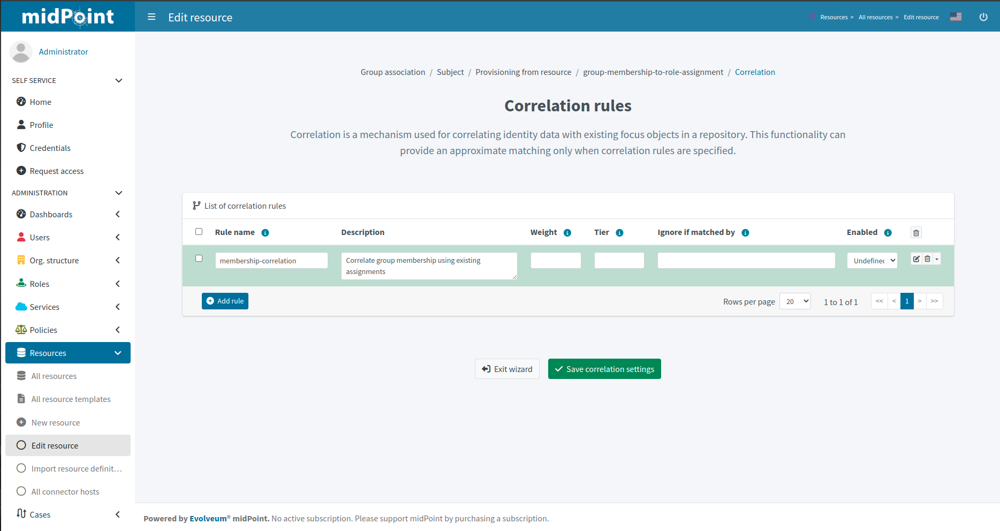
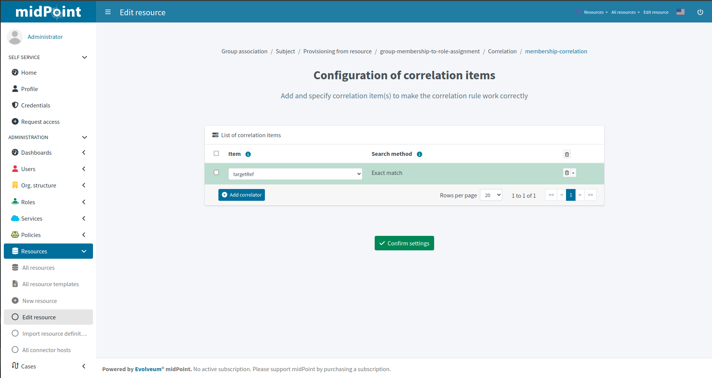

= Resource wizard: Association type provisioning from resource for subject
:page-nav-title: Provisioning from resource
:page-toc: top
:page-since: "4.9"

On this page we create provisioning rule(s) to specify how midPoint should read the association information and transform it to midPoint data, typically assignments.

Click btn:[Add provisioning rule] to create a new provisioning rule.

We can configure basic attributes of the provisioning rule:

* *Name* is used to uniquely name this rule
* *Strength* allows the association xref:/midpoint/reference/expressions/mappings/#_mapping_strength[mapping strength] to be set
* *Lifecycle state* allows defining the lifecycle state, e.g. `Proposed` for xref:/midpoint/reference/admin-gui/simulations/[simulation] of the provisioning rule.

Click btn:[Save settings].

Further configuration is required.

*Basic Attributes* tile allows returning back to the basic provisioning rule attributes definition.
Other tiles are described below.

== Mapping

In this step, you can configure the mapping for reading the associations (inbound).

Create a new mapping using btn:[Add inbound] that defines the transformation of association data from resource to midPoint data (inbound):

* *Name* is needed to uniquely identify this mapping
* *From resource attribute* should be kept as it is
* *Expression*: we can use the expression *Shadow owner* which means assigning the role that owns the entitlement
* *Target* property should be set to `targetRef` (of the assignment corresponding to the association)
* *Lifecycle state* allows you to define the lifecycle state. This can be used during xref:/midpoint/reference/admin-gui/simulations/[Simulations].

The detailed steps for mapping include the same steps as editing the mapping of the object type.

Click btn:[Save mappings] when done to return to the previous page from which you started the mapping editor.

== Synchronization

In this step, you can configure synchronization rules for provisioning. This section specifies how midPoint reacts when a new synchronization event is detected.

Click btn:[Add reaction] to add a new row in the table.

For the situations, you can select an appropriate situation:

* *Unmatched* refers to situation when there is no assignment corresponding to the association
* *Matched* refers to situation when there is a direct assignment corresponding to the  association already
* *Matched indirectly* refers to situation when there is an indirect assignment corresponding to the association already

For the reactions, you can select:

* *Add focus value* to allow creation of assignment corresponding to the association
* *Synchronize* to synchronize data between association and assignment for existing assignments
* *Undefined* to not do anything

For each table entry:

* *Lifecycle state* allows you to define the lifecycle state of the situation/reaction configuration. This can be used during xref:/midpoint/reference/admin-gui/simulations/[], e.g. specifying lifecycle state as `Proposed` will be used only to simulate the synchronization/reaction configuration, `Draft` disables the synchronization/reaction configuration etc.

The detailed steps for synchronization rule include the same steps as editing the synchronization rule of the object type.

Click btn:[Save synchronization settings] when done to return to the previous page from which you started the synchronization editor.

== Correlation

In this step, you can configure correlation rules for provisioning.
Define a new correlation rule to specify how midPoint should correlate the associations to assignments.

When you click on btn:[Edit] in item menu you will see table for items of correlation rule.
If associations correspond to assignments, you typically want to use (inbound mapping for) `targetRef` property (of the assignment) as correlation item.

Click btn:[Confirm settings] when finished to return to the previous page for correlation rules, but you must save your changes.

Click btn:[Save correlation settings] when done to return to the previous page from which you started the correlation editor.

Now we can go back to configure _Provisioning to resource_.

include::../../../configuration-resource-panels.adoc[]

include::../../../how-to-use-lifecycle-state.adoc[]

include::../../../limitation-all.adoc[]
