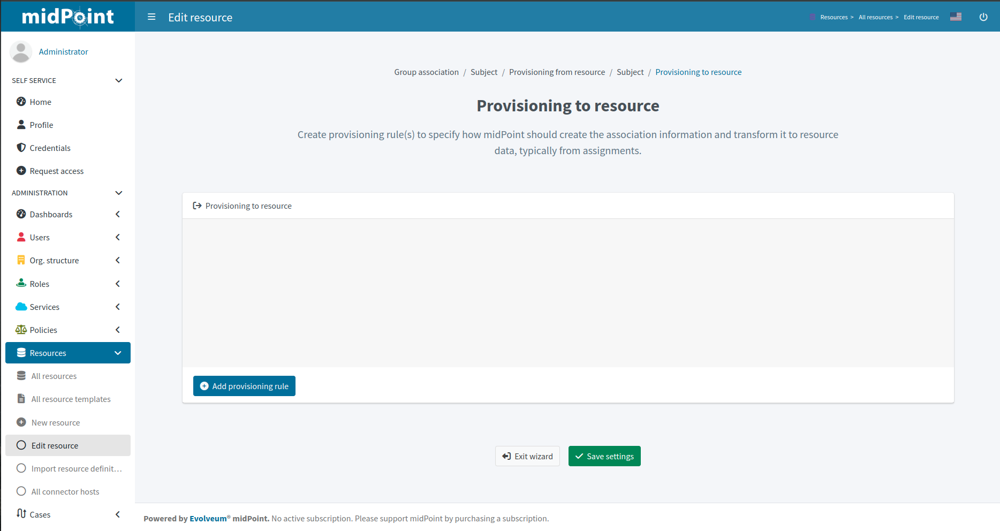
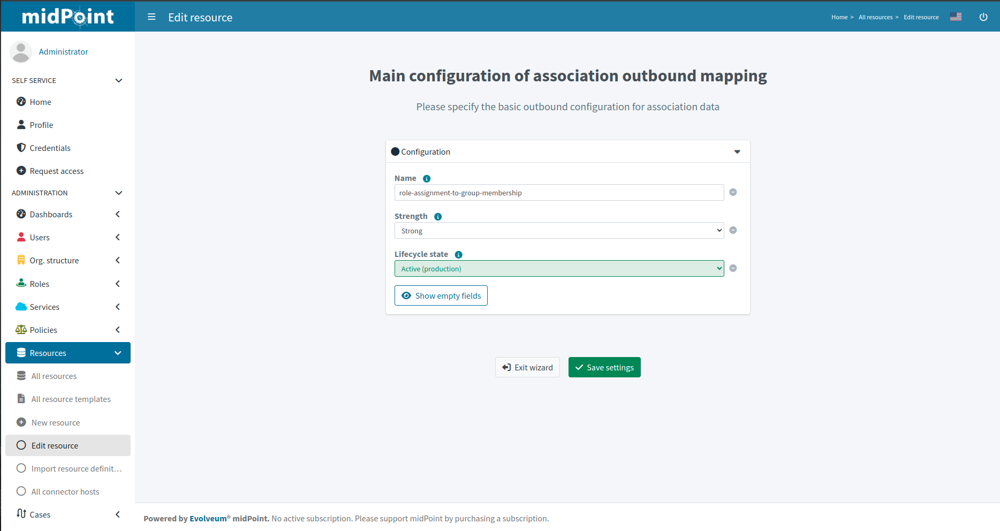
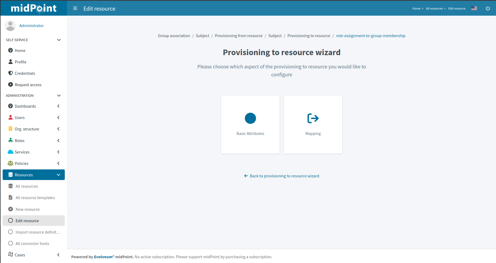
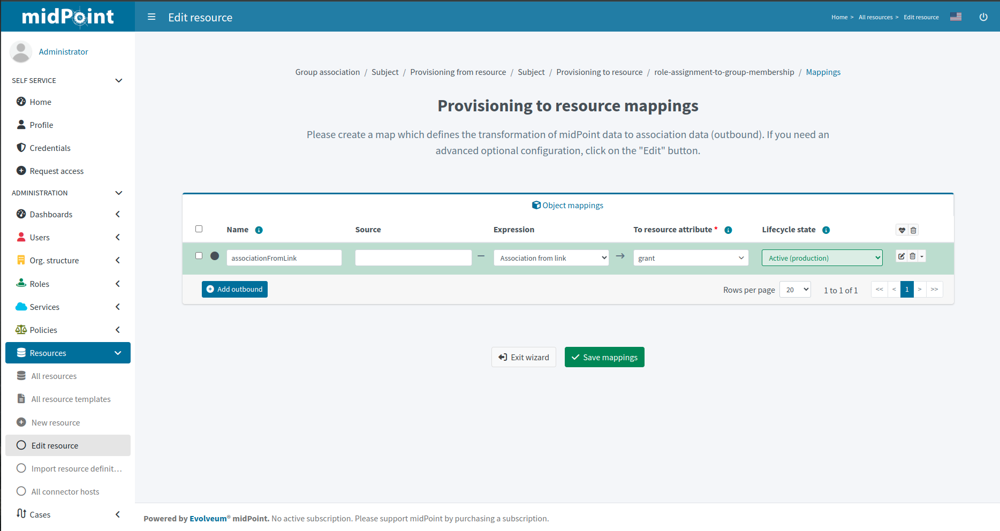

= Resource wizard: Association type provisioning to resource for subject
:page-nav-title: Provisioning to resource
:page-toc: top
:page-since: "4.9"

On this page we can create provisioning rule(s) to specify how midPoint should create the association information and transform it to resource data, typically from assignments.

The first steps are the same as for provisioning from resources, we need to create a new rule.

Click btn:[Add provisioning rule] to create a new provisioning rule.

We can configure basic attributes of the provisioning rule:

* *Name* is used to uniquely name this rule
* *Strength* allows the association xref:/midpoint/reference/expressions/mappings/#_mapping_strength[mapping strength] to be set
* *Lifecycle state* allows defining the lifecycle state, e.g. `Proposed` for xref:/midpoint/reference/admin-gui/simulations/[simulation] of the provisioning rule.

Click btn:[Save settings].

Further configuration is required.

*Basic Attributes* tile allows returning back to the basic provisioning rule attributes definition.
Other tiles are described below.

== Mapping

In this step, you can configure the mapping for creating the associations (outbound).

Create a new mapping using btn:[Add outbound] that defines the transformation of midPoint data to association data (outbound).

* *Name* is needed to uniquely identify this mapping
* *Source* should be kept as it is
* *Expression*: we can use the expression *Association from link* which means associate with the entitlement owned by the assigned role.
* *To resource attribute* should be kept as it is
* *Lifecycle state* allows you to define the lifecycle state. This can be used during xref:/midpoint/reference/admin-gui/simulations/[Simulations].

The detailed steps for mapping include the same steps as editing the mapping of the object type.

Click btn:[Save mappings] when done to return to the previous page from which you started the mapping editor.

include::../../../configuration-resource-panels.adoc[]

include::../../../how-to-use-lifecycle-state.adoc[]

include::../../../limitation-all.adoc[]
