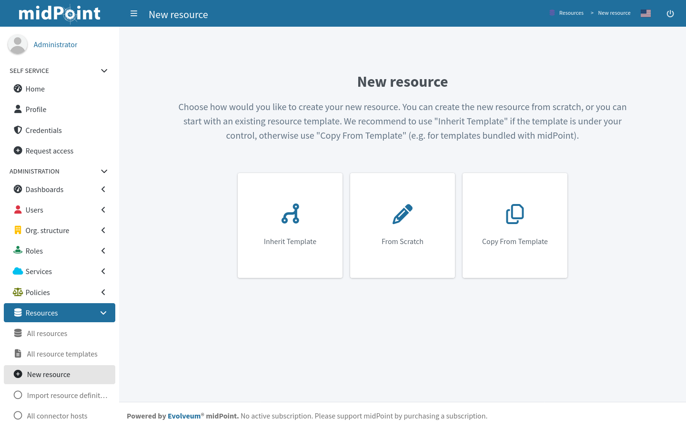
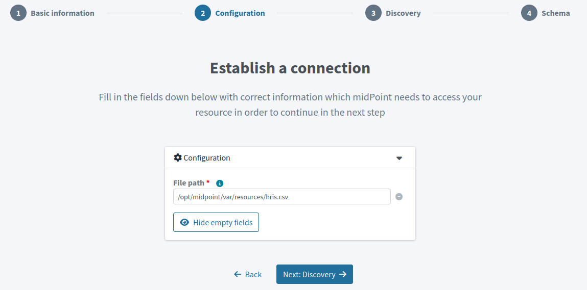
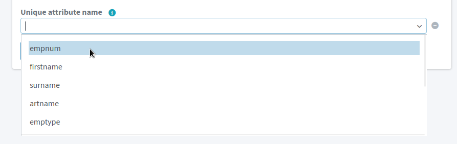
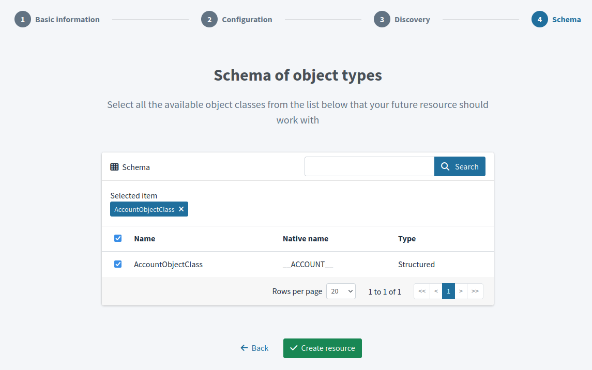
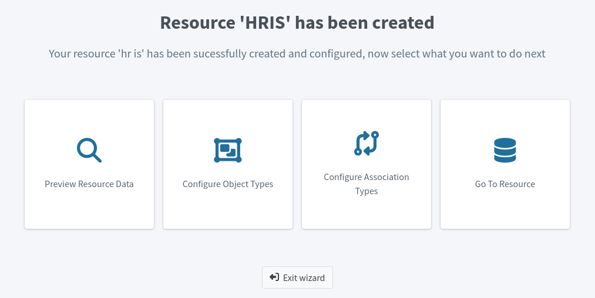

= Create a New Resource in Resource Wizard
:page-nav-title: 'Create New Resource'
:page-display-order: 10
:page-toc: top
:experimental:
:icons: font
:sectnums:

Every system you to connect to midPoint is represented as a resource in midPoint.
To connect a system, you need to create a resource for it first.

This guide shows you how to create a new resource in midPoint via the web GUI and configure it to access the resource.

[NOTE]
====
See xref:/midpoint/reference/resources/resource-configuration/[] for advanced configuration options and in-depth explanations.
====

// TODO:  Create a guide for templates in GUI and link it here.
Before you continue, you may want to have  a look at xref:/midpoint/reference/resources/resource-configuration/inheritance/[] to learn about template configuration.

== Select Starting Point and Connector

The first thing to do when creating a new resource using the wizard is to decide whether you want to create it from scratch, use a template, or copy the configuration from a pre-existing resource.

. In icon:database[] *Resources*, select icon:plus-circle[] *New Resource*.
. Select icon:pencil[] *From Scratch*. +
    See the note below for explanation of the options here.
. Select a connector. +
    For example, to read a CSV file, use the *CsvConnector*.

Now, you'll configure the resource on several screens.

.A closer look at the starting points:
[NOTE]
====
* *Inherit Template* – the new resource will be based on a pre-existing resource template. The new resource will _inherit_ the configuration.
* *From Scratch* – you will need to configure all aspects of the resource
* *Copy From Template* – the new resource will be based on a pre-existing resource template. The new resource will be created as a copy of that template.

A resource template is marked as such by setting the `template` property to `true`.
See xref:/midpoint/reference/resources/resource-configuration/inheritance/[] for more information.
====

.See the following pages for more information on connectors:
* For general advice on setting up and using connectors: xref:/midpoint/reference/resources/connector-setup/[]
* For connector developers and engineers using custom connectors: xref:/midpoint/reference/resources/connid/[]
* xref:/connectors/connectors/[List of Identity Connectors] known to work with midPoint

== Basic Information
. Type *Name* and *Description* of the resource. +
    For example,
    * Name: _HRIS_
    * Description: _CSV exports from the HR system_
. Keep the *Lifecycle state* as _Proposed_ until you finish and test the configuration of the resource.
. Click btn:[Next: Configuration].

[TIP]
====
*Lifecycle State* is a new property since midPoint 4.8.
It gives you the option to create preliminary resource configuration that's not active, but you can use it for xref:/midpoint/reference/admin-gui/simulations/[simulations].
The default value is _Proposed_.

See xref:/midpoint/reference/concepts/object-lifecycle/[] to understand the concept in more depth.
====

== Establish a Connection

Now, you need to provide information on how to connect to the resource.

In the case of the CSV connector, the only configuration required is the path to the source CSV file.
The exact path depends on your midPoint instance configuration.

If you use Docker, have a look at link:/midpoint/quickstart/#file-paths-in-docker-containers[working with file paths in Docker containers].

.A potential issue with CSV files
[NOTE]
====
If you're using the CSV connector and the wizard fails in this step with an error _Connector initialization failed. Configuration error: Configuration error: Header in the CSV file doesn't contain a unique attribute name as defined in the configuration_, it may be caused by presence of UTF-8 BOM characters in the file.
See more link:https://support.evolveum.com/work_packages/9497/activity[in the related bug report]. +
To resolve the issue, remove the leading UTF-8 BOM characters from the CSV file and start the wizard again.
You can do this, for example, by copying the file contents to a new file in a text editor.
====

Contents of this screen vastly depend on the resource type and on what the connector supports.
For remote resources such as LDAP servers, the configuration is more complex.
Refer to the documentation of the particular connector you're using. See xref:/connectors/connectors/[] to find more information on supported connectors.

When you're done, click btn:[Next: Discovery].

[TIP]
====
MidPoint validates the configuration before you can get to the next step.
If midPoint can't connect to the resource, it'll tell you so and won't let you continue.
====

== MidPoint Discovery

Use this screen to tell midPoint about your data structure.
Refer to the information tooltip icons to learn about the purpose of each field.

Importantly and regardless of the resource type, you need to *select a unique attribute*, i.e., an attribute that uniquely identifies each entry in your database.

When you're done, click btn:[Next: Schema].

.Conveniently, midPoint suggests the field names so that you don't need to type them manually. Here, they're columns found in a CSV file.

== Schema of Object Types

In the final screen, select the schema of the object types that are in the resource.

If you're connecting a resource with only one type of objects, such as users, *use the pre-selected _AccountObjectClass_ schema*.

In more advanced configurations, you may want to refer to xref:/midpoint/reference/resources/resource-schema/[] and xref:/midpoint/reference/resources/shadow/kind-intent-objectclass/#object-class[].

Click btn:[Create Resource] to finish the configuration.

== Next Steps

The final screen provides options for your next steps.

The best first action after creating a resource is to preview its data to confirm that midPoint is retrieving data from the resource correctly.
Click icon:magnifying-glass[] btn:[Preview Resource Data] to inspect the objects that midPoint sees on the resource.

Use the btn:[Back] button beneath the object listing to get back to the last wizard screen.

After reviewing the resource objects, you can return to the resource wizard and adjust the resource configuration as needed using the icon:database[] btn:[Go To Resource] tile.

[TIP]
====
If you need to access the resource configuration later:

. In icon:database[] *Resources* > *All resources*, select the resource.
. In the left-side resource navigation, these are the sections you'll use the most in the beginning: +
    *Basic*, *Connector configuration*, and *Resource objects*.
====

With the resource created and configured, continue with the configuration further:

* xref:./object-type[]
* xref:./association-type[]
* xref:/midpoint/reference/tasks/synchronization-tasks/import-and-reconciliation/[]

:sectnums!:

include::see-also.adoc[]
