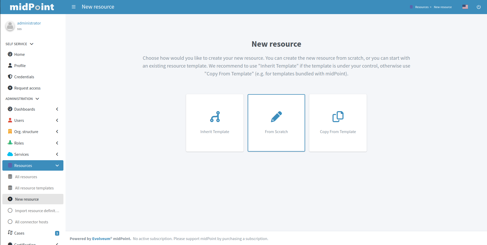
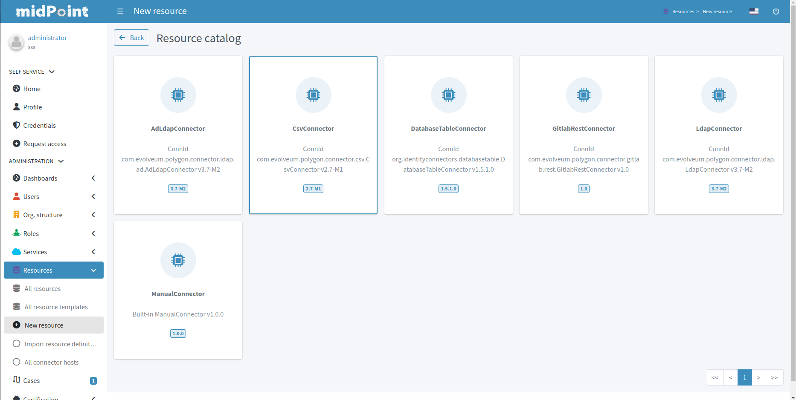
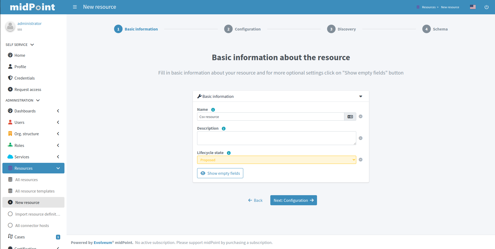
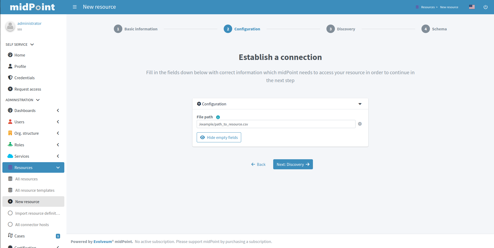
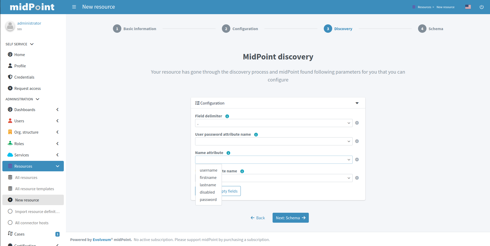
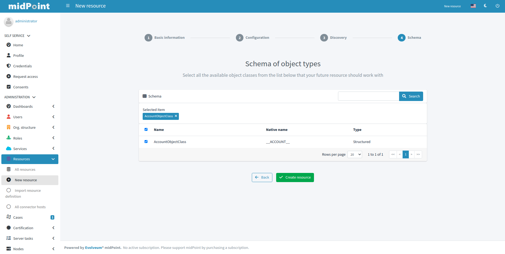
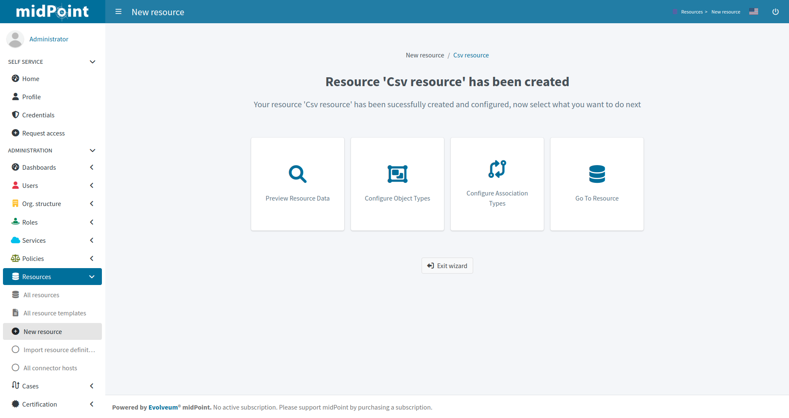
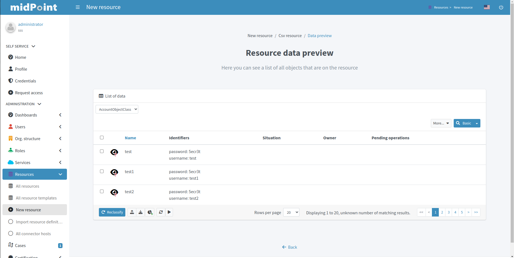

= Resource wizard
:page-toc: top
:page-since: "4.6"
:page-since-improved: [ "4.8", "4.9" ]

== Introduction

Resource wizard allows to easily create and update resource configuration.
No midPoint XML language is needed, the configuration is entirely UI-based.

The new UI takes form of panels with choices for specific parts of resource configuration.
Specific parts of configuration are represented as steps in wizard.

//Resource wizard was completely rewritten and redesigned in midPoint version 4.6.
//It was further enhanced in midPoint 4.8.
Screenshots below corresponding with midPoint version 4.8.

If you would like to see the resource wizard in action, please watch our Resource Wizard webinar video:

video::-JUXHMGrFyI[youtube,title="Resource Wizard Webinar Video"]

If you would like to see the resource wizard used as a part of xref:/midpoint/methodology/first-steps/[First Steps Methodology] webinar video, please watch our First Steps Methodology video:

video::suo775ym_PE[youtube,title="First Steps Methodology Webinar Video"]

We recommend you to read about xref:/midpoint/reference/synchronization/[] as resource wizard allows configuration which belongs to synchronization concepts.

== Resource creation

To create resource, navigate to menu:Resources[New resource].

There are the following possibilities:

. *Inherit Template* - the new resource will be based on a pre-existing resource template. The new resource will _inherit_ the configuration.
. *From Scratch* - you will need to configure all aspects of the resource
. *Copy From Template* - the new resource will be based on a pre-existing resource template. The new resource will be created as a copy of that template.

NOTE: A resource template is marked as such by setting the `template` property to `true`.
See xref:/midpoint/reference/resources/resource-configuration/inheritance/[] for more information.

Selecting *From Scratch* option leads to a Resource catalog page:

Click the connector tile you want to use to start the resource creation wizard.

.See also the following pages for more information:
* For general advice on using stock connectors in midPoint, please see xref:/midpoint/reference/resources/connector-setup/[Connector Setup]
* For connector developers and engineers using custom connectors xref:/midpoint/reference/resources/connid/[Using ConnId Connectors in midPoint] might be important
* xref:/connectors/connectors/[List of Identity Connectors] known to work with midPoint

== Basic configuration

Enter basic configuration such as resource *Name* and *Description* here.

*Lifecycle state* is a new property since midPoint 4.8.
It allows you to create preliminary resource configuration that will not be active, but can be used for xref:/midpoint/reference/admin-gui/simulations/[Simulations].
The default value is `Proposed`.

Click btn:[Next] to continue the resource configuration.

If the connector supports _discovery_ operation, resource wizard will ask you for mandatory configuration parameters to be able to detect the others, e.g. path to a CSV file for CSV file connector.

.See also the following pages for more information:
* Familiarize yourself with the concept of xref:/midpoint/reference/admin-gui/simulations/[Simulations]
* xref:/midpoint/reference/concepts/object-lifecycle/[Object Lifecycle] (at least to understand the basics of lifecycle states)

Click btn:[Next] to start discovery process and continue the resource configuration.

All other resource configuration properties can be configured now, e.g. CSV file field delimiter or a CSV file unique identifier column.
Some of the properties are already preconfigured by the connector.
Some of them allow suggestions of appropriate values using an autocompletion, e.g. when selecting which column should be used as a unique identifier of the row, the wizard suggests the CSV file columns as detected by the connector in the discovery step.

Click btn:[Next] to continue the resource configuration.

WARNING: If you are using CSV connector and wizard fails in this step with error _"Connector initialization failed. Configuration error: Configuration error: Header in csv file doesn't contain unique attribute name as defined in configuration."_, it may be caused by presence of UTF-8 BOM characters in the file. See more https://support.evolveum.com/work_packages/9497/activity[here]. +
To resolve the issue, remove the leading UTF-8 BOM characters from the csv file and start the wizard again. This can be done e.g. by copying the file content to a new file in text editor.

Connector will return possible object types and their attributes (_schema_ and its _object classes_).
Confirm the detected configuration.

Click btn:[Create resource] to create the resource and store it in midPoint repository.
Further configuration is required.
You can choose your next step:

* Preview Resource Data
* Configure Object Types
* Configure Association Types
* Go To Resource

Clicking *Preview Resource Data* tile will display the data (e.g. accounts) in the source/target system configured as resource.
You can display the data even before providing configuration for its processing.

Clicking *Configure Object Types* allows you to xref:./object-type[Object type configuration], configure the Object type(s)>>.

Clicking *Configure Association Types* allows you to xref:./association-type[Association type configuration], configure the Association type(s)>>.

Clicking *Go To Resource* leads to the resource details page.

include::configuration-resource-panels.adoc[]

include::how-to-use-lifecycle-state.adoc[]

include::limitation-all.adoc[]
