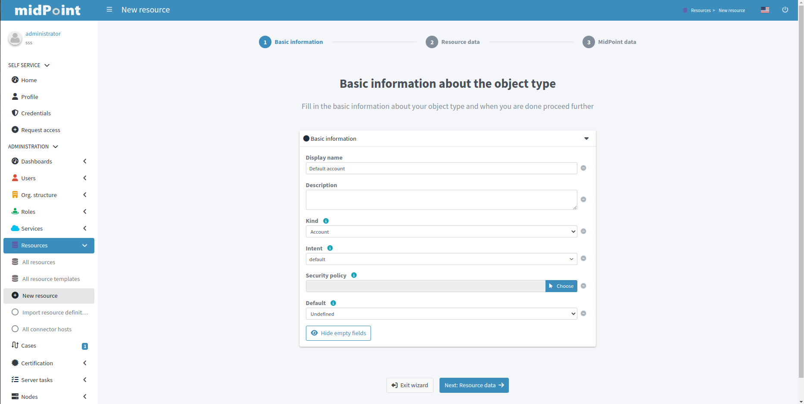
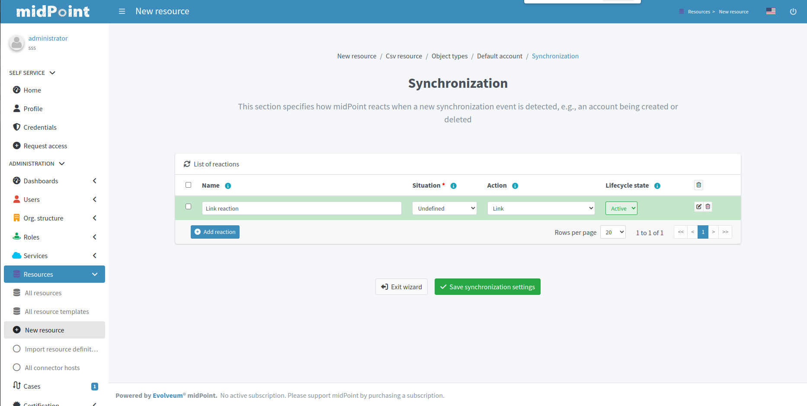
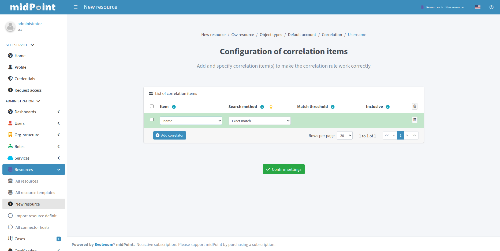
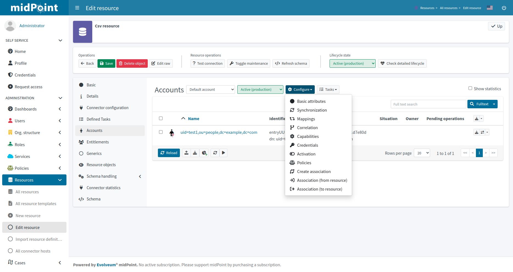

= Resource wizard
:experimental:
:page-toc: top
:page-since: "4.6"
:page-since-improved: [ "4.8" ]

== Introduction

Resource wizard allows to easily create and update resource configuration.
No midPoint XML language is needed, the configuration is entirely UI-based.

The new UI takes form of panels with choices for specific parts of resource configuration.
Specific parts of configuration are represented as steps in wizard.

//Resource wizard was completely rewritten and redesigned in midPoint version 4.6.
//It was further enhanced in midPoint 4.8.
Screenshots below corresponding with midPoint version 4.8.

If you would like to see the resource wizard in action, please watch our Resource Wizard webinar video:

video::-JUXHMGrFyI[youtube,title="Resource Wizard Webinar Video"]

If you would like to see the resource wizard used as a part of xref:/midpoint/methodology/first-steps/[First Steps Methodology] webinar video, please watch our First Steps Methodology video:

video::suo775ym_PE[youtube,title="First Steps Methodology Webinar Video"]

We recommend you to read about xref:/midpoint/reference/synchronization/[] as resource wizard allows configuration which belongs to synchronization concepts.

== Resource creation

To create resource, navigate to menu:Resources[New resource].

There are the following possibilities:

. *Inherit Template* - the new resource will be based on a pre-existing resource template. The new resource will _inherit_ the configuration.
. *From Scratch* - you will need to configure all aspects of the resource
. *Copy From Template* - the new resource will be based on a pre-existing resource template. The new resource will be created as a copy of that template.

NOTE: A resource template is marked as such by setting the `template` property to `true`.
See xref:/midpoint/reference/resources/resource-configuration/inheritance/[] for more information.

Selecting *From Scratch* option leads to a Resource catalog page:

image::step-1-resource-catalog.png[link=step-1-connector-conf-discovery.png,100%, title=Resource catalog]

Click the connector tile you want to use to start the resource creation wizard.

.See also the following pages for more information:
* For general advice on using stock connectors in midPoint, please see xref:/midpoint/reference/resources/connector-setup/[Connector Setup]
* For connector developers and engineers using custom connectors xref:/midpoint/reference/resources/connid/[Using ConnId Connectors in midPoint] might be important
* xref:/connectors/connectors/[List of Identity Connectors] known to work with midPoint

== Basic configuration

Enter basic configuration such as resource *Name* and *Description* here.

*Lifecycle state* is a new property since midPoint 4.8.
It allows you to create preliminary resource configuration that will not be active, but can be used for xref:/midpoint/reference/admin-gui/simulations/[Simulations].
The default value is `Proposed`.

image::step-1-basic-conf.png[link=step-1-basic-conf.png, 100%, title=Basic configuration]

Click btn:[Next] to continue the resource configuration.

If the connector supports _discovery_ operation, resource wizard will ask you for mandatory configuration parameters to be able to detect the others, e.g. path to a CSV file for CSV file connector.

image::step-1-connector-conf-discovery.png[link=step-1-connector-conf-discovery.png,100%, title=Partial configuration for discovery]

.See also the following pages for more information:
* Familiarize yourself with the concept of xref:/midpoint/reference/admin-gui/simulations/[Simulations]
* xref:/midpoint/reference/concepts/object-lifecycle/[Object Lifecycle] (at least to understand the basics of lifecycle states)

Click btn:[Next] to start discovery process and continue the resource configuration.

All other resource configuration properties can be configured now, e.g. CSV file field delimiter or a CSV file unique identifier column.
Some of the properties are already preconfigured by the connector.
Some of them allow suggestions of appropriate values using an autocompletion, e.g. when selecting which column should be used as a unique identifier of the row, the wizard suggests the CSV file columns as detected by the connector in the discovery step.

Click btn:[Next] to continue the resource configuration.

WARNING: If you are using CSV connector and wizard fails in this step with error _"Connector initialization failed. Configuration error: Configuration error: Header in csv file doesn't contain unique attribute name as defined in configuration."_, it may be caused by presence of UTF-8 BOM characters in the file. See more https://support.evolveum.com/work_packages/9497/activity[here]. +
To resolve the issue, remove the leading UTF-8 BOM characters from the csv file and start the wizard again. This can be done e.g. by copying the file content to a new file in text editor.

Connector will return possible object types and their attributes (_schema_ and its _object classes_).
Confirm the detected configuration.

Click btn:[Create resource] to create the resource and store it in midPoint repository.
Further configuration is required.
You can choose your next step:

* Preview Resource Data
* Configure Object Types
* Go To Resource

image::choice-part-resource.png[link=choice-part-resource.png,100%,title=Resource created - next steps]

Clicking *Preview Resource Data* tile will display the data (e.g. accounts) in the source/target system configured as resource.
You can display the data even before providing configuration for its processing.

Clicking *Configure Object Types* allows you to <<Object type configuration,configure the Object type(s)>>.

Clicking *Go To Resource* leads to the resource details page.

== Object type configuration

In this part of resource configuration, you can configure the object types for xref:/midpoint/reference/resources/resource-configuration/schema-handling/[Schema handling], essentially defining the behavior of midPoint with respect to the resource.
One or multiple object types can be defined, based on the source/target system characteristics.
For example, CSV resource contains typically a single object type (e.g. accounts) while LDAP resource can contain more than one object type (e.g. accounts and groups).

image::step-2-object-type-table.png[link=step-2-object-type-table.png,100%,title=Table of object types]

Click btn:[Add object type] to create a new object type definition using Object type configuration wizard.

=== Basic attributes

Define the basic information about the object type:

* *Display name* will be displayed in midPoint as a reference to this object type configuration
* *Kind* is either `Account`, `Entitlement` or `Generic`. For accounts, please select `Account`.
+
TIP: You first object type definition will be almost always for accounts (`kind=account`). Typical source of user data is HR system. Later you might want to use also Entitlements and Generic.
* *Intent* is used when you would like to use more than one different object _types_, e.g. standard and administrative accounts. Keep the default (empty) value if you want to work with just one type of accounts.
* *Default* specifies if the intent provided in the previous value should be used as the default value in case you define multiple intents. Select `True` if you are using only a single intent / one type of accounts.

.See also the following pages for more information:
* xref:/midpoint/reference/resources/shadow/kind-intent-objectclass/[]

Click btn:[Next: Resource data] to continue the object type configuration.

Define the resource-specific configuration for this object type:

* *Object class* is one of the object classes (types) supported by the connector for the source/target system represented as this resource. For resources supporting only a single object class (e.g. CSV) this will be displayed as `AccountObjectClass` and set as default by the wizard.
* *Filter* allows to define a classification via midPoint xref:/midpoint/reference/concepts/query/midpoint-query-language/[query language]
* *Classification condition* allows to define a classification condition (midPoint expression, not query)

TIP: Classification allows to limit which resource data (e.g. accounts) are considered part of this object type definition.
An example of *Filter* usage: CSV file entries matching query `attributes/contractType != "Incognito"` should be considered as accounts, all other should be ignored.

NOTE: You do not need to use the classification at all. If unsure, do not use it.

.See also the following pages for more information:
* xref:/midpoint/reference/resources/resource-configuration/schema-handling/changes-in-4.6/#resource-object-type-delineation[Resource Object Type Delineation]

// TODO TODO we do not have better Delination example! I have created https://support.evolveum.com/wp/9404 to track this

image::step-2-object-type-resource-data.png[link=step-2-object-type-resource-data.png, 100%,title=Resource data]

Click btn:[Next: MidPoint Data] to continue the object type configuration.

Define the midPoint-specific configuration for this object type:

* *Type* defines type of midPoint object that will correspond to the resource object (e.g. `User`). midPoint will respect this setting when creating a new midPoint object from this object type data on the resource.
* *Archetype* allows selection of archetype that will be automatically assigned for all midPoint objects created from this object type data on the resource. The same archetype will be also used as a part of correlation, i.e. enforced.
+
If unsure, keep Archetype empty.

.See also the following pages for more information:
* overview of xref:/midpoint/reference/schema/archetypes/[Archetypes]
* built-in xref:/midpoint/reference/schema/archetypes/person/[Person archetype] ready to be used

image::step-2-object-type-midpoint-data.png[link=step-2-object-type-midpoint-data.png, 100%, title=Midpoint data]

Click btn:[Save settings] to save the object type configuration.
Further configuration is required.
You can choose your next step to configure other parts of your object type configuration:

* <<Basic attributes>> allows getting back to the basic configuration of your object type
* <<Mappings>> allow to configure resource attribute mappings
* <<Synchronization>> allows to configure synchronization situations and reactions
* <<Correlation>> allows to configure correlation rules for resource objects
* <<Capabilities>> allows you to disable/override some functionality of the resource and/or connector without changing the connector implementation
* <<Activation>> allows to configure rules (mappings) for activation
* <<Credentials>> allows to configure mappings for credentials (e.g. passwords)
* <<Associations>> allow to configure the resource for associations, e.g. account to group relations

image::choice-part-object-type.png[link=choice-part-object-type.png,100%,title=Parts of object type configuration]

Or you can click btn:[Preview data] to display resource data according to the configuration of this particular object type you are configuring (considering `Kind`, `Intent`, `Object class` etc.):

.Data preview of object type
image::data-preview-object-type.png[link=data-preview-object-type.png,100%,title=Data preview of object type]

=== Mappings

This part of object type wizard allows you to define attribute xref:/midpoint/reference/expressions/mappings/[mappings].
This way you can define midPoint behavior for resource attributes: how the resource attributes values should be fetched to midPoint (xref:/midpoint/reference/expressions/mappings/inbound-mapping/[inbound mappings]) or how the resource attribute values should be populated in resource (xref:/midpoint/reference/expressions/mappings/outbound-mapping/[outbound mappings]).

Click either *Inbound mappings* or *Outbound mappings* header in the table of mappings.

.See also the following pages for more information:
* xref:/midpoint/reference/resources/resource-configuration/schema-handling/[Resource Schema Handling]
* xref:/midpoint/reference/expressions/mappings/[Mappings]
* xref:/midpoint/reference/expressions/[MidPoint Expressions and Mappings]
* xref:/midpoint/reference/expressions/mappings/inbound-mapping/[Inbound mappings]
* xref:/midpoint/reference/expressions/mappings/outbound-mapping/[Outbound mappings]

==== Inbound mappings

Use xref:/midpoint/reference/expressions/mappings/inbound-mapping/[inbound mappings] to store resource attribute values in midPoint properties.

Click btn:[Add inbound] to add a new inbound mapping.

To define a mapping, you need to configure:

* *Name* of the mapping. This is technically not mandatory, but helps a lot during troubleshooting and when using resource template inheritance.
* *From resource attribute* allows you to type (with autocompletion) the resource attribute that should be used as a source of the mapping.
* *Expression* specifies how the source attribute(s) should be used. Resource wizard support the following xref:/midpoint/reference/expressions/expressions/[expression types]:
** *As is* (default) simply copies the value from resource attribute to midPoint target property
** *Literal* allows to specify a constant value
** *Script* allows to write a more complex behavior using a xref:/midpoint/reference/expressions/expressions/[midPoint expression] (by default in Groovy language)
** *Generate* allows to generate a random string using a value policy (useful for generating passwords)
* *Target* allows you to type (with autocompletion) the midPoint property that should be used to store the value generated by the inbound mapping
* *Lifecycle state* allows you to define the lifecycle state of the mapping. This can be used during xref:/midpoint/reference/admin-gui/simulations/[Simulations], e.g. specifying lifecycle state as `Proposed` will be used only to simulate the mapping, `Draft` disables the mapping etc.

image::step-3-mappings-inbound.png[link=step-3-mappings-inbound.png, 100%, title=Table of inbound mappings]

TIP: Adding new mappings to existing configuration can utilize simulations if you use `Proposed` as the new mappings' lifecycle state. Such mappings can be simulated without influencing the real data.

More complex configuration is possible by clicking btn:[Edit] button:

[%autowidth, cols="a,a", frame=none, grid=none, role=center]
|===
| image::step-3-mappings-inbound-detail-main.png[link=step-3-mappings-inbound-detail-main.png, 100%, title=Main configuration of inbound mapping (complex view)]
| image::step-3-mappings-inbound-detail-optional.png[link=step-3-mappings-inbound-detail-optional.png, 100%, title=Optional configuration of inbound mapping (complex view)]
|===

[#use_inbound_for_correlation]
You can define the inbound mapping as ordinary (default), or you can specify *Use for* parameter with value `Correlation` in the *Optional configuration* of the mapping to use the mapping only during the correlation.
This is how you can define inbound mappings to be used in <<Correlation>> when item correlator is used, even for target resources where you normally have no inbound mappings at all.
For more information, please refer to xref:/midpoint/reference/correlation/#example-4-correlation-for-outbound-resources[this example for correlation-only inbound mapping].

Mapping can be deleted by clicking btn:[Delete] button.

Mappings can be saved by clicking btn:[Save mappings] and wizard will return to the previous page from which you started mapping editor.

Click btn:[Attribute overrides] if you need to xref:/midpoint/reference/resources/resource-configuration/schema-handling/#attribute-definitions[override attribute(s) visibility or other behavior].

==== Outbound Mappings

Use xref:/midpoint/reference/expressions/mappings/outbound-mapping/[outbound mappings] to populate resource attribute values from midPoint properties.

Click btn:[Add outbound] to add a new outbound mapping.

To define a mapping, you need to configure:

* *Name* of the mapping. This is technically not mandatory, but helps a lot during troubleshooting and when using resource template inheritance.
* *Source* allows you to type (with autocompletion) the midPoint property that should be used as a source for this outbound mapping
+
TIP: Even multiple source attributes can be defined for an outbound mapping.
* *Expression* specifies how the source attribute(s) should be used. Resource wizard support the following xref:/midpoint/reference/expressions/expressions/[expression types]:
** *As is* (default) simply copies the value from resource attribute to midPoint target property
** *Literal* allows to specify a constant value
** *Script* allows to write a more complex behavior using a xref:/midpoint/reference/expressions/expressions/[midPoint expression] (by default in Groovy language)
** *Generate* allows to generate a random string using a value policy (useful for generating passwords)
* *To resource attribute* allows you to type (with autocompletion) the resource attribute that should be used as a target of the mapping.
* *Lifecycle state* allows you to define the lifecycle state of the mapping. This can be used during xref:/midpoint/reference/admin-gui/simulations/[Simulations], e.g. specifying lifecycle state as `Proposed` will be used only to simulate the mapping, `Draft` disables the mapping etc.

image::step-3-mappings-outbound.png[link=step-3-mappings-outbound.png, 100%, title=Table of outbound mappings]

TIP: Adding new mappings to existing configuration can utilize simulations if you use `Proposed` as the new mappings' lifecycle state. Such mappings can be simulated without influencing the real data.

More complex configuration is possible by clicking btn:[Edit] button:

[%autowidth, cols="a,a", frame=none, grid=none, role=center]
|===
| image::step-3-mappings-outbound-detail-main.png[link=step-3-mappings-outbound-detail-main.png, 100%, title=Main configuration of outbound mapping (complex view)]
| image::step-3-mappings-outbound-detail-optional.png[link=step-3-mappings-outbound-detail-optional.png, 100%, title=Optional configuration of outbound mapping (complex view)]
|===

Mapping can be deleted by clicking btn:[Delete] button.

Mappings can be saved by clicking btn:[Save mappings] and wizard will return to the previous page from which you started mapping editor.

Click btn:[Attribute overrides] if you need to xref:/midpoint/reference/resources/resource-configuration/schema-handling/#attribute-definitions[override attribute(s) visibility or other behavior].

==== Attribute override

Attribute configuration can be xref:/midpoint/reference/resources/resource-configuration/schema-handling/#attribute-definitions[overridden] beyond the context of the mappings.
This is useful to override attribute visibility, its display name, tolerance etc.

{empty} +
[%autowidth, cols="a,a", frame=none, grid=none, role=center]
|===

2+| image::step-3-mappings-override.png[link=step-3-mappings-override.png, 100%, title=Table of attribute overrides]

| image::step-3-mappings-override-detail-basic.png[link=step-3-mappings-override-detail-basic.png, 100%, title=Detailed configuration of attribute override configuration]
| image::step-3-mappings-override-detail-limitations.png[link=step-3-mappings-override-detail-limitations.png, 100%, title=Detailed configuration of attribute override - limitations configuration]
|===

=== Synchronization

This part of object type wizard allows you to define xref:/midpoint/reference/synchronization/situations/[synchronization situations and reactions].
These situations represent state of the resource object (e.g. account) in relation to midPoint and appropriate action that should be executed by midPoint.

For the situations you need to configure:

* *Name* of the situation/reaction configuration. This is technically not mandatory, but helps a lot during troubleshooting and when using resource template inheritance.
* *Situation* allows you to select an appropriate situation:
** *Linked* refers to situation when the resource object is linked to its midPoint owner
** *Unlinked* refers to situation when a new resource object has been found and its owner can be determined, but there is no link between the midPoint owner and resource object
** *Deleted* refers to situation when the resource object was references by midPoint owner but the resource object has been deleted
** *Unmatched* refers to situation when a new resource object has been found but midPoint cannot determine any owner for the account
** *Disputed* refers to situation when the midPoint has determined more potential midPoint owners for a single resource account or if the correlation of the resource object is not definitive (not fully trusted)
* *Action* allows you to select midPoint behavior if the resource object is in the defined Situation
** *Add focus* allows to create a new object in midPoint based on the resource data
** *Synchronize* allows to synchronize data between midPoint object and resource data based on the <<Mappings,mappings>>. This action is typical for `linked` situation.
** *Link* allows to link previously not linked resource object to midPoint object
** *Delete resource object* allows to delete resource object
** *Inactivate resource object* allows to inactivate (disable) resource object
** *Inactivate focus* allows to inactivate (disable) midPoint object
** *Delete focus* allows to delete midPoint object
** *Create correlation case* allows to resolve the situation interactively (useful for `Disputed` situation)
* *Lifecycle state* allows you to define the lifecycle state of the situation/reaction configuration. This can be used during xref:/midpoint/reference/admin-gui/simulations/[Simulations], e.g. specifying lifecycle state as `Proposed` will be used only to simulate the synchronization/reaction configuration, `Draft` disables the synchronization/reaction configuration etc.

TIP: The logic of situation and action is up to you. E.g. it is perfectly OK to have reaction `Add focus` for `Unmatched` situation for an authoritative source system such as HR. For target system, however, probably more appropriate reaction for `Unmatched` situation would be `Inactivate resource object`.

TIP: Please refer to xref:/midpoint/reference/schema/focus-and-projections/[Focus and Projections] for explanation of the term _Focus_. In the most basic scenarios when synchronizing users and their accounts, _focus_ corresponds to User object in midPoint.

More complex configuration is possible by clicking btn:[Edit] button:

[%autowidth, cols="a,a", frame=none, grid=none, role=center]
|===
| image::step-4-synch-detail-basic.png[link=step-4-synch-detail-basic.png, 100%, title=Basic configuration of synchronizatio rule]
| image::step-4-synch-detail-action.png[link=step-4-synch-detail-action.png, 100%, title=Action for synchronization rule]

| image::step-4-synch-detail-optional.png[link=step-4-synch-detail-optional.png, 100%, title=Optional attributes for synchronization rule]
|
|===

Situation/reaction configuration can be deleted by clicking btn:[Delete] button.

Click btn:[Save synchronization settings] when done to return to the previous page from which you started the synchronization editor.

=== Correlation

Correlation allows you to define how midPoint should recognize relations between resource objects and midPoint objects.
In short, this is about searching the resource object owners in midPoint.

You can create one or several correlation rules.

Click btn:[Add rule] to add a new correlation rule.

For the correlation, you can configure the following:

* *Rule name* for documentation and troubleshooting purposes
* *Description*
* *Weight*, *Tier*, *Ignore if matched by* for more complex scenarios
* *Enabled* to enable or disable the correlation rule

image::step-5-correlator-rule.png[link=step-5-correlator-rule.png,100%,title=Table of correlation rules]

Click btn:[Edit] button to edit details of the correlation rule.

Specify the item configuration:

* *Item* refers to a midPoint property for which an inbound mapping exists. This will be used for correlation. E.g. if there is an inbound mapping from AD's `sAMAccountName` attribute to midPoint user's `name` property, you would use `name` item
+
TIP: For target resources where inbound mappings are normally not used, the inbound mapping can be in a special <<#use_inbound_for_correlation,"Use for correlation only" mode>>.
* *Search method* allows to specify either exact match or one of the fuzzy search methods supported by midPoint

.Table of correlation items for one correlation rule

.See also the following pages for more information:
* xref:/midpoint/reference/correlation/items-correlator/[]
* xref:/midpoint/reference/correlation/[Smart Correlation]

Click btn:[Save correlation settings] when done to return to the previous page from which you started the correlation editor.

=== Capabilities

Capabilities panel informs you about the supported capabilities for the resource with selected connector and allows to override them.
Capabilities can be simply _disabled_, e.g. disable operation can be disabled for this resource object type.
This does not require any change in the connector.

Capabilities can be also _configured_, e.g. for LDAP resources, you can define which account attribute is used to set/indicate the status of the account.

TIP: Capabilities can be configured also on the resource level, not just for specific object types by navigating to resource's *Details* panel.

.Capabilities configuration
image::step-6-capabilities.png[link=step-6-capabilities.png,100%,title=Capabilities configuration]

Click btn:[Save capabilities] when done to return to the previous page from which you started the capabilities editor.

=== Activation

This part of object type wizard allows you to define behavior for xref:/midpoint/reference/concepts/activation/[].
This extends far beyond a simple definition of account being enabled or disabled.

Starting with version 4.8, midPoint contains GUI support for activation mappings.
We can use predefined mappings (rules) for many interesting situations.
//, or we can add standard activation mappings, where the GUI is the same as in xref:/midpoint/reference/admin-gui/resource-wizard/#mappings[Mappings section of object type wizard].

.See also the following pages for more information:
* xref:/midpoint/reference/resources/resource-configuration/schema-handling/activation/#wizard-panels[Resource Schema Handling: Activation].
* xref:/midpoint/reference/concepts/activation/[Activation]
* xref:/midpoint/reference/resources/resource-configuration/schema-handling/activation/#_predefined_activation_mappings[Predefined Activation Mappings]

==== Inbound activation mappings

The table contains the list of inbound activation mappings.

image::step-7-activation-inbounds.png[link=step-7-activation-inbounds.png, 100%, title=Empty inbound table for activation]

Click btn:[Add inbound] to add a new inbound activation mapping.

In the popup, specify the activation rule (predefine behavior), e.g. "Administrative status".
Then configure details for mapping as appropriate for the activation scenario.

[%autowidth, cols="a,a", frame=none, grid=none, role=center]
|===
| image::step-7-activation-inbound-add.png[link=step-7-activation-inbound-add.png, 100%, title=Popup for adding of new inbound activation mapping]
| image::step-7-activation-inbound-full.png[link=step-7-activation-inbound-full.png, 100%, title=Activation table with inbound mapping for administrative status]

|===

Each mapping also allows setting *Lifecycle state*.
This can be used during xref:/midpoint/reference/admin-gui/simulations/[Simulations], e.g. specifying lifecycle state as `Proposed` will be used only to simulate the activation mapping, `Draft` disables the activation mapping etc.

Click btn:[Save mappings] when done to return to the previous page from which you started the activation editor.

==== Outbound activation mappings

The table contains the list of outbound activation mappings.

image::step-7-activation-outbounds.png[link=step-7-activation-outbounds.png, 100%, title=Empty outbound table for activation]

Click btn:[Add outbound] to add a new outbound activation mapping.

In the popup, specify the activation rule (predefine behavior), e.g. "Administrative status" or "Disable instead of delete".
Then configure details for mapping as appropriate for the activation scenario.

[%autowidth, cols="a,a", frame=none, grid=none, role=center]
|===
| image::step-7-activation-outbound-add.png[link=step-7-activation-outbound-add.png, 100%, title=Popup for adding of new outbound activation mapping]
| image::step-7-activation-outbound-full.png[link=step-7-activation-outbound-full.png, 100%, title=Activation table with outbound mapping for administrative status and predefined mappings for 'Disable instead of delete' and 'Delayed delete' configuration]
|===

Predefined mapping configurations contain only one configuration step.

.Predefined details configuration for 'Delayed delete'
image::step-7-predefined-details.png[link=step-7-predefined-details.png,100%,title=Predefined details configuration for 'Delayed delete']

Each mapping also allows setting *Lifecycle state*.
This can be used during xref:/midpoint/reference/admin-gui/simulations/[Simulations], e.g. specifying lifecycle state as `Proposed` will be used only to simulate the activation mapping, `Draft` disables the activation mapping etc.

Click btn:[Save settings] when done to return to the previous page from which you started the activation editor.

=== Credentials

Credentials allows you to define mappings for credentials, e.g. passwords.

Configuration for credentials contains similar panels as for activation, but contains only one kind of mapping and doesn't contain any predefined mappings.
Use the credentials mappings to either pass or generate the password.

TIP: The `as is` mappings are very simple as midPoint implies that the password will be passed from midPoint user password to resource object password (if supported by the resource and connector) or vice versa.

image::step-8-credentials.png[link=step-8-credentials.png,100%,title=Configuration of credentials]

Each mapping also allows setting *Lifecycle state*.
This can be used during xref:/midpoint/reference/admin-gui/simulations/[Simulations], e.g. specifying lifecycle state as `Proposed` will be used only to simulate the credentials mapping, `Draft` disables the credentials mapping etc.

Click btn:[Save settings] when done to return to the previous page from which you started the credentials editor.

NOTE: You don't need any credentials mappings if you are not managing the passwords in the resource (e.g. if you are using SSO with another system).

=== Associations

Associations allow you to configure resource for object type relations.
Typically, this is used to configure how account/group membership is defined and processed.

You can define the following associations properties:

* *ref* is a unique name for the association (technical), e.g. `group`
* *Display name* is a user-friendly association name displayed in GUI
* *Kind* and *Intent* specify the object type which defines the object to be associated. This means you are referring to another <<Object type configuration,object type>> for entitlement which needs to be defined first using the same mechanism as you use for accounts.
* *Direction* defines the direction of the relation between associated objects. There are two possibilities:
** *Object to subject* Object (e.g. a group) has an attribute that contains subject (e.g. account) identifiers as its values. E.g. a group has a list of members. _This is the LDAP-way_.
** *Subject to object* Subject (e.g. account) has an attribute that contains object (e.g. group) identifiers as its values. E.g. an account has a list of groups to which it belongs.
* *Association attribute* refers to name of the attribute which represents the association. This is the attribute that will be modified when the association changes. In object-to-subject associations this is the attribute of the object (e.g. group's `dn`). In subject-to-object associations this is an attribute of the subject (e.g. account's `groups` attribute).
* *Value attribute* refers to name of the attribute from with a value for association attribute is taken. The value is taken from this attribute and it will be stored in the association attribute. This attribute will not be modified when the association changes, it is only for reading. In object-to-subject associations this is the attribute of the subject (e.g. account's `dn`). In subject-to-object associations this is an attribute of the object (e.g. group's `name`). This attribute usually contain identifiers.
* *Lifecycle state* allows you to define the lifecycle state of the association configuration. This can be used during xref:/midpoint/reference/admin-gui/simulations/[Simulations], e.g. specifying lifecycle state as `Proposed` will be used only to simulate the association configuration, `Draft` disables the association configuration etc.

image::step-9-association.png[link=step-9-association.png,100%,title=Table of associations]

Click btn:[Add association] to add a new association configuration.

.Detail configuration for association
image::step-9-association-detail.png[Detail configuration for association, 100%]

.See also the following pages for more information:
* xref:/midpoint/reference/resources/entitlements/#association-definition[Association definition]
* xref:/midpoint/reference/resources/entitlements/[Entitlements]

Click btn:[Save associations settings] when done to return to the previous page from which you started the association editor.

== Wizard for existing resource

The resource object type wizard can be used also for editing existing resource settings.

Navigate to one of the resource object panels (*Accounts*, *Entitlements* or *Generic*), select the object type by its display name and click btn:[Configure], then select button for particular part of object type wizard.

== Wizard for task creation

The resource wizard allows creation of resource-related tasks without going to "Server tasks" menu.
It allows even more: wizard-like creation of these tasks.

You can create the following types of tasks for your resource objects:

* Import from resource
* Reconciliation
* Live synchronization

All these tasks can be created as standard tasks or xref:/midpoint/reference/admin-gui/simulations/[simulated tasks].

=== Standard (non-simulated) tasks

To create a new non-simulated task within the resource wizard, navigate to one of the resource object panels (*Accounts*, *Entitlements* or *Generics*) and click btn:[Tasks], then click *Create task*.

Keep the *Simulate task* switch set to *OFF*.

Select the xref:/midpoint/reference/tasks/synchronization-tasks/[task] to be created (Import, Reconciliation, Live synchronization) by clicking one of the tiles:

Click btn:[Create task] to start task creation wizard.

Define basic information for the task:

* *Name* will be used as the task name. If you do not define the task name, it will be generated automatically based on the task type, resource and object type display name, e.g. `Import task: HR System: HR Person`.

image::task-wizard-step-2-basic.png[link=task-wizard-step-2-basic.png,100%,title=Step 2: Enter basic task information]

Click btn:[Next: Resource objects] to continue with the task creation.

Define resource-related information for the task.
Normally you don't need to define anything as the task creation wizard will use the information from the resource and object type, where you have started it and *Resource*, *Kind*, *Intent* and/or *Object class* will be already predefined.

image::task-wizard-step-3-resource.png[link=task-wizard-step-3-resource.png,100%,title=Step 3: Enter resource-related task information]

Click btn:[Next: Distribution] to continue with the task creation.

Define distribution information for the task, currently only *Worker threads* you want to use for the task run.
The default value is a single worker.

image::task-wizard-step-4-distribution.png[link=task-wizard-step-4-distribution.png,100%,title=(Optional) Step 4: Enter distribution details]

Click btn:[Save & Run] to save and start task immediately or click btn:[Save settings] to create but not start the task.

You can get to the task details either using menu:Server tasks[All tasks] or clicking *Defined tasks* menu item in the resource details.

image::task-wizard-defined-tasks.png[link=task-wizard-defined-tasks.png,100%,title="List of tasks defined for the resource"]

=== Simulated tasks

To create a new simulated task within the resource wizard, navigate to one of the resource object panels (*Accounts*, *Entitlements* or *Generics*) and click btn:[Tasks], then click *Create task*.

Switch the *Simulate task* to *ON*.

Select the xref:/midpoint/reference/tasks/synchronization-tasks/[task] to be created (Import, Reconciliation, Live synchronization) by clicking one of the tiles:

image::task-wizard-step-1-select-task-type-simulated.png[link=task-wizard-step-1-select-task-type-simulated.png,100%,title=Step 1: Select task type (with simulation)j]

Click btn:[Create task] to start task creation wizard.

Define basic information for the task:

* *Name* will be used as the task name. If you do not define the task name, it will be generated automatically based on the task type, resource and object type display name, e.g. `Import task: HR System: HR Person`.
In the following image we are using a custom task name `Reconciliation with AD - development simulation`.

image::task-wizard-step-2-basic-simulated.png[link=task-wizard-step-2-basic-simulated.png,100%,title=Step 2: Enter basic task information]

Click btn:[Next: Resource objects] to continue with the task creation.

Define resource-related information for the task.
Normally you don't need to define anything as the task creation wizard will use the information from the resource and object type, where you have started it and *Resource*, *Kind*, *Intent* and/or *Object class* will be already predefined.

image::task-wizard-step-3-resource-simulated.png[link=task-wizard-step-3-resource-simulated.png,100%,title=Step 3: Enter resource-related task information]

Click btn:[Next: Execution] to continue with the task creation. The "Execution" parameters can be edited only for simulated tasks.

Define execution-related information for the task.
This allows to configure the task xref:/midpoint/reference/admin-gui/simulations/[simulation parameters]:

.Execution
* *Mode* allows to specify either `Full` or `Preview` execution modes. For simulation, select `Preview` (which is automatically set as default when creating a simulated task)

.Configuration to use
* *Predefined* allows to specify the configuration that will be used for the simulation.
** *Development* allows evaluating all configuration which is in lifecycle state `Active` or `Proposed`
** *Production* allows evaluating all configuration which is in lifecycle state `Active` or `Deprecated`

image::task-wizard-step-4-execution-simulated.png[link=task-wizard-step-4-execution-simulated.png,100%,title=Step 4: Enter execution-related task information]

Click btn:[Next: Schedule] to continue with the task creation. The "Schedule" parameters can be edited only for reconciliation and/or live synchronization tasks.

Define scheduling-related information for the task.

TIP: Scheduling usually does not make much sense when creating a simulated task.

* *Interval* allows defining scheduling interval in seconds
* *Cron-like pattern* allows defining scheduling intervals via cron-like pattern

Click btn:[Next: Distribution] to continue with the task creation.

Define distribution information for the task, currently only *Worker threads* you want to use for the task run.
The default value is a single worker.

image::task-wizard-step-4-distribution.png[link=task-wizard-step-4-distribution.png,100%,title=(Optional) Step 6: Enter distribution details]

Click btn:[Save & Run] to save and start task immediately or click btn:[Save settings] to create but not start the task.

You can get to the task details either using menu:Server tasks[All tasks] or clicking *Defined tasks* menu item in the resource details.

image::task-wizard-defined-tasks.png[link=task-wizard-defined-tasks.png,100%,title="List of tasks defined for the resource"]

include::limitation-all.adoc[]

include::see-also.adoc[]
