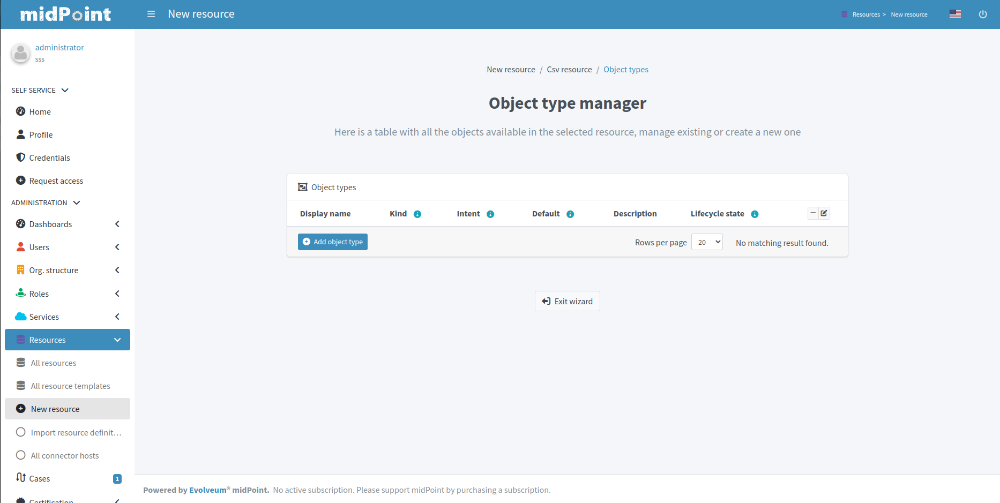
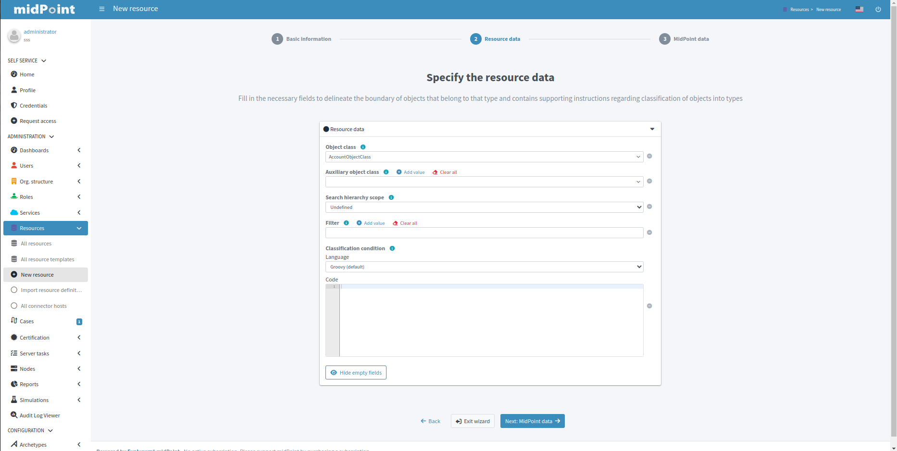
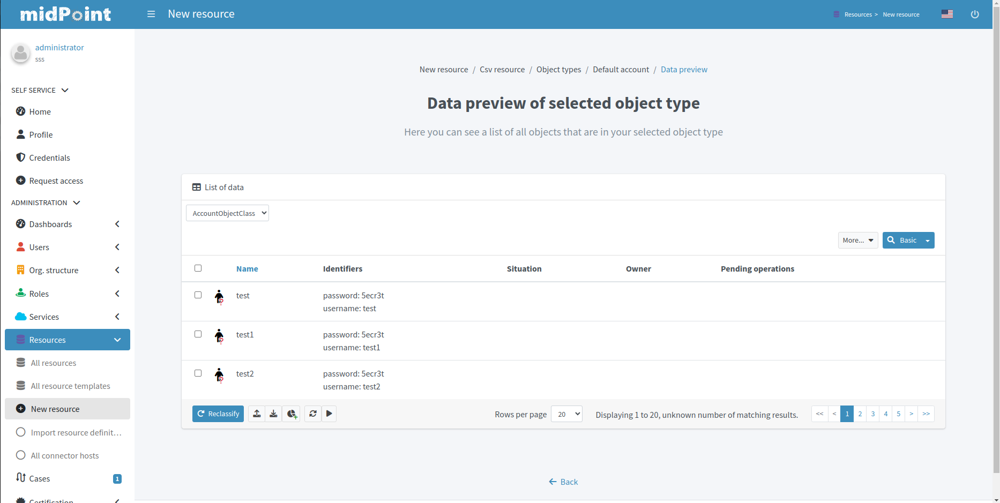
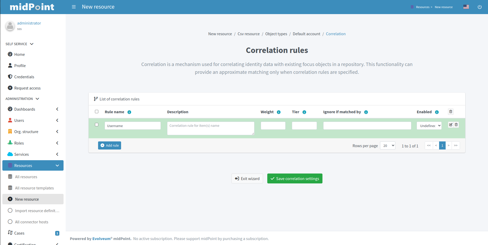
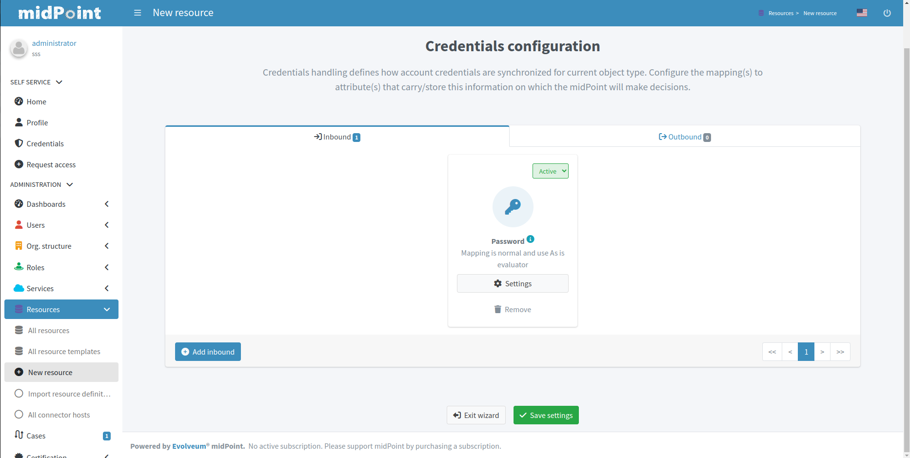

= Resource wizard
:experimental:
:page-toc: top
:page-since: "4.6"
:page-since-improved: [ "4.8" ]

== Introduction

Resource wizard allows to easily create and update resource configuration.
No midPoint XML language is needed, the configuration is entirely UI-based.

The new UI takes form of panels with choices for specific parts of resource configuration.
Specific parts of configuration are represented as steps in wizard.

//Resource wizard was completely rewritten and redesigned in midPoint version 4.6.
//It was further enhanced in midPoint 4.8.
Screenshots below corresponding with midPoint version 4.8.

If you would like to see the resource wizard in action, please watch our Resource Wizard webinar video:

video::-JUXHMGrFyI[youtube,title="Resource Wizard Webinar Video"]

If you would like to see the resource wizard used as a part of xref:/midpoint/methodology/first-steps/[First Steps Methodology] webinar video, please watch our First Steps Methodology video:

video::suo775ym_PE[youtube,title="First Steps Methodology Webinar Video"]

== Resource creation

To create resource, navigate to menu:Resources[New resource].

There are the following possibilities:

. *Inherit Template* - the new resource will be based on a pre-existing resource template. The new resource will _inherit_ the configuration.
. *From Scratch* - you will need to configure all aspects of the resource
. *Copy From Template* - the new resource will be based on a pre-existing resource template. The new resource will be created as a copy of that template.

image::step-1-type-of-resource.png[link=step-1-type-of-resource.png,100%, title=Type of resource]

Selecting *From Scratch* option leads to a Resource catalog page:

image::step-1-resource-catalog.png[link=step-1-connector-conf-discovery.png,100%, title=Resource catalog]

Click the connector tile you want to use to start the resource creation wizard.

.See also the following pages for more information:
* For general advice on using stock connectors in midPoint, please see xref:/midpoint/reference/resources/connector-setup/[Connector Setup]
* For connector developers and engineers using custom connectors xref:/midpoint/reference/resources/connid/[Using ConnId Connectors in midPoint] might be important
* xref:/connectors/connectors/[List of Identity Connectors] known to work with midPoint

== Basic configuration

Enter basic configuration such as resource *Name* and *Description* here.

*Lifecycle state* is a new property since midPoint 4.8.
It allows you to create preliminary resource configuration that will not be active, but can be used for xref:/midpoint/reference/admin-gui/simulations/[Simulations].
The default value is `Proposed`.

Click btn:[Next] to continue the resource configuration.

If the connector supports _discovery_ operation, resource wizard will ask you for mandatory configuration parameters to be able to detect the others, e.g. path to a CSV file for CSV file connector.

.See also the following pages for more information:
* Familiarize yourself with the concept of xref:/midpoint/reference/admin-gui/simulations/[Simulations]
* xref:https://docs.evolveum.com/midpoint/reference/concepts/object-lifecycle/[Object Lifecycle] (at least to understand the basics of lifecycle states)

Click btn:[Next] to start discovery process and continue the resource configuration.

All other resource configuration properties can be configured now, e.g. CSV file field delimiter or a CSV file unique identifier column.
Some of the properties are already preconfigured by the connector.
Some of them allow suggestions of appropriate values using an autocompletion, e.g. when selecting which column should be used as a unique identifier of the row, the wizard suggests the CSV file columns as detected by the connector in the discovery step.

image::step-1-discovered-config.png[link=step-1-discovered-config.png, 100%, title=Discovered configuration]

Click btn:[Next] to continue the resource configuration.

Connector will return possible object types and their attributes (_schema_ and its _object classes_).
Confirm the detected configuration.

image::step-1-schema.png[link=step-1-schema.png, 100%, title=Schema]

Click btn:[Create resource] to create the resource and store it in midPoint repository.
Further configuration is required.
You can choose your next step:

* Preview Resource Data
* Configure Object Types
* Go To Resource

image::choice-part-resource.png[link=choice-part-resource.png,100%,title=Resource created - next steps]

Clicking *Preview Resource Data* tile will display the data (e.g. accounts) in the source/target system configured as resource.
You can display the data even before providing configuration for its processing.

image::data-preview-resource.png[link=data-preview-resource.png,100%,title=Resource Data preview]

Clicking *Configure Object Types* allows you to <<Object type configuration,configure the Object type(s)>>.

Clicking *Go To Resource* leads to the resource details page.

== Object type configuration

In this part of resource configuration, you can configure the object types for xref:/midpoint/reference/resources/resource-configuration/schema-handling/[Schema handling], essentially defining the behavior of midPoint with respect to the resource.
One or multiple object types can be defined, based on the source/target system characteristics.
For example, CSV resource contains typically a single object type (e.g. accounts) while LDAP resource can contain more than one object type (e.g. accounts and groups).

Click btn:[Add object type] to create a new object type definition using Object type configuration wizard.

=== Basic attributes

Define the basic information about the object type:

* *Display name* will be displayed in midPoint as a reference to this object type configuration
* *Kind* is either `Account`, `Entitlement` or `Generic`. For accounts, please select `Account`.
* *Intent* is used when you would like to use more than one different object _types_, e.g. standard and administrative accounts. Keep the default (empty) value if you want to work with just one type of accounts.
* *Default* specifies if the intent provided in the previous value should be used as the default value in case you define multiple intents. Select `True` if you are using only a single intent / one type of accounts.

image::step-2-object-type-basic-config.png[link=step-2-object-type-basic-config.png, 100%, title=Basic configuration of object type]

.See also the following pages for more information:
* xref:/midpoint/reference/resources/shadow/kind-intent-objectclass/[]

Click btn:[Next: Resource data] to continue the object type configuration.

Define the resource-specific configuration for this object type:

* *Object class* is one of the object classes (types) supported by the connector for the source/target system represented as this resource. For resources supporting only a single object class (e.g. CSV) this will be displayed as `AccountObjectClass` and set as default by the wizard.
* *Filter* allows to define a classification via midPoint xref:/midpoint/reference/concepts/query/midpoint-query-language/[query language]
* *Classification condition* allows to define a classification condition (midPoint expression, not query)

TIP: Classification allows to limit which resource data (e.g. accounts) are considered part of this object type definition.
An example of *Filter* usage: CSV file entries matching query `attributes/contractType != "Incognito"` should be considered as accounts, all other should be ignored.

NOTE: You do not need to use the classification at all. If unsure, do not use it.

.See also the following pages for more information:
* xref:/midpoint/reference/resources/resource-configuration/schema-handling/changes-in-4.6/#resource-object-type-delineation[Resource Object Type Delineation]

// TODO TODO we do not have better Delination example! I have created https://jira.evolveum.com/browse/MID-9404 to track this

Click btn:[Next: MidPoint Data] to continue the object type configuration.

Define the midPoint-specific configuration for this object type:

* *Type* defines type of midPoint object that will correspond to the resource object (e.g. `User`). midPoint will respect this setting when creating a new midPoint object from this object type data on the resource.
* *Archetype* allows selection of archetype that will be automatically assigned for all midPoint objects created from this object type data on the resource. The same archetype will be also used as a part of correlation, i.e. enforced.
+
If unsure, keep Archetype empty.

.See also the following pages for more information:
* overview of xref:/midpoint/reference/schema/archetypes/[Archetypes]
* built-in xref:/midpoint/reference/schema/archetypes/person/[Person archetype] ready to be used

image::step-2-object-type-midpoint-data.png[link=step-2-object-type-midpoint-data.png, 100%, title=Midpoint data]

Click btn:[Save settings] to save the object type configuration.
Further configuration is required.
You can choose your next step to configure other parts of your object type configuration:

##TODO add links to content##

* <<Basic attributes>> allows getting back to the basic configuration of your object type
* <<Mappings>> allow to configure resource attribute mappings
* <<Synchronization>>
* <<Correlation>>
* <<Capabilities>>
* <<Activation>>
* <<Credentials>>
* <<Associations>>

image::choice-part-object-type.png[link=choice-part-object-type.png,100%,title=Parts of object type configuration]

Or you can click btn:[Preview data] to display resource data according to the configuration of this particular object type you are configuring (considering `Kind`, `Intent`, `Object class` etc.):

.Data preview of object type

=== Mappings

This part of object type wizard allows you to define attribute xref:/midpoint/reference/expressions/mappings/[mappings].
This way you can define midPoint behavior for resource attributes: how the resource attributes values should be fetched to midPoint (xref:/midpoint/reference/expressions/mappings/inbound-mapping/[inbound mappings]) or how the resource attribute values should be populated in resource (xref:/midpoint/reference/expressions/mappings/outbound-mapping/[outbound mappings]).

Click either *Inbound mappings* or *Outbound mappings* header in the table of mappings.

.See also the following pages for more information:
* xref:/midpoint/reference/resources/resource-configuration/schema-handling/[Resource Schema Handling]
* xref:/midpoint/reference/expressions/mappings/[Mappings]
* xref:https://docs.evolveum.com/midpoint/reference/support-4.8/expressions/[MidPoint Expressions and Mappings]
* xref:/midpoint/reference/expressions/mappings/inbound-mapping/[Inbound mappings]
* xref:/midpoint/reference/expressions/mappings/outbound-mapping/[Outbound mappings]

==== Inbound mappings

Use xref:/midpoint/reference/expressions/mappings/inbound-mapping/[inbound mappings] to store resource attribute values in midPoint properties.

Click btn:[Add inbound] to add a new inbound mapping.

To define a mapping, you need to configure:

* *Name* of the mapping. This is technically not mandatory, but helps a lot during troubleshooting and when using resource template inheritance.
* *From resource attribute* allows you to type (with autocompletion) the resource attribute that should be used as a source of the mapping.
* *Expression* specifies how the source attribute(s) should be used. Resource wizard support the following xref:/midpoint/reference/expressions/expressions/[expression types]:
** *As is* (default) simply copies the value from resource attribute to midPoint target property
** *Literal* allows to specify a constant value
** *Script* allows to write a more complex behavior using a xref:/midpoint/reference/expressions/expressions/[midPoint expression] (by default in Groovy language)
** *Generate* allows to generate a random string using a value policy (useful for generating passwords)
* *Target* allows you to type (with autocompletion) the midPoint property that should be used to store the value generated by the inbound mapping
* *Lifecycle state* allows you to define the lifecycle state of the mapping. This can be used during xref:/midpoint/reference/admin-gui/simulations/[Simulations], e.g. specifying lifecycle state as `Proposed` will be used only to simulate the mapping, `Draft` disables the mapping etc.

image::step-3-mappings-inbound.png[link=step-3-mappings-inbound.png, 100%, title=Table of inbound mappings]

TIP: Adding new mappings to existing configuration can utilize simulations if you use `Proposed` as the new mappings' lifecycle state. Such mappings can be simulated without influencing the real data.

More complex configuration is possible by clicking btn:[Edit] button:

[%autowidth, cols="a,a", frame=none, grid=none, role=center]
|===
| image::step-3-mappings-inbound-detail-main.png[link=step-3-mappings-inbound-detail-main.png, 100%, title=Main configuration of inbound mapping (complex view)]
| image::step-3-mappings-inbound-detail-optional.png[link=step-3-mappings-inbound-detail-optional.png, 100%, title=Optional configuration of inbound mapping (complex view)]
|===

Mapping can be deleted by clicking btn:[Delete] button.

Mappings can be saved by clicking btn:[Save mappings] and wizard will return to the previous page from which you started mapping editor.

Click btn:[Attribute overrides] if you need to xref:https://docs.evolveum.com/midpoint/reference/support-4.8/resources/resource-configuration/schema-handling/#attribute-definitions[override attribute(s) visibility or other behavior].

==== Outbound Mappings

Use xref:/midpoint/reference/expressions/mappings/outbound-mapping/[outbound mappings] to populate resource attribute values from midPoint properties.

Click btn:[Add outbound] to add a new outbound mapping.

To define a mapping, you need to configure:

* *Name* of the mapping. This is technically not mandatory, but helps a lot during troubleshooting and when using resource template inheritance.
* *Source* allows you to type (with autocompletion) the midPoint property that should be used as a source for this outbound mapping
+
TIP: Even multiple source attributes can be defined for an outbound mapping.
* *Expression* specifies how the source attribute(s) should be used. Resource wizard support the following xref:/midpoint/reference/expressions/expressions/[expression types]:
** *As is* (default) simply copies the value from resource attribute to midPoint target property
** *Literal* allows to specify a constant value
** *Script* allows to write a more complex behavior using a xref:/midpoint/reference/expressions/expressions/[midPoint expression] (by default in Groovy language)
** *Generate* allows to generate a random string using a value policy (useful for generating passwords)
* *To resource attribute* allows you to type (with autocompletion) the resource attribute that should be used as a target of the mapping.
* *Lifecycle state* allows you to define the lifecycle state of the mapping. This can be used during xref:/midpoint/reference/admin-gui/simulations/[Simulations], e.g. specifying lifecycle state as `Proposed` will be used only to simulate the mapping, `Draft` disables the mapping etc.

image::step-3-mappings-outbound.png[link=step-3-mappings-outbound.png, 100%, title=Table of outbound mappings]

TIP: Adding new mappings to existing configuration can utilize simulations if you use `Proposed` as the new mappings' lifecycle state. Such mappings can be simulated without influencing the real data.

More complex configuration is possible by clicking btn:[Edit] button:

[%autowidth, cols="a,a", frame=none, grid=none, role=center]
|===
| image::step-3-mappings-outbound-detail-main.png[link=step-3-mappings-outbound-detail-main.png, 100%, title=Main configuration of outbound mapping (complex view)]
| image::step-3-mappings-outbound-detail-optional.png[link=step-3-mappings-outbound-detail-optional.png, 100%, title=Optional configuration of outbound mapping (complex view)]
|===

Mapping can be deleted by clicking btn:[Delete] button.

Mappings can be saved by clicking btn:[Save mappings] and wizard will return to the previous page from which you started mapping editor.

Click btn:[Attribute overrides] if you need to xref:https://docs.evolveum.com/midpoint/reference/support-4.8/resources/resource-configuration/schema-handling/#attribute-definitions[override attribute(s) visibility or other behavior].

==== Attribute override

Attribute configuration can be xref:https://docs.evolveum.com/midpoint/reference/support-4.8/resources/resource-configuration/schema-handling/#attribute-definitions[overridden] beyond the context of the mappings.
This is useful to override attribute visibility, its display name, tolerance etc.

{empty} +
[%autowidth, cols="a,a", frame=none, grid=none, role=center]
|===

2+| image::step-3-mappings-override.png[link=step-3-mappings-override.png, 100%, title=Table of attribute overrides]

| image::step-3-mappings-override-detail-basic.png[link=step-3-mappings-override-detail-basic.png, 100%, title=Detailed configuration of attribute override configuration]
| image::step-3-mappings-override-detail-limitations.png[link=step-3-mappings-override-detail-limitations.png, 100%, title=Detailed configuration of attribute override - limitations configuration]
|===

=== Synchronization

This part of object type wizard allows you to define xref:/midpoint/reference/synchronization/situations/[synchronization situations and reactions].
These situations represent state of the resource object (e.g. account) in relation to midPoint and appropriate action that should be executed by midPoint.

For the situations you need to configure:

* *Name* of the situation/reaction configuration. This is technically not mandatory, but helps a lot during troubleshooting and when using resource template inheritance.
* *Situation* allows you to select an appropriate situation:
** *Linked*
** *Unlinked*
** *Deleted*
** *Unmatched*
** *Disputed*
* *Action* allows you to select midPoint behavior if the resource object is in the defined Situation
** *Add focus* allows to create a new object in midPoint based on the resource data
** *Synchronize* allows to synchronize data between midPoint object and resource data based on the mappings
** *Link* allows to link previously not linked resource object to midPoint object
** *Delete resource object* allows to delete resource object
** *Inactivate resource object* allows to inactivate (disable) resource object
** *Inactivate focus* allows to inactivate (disable) midPoint object
** *Delete focus* allows to delete midPoint object
* *Lifecycle state* allows you to define the lifecycle state of the situation/reaction configuration. This can be used during xref:/midpoint/reference/admin-gui/simulations/[Simulations], e.g. specifying lifecycle state as `Proposed` will be used only to simulate the synchronization/reaction configuration, `Draft` disables the synchronization/reaction configuration etc.

TIP: Please refer to xref:/midpoint/reference/schema/focus-and-projections/[Focus and Projections] for explanation of the term _Focus_. In the most basic scenarios when synchronizing users and their accounts, _focus_ corresponds to User object in midPoint.

image::step-4-synch.png[link=step-4-synch.png,100%,title=Table of synchronization actions]

More complex configuration is possible by clicking btn:[Edit] button:

[%autowidth, cols="a,a", frame=none, grid=none, role=center]
|===
| image::step-4-synch-detail-basic.png[link=step-4-synch-detail-basic.png, 100%, title=Basic configuration of synchronizatio rule]
| image::step-4-synch-detail-action.png[link=step-4-synch-detail-action.png, 100%, title=Action for synchronization rule]

| image::step-4-synch-detail-optional.png[link=step-4-synch-detail-optional.png, 100%, title=Optional attributes for synchronization rule]
|
|===

Situation/reaction configuration can be deleted by clicking btn:[Delete] button.

// TODO finished 12.1.2024 16:45

=== Correlation

.Table of correlation rules

.Table of correlation items for one correlation rule
image::step-5-correlator-item.png[Table of correlation items for one correlation rule,100%]

=== Capabilities

On the capabilities configuration panel, we can see one tile for each supported capability. Some capability we can only enable or disable, but some contains a configuration container. When a capability contains container, and we click on the capability tile, a container configuration popup will appear.

.Capabilities configuration
image::step-6-capabilities.png[Capabilities configuration,100%]

=== Activation

From version 4.8, midPoint contains GUI support for activation mapping. We can add predefined mappings configuration or use typically mappings. For more information see xref:/midpoint/reference/resources/resource-configuration/schema-handling/activation/#wizard-panels[Resource Schema Handling: Activation].

Details configuration for typically mapping are same as for attribute mappings, so contain main and optional details panel.

==== Inbound

[%autowidth, cols="a,a", frame=none, grid=none, role=center]
|===
| image::step-7-activation-inbounds.png[link=step-7-activation-inbounds.png, 100%, title=Empty inbound table for activation]
| image::step-7-activation-inbound-add.png[link=step-7-activation-inbound-add.png, 100%, title=Popup for adding of new inbound activation mapping]

2+| image::step-7-activation-inbound-full.png[link=step-7-activation-inbound-full.png, 100%, title=Activation table with inbound mapping for administrative status]

|===

==== Outbound

[%autowidth, cols="a,a", frame=none, grid=none, role=center]
|===
| image::step-7-activation-outbounds.png[link=step-7-activation-outbounds.png, 100%, title=Empty outbound table for activation]
| image::step-7-activation-outbound-add.png[link=step-7-activation-outbound-add.png, 100%, title=Popup for adding of new outbound activation mapping]

2+| image::step-7-activation-outbound-full.png[link=step-7-activation-outbound-full.png, 100%, title=Activation table with outbound mapping for administrative status and predefined mappings for 'Disable instead of delete' and 'Delayed delete' configuration]
|===

Predefined mapping configurations contains only one configuration step.

.Predefined details configuration for 'Delayed delete'
image::step-7-predefined-details.png[Predefined details configuration for 'Delayed delete',100%]

=== Credentials

Configuration for credentials contains similar panels as for activation, but contains only one kind of mapping and doesn't contain any predefined mappings.

.Configuration of credentials

=== Associations

.Table of associations
image::step-9-association.png[Table of associations, 100%]

.Detail configuration for association
image::step-9-association-detail.png[Detail configuration for association, 100%]

== Wizard for existing resource

We can use wizard panels to edit existing resource. It's enough if we open the panel for displaying resource objects (accounts/entitlements/generics), select specific object type by intent, click on button 'Configure', and then the buttons for opening the wizard for a specific part of the object type configuration are displayed.

.Resource detail
image::resource-details.png[Resource detail, 100%]

== Configuration of resource wizard panels

Some wizard panels are configurable, for more information see xref:/midpoint/reference/admin-gui/admin-gui-config/#wizard-panels[Wizard panels].

== Limitations

TODO
