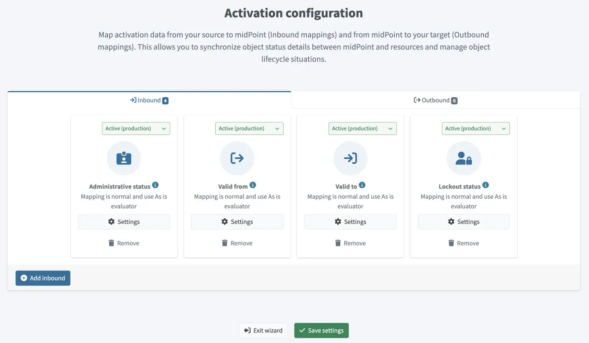
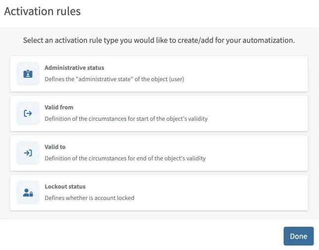
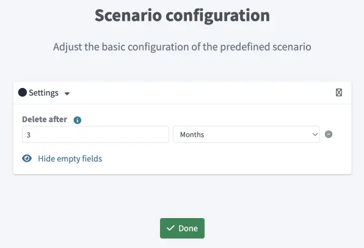
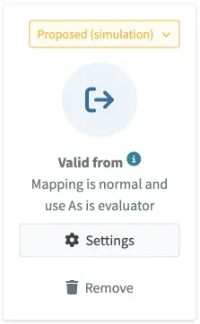

= Resource wizard: Object type activation
:page-nav-title: Activation
:experimental:
:page-toc: top
:page-since: "4.9"
:page-keywords: activation, activation rule, activation rules, inbound activation mapping, outbound activation mapping, administrative status, valid from, valid to, lockout status, disable instead of delete, delayed delete, pre-provision, existence
:page-description: This describes how you can define behavior for activation.

This part of object type wizard allows you to define behavior for _activation_.

== Introduction

The term _activation_ in midPoint denotes a set of properties that describe the activation state of an object (typically a user or an account), such as whether it is enabled or disabled, and any time constraints defining when it should be active.

Activation rules described in this section define how the activation state of resource objects on connected systems should reflect the state of objects in midPoint, and vice versa. They determine when accounts should be enabled, disabled, locked, or deleted.
As the primary targets are typically users and accounts, we will use these terms in the following sections; however, the same principles apply to any object type.

Activation rules allow you to automatically reflect real-world situations, for example, when a new employee joins the organization, when their access must be temporarily suspended during a planned leave, or when someone leaves the organization and their access must be removed.
By defining these rules centrally, access to systems consistently matches the actual status of individuals in the organization.

In modern connectors, activation is handled through the xref:/midpoint/reference/admin-gui/resource-wizard/object-type/capability[_activation_ capability].
If you are using an older or more specialized connector that does not support this capability, or if you need to define more complex activation logic, you can define activation behavior using activation rules which are described at this page.

For more details on the concept of activation, see xref:/midpoint/reference/concepts/activation/[].

[[inbound-activation-rules]]
== Inbound activation rules

Inbound activation rules define how the activation state of objects in midPoint should reflect the state of accounts on connected systems (i.e., connected systems -> midPoint).

To add a new inbound activation rule:

. In [.nowrap]#icon:database[]  *Resources*# > [.nowrap]#icon:database[] *All Resources*#, select your resource.
. In [.nowrap]#icon:male[] *Accounts*#, click [.nowrap]#icon:cog[] btn:[Configure]# > [.nowrap]#icon:toggle-off[] *Activation*#.
. Click [.nowrap]#icon:circle-plus[] btn:[Add inbound]#.
. Select an activation rule type to add.
+

** *Administrative status* is the most common type of activation rule, which allows you to define how the administrative status of an account is reflected between midPoint and connected systems. +
The _source_, _target_, and _expression_ for this rule are implicit, so you may not need to configure this rule further.
By default:
*** For inbound rules, the source is the attribute supported by the connector, and the target is the midPoint's `administrativeStatus` property.
*** For outbound rules, the source is the `effectiveStatus` property, and the target is the attribute supported by the connector.

+
The valid values are _no value_, `enabled`, and `disabled`. +
See xref:/midpoint/reference/concepts/activation/#administrative_status[Administrative status] for more details.
** *Valid from* and *Valid to* allow you to define activation rules based on the validity period of a user.
For example, you can specify that an account should be enabled only during the user's employment period. +
By default:
*** For inbound rules, the source is the attribute supported by the connector, and the target is the midPoint's `validFrom` or `validTo` property.
*** For outbound rules, the source is the `validFrom` or `validTo` property, and the target is the attribute supported by the connector.

+
See xref:/midpoint/reference/concepts/activation/#validity[Validity] for more details.
** *Lockout status* defines if user accounts are locked or unlocked.
This is typically used to automatically lock accounts after a certain number of failed login attempts (for example, to avoid brute-force password attacks) or to reflect the lockout status from an external system. +
The valid values are _no value_, `normal`, and `locked`. +
See xref:/midpoint/reference/concepts/activation/#lockout[Lockout] for more details.

. If you need to define details, such as conditions, for your rule, click [.nowrap]#icon:cog[] btn:[Settings]#, adjust the settings as needed, and save them. +
Activation rules are representations of real schema attributes, i.e., the rule source and target attribute/property are already predefined and in many scenarios, you will not have to do any configuring. +
Some of the activation rules only have one configuration step, such as the outbound *Delayed delete* rule.

+

+
Other rules have more options organized into two configuration steps. +
Their configuration is based on the principles of xref:/midpoint/reference/admin-gui/resource-wizard/object-type/mapping[object type mapping].

. Set the *Lifecycle state* of the rule by selecting it in the drop-down menu, e.g., _Active (production)_. +
This allows you to only xref:/midpoint/reference/admin-gui/simulations/[simulate] the activation rule by setting the lifecycle state to _Proposed (simulation)_, or to disable it by setting it to _Draft_, etc.
+

. Add other rules as needed.
. Click [.nowrap]#icon:check[] btn:[Save settings]# when done to save the changes and return to the resource.

[[outbound-activation-rules]]
== Outbound activation rules

Outbound activation rules define how the activation state of accounts on connected systems should reflect the state of objects in midPoint (i.e., midPoint -> connected systems).

image::activation_outbound_rules.webp[title="Outbound activation rules"]

. In [.nowrap]#icon:database[]  *Resources*# > [.nowrap]#icon:database[] *All Resources*#, select your resource.
. In [.nowrap]#icon:male[] *Accounts*#, click [.nowrap]#icon:cog[] btn:[Configure]# > [.nowrap]#icon:toggle-off[] *Activation*#.
. Click [.nowrap]#icon:circle-plus[] btn:[Add outbound]#.
. Select the type of rule that you want to add:
** *Administrative status* - See <<inbound-activation-rules,inbound activation rules>>.
** *Disable instead of delete* - When an account is unassigned and there is no other existing assignment for the account, midPoint deprovisions the account by _disabling_ it instead of deleting it.
This is useful for auditing purposes, as it allows you to keep the account in the system while preventing its use, or for easier future re-activation of the account if the user returns to the organization. +
See xref:/midpoint/reference/concepts/activation/disable-instead-of-delete[] for more details.
** *Delayed delete* - Sets when an account is actually deleted after it is unassigned and there is no other existing assignment for the account.
This is useful for auditing or legal purposes, but also as a safety measure to prevent accidental deletion of accounts.
** *Pre-provision* - This makes sure accounts are created before their assignments become effective, so they already exist when activation occurs.
This is useful, for example, when provisioning is time-consuming and you want to avoid delays in activation, when you have a more complex provisioning flow and you need accounts to exist so that you can apply attributes or entitlements, or when you simply want to have accounts ready for future activation.
** *Valid from* and *Valid to* - See <<inbound-activation-rules,inbound activation rules>>.
** *Lockout status* - See <<inbound-activation-rules,inbound activation rules>>.
** *Existence* - Defines if an account exists (`true`) or does not exist (`false`).
Effectively, this allows you to delete accounts when they are unassigned (as opposed to the "Disable instead of delete" rule) or to keep accounts even after they are unassigned (as opposed to the "Delayed delete" rule).

. Configure the rule's settings in the same way as for <<inbound-activation-rules,inbound activation rules>>.
. Click [.nowrap]#icon:check[] btn:[Save settings]# when done.
. Set the *Lifecycle state* of the rule by selecting it in the drop-down menu, e.g., _Active (production)_. +
This allows you to only xref:/midpoint/reference/admin-gui/simulations/[simulate] the activation rule by setting the lifecycle state to _Proposed (simulation)_, or to disable it by setting it to _Draft_, etc.

. Add other rules as needed.
. Click [.nowrap]#icon:check[] btn:[Save settings]# when done to save the changes and return to the resource.

include::../../limitation-all.adoc[]

== See also

* xref:/midpoint/reference/resources/resource-configuration/schema-handling/activation/#wizard-panels[Resource Schema Handling: Activation].
* xref:/midpoint/reference/concepts/activation/[Activation]
* xref:/midpoint/reference/resources/resource-configuration/schema-handling/activation/#_predefined_activation_mappings[Predefined Activation Mappings]
* xref:/midpoint/reference/concepts/object-lifecycle[]
* xref:/midpoint/reference/admin-gui/admin-gui-config/#wizard-panels[]