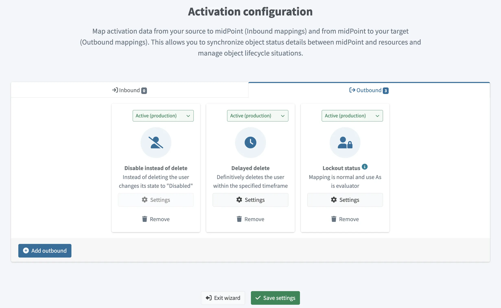

= Resource wizard: Object type activation
:page-nav-title: Activation
:experimental:
:page-toc: top
:page-since: "4.9"
:page-keywords: activation, inbound activation mapping, outbound activation mapping, administrative status, valid from, valid to, lockout status, disable instead of delete, delayed delete, pre-provision, existence
:page-description:

This part of object type wizard allows you to define behavior for _activation_.

== Introduction

Activation settings define how accounts (typically users) on connected systems should behave based on what is happening with the person in the organization.
They determine when accounts should be enabled, disabled, locked, or deleted.

This allows you to automatically reflect real-world situations, for example, when a new employee joins the organization, when their access must be temporarily suspended during a planned leave, or when someone leaves the organization and their access must be removed.
By defining these rules centrally, access to systems consistently matches the actual status of individuals in the organization.

In modern connectors, activation is handled through the xref:/midpoint/reference/admin-gui/resource-wizard/object-type/capability[_activation_ capability].
If you are using an older or more specialized connector that does not support this capability, or if you need to define more complex activation logic, you can define activation behavior using activation mappings which are described at this page.

For more details on the concept of activation, see xref:/midpoint/reference/concepts/activation/[].

[[inbound-activation-mapping]]
== Inbound activation mapping

image::step-6-activation-inbounds.webp[title="Inbound activation mapping"]

To add a new inbound activation mapping:

. In [.nowrap]#icon:database[]  *Resources*# > [.nowrap]#icon:database[] *All Resources*#, select your resource.
. In [.nowrap]#icon:male[] *Accounts*#, click [.nowrap]#icon:cog[] btn:[Configure]# > [.nowrap]#icon:toggle-off[] *Activation*#.
. Click [.nowrap]#icon:circle-plus[] btn:[Add inbound]#.
. Select the type of mapping that you want to add:
+

image::activation_inbound.webp[title="Types of inbound activation mappings"]
** *Administrative status* is the most common type of mapping, which allows you to define how the administrative status of a user affects the activation status of their accounts on connected systems. +
The valid values are _no value_, `enabled`, and `disabled`. +
See xref:/midpoint/reference/concepts/activation/#administrative_status[Administrative status] for more details.
** *Valid from* and *Valid to* mappings allow you to define activation rules based on the validity period of a user.
For example, you can specify that an account should be enabled only during the user's employment period. +
See xref:/midpoint/reference/concepts/activation/#validity[Validity] for more details.
** *Lockout status* defines if user accounts are locked or unlocked.
This is typically used to automatically lock accounts after a certain number of failed login attempts (for example, to avoid brute-force password attacks) or to reflect the lockout status from an external system. +
The valid values are _no value_, `normal`, and `locked`. +
See xref:/midpoint/reference/concepts/activation/#lockout[Lockout] for more details.

. Click [.nowrap]#icon:cog[] btn:[Settings]# to configure the mapping details.
Some of the mappings are predefined and have only one configuration step, such as the outbound *Delayed delete* mapping:

+
image::activation_delayed_delete.webp[title="Predefined 'Delayed delete' mapping"]
+
Other mappings have more options and two configuration steps described in the following points.
. At the Main configuration page, configure the following and click [.nowrap]#btn:[Next:Optional] icon:arrow-right[]# to proceed to the next step (the options in this step are, for the most part, the same as for <<outbound-activation-mapping,outbound activation mapping>>, but the source and target are different):
** *Name*: Name your mapping descriptively.
    This is convenient during troubleshooting and when using xref:/midpoint/reference/resources/resource-configuration/inheritance/[resource template inheritance].
** *Strength*: Define how aggressively the mapping is applied.
    Refer to xref:/midpoint/reference/expressions/mappings/#_mapping_strength[] for details.
** *Source*: Select a property/attribute to be used as an input for the mapping. +
For outbound mapping, this is typically the `effectiveStatus`, or a property derived from it.
** *Expression*: Select how to handle the source attribute value.
    Refer to xref:/midpoint/reference/expressions/expressions/#expression-evaluators[] for more details.
    *** _As is_ (default): Copy values without changes.
    *** _Literal_: Specify one or more constant values upon clicking btn:[Show values].
    *** _Script_: Define a more complex behavior using a script upon clicking btn:[Show script].
    *** _Path_: Reference a property or a variable upon clicking btn:[Show path].
** *Target*: Select a midPoint property in which to store the mapping output. +
For inbound mapping, this is typically the activation administrativeStatus or a property derived from it.
** *Condition*: Control the mapping usage dynamically with a custom script in which you can define a specific xref:/midpoint/reference/expressions/mappings/condition/[condition].
The mapping is used when the condition evaluates to `true`. +
For example, you may want to apply your mapping only if a user has a specific role or status.

. At the Optional configuration step, configure the following and click [.nowrap]#icon:check[] btn:[Done]# to save your changes (the options in this step are, for the most part, the same as for <<outbound-activation-mapping,outbound activation mapping>>, but the source and target are different):
** *Description*: Describe the mapping for better understanding of its purpose.
** *Authoritative*: Control whether the mapping can remove values.
    An authoritative mapping is allowed to delete values that it previously wrote, while a non‑authoritative mapping never removes anything it has added.
    Refer to xref:/midpoint/reference/expressions/mappings/#authoritative[] for details.
** *Exclusive*: Define how many mappings may handle the target property:
    ** _True_: The mapping is exclusive to the selected target property.
        Using the same target property in a different mapping will cause an error.
    ** _False_: You can use the selected target property in other mappings as well (default).
** *Channel*: Limit the mapping to a specific xref:/midpoint/reference/concepts/channel.adoc[channel].
If empty, the mapping applies to all channels.
** *Except channel*: Define a channel in which the mapping is _not_ applied.

. Set the *Lifecycle state* of the mapping by selecting it in the drop-down menu, e.g., _Active (production)_. +
This can be used during xref:/midpoint/reference/admin-gui/simulations/[Simulations], e.g., specifying lifecycle state as `Proposed` will be used only to simulate the activation mapping, `Draft` disables the activation mapping, etc.
+

image::activation_mapping_valid_from.webp[title="Lifecycle state selection in the activation mapping configuration"]
. Add other mappings as needed.
. Click [.nowrap]#icon:check[] btn:[Save settings]# when done to save the changes and return to the resource.

[[outbound-activation-mapping]]
== Outbound activation mapping

. In [.nowrap]#icon:database[]  *Resources*# > [.nowrap]#icon:database[] *All Resources*#, select your resource.
. In [.nowrap]#icon:male[] *Accounts*#, click [.nowrap]#icon:cog[] btn:[Configure]# > [.nowrap]#icon:toggle-off[] *Activation*#.
. Click [.nowrap]#icon:circle-plus[] btn:[Add outbound]#.
. Select the type of mapping that you want to add:
** *Administrative status* - Same as for <<inbound-activation-mapping,inbound activation mapping>>.
** *Disable instead of delete* - When an account is unassigned and there is no other existing assignment for the account, midPoint deprovisions the account by _disabling_ it instead of deleting it.
This is useful for auditing purposes, as it allows you to keep the account in the system while preventing its use, or for easier future re-activation of the account if the user returns to the organization. +
See xref:/midpoint/reference/concepts/activation/disable-instead-of-delete[] for more details.
** *Delayed delete* - Sets when an account is actually deleted after it is unassigned and there is no other existing assignment for the account.
This is useful for auditing or legal purposes, but also as a safety measure to prevent accidental deletion of accounts.
** *Pre-provision* - This makes sure accounts are created before their assignments become effective, so they already exist when activation occurs.
This is useful, for example, when provisioning is time-consuming and you want to avoid delays in activation, when you have a more complex provisioning flow and you need accounts to exist so that you can apply attributes or entitlements, or when you simply want to have accounts ready for future activation.
** *Valid from* and *Valid to* - Same as for <<inbound-activation-mapping,inbound activation mapping>>.
** *Lockout status* - Same as for <<inbound-activation-mapping,inbound activation mapping>>.
** *Existence* - Defines if an account exists (`true`) or does not exist (`false`).
Effectively, this allows you to delete accounts when they are unassigned (as opposed to the "Disable instead of delete" mapping) or to keep accounts even after they are unassigned (as opposed to the "Delayed delete" mapping).

. Configure the mapping's settings in the same way as for <<inbound-activation-mapping,inbound activation mapping>>.
. Click [.nowrap]#icon:check[] btn:[Save settings]# when done.
. Set the *Lifecycle state* of the mapping by selecting it in the drop-down menu, e.g., _Active (production)_. +
This can be used during xref:/midpoint/reference/admin-gui/simulations/[Simulations], e.g., specifying lifecycle state as `Proposed` will be used only to simulate the activation mapping, `Draft` disables the activation mapping, etc. 

. Add other mappings as needed.
. Click [.nowrap]#icon:check[] btn:[Save settings]# when done to save the changes and return to the resource.

include::../../limitation-all.adoc[]

== See also

* xref:/midpoint/reference/resources/resource-configuration/schema-handling/activation/#wizard-panels[Resource Schema Handling: Activation].
* xref:/midpoint/reference/concepts/activation/[Activation]
* xref:/midpoint/reference/resources/resource-configuration/schema-handling/activation/#_predefined_activation_mappings[Predefined Activation Mappings]
* xref:/midpoint/reference/concepts/object-lifecycle[]
* xref:/midpoint/reference/admin-gui/admin-gui-config/#wizard-panels[]