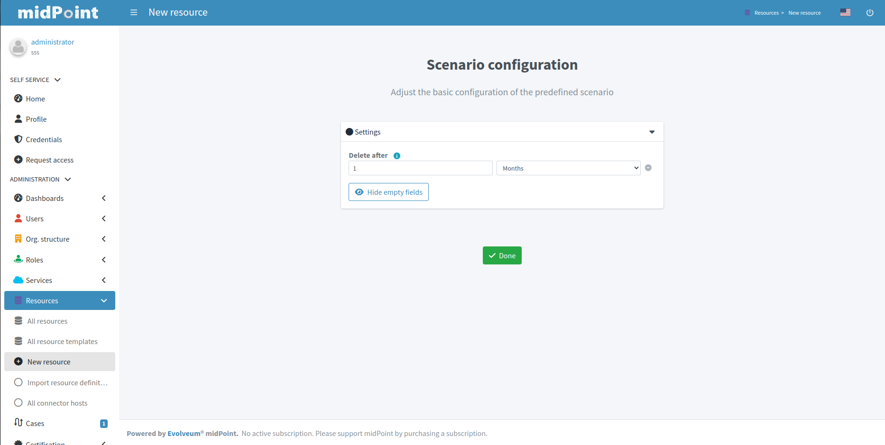

= Resource wizard: Object type activation
:page-nav-title: Activation
:experimental:
:page-toc: top
:page-since: "4.9"

This part of object type wizard allows you to define behavior for xref:/midpoint/reference/concepts/activation/[].
This extends far beyond a simple definition of account being enabled or disabled.

Starting with version 4.8, midPoint contains GUI support for activation mappings.
We can use predefined mappings (rules) for many interesting situations.
//, or we can add standard activation mappings, where the GUI is the same as in xref:/midpoint/reference/admin-gui/resource-wizard/#mappings[Mappings section of object type wizard].

.See also the following pages for more information:
* xref:/midpoint/reference/resources/resource-configuration/schema-handling/activation/#wizard-panels[Resource Schema Handling: Activation].
* xref:/midpoint/reference/concepts/activation/[Activation]
* xref:/midpoint/reference/resources/resource-configuration/schema-handling/activation/#_predefined_activation_mappings[Predefined Activation Mappings]

== Inbound activation mappings

The table contains the list of inbound activation mappings.

Click btn:[Add inbound] to add a new inbound activation mapping.

In the popup, specify the activation rule (predefine behavior), e.g. "Administrative status".
Then configure details for mapping as appropriate for the activation scenario.

[%autowidth, cols="a,a", frame=none, grid=none, role=center]
|===
| image::step-6-activation-inbound-add.png[link=step-6-activation-inbound-add.png, 100%, title=Popup for adding of new inbound activation mapping]
| image::step-6-activation-inbound-full.png[link=step-6-activation-inbound-full.png, 100%, title=Activation table with inbound mapping for administrative status]

|===

Each mapping also allows setting *Lifecycle state*.
This can be used during xref:/midpoint/reference/admin-gui/simulations/[Simulations], e.g. specifying lifecycle state as `Proposed` will be used only to simulate the activation mapping, `Draft` disables the activation mapping etc.

Click btn:[Save mappings] when done to return to the previous page from which you started the activation editor.

== Outbound activation mappings

The table contains the list of outbound activation mappings.

Click btn:[Add outbound] to add a new outbound activation mapping.

In the popup, specify the activation rule (predefine behavior), e.g. "Administrative status" or "Disable instead of delete".
Then configure details for mapping as appropriate for the activation scenario.

[%autowidth, cols="a,a", frame=none, grid=none, role=center]
|===
| image::step-6-activation-outbound-add.png[link=step-6-activation-outbound-add.png, 100%, title=Popup for adding of new outbound activation mapping]
| image::step-6-activation-outbound-full.png[link=step-6-activation-outbound-full.png, 100%, title=Activation table with outbound mapping for administrative status and predefined mappings for 'Disable instead of delete' and 'Delayed delete' configuration]
|===

Predefined mapping configurations contain only one configuration step.

.Predefined details configuration for 'Delayed delete'

Each mapping also allows setting *Lifecycle state*.
This can be used during xref:/midpoint/reference/admin-gui/simulations/[Simulations], e.g. specifying lifecycle state as `Proposed` will be used only to simulate the activation mapping, `Draft` disables the activation mapping etc.

Click btn:[Save settings] when done to return to the previous page from which you started the activation editor.

include::../../configuration-resource-panels.adoc[]

include::../../how-to-use-lifecycle-state.adoc[]

include::../../limitation-all.adoc[]
