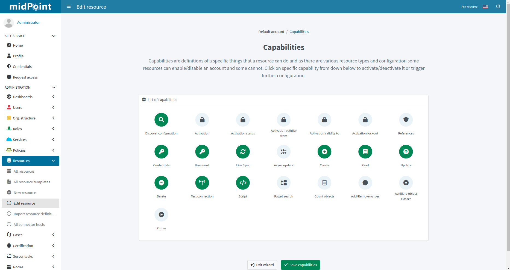

= Resource wizard: Object type capabilities
:page-nav-title: Capabilities
:page-toc: top
:page-since: "4.9"

Capabilities panel informs you about the supported capabilities for the resource with selected connector and allows to override them.
Capabilities can be simply _disabled_, e.g. disable operation can be disabled for this resource object type.
This does not require any change in the connector.

Capabilities can be also _configured_, e.g. for LDAP resources, you can define which account attribute is used to set/indicate the status of the account.

TIP: Capabilities can be configured also on the resource level, not just for specific object types by navigating to resource's *Details* panel.

.Capabilities configuration

Click btn:[Save capabilities] when done to return to the previous page from which you started the capabilities editor.
