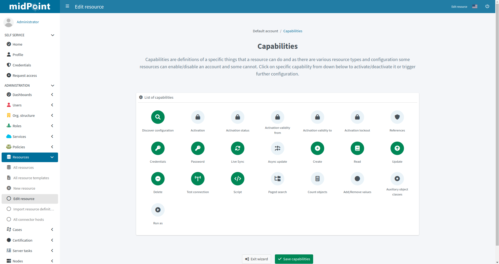

= Resource wizard: Object type capabilities
:page-nav-title: Capabilities
:page-toc: top
:page-since: "4.9"
:experimental:
:page-keywords: capabilities, object type capabilities, resource capabilities, resource configuration, resource wizard
:page-description: This page describes the capabilities that can be configured for an object type in midPoint GUI.

== Introduction

Object type capabilities define what operations and behaviors are supported for a specific object type within a resource.
They describe the functional contract between midPoint and the resource, determining which actions can be executed (such as read, create, update, delete, or synchronization-related operations) and how those actions behave.

Each capability represents a particular aspect of resource functionality.
Some can only be turned on/off, while others can be configured to reflect real-world constraints or requirements.

This is a midPoint GUI guide.
For more technical details about capabilities, see xref:/midpoint/reference/resources/resource-configuration/capabilities/[].

== Capabilities levels

In midPoint, capabilities are defined at the following levels:

* *Resource* - These capabilities apply to all object types within a resource. +
You can access them by going to [.nowrap]#icon:database[] btn:[Resources]# > [.nowrap]#icon:database[] btn:[All resources]# > _resource_ > [.nowrap]#icon:info[] btn:[Details]#.
* *Object type* - These capabilities apply only to a specific object type within a resource. +
You can access them in your resource by going to [.nowrap]#icon:gears[] btn:[Schema handling]# > [.nowrap]#icon:exchange-alt[] btn:[Object types]# > _object type_ > [.nowrap]#icon:atom[] btn:[Capabilities]#.

This two-level structure allows for a flexible and granular configuration of capabilities, enabling you to tailor the behavior of each object type while maintaining a consistent baseline defined at the resource level. +
For example, you can have a read-only resource in which you have separate object types for external and internal accounts, where the external accounts are read-only, while the internal accounts support all operations.
In such a scenario, you would disable the update and delete capabilities at the resource level, and then enable them for the internal accounts object type. 

== Configure capabilities

.Capabilities configuration

The capabilities panel informs you about the supported capabilities for the resource/object type with the selected connector, and allows you to override them.
Capabilities can be simply _disabled_ without requiring any changes in the connector.

The capabilities that are supported by the connector natively (i.e., are implemented directly in the connector, not emulated or approximated by midPoint) are enabled (green) when you first create a new resource or object type, and you can disable them if you do not want to use them. +
Various connectors support different capabilities natively.

[TIP]
====
* To find out if a capability is supported natively at a later point, see if it is listed in the `capabilities/native` section of the resource XML.
Open the resource XML by clicking [.nowrap]#icon:edit[] btn:[Edit raw]# button in the resource header, and look for the `capabilities` section. +
* In various drop-down menus in the Capabilities configuration, native values are represented by the _Undefined_ option.
====

While some capabilities can only be enabled/disabled, others can be configured to reflect specific requirements or constraints of the resource.
These are the capabilities that can be configured:

* *Activation* - Enables the activation capability, i.e., the ability to control the lifecycle state of objects, such as if objects are enabled/disabled, their validity and lockout status. +
This is a wrapper that includes the *Activation status*, *Activation validity from/to*, and *Activation lockout* capabilities, which are only relevant if the activation capability is enabled.
It enables you to enable/disable the entire activation capability with one switch.
* *Activation status* - Further defines the activation capability by specifying the attribute used to determine the activation status of an account. +
** *Enabled* - Set to _True_ to enable this capability.
** *Returned by default* - Set to _True_ to include this attribute in the default set of attributes returned by the resource. +
See xref:/connectors/connectors/com.evolveum.polygon.connector.ldap.ad.AdLdapConnector/#_attributes_not_returned_by_default[].
** *Attribute* - Defines the name of the attribute that stores the information about the activation status of an account.
** *Enable value* - Defines the value of the attribute that indicates that the account is enabled.
** *Disable value* - Defines the value of the attribute that indicates that the account is disabled.
** *Ignore attribute* - When set to _True_, sets the original *Attribute* to ignored in the schema (*Attribute* must be defined), which means that midPoint will not read this attribute from the resource and it will not return it in the output.
The original attribute will then be used through the capability configuration instead of the regular attribute configuration. +
This is used to avoid duplication of the same attribute in the schema.
* *Activation validity from/to* - When enabled, enables midPoint to use the resource's validity timestamps of individual objects (i.e., map them to `activation/validFrom` and `activation/validTo` properties).
Typically, this is used to determine if an account is valid at a given point in time, and to automatically disable accounts that are not valid.
* *Activation lockout* - Facilitates activation lockout management by defining the attribute that indicates whether an account is locked out, and the value that represents the locked-out state. +
This is used, for example, to provide status for accounts that have been locked after a certain number of failed login attempts. +
The available options are the same as for *Activation status* capability.
* *References* - Enables midPoint to manage references on the resource. +
These tell midPoint that a resource attribute represents a relationship (reference) between objects.
This configuration defines how these relationships are interpreted by binding the subject and object ends to specific schema attributes, along with direction and object class information.
* *Credentials* - Enables midPoint to manage credentials on the resource. +
This is a wrapper capability that currently includes only the *Password* capability.
* *Password* - Enables midPoint to manage passwords on the resource. +
You can specify if passwords are *Readable*, i.e., they can be read from the resource, and if they are supposed to be *Returned by default* when reading objects from the resource by setting these options to _True_.
* *Live Sync* - Enables xref:/midpoint/reference/tasks/synchronization-tasks/live-synchronization/[live synchronization], i.e., allows you to detect changes almost in real time. +
By setting *Precise token value* to _True_, you can ensure that the synchronization token value is precise enough to guarantee correct restart of live sync after a change (i.e., a new xref:/midpoint/devel/prism/concepts/deltas/[delta]).
This may be crucial for certain resources to avoid missing changes because some resources may use, for example, timestamps as synchronization tokens, and so they may not distinguish individual changes if those timestamps are not granular enough.
Other resources may use appropriate token values but they may not guarantee correct ordering of changes, which may also lead to missing changes during live sync restart.
* *Read* - Enables reading objects from the resource. +
Set *Caching only* to _True_ if the resource does not have a native read capability but you want to use the data cached by midPoint as read approximation.
This means that midPoint will not read data from the resource for read operations, but it will only return data from its cache, which may be stale.
This is typically only used for debugging or testing purposes when you want to prevent live reads, and it is not recommended for production use. 
Set *Return default attributes* option to _True_ if the resource supports returning a default set of attributes.
This is used to optimize read operations by only retrieving a default set of attributes (determined by the resource) instead of all attributes, which may be costly to retrieve.
* *Update* - Enables updating objects on the resource. +
** Set *Manual* to _True_ if there is no online connection to the resource, i.e., the resource enables you to execute operations asynchronously. +
This is typically used for resources that create a ticket for each update operation, or when operations are executed manually by a human operator.
** Set *Add/Remove attribute values* to _True_ if the resource supports adding and removing individual attribute values.
This is used for multi-valued attributes, and it allows midPoint to optimize update operations by only sending the changes instead of the whole object.
* *Script* - Enables executing scripts on the connector or resource defined in *Host Type* using a specified *Language*.
* *Paged search* - Enable paged searches. +
** You can specify the *Default sort field* that will apply if no sorting is specified by client (i.e., at a higher level).
** Also, in *Default sort direction*, define if the default sorting will be ascending or descending.
* *Count objects* - Enables determining the number of objects on the resource without retrieving them. +
In the *Simulate* dropdown menu, you can choose to simulate this capability using:
** *Paged search estimate* 
** *Sequential search*
// what are these options? Is simulation a workaround for resources that do not support counting objects natively?
* *Behavior*  - This is a wrapper capability that includes other capabilities related to the behavior of the resource.
Currently only the *Last login timestamp* capability is included.
* *Last login timestamp* - Enables the resource to provide the last login timestamp information. +
This is useful for determining inactive accounts and for other purposes related to account management and security. +
This capability is also accessible in the *Behavior* capability.