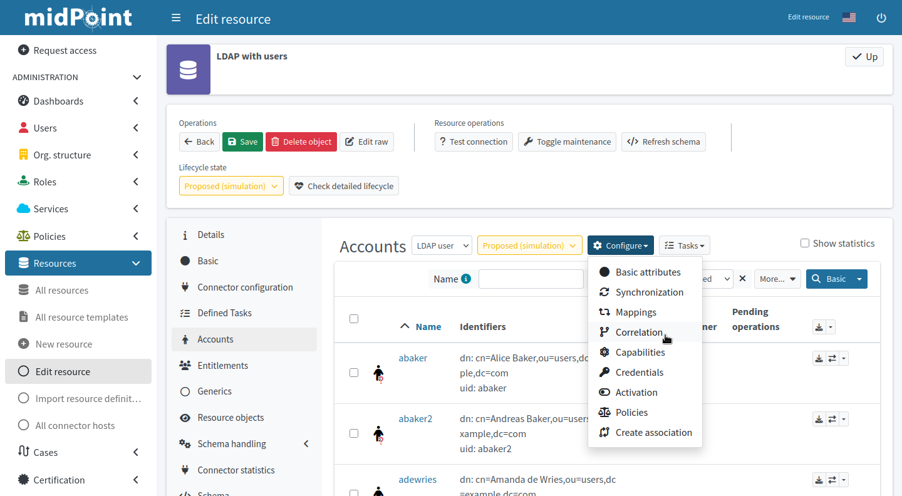
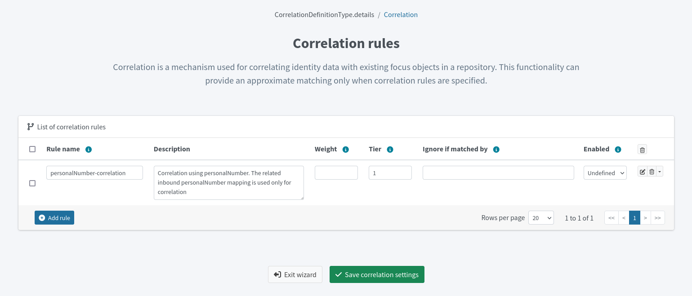
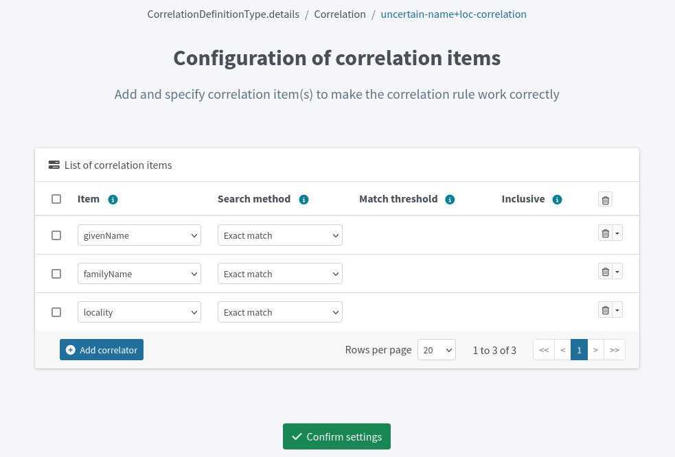

= Resource wizard: Object type correlation
:page-nav-title: Correlation
:page-toc: top
:page-since: "4.9"
:experimental:

Smart correlation in midPoint is a mechanism that links resource object shadows to existing focal objects, enabling efficient synchronization through a configurable matching system.
In short, it's a means of searching for resource object owners in midPoint.

Correlation rules dictate how to find the object owners.
You can define one or more correlation rules.

== Create Correlation Rules

. In icon:database[] *Resources* > icon:database[] *All Resources*, select your resource.
. In icon:male[] *Accounts*, click icon:cog[] btn:[Configure] > icon:code-branch[] *Correlation*.
. Click icon:plus-circle[] btn:[Add rule] and configure the new rule:
    ** *Rule name*: A descriptive name of the rule. Needs to be unique in the context of the resource.
    ** *Description*: An optional detailed description of the rule.
    ** *Weight*: Signifies the rule confidence. 1.0 means 100% confidence.
		The weight is multiplied by the accumulated confidence of individual correlators within the rule to get the final confidence value of the rule. +
		See xref:/midpoint/reference/correlation/rule-composition/#composition-algorithm-outline[] for details.
    ** *Tier*: Tiers dictate the order of rule processing. If and only if the rule doesn't provide confident-enough match, next tier is processed
    ** *Ignore if matched by*: You can block the rule from evaluation if the correlator within the rule is matched in another rule already. 
		This is useful to avoid getting skewed confidence values if multiple rules use the same correlator (e.g., _employeeNumber_), as they would add up and reach confidence over 100%. +
		See xref:/midpoint/reference/correlation/rule-composition/#ignore-if-matched-by-flag[] for details.
    ** *Enabled*: An option to temporarily disable a rule. _Undefined_ is the same as _Enabled_.
. <<set-up-correlators,Set up correlators>> for each rule.
. Click icon:plus-circle[] btn:[Add rule] and repeat until you add all the rules.
. Click icon:check[] btn:[Save correlation settings] to save the rules and exit the wizard.

[[set-up-correlators]]
=== Set up Correlators

For each correlation rule, you need to also add a *correlator*.
Correlators specify the values of which attributes to compare when matching resource and focal objects.
You can have multiple correlators for one correlation rules.
For each correlator, you specify an attribute for which you have an inbound mapping from the resource you're correlating.

For instance, if you have an HR system with employee numbers, and an LDAP system that uses the same employee numbers, you may inbound-map the employee numbers to `empnum` in both the resources and use the `empnum` attribute for correlation.

[TIP]
====
You can use _correlation-only_ xref:/midpoint/reference/admin-gui/resource-wizard/object-type/mapping/[inbound mapping] for target resources where you normally don't use inbound mappings.
// TODO: link to the section about correlation-only mappings after this section is written @dakle 2025-05-20
====

To add correlators for correlation rules:

. Open the list of correlation rules from your resource accounts list via icon:cog[] btn:[Configure] > icon:code-branch[] *Correlation*.
. In the list, click icon:edit[] btn:[Edit] at the far right on a correlation rule for which you want to configure the correlator.
. Click icon:plus-circle[] btn:[Add correlator].
. Under *Item*, select the attribute to correlate.
	** *Item* refers to a midPoint property for which an inbound mapping exists.
		This will be used for correlation.
		For example, if you have an inbound mapping from AD's _sAMAccountName_ attribute to midPoint user's _name_ property, you would select _name_ here.
. Select the *Search method*:
	** _Exact match_: The attribute values need to match exactly for the objects to correlate (get linked, in other words).
	** _Levenshtein distance_: Method of approximate matching with a threshold of the minimum number of single-character edits. Refer to link:https://en.wikipedia.org/wiki/Levenshtein_distance[Levenshtein distance on Wikipedia] for more details about the method.
	** _Trigram similarity_: Method of approximate matching using the ratio of common trigrams to all trigrams in compared strings.
. For the fuzzy-search methods, define *Match threshold* and whether the value is *Inclusive* (in the mathematical sense).
. Click icon:check[] btn:[Confirm settings] to save the correlators and return to the correlation rule list.

.Refer to the following resources for more information:
* xref:/midpoint/reference/correlation/items-correlator/[]
* xref:/midpoint/reference/correlation/[Smart Correlation]

include::../../limitation-corelation.adoc[]
