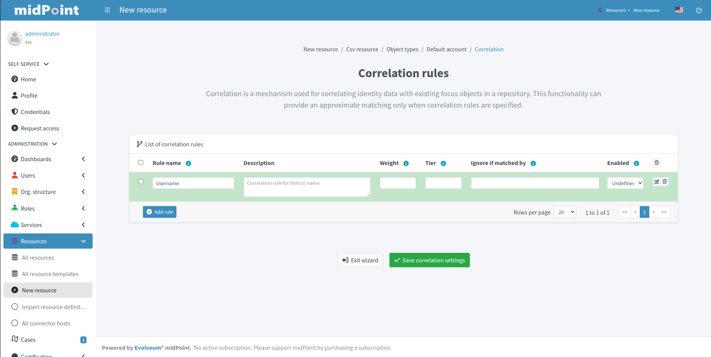
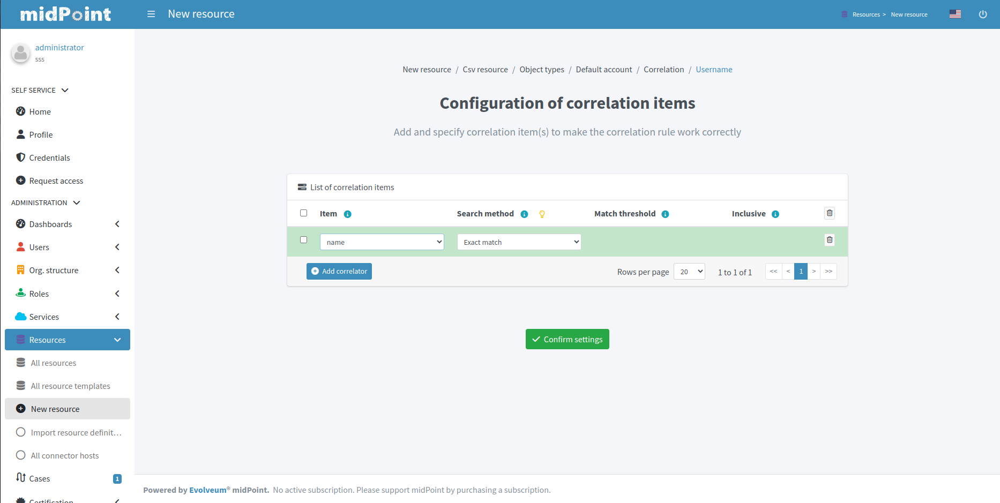

= Resource wizard: Object type correlation
:page-nav-title: Correlation
:page-toc: top
:page-since: "4.9"
:experimental:

Smart correlation in midPoint is a mechanism that links resource object shadows to existing focal objects, enabling efficient synchronization through a configurable matching system.
In short, it's a means to searching resource object owners in midPoint.

Correlation rules dictate how to find the object owners.
You can define one or more correlation rules.

image::corerlation-rules-setup-accounts-configure-menu.webp[title="Configuration menu in resource accounts list as an entry point to the correlation rules wizard"]

== Create Correlation Rules

. In icon:database[] *Resources* > icon:database[] *All Resources*, select your resource.
. In icon:male[] *Accounts*, click icon:cog[] btn:[Configure] > icon:code-branch[] *Correlation*.
. Click icon:plus-circle[] btn:[Add rule] and configure the new rule:
    ** *Rule name*: A descriptive name of the rule. Needs to be unique in the context of the resource.
    ** *Description*: An optional detailed description of the rule.
    ** *Weight*: The weight is multiplied by correlator confidence to get the rule confidence value.
    ** *Tier*: Tiers dictate the order of rule processing. If and only if the rule doesn't provide confident-enough match, next tier is processed
    ** *Ignore if matched by*:
    ** *Enabled*: An option to temporarily disable a rule.
. Click btn:[Add rule] and repeat until you add all the rules.
. Click icon:check[] btn:[Save correlation settings] to save the rules and exit the wizard.

For the correlation, you can configure the following:

* *Rule name* for documentation and troubleshooting purposes
* *Description*
* *Weight*, *Tier*, *Ignore if matched by* for more complex scenarios
* *Enabled* to enable or disable the correlation rule

Click btn:[Edit] button to edit details of the correlation rule.

Specify the item configuration:

* *Item* refers to a midPoint property for which an inbound mapping exists. This will be used for correlation. E.g. if there is an inbound mapping from AD's `sAMAccountName` attribute to midPoint user's `name` property, you would use `name` item
+
TIP: For target resources where inbound mappings are normally not used, the inbound mapping can be in a special <<#use_inbound_for_correlation,"Use for correlation only" mode>>.
* *Search method* allows to specify either exact match or one of the fuzzy search methods supported by midPoint

.Table of correlation items for one correlation rule

.See also the following pages for more information:
* xref:/midpoint/reference/correlation/items-correlator/[]
* xref:/midpoint/reference/correlation/[Smart Correlation]

Click btn:[Save correlation settings] when done to return to the previous page from which you started the correlation editor.

include::../../configuration-resource-panels.adoc[]

include::../../how-to-use-lifecycle-state.adoc[]

include::../../limitation-corelation.adoc[]
