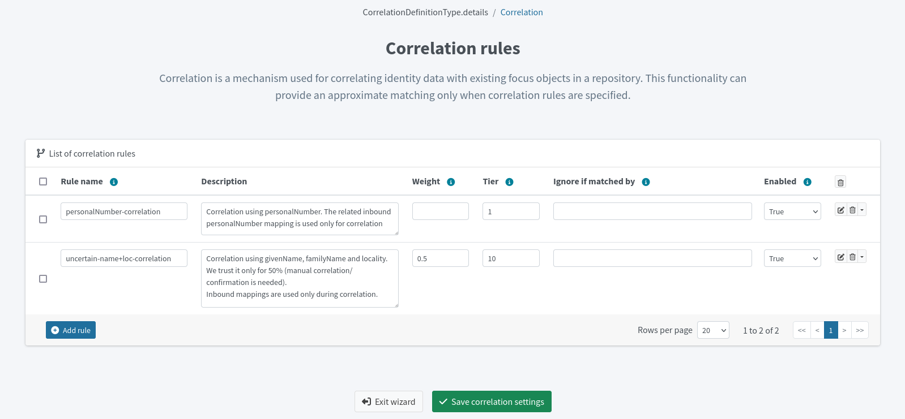

= Resource wizard: Object type correlation
:page-nav-title: Correlation
:page-toc: top
:page-since: "4.9"
:experimental:
:page-keywords: correlation, resource, object type, resource wizard, admin GUI
:page-description: This section describes how to set up correlation rules for a resource in midPoint using the GUI resource wizard.

This describes how to set up correlation rules for a resource in midPoint using the GUI resource wizard.

== Overview

Correlation in midPoint links resource object shadows to existing focal objects through a configurable matching mechanism.
It determines how midPoint identifies the owner of a resource object, which is essential for maintaining correct and up-to-date associations between resources and focal objects.

In practice, correlation allows midPoint to automatically find the appropriate user for a given resource account based on account attributes and defined correlation rules.

Before configuring correlation rules for a resource, it is recommended to define xref:/midpoint/reference/admin-gui/resource-wizard/object-type/mapping[inbound mapping].
While not strictly required before starting configuring correlation, inbound mapping allows you to reuse mapped attributes as xref:/midpoint/reference/correlation/items-correlator[correlation items].
More importantly, this step helps you identify which attributes are suitable for correlation—specifically those that are stable and sufficiently unique for reliable matching.
If you have not yet configured inbound mapping for correlation, you will be able to do so when configuring correlation. 

The defined correlation rules are later used by xref:/midpoint/reference/admin-gui/resource-wizard/object-type/synchronization[synchronization processes] to actually link resource accounts to their corresponding focal objects.

Refer to xref:/midpoint/reference/correlation/[Correlation] for more details on the topic.

[[create-correlation-rules]]
== Create correlation rules

image::correlation-rules-setup-accounts-configure-menu.webp[title="Configuration menu in resource accounts list as an entry point to the correlation rules wizard"]

. In icon:database[] *Resources* > icon:database[] *All Resources*, select your resource.
. In icon:male[] *Accounts*, click icon:cog[] btn:[Configure] > icon:code-branch[] *Correlation*.
. You can:
** Create correlation rules manually - Click [.nowrap]#icon:plus[] btn:[Create new]# and continue with this guide.
** Use an artificial intelligence (AI) assistant to help you create correlation rules - See <<ai-correlation>> and then return here to continue modifying the AI suggested rules if needed.
. Define the general settings of the correlation rule:
    ** *Rule name* - A descriptive name of the rule. This needs to be unique in the context of the resource.
    ** *Description* - An optional detailed description of the rule.
	** *Enabled* - Set to `true` to enable the correlation rule. 
	Set to `false` if you want to disable the correlation rule.
	This is useful if you want to temporarily stop using the rule without deleting it. _Undefined_ is the same as _False_.
	** *Tier* - Tiers determine the order of rule processing. If a higher-tier rule does not provide a confident-enough match, the next tier is processed.
	Lower numbers mean higher tiers.
    ** *Weight* - Signifies the rule confidence. 1.0 means 100% confidence.
	The weight is multiplied by the accumulated confidence of link:#set-up-correlators[individual correlators] within the rule to get the final confidence value of the rule. +
	See xref:/midpoint/reference/correlation/rule-composition/#composition-algorithm-outline[] for details.
	** *Ignore if matched by* - You can block the rule from evaluation if the correlator within the rule is matched in another rule already. 
	This is useful to avoid getting skewed confidence values if multiple rules use the same correlator (e.g., _surname_), as they would add up and reach confidence over 100%. +
	See xref:/midpoint/reference/correlation/rule-composition/#ignore-if-matched-by-flag[] for details.
+
image::correlation-rule-example.webp[title="Example of a correlation rule with an employee number correlator. The rule has a weight of 1.0, which means that if the correlator matches, the rule will yield a confidence of 100%."]

. <<set-up-correlators, Add correlation items>>, also referred to as _correlators_, for the rule.
. Click [.nowrap]#icon:check[] btn:[Confirm]#.
. To check that your correlation configuration works as expected, you can run a <<simulation,simulation>>.
. Click [.nowrap]#icon:check[] btn:[Save correlation settings]# to save the rules and exit the wizard.
+

[[set-up-correlators]]
=== Set up correlation items (correlators)

For each correlation rule, you need to add at least one *correlation item*, or *correlator*.
Correlation items specify the values of which attributes are to be compared when matching resource and focal objects.
In practical terms, these are xref:/midpoint/reference/admin-gui/resource-wizard/object-type/mapping[inbound mappings] that are stable and sufficiently unique for reliable matching.

You can have multiple correlation items for one correlation rule.
For each correlation item, you specify an attribute for which you have an inbound mapping from the resource you are correlating.

For instance, if you have an HR system with employee numbers and an LDAP system that uses the same employee numbers, you may inbound-map the employee numbers to `empnum` in both resources and use the `empnum` attribute for correlation.

[TIP]
====
You can use _correlation-only_ xref:/midpoint/reference/admin-gui/resource-wizard/object-type/mapping/[inbound mappings] for target resources, where you normally do not use inbound mappings.
// TODO: link to the section about correlation-only mappings after this section is written @dakle 2025-05-20
====

To add correlation items to correlation rules:

. Open the list of correlation rules in your resource via [.nowrap]#icon:male[] btn:[Accounts]# > [.nowrap]#icon:cog[] btn:[Configure]# > [.nowrap]#icon:code-branch[] btn:[Correlation]#.
. In the list of correlation rules, click [.nowrap]#icon:eye[] btn:[Edit rule]# on a correlation rule for which you want to configure the correlation items.
. Add a correlation item by clicking:
** [.nowrap]#icon:link[] btn:[Add existing]# if you have already defined an inbound mapping for the attribute you want to use for correlation.
.. Select an attributes from the list of available attributes for correlation.
.. Click [.nowrap]#icon:link[] btn:[Add mappings]# to add the mapping and to return to the correlation rule.
+
image::correlation-add-existing-mapping.webp[title="Add existing correlation item based on an already defined inbound mapping. This allows you to reuse the mapped attribute as a correlator."]
	
** Click [.nowrap]#icon:circle-plus[] btn:[Create new]# if you want to create a new correlator from an attribute for which you have not yet defined an inbound mapping.
.. Configure the xref:/midpoint/reference/admin-gui/resource-wizard/object-type/mapping/[inbound mapping].
+
TIP: Select _Correlation_ in the *Use for* option if you are working with a resource that does not otherwise require inbound mappings, such as a target resource in a reconciliation scenario.

.. Click [.nowrap]#icon:circle-plus[] btn:[Create mapping]#.
+
image::correlation-add-new-mapping.webp[title="Create a new correlation item. This allows you to create a correlator from an attribute for which you have not defined an inbound mapping yet."]
+
. Configure the correlation item:
	.. *Item* - Selects an item to correlate.
	It refers to a midPoint property for which an inbound mapping exists.
	This will be used for correlation.
	For example, if you have an inbound mapping from AD's _sAMAccountName_ attribute to midPoint user's _name_ property, you would select _name_ here.
	.. *Resource attribute* - Selects the attribute on the resource side that will be compared to the selected midPoint property.
	.. *Search method*:
	** _Exact match_: Values need to match exactly for the objects to correlate (get linked, in other words).
	** _Levenshtein distance_: Method of approximate matching with a threshold of the maximum permitted number of single-character edits. Refer to link:https://en.wikipedia.org/wiki/Levenshtein_distance[Levenshtein distance on Wikipedia] for more details about the method.
	** _Trigram similarity_: Method of approximate matching using the ratio of common trigrams to all trigrams in compared strings.
	+
	For the fuzzy-search methods, define the *Match threshold* and whether the threshold value is *Inclusive* (in the mathematical sense).
	.. Optionally, click [.nowrap]#icon:edit[] btn:[Edit mapping]# to define detailed settings for the correlation item.
. Click icon:check[] btn:[Confirm] to save the correlators.

image::correlation-rules-multiple-correlator.webp[title="List of correlators for one correlation rule. In this configuration, all three values must match exactly for the rule to gain the maximum confidence."]

[[ai-correlation]]
=== Use AI to Generate Correlation Rules

To boost productivity and to configure correlation faster and more efficiently, use the midPoint's AI assistant to generate correlation rules based on the actual data in your resource.
This greatly simplifies the process of setting up correlation, especially for large and complex resources, by providing intelligent suggestions for correlation rules that are tailored to your specific resource data.

image::correlation-use-ai.webp[title="Use AI to generate correlation rules based on the actual data in your resource."]

. Make sure you toggle the [.nowrap]#icon:wand-magic-sparkles[] btn:[Suggestions enabled]# on to enable the AI assistant.
If you have not yet configured any correlation rules, this toggle will not be visible, and you can continue to the next step.
. Click the [.nowrap]#icon:wand-magic-sparkles[] btn:[Generate suggestions]# button to generate correlation rule suggestions based on the actual data in your resource.
The AI assistant will prompt you to select the data you want to analyze, such as your schema.
To ensure maximum security, no authentication credentials or passwords are shared in the process.
. Inspect the generated suggestions.
You can do so directly in the list of suggestions, or you can click [.nowrap]#icon:edit[] btn:[View rule]# to see the details of the suggested correlation rules and their correlators.
. Take action on the generated suggestions:
** [.nowrap]#icon:check[] btn:[Accept]# them so that you can open them for editing.
If the new rule does not have any inbound mappings, i.e., correlation items, configured, you will be prompted to [.nowrap]#icon:check[] btn:[Accept and add]# them.
By accepting at this point, you are only accepting the correlation rule suggestion, and you still remain in control as you will be able to review and modify the suggested rule and correlators before saving and deploying them.
** [.nowrap]#icon:x[] btn:[Discard]# the suggestions if you do not want to use them at all.

+
If you have discarded some suggestions by mistake, or have made changes you are not happy with, you can always remove the correlation rules and click [.nowrap]#icon:arrows-rotate[] btn:[Re-generate]# to get new suggestions.

+
image::correlations-regenerate.webp[title="Regenerate correlation rules suggestions if you are not happy with the current ones. This will not affect any of the rules you have already accepted."]
+
. For the suggestions you have accepted, click [.nowrap]#icon:eye[] btn:[Edit rule]# and continue modifying them as you would when <<create-correlation-rules,creating new correlation rules manually>>.

[[simulation]]
=== Simulate Correlation

After you set up your correlation rules, you can run a simulation to check how they work with the actual data in your resource.

image::correlation-simulation.webp[title="Run a correlation simulation"]

In your correlation rules list, at the bottom of the page:

. Click [.nowrap]#icon:flask[] btn:[Simulate]#.
. Select the environment you want to run the simulation in, and click [.nowrap]#icon:check[] btn:[Next]#.
. Define the simulation parameters:
	** *Sample size* - How many resource objects to include in the simulation. The higher the number, the longer the simulation will take.
	** *Query* - You can target specific objects in the resource by defining a query. For example, you can target only accounts with a specific value in an attribute, or accounts created within a specific time range.
. Click [.nowrap]#icon:play[] btn:[Run simulation]#.
. Wait for the simulation to finish, and check the results. You can see how many resource objects were matched by each correlation rule, and which focal objects they were matched to.
+
TIP: You can always review the simulation results in your correlation rules by clicking the dropdown menu for [.nowrap]#icon:eye[] btn:[Simulate]#.

== Troubleshooting

=== Generate suggestions button not visible

If the AI assistant is not available, make sure you toggle the [.nowrap]#icon:wand-magic-sparkles[] btn:[Suggestions enabled]# on to enable the AI assistant.

image::correlations-regenerate.webp[title="Enable the AI assistant."]

=== AI assistant not generating suggestions

If you experience issues with AI not generating suggestions:

* Check that your resource is connected by going to [.nowrap]#icon:database[] btn:[Resources]# > [.nowrap]#icon:database[] btn:[All Resources]# > resource, and clicking [.nowrap]#icon:question[] btn:[Test connection]#.
* Check that xref:/midpoint/reference/resources/attribute-caching[shadow caching] is enabled on your resource.
* Make sure object types are configured correctly on your resource.

include::../../limitation-all.adoc[]

include::../../see-also.adoc[]

