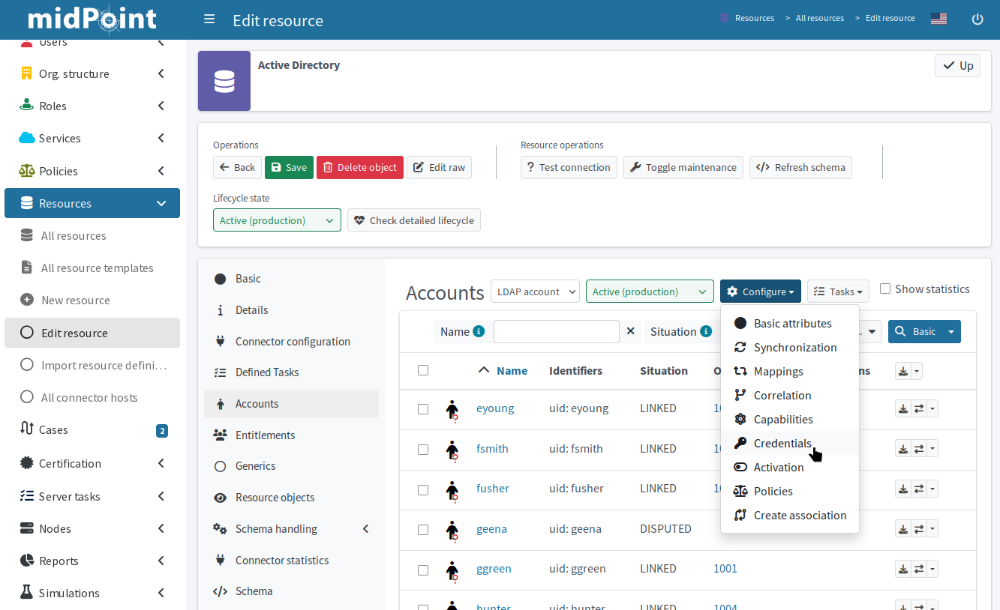

// = Resource wizard: Object type credentials
= Manage credential mappings in GUI
:page-nav-title: Credentials
:page-toc: top
:experimental:
:page-since: "4.9"

Manage credentials on your resources in the graphical user interface using the resource wizard for credential mappings.

In midPoint, you can manage various types of credentials, such as passwords, link:https://en.wikipedia.org/wiki/Secure_Shell#Authentication:_OpenSSH_key_management[SSH keys], link:https://en.wikipedia.org/wiki/X.509[X.509] certificates for link:https://en.wikipedia.org/wiki/Transport_Layer_Security[TLS], link:https://en.wikipedia.org/wiki/Time-based_one-time_password[TOTPs] for link:https://en.wikipedia.org/wiki/Multi-factor_authentication[MFA], etc.
You can configure credential mappings to transfer credentials between the resource and midPoint, generate new keys that follow your security policies, or run a script to perform any advanced actions on the credentials.

The resource wizard for credential mappings is similar to the xref:/midpoint/reference/admin-gui/resource-wizard/object-type/activation/[wizard used for activation configuration].
However, it is generally simpler and does not offer any presets.

[NOTE]
====
You do not need any credential mappings if you do not manage credentials on the resource.
That may be, for instance, when you handle authentication by SSO using a separate system.
====

.Configuration menu in the resource account list as an entry point to the credential mapping rules wizard

== Add credential mappings

To define credential mappings in the GUI:

. In [.nowrap]#icon:database[] *Resources*# > [.nowrap]#icon:database[] *All resources*#, go to your resource.
. In [.nowrap]#icon:male[] *Accounts*#, click [.nowrap]#icon:cog[] btn:[Configure]# > [.nowrap]#icon:key[] *Credentials*#.
. Select [.nowrap]#icon:arrow-right-to-bracket[] *Inbound*# or [.nowrap]#icon:arrow-right-from-bracket[] *Outbound*# tab:
    ** Inbound: To send credentials to midPoint
    ** Outbound: To send credentials to the resource
. Click [.nowrap]#icon:circle-plus[] btn:[Add inbound]# (or outbound) to add new mapping rule.
. Click [.nowrap]#icon:gear[] btn:[Settings]# on the new tile that appears in the selected tab.

.Outbound credential mappings overview with one active mapping set to generate password
image::credential-outbound-mapping.webp["Outbound credential mappings overview with one active mapping to generate password"]

=== Define basic options

At this point, what you do next highly depends on what your goal is.
Here is an outline of your options:

* *Name* the mapping descriptively.
    ** The requirements are identical to those for other mappings:
        In general, it is optimal to treat mapping names the same as file names.
        They need to be unique and it is best to use hyphens instead of spaces.
        For example, _update-user-password_.
* Set *strength* based on the mapping purpose. See the xref:/midpoint/reference/expressions/mappings/#_mapping_strength[explanation of the mapping strength options].
* In *Expression*, you define how to handle the credentials.
    ** _As is_ provides the simplest option to just pass an existing value from midPoint to the resource or vice versa.
    ** _Generate_ tells midPoint to create a new random password.
        This may be used in an outbound _weak_ mapping to generate initial passwords.
    ** _Literal_ inserts a static value.
    ** _Script_ gives you the option to define conditional behavior, for example.
* See the section on xref:#credentials-source-and-target[source and target options] below to decide whether you need to adjust them.

When you are done with the basic setup, click btn:[Next: Optional].

[[credentials-source-and-target]]
==== Source and target mapping options

In some cases, you may also need to specify the source and target options for the mapping.

As a general rule, rely on the default behavior of the connector and leave the source and target options blank.
When you use a resource like LDAP, the connector knows where the credentials belong.
Similarly, midPoint knows implicitly where to store credentials.
Define source and target in credential mappings
only when you cannot rely on the ability of the connector
to determine which attributes to use for credentials.

For example, if you exchange passwords with a custom resource
or handle accounts with multiple credential types per account,
you may need to tell midPoint (and, by extension, the connector) which attribute to use in what situation.

* For [.nowrap]#icon:arrow-right-to-bracket[] *Inbound*# mappings:
    ** *Source* specifies an attribute on the resource side from which to take credentials.
        This is typically defined in the xref:/midpoint/reference/resources/resource-configuration/[resource schema] and needs not to be specified manually here.
        However, if your resource objects (e.g., users) have multiple authentication tokens, such as a password _and_ a PIN,
        you would specify the PIN as an additional credential source and map it to its dedicated target attribute in midPoint.
        The source value to use in case of a CSV resource could be, for instance, `$shadow/attributes/ri:someColumnName`.
    ** *Target* specifies an attribute in the midPoint resource object type to which you wish to put authentication tokens.
        You would use this option to specify destination for PINs from the use case above or to copy passwords to an additional custom attribute, for example.
    ** You do not have to explicitly specify _both_ source and target if not required.
* For [.nowrap]#icon:arrow-right-from-bracket[] *Outbound*# mappings:
    ** You can only define *source* and it is exactly that attribute you would define as *target* for inbound mappings above (e.g., a custom object type attribute for a PIN).
    ** If you cannot rely on the resource schema definition for password target mapping because your users have two passwords, for instance,
        you need to map the secondary password to the appropriate resource attribute using general outbound xref:/midpoint/reference/admin-gui/resource-wizard/object-type/mapping/[mapping rules].
        In other words, you handle secondary passwords as you would handle any other attribute, such as _surname_.

=== Adjust advanced settings

On the screen that follows, define the parameters below as needed.
You can safely leave them at defaults and click [.nowrap]#icon:check[] btn:[Done]# to save the mapping and exit the wizard.

* *Authoritative* option defines whether the mapping "tolerates" changes by other means.
    ** Refer to xref:/midpoint/reference/expressions/mappings/#authoritative[Mappings (authoritative)] for details.
* *Exclusive* option ensures only one mapping can target the particular attribute.
    ** Refer to xref:/midpoint/reference/expressions/mappings/#exclusive[Mappings (exclusive)] for details.
* *Channel* option provides a way to restrict the mapping applicability only to the context of certain channels.
    ** Refer to xref:/midpoint/reference/expressions/mappings/#channel-constraints[Mappings (channel constraints)] for details.

When you are done with the setup, click [.nowrap]#icon:check[] btn:[Done]#.

[TIP]
====
New credential mappings are in the _Active_ lifecycle state by default.
We suggest you change it to _Proposed_ and xref:/midpoint/reference/admin-gui/resource-wizard/wizard-existing-resource/#simulated-tasks[test your configuration] first.
====

== Example configurations

Here are a few example configurations you can use as starting points for your configuration.

=== Generate initial password

Let us have a target resource to which you provision accounts as they are creates in a source resource.
Some systems, such as LDAP, do not allow _passwordless_ accounts, meaning you have to create _some_ password,
even if users need to reset it by means of a help desk, for instance, before actually using the account.

This is the situation to have midPoint generate a random password for new accounts.

. Create a new *outbound* credential mapping.
. *Name* it _generate-initial-password_, for instance.
. Give it a _weak_ *strength*.
. Set the *expression* option to _Generate_.
. Save the mapping.

This mapping populates the password attribute with a random generated password only if the attribute is empty.
Under any other circumstance, the mapping does not change the password because you set it as _weak_.

=== Let users change their password from midPoint

To let users change their resource password in midPoint,
add an outbound credential mapping that takes the password from the corresponding focus in midPoint
and updates it in the resource shadow (and the remote resource, by extension) during reconciliation.
Additionally, you may want to prevent midPoint from overwriting the password, should the user change it by other means—e.g., directly on the resource.

. Create a new *outbound* credential mapping.
. *Name* it _change-password_, for instance.
. Give it a _normal_ *strength*.
. Set the *expression* to _As is_.
. Save the mapping.

The strength of this mapping dictates that it updates the target value when the source changes,
but leaves it be in case the source stays the same but the target value is updated not through midPoint (user changed it directly on the resource, for example).
The _As is_ expression simply copies the password from midPoint to the resource.

include::../../see-also.adoc[]

* xref:/midpoint/reference/security/credentials/[]

* xref:/midpoint/reference/expressions/[]

* xref:/midpoint/reference/simulation/[]

* xref:/midpoint/reference/resources/resource-schema/[]

* xref:/midpoint/reference/resources/resource-configuration/[]

* xref:/midpoint/reference/resources/resource-configuration/schema-handling/[]
