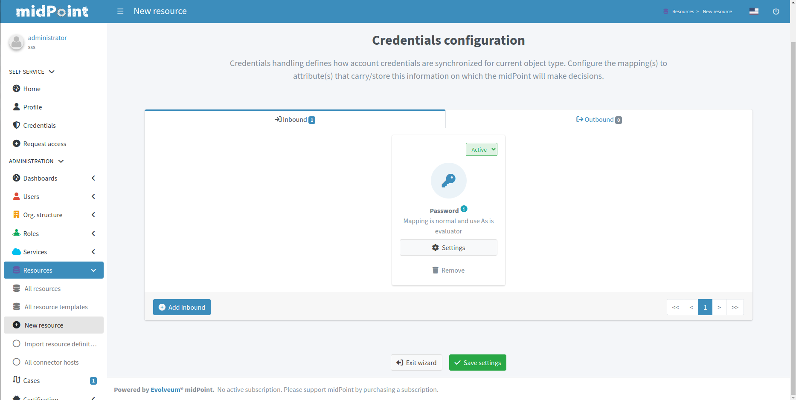

= Resource wizard: Object type credentials
:page-nav-title: Credentials
:page-toc: top
:page-since: "4.9"

Credentials allows you to define mappings for credentials, e.g. passwords.

Configuration for credentials contains similar panels as for activation, but contains only one kind of mapping and doesn't contain any predefined mappings.
Use the credentials mappings to either pass or generate the password.

TIP: The `as is` mappings are very simple as midPoint implies that the password will be passed from midPoint user password to resource object password (if supported by the resource and connector) or vice versa.

Each mapping also allows setting *Lifecycle state*.
This can be used during xref:/midpoint/reference/admin-gui/simulations/[Simulations], e.g. specifying lifecycle state as `Proposed` will be used only to simulate the credentials mapping, `Draft` disables the credentials mapping etc.

Click btn:[Save settings] when done to return to the previous page from which you started the credentials editor.

NOTE: You don't need any credentials mappings if you are not managing the passwords in the resource (e.g. if you are using SSO with another system).

include::../../limitation-all.adoc[]

include::../../see-also.adoc[]
