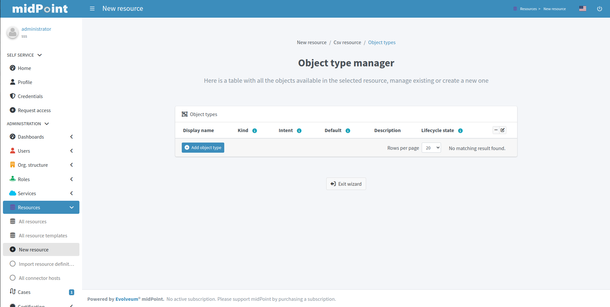
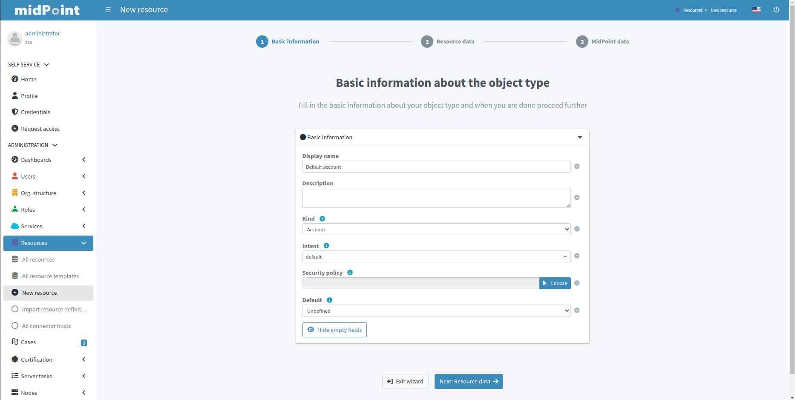
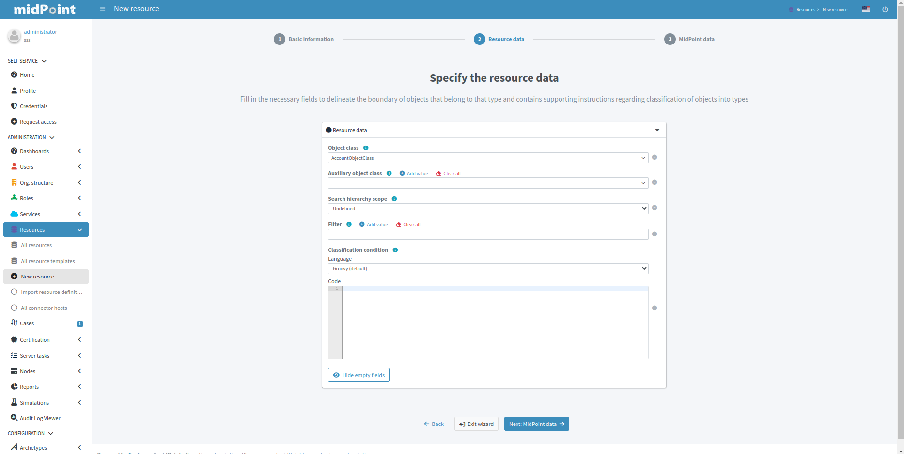
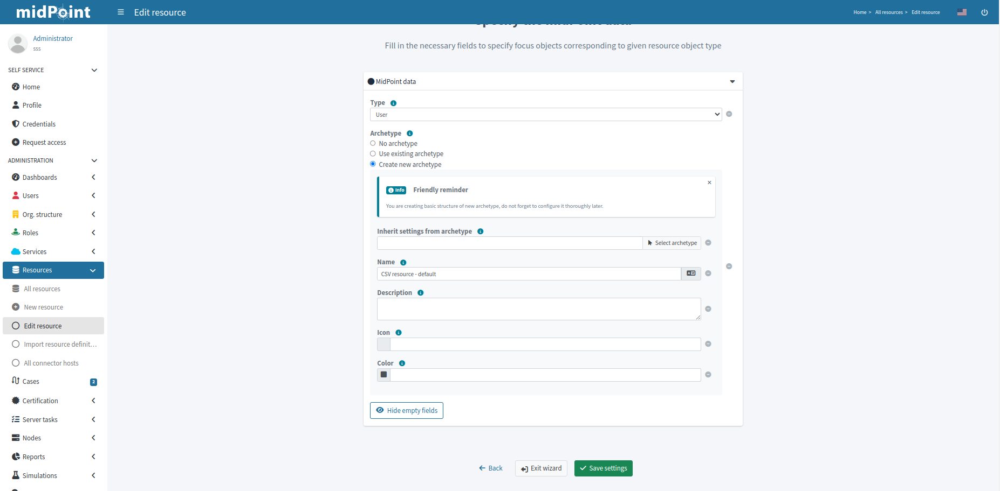
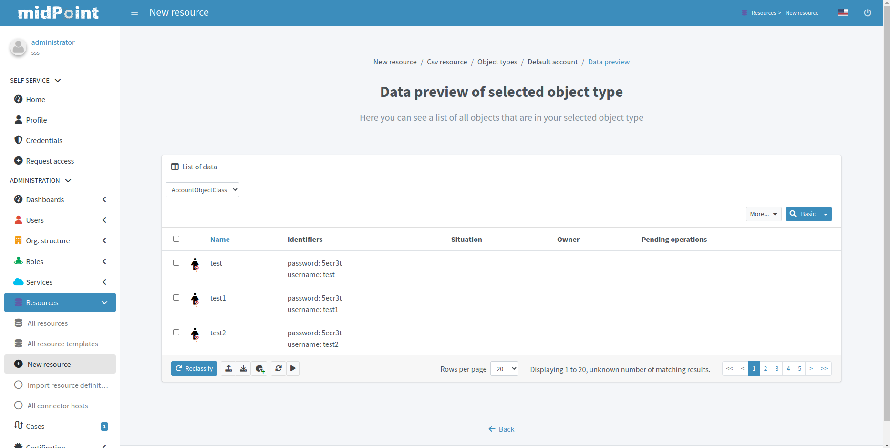

= Resource wizard: Object type configuration
:page-nav-title: Object type configuration
:page-toc: top
:page-since: "4.9"

In this part of resource configuration, you can configure the object types for xref:/midpoint/reference/resources/resource-configuration/schema-handling/[Schema handling], essentially defining the behavior of midPoint with respect to the resource.
One or multiple object types can be defined, based on the source/target system characteristics.
For example, CSV resource contains typically a single object type (e.g. accounts) while LDAP resource can contain more than one object type (e.g. accounts and groups).

Click btn:[Add object type] to create a new object type definition using Object type configuration wizard.

== Basic attributes

Define the basic information about the object type:

* *Display name* will be displayed in midPoint as a reference to this object type configuration
* *Kind* is either `Account`, `Entitlement` or `Generic`. For accounts, please select `Account`.
+
TIP: You first object type definition will be almost always for accounts (`kind=account`). Typical source of user data is HR system. Later you might want to use also Entitlements and Generic.
* *Intent* is used when you would like to use more than one different object _types_, e.g. standard and administrative accounts. Keep the default (empty) value if you want to work with just one type of accounts.
* *Default* specifies if the intent provided in the previous value should be used as the default value in case you define multiple intents. Select `True` if you are using only a single intent / one type of accounts.

.See also the following pages for more information:
* xref:/midpoint/reference/resources/shadow/kind-intent-objectclass/[]

Click btn:[Next: Resource data] to continue the object type configuration.

Define the resource-specific configuration for this object type:

* *Object class* is one of the object classes (types) supported by the connector for the source/target system represented as this resource. For resources supporting only a single object class (e.g. CSV) this will be displayed as `AccountObjectClass` and set as default by the wizard.
* *Filter* allows to define a classification via midPoint xref:/midpoint/reference/concepts/query/midpoint-query-language/[query language]
* *Classification condition* allows to define a classification condition (midPoint expression, not query)

TIP: Classification allows to limit which resource data (e.g. accounts) are considered part of this object type definition.
An example of *Filter* usage: CSV file entries matching query `attributes/contractType != "Incognito"` should be considered as accounts, all other should be ignored.

NOTE: You do not need to use the classification at all. If unsure, do not use it.

.See also the following pages for more information:
* xref:/midpoint/reference/resources/resource-configuration/schema-handling/#_delineation[Resource Object Type Delineation]

// TODO TODO we do not have better Delination example! I have created https://support.evolveum.com/wp/9404 to track this

Click btn:[Next: MidPoint Data] to continue the object type configuration.

Define the midPoint-specific configuration for this object type:

* *Type* defines type of midPoint object that will correspond to the resource object (e.g. `User` or `Role`). midPoint will respect this setting when creating a new midPoint object from this object type data on the resource.
* *Archetype* allows selection of archetype that will be automatically assigned for all midPoint objects created from this object type data on the resource. The same archetype will be also used as a part of correlation, i.e. enforced.
+
If unsure, keep Archetype empty.
+
Panel for Archetype allows three possibilities:

** _No archetype_,
** _Use existing archetype_ - Use existing archetype means that you can choose from already created archetypes.
** _Create new archetype_ - Create new archetype, with basic configuration. Created archetype will be added to configuration as reference.
In this case, you have the following options:

*** *Inherit settings from archetype* allows to select archetype which becomes superarchetype for the one you are creating.
For example, you can create your own archetype for roles, which will inherit `Application role` archetype.
*** *Name* defines the new archetype name (generated by resource wizard using resource name and intent, but you can change it)
*** *Description* allows you to write short description of the new archetype
*** *Create inducement* allows to create an inducement in the new archetype to construct the resource object defined in currently edited object type (`True`) for all focus object with this archetype.
*** *Create inducement for membership* allows to create an inducement in the new archetype to construct the resource account _and_ association (membership) for focal objects with assigned role of this archetype.
For example, if you create a new archetype `LDAP group` for roles, by assigning role with `LDAP group` archetype to a user, new LDAP account will be created and made member of the group constructed by `LDAP group` archetype for the role.
*** *Label* allows defining label of the new archetype displayed in summary panel of objects with this archetype assigned
*** *Plural label* allows defining label of the new archetype displayed in main menu if object collection view will be defined for this archetype
*** *Icon* allows defining the new archetype icon using Font Awesome icon names. For example `fa fa-briefcase` corresponds to `briefcase` icon in Font Awesome in the default (solid) icon set
*** *Color* allows defining the new archetype color for the icon using CSS color names

NOTE: The archetype can be *created* using resource wizard.
After its creation, you can modify it outside resource wizard in archetype editor, if needed.

.See also the following pages for more information:
* overview of xref:/midpoint/reference/schema/archetypes/[Archetypes]
* built-in xref:/midpoint/reference/schema/archetypes/person/[Person archetype] ready to be used

Click btn:[Save settings] to save the object type configuration (if you have selected option to create a new archetype, the archetype will be created at this time).

Further configuration is required.
You can choose your next step to configure other parts of your object type configuration:

* <<Basic attributes>> allows getting back to the basic configuration of your object type
* xref:./mapping/[Mappings] allow to configure resource attribute mappings
* xref:./synchronization/[Synchronization] allows to configure synchronization situations and reactions
* xref:./correlation/[Correlation] allows to configure correlation rules for resource objects
* xref:./capability/[Capabilities] allows you to disable/override some functionality of the resource and/or connector without changing the connector implementation
* xref:./activation/[Activation] allows to configure rules (mappings) for activation
* xref:./credentials/[Credentials] allows to configure mappings for credentials (e.g. passwords)
* xref:./policies/[Policies] allow to configure the resource operation policies

image::choice-part.png[link=choice-part.png,100%,title=Parts of object type configuration]

Or you can click btn:[Preview data] to display resource data according to the configuration of this particular object type you are configuring (considering `Kind`, `Intent`, `Object class` etc.):

.Data preview of object type

include::../configuration-resource-panels.adoc[]

include::../how-to-use-lifecycle-state.adoc[]

include::../limitation-all.adoc[]
