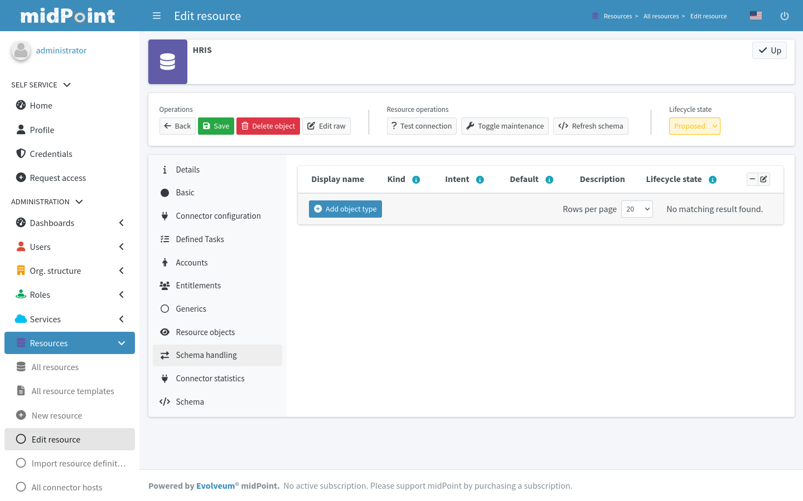
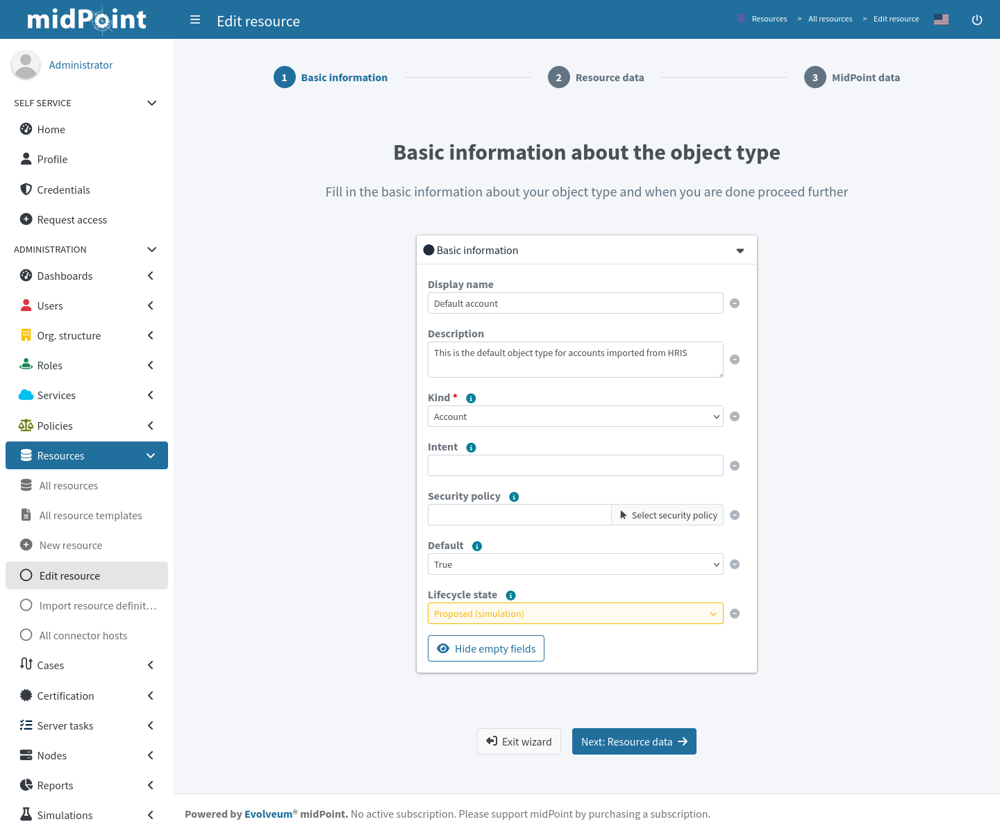
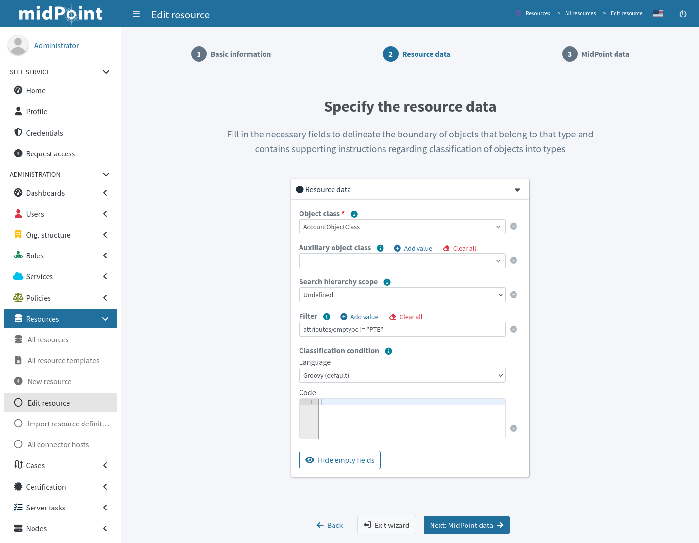
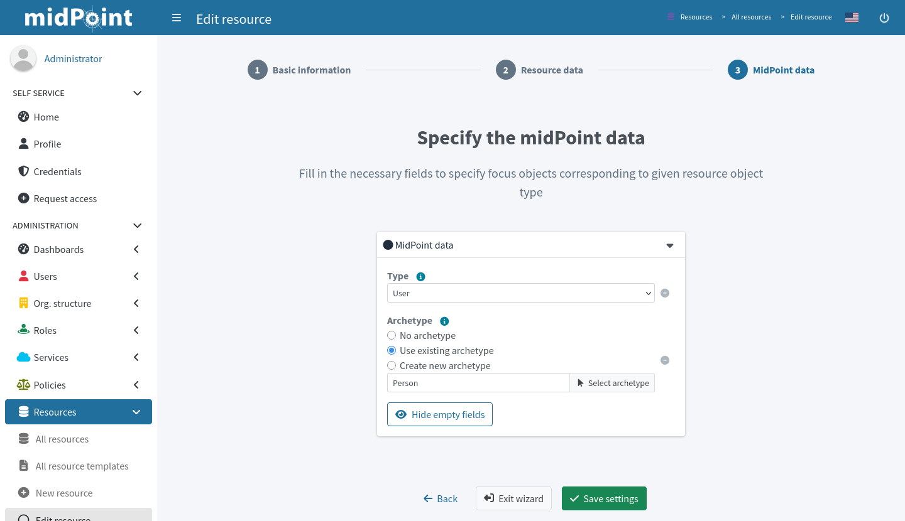
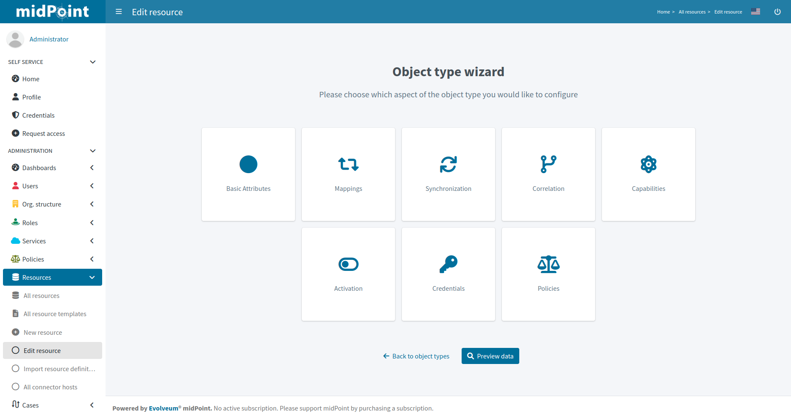

= Resource wizard: Object type configuration
:page-nav-title: Object type configuration
:page-toc: top
:page-since: "4.9"
:experimental:
:page-display-order: 20

In midPoint, configuring object types is the key to defining the structure of different identity objects, such as users, roles, and resources.
This guide describes the basic steps involved in setting up object types.
It also provides links to follow-up materials for more advanced configurations.

You can configure the object types for xref:/midpoint/reference/resources/resource-configuration/schema-handling/[schema handling], essentially defining the behavior of midPoint with respect to the resource.
You can define one or more object types based on the resource characteristics (i.e., the characteristics of the system the
resource represents).
For example, a CSV resource typically contains a single object type (e.g., accounts) while an LDAP resource can contain multiple object types (e.g., accounts and groups).

To *create a new object type definition* using the configuration wizard:

. In icon:database[] *Resources* > icon:database[] *All resources*, select your resource.
. Go to icon:gears[] *Schema handling* > icon:exchange[] *Object types* in the selected resource.
. Click icon:circle-plus[] btn:[Add object type].

If you need to *edit an existing object type*:

. In icon:database[] *Resources* > icon:database[] *All resources*, select your resource.
. Go to icon:gears[] *Schema handling* > icon:exchange[] *Object types* in the selected resource.
. Click the name of the object type you want to edit.
. Select the icon:circle[] *Basic attributes* tile to get into the same wizard as when you set up a new object type. +
    The other options are covered by different resource wizard tutorials.

== Basic attributes

Define the basic information about the object type.

* *Display name*: User-friendly name displayed in the midPoint user interface.
* *Kind*: Select `Account` for user accounts and `Entitlement` for role-like objects usually associated with user accounts.
* *Intent*: Used when you use multiple object types, e.g., _standard_ and _administrative_ accounts.
	Keep the default (empty) value if you work with just one type of accounts.
* *Default*: Specifies if the provided intent should be used as a default in case you define multiple intents for the same object kind.
	Select `True` if you use only a single intent.
* *Lifecycle state*: Set to _Proposed_ before you finish the setup and test it.
	Refer to the xref:/midpoint/reference/concepts/object-lifecycle/[] for more details.

Click btn:[Next: Resource data] to continue to the next object type configuration screen.

[TIP]
====
You first object type will almost always be of the account kind, with an empty intent, and the `default` attribute set to `True`.
That's usual for the first user data source, i.e., an HR system.
Later, when you set up roles and more account types, you'll also use the entitlement kind and specific intents.

Learn more about kinds, intents, and object classes: xref:/midpoint/reference/resources/shadow/kind-intent-objectclass/[]
====

== Specify the Resource Data

Define the resource-specific configuration for this object type.

* *Object class*: One of the object classes supported by the connector for the resource.
	Resources like CSV support only one object class which is displayed as `AccountObjectClass`.
* *Filter*: Define a filtering rules using xref:/midpoint/reference/concepts/query/midpoint-query-language/[midPoint query language]
* *Classification condition*: Define a classification condition (midPoint expression, not query)

You don't need to use filtering and classification at all.
If unsure, don't use it.

Click btn:[Next: MidPoint data] to continue to the next object type configuration screen.

// TODO: Some link to classification condition would be useful but I can't find anything that seems suitable. @dakle
// I don't think this is the right page: https://docs.evolveum.com/midpoint/reference/support-4.9/resources/resource-configuration/schema-handling/classification/  @dakle

=== Filter resource objects

Filtering is useful for limiting which resource data (e.g., accounts) are considered a part of this object type definition.

To do that, use the *Filter* field and type a filter query.
Filtering uses xref:/midpoint/reference/concepts/query/midpoint-query-language/[midPoint query language].

For example, to ignore all accounts of part-time employees (_PTE_), use `attributes/emptype != "PTE"` as the filter query.
`emptype` is the employment type attribute here as defined on the resource (e.g., a column in the source CSV file).

If you change filtering conditions for an existing object type, you then need to xref:/midpoint/reference/tasks/shadow-reclassification-task/gui/[reclassify the shadow objects] of this type.

.Learn more about schema handling, classification, and delineation:
* xref:/midpoint/reference/resources/resource-configuration/schema-handling/[]
* xref:/midpoint/reference/resources/resource-configuration/schema-handling/classification/[]
* xref:/midpoint/reference/resources/resource-configuration/schema-handling/delineation/[]

== Specify the midPoint Data

Define the midPoint-specific configuration of focus objects for this object type.

* *Type*: Specify type of midPoint objects that correspond to the resource objects (e.g., _User_ or _Role_).
	Objects of the _Account_ kind are usually of the _User_ type.
	The _Entitlement_ kind usually means the _Role_ type.

* *Archetype*: Select or create a new xref:/midpoint/reference/schema/archetypes[archetype] that best matches what the xref:/midpoint/reference/schema/focus-and-projections[focal objects] in midPoint represent.
	For instance, the _Person_ archetype is often suitable for objects representing user accounts.
	The focus archetype defines the type of resource objects and must be applied to all linked focus objects.
	If a focus object lacks the required archetype, it is added.
	If a different archetype is present, an error occurs.
	This enforcement applies to all projections, but the order in which projections are added can affect how archetype xref:/midpoint/reference/roles-policies/roles/assignment/assignment-vs-inducement[inducements] are processed.

	** If unsure, select *No archetype*.
		You can edit the object type later.

	** Otherwise, xref:/midpoint/reference/schema/archetypes/configuration-gui/#work-with-archetypes-in-the-object-type-resource-wizard[select an existing or create a new archetype].

Click btn:[Save settings] to save the object type configuration.

[NOTE]
====
You can xref:/midpoint/reference/schema/archetypes/configuration-gui/[modify the selected archetype outside the resource wizard] later.
====

.See also details on the built-in xref:/midpoint/reference/schema/archetypes/person/[].

== Further Object Type Configuration

Further configuration is required.

First of all, we suggest you click btn:[Preview data] to display resource data according to the configuration of this particular object type.

image::data-preview.png[link=data-preview.png,100%,title=Data preview of object type]

After you confirm whether your settings produce expected results, you can choose your next steps to configure other parts of your object type:

* <<Basic attributes>>: Get back to the basic configuration of your object type.
* xref:./mapping/[Mappings]: Configure resource attribute mappings.
* xref:./synchronization/[Synchronization]: Configure synchronization situations and reactions.
* xref:./correlation/[Correlation]: Configure correlation rules for resource objects.
* xref:./capability/[Capabilities]: Disable/override some functionality of the resource and/or connector without changing the connector implementation.
* xref:./activation/[Activation]: Configure rules (mappings) for activation.
* xref:./credentials/[Credentials]: Configure mappings for credentials (e.g., passwords).
* xref:./policies/[Policies]: Configure the resource operation policies.

include::../limitation-all.adoc[]

include::../see-also.adoc[]
