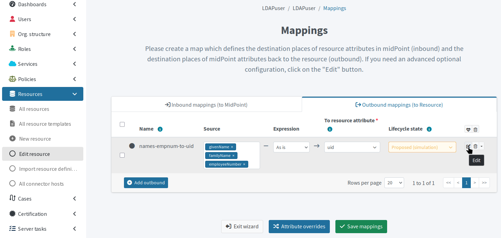
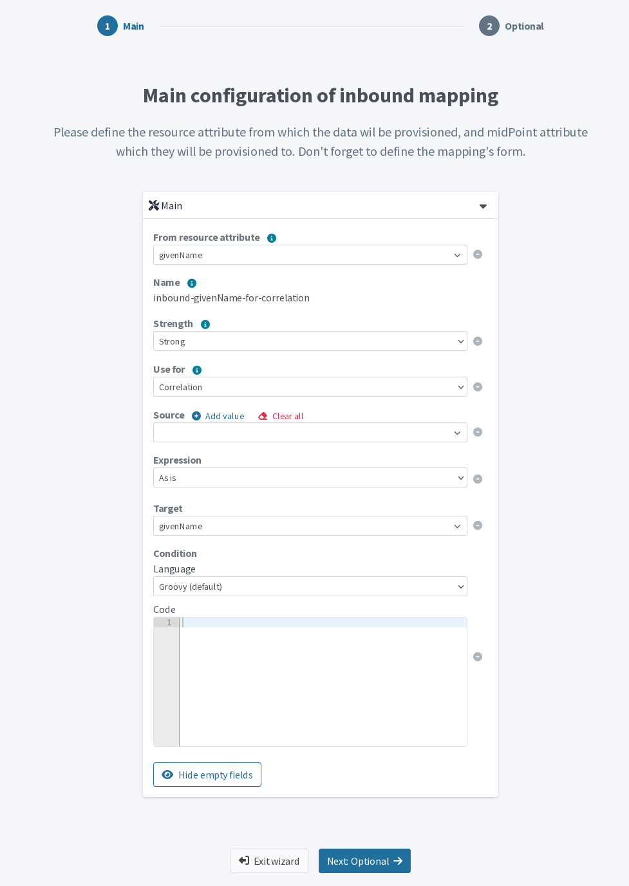
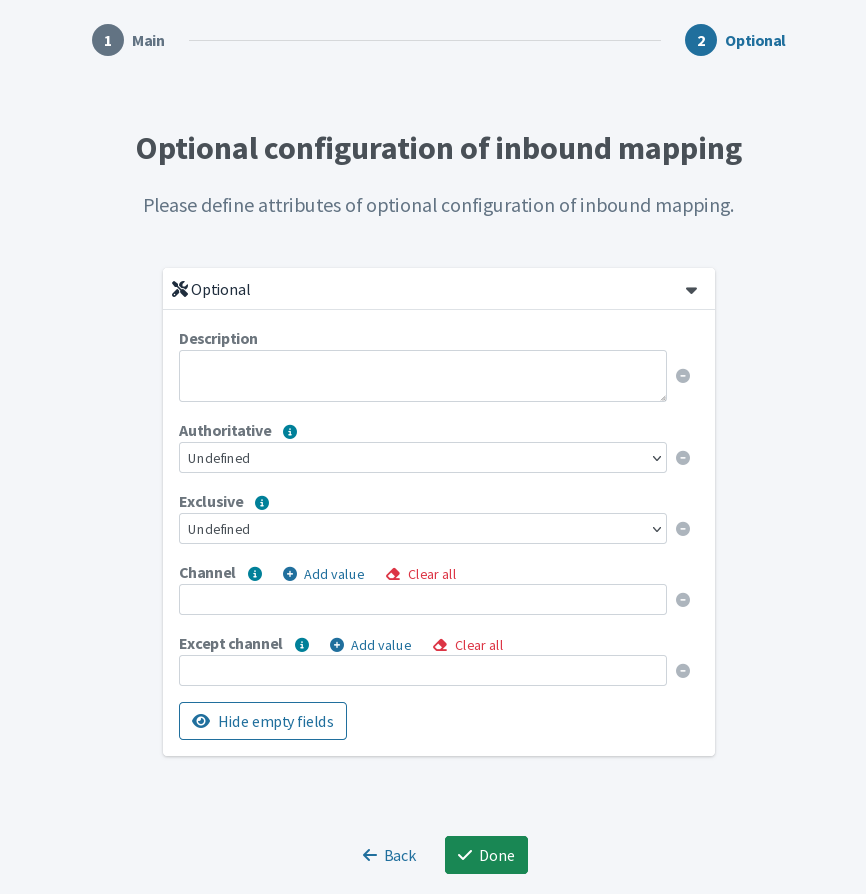
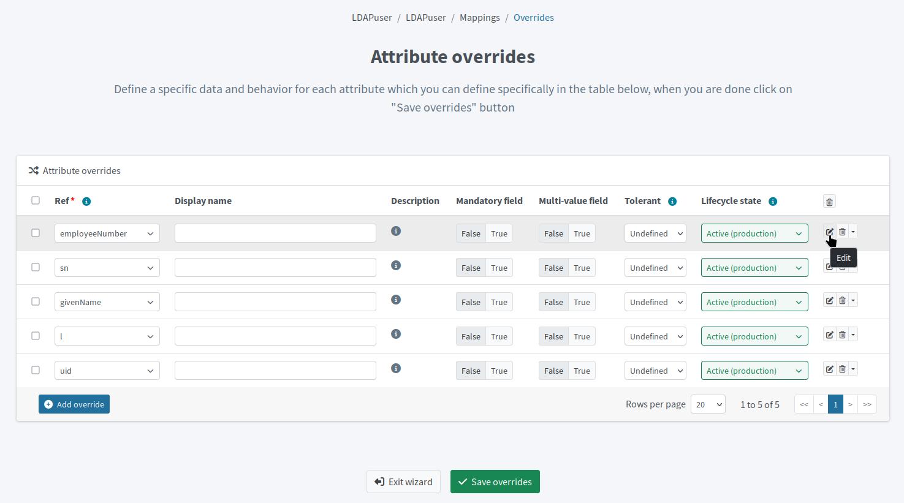
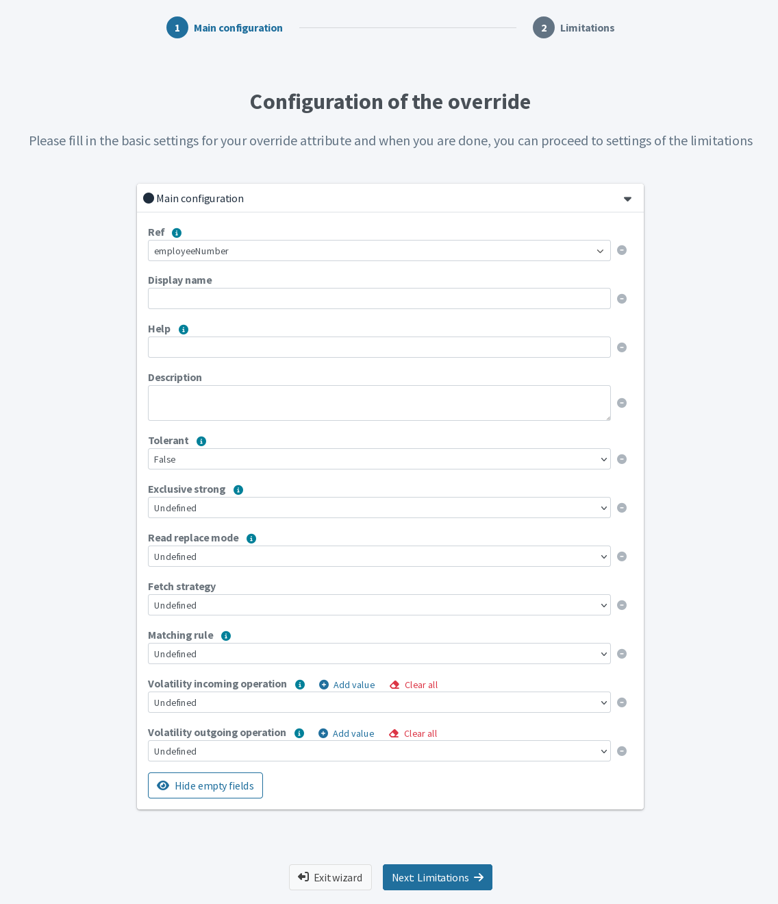
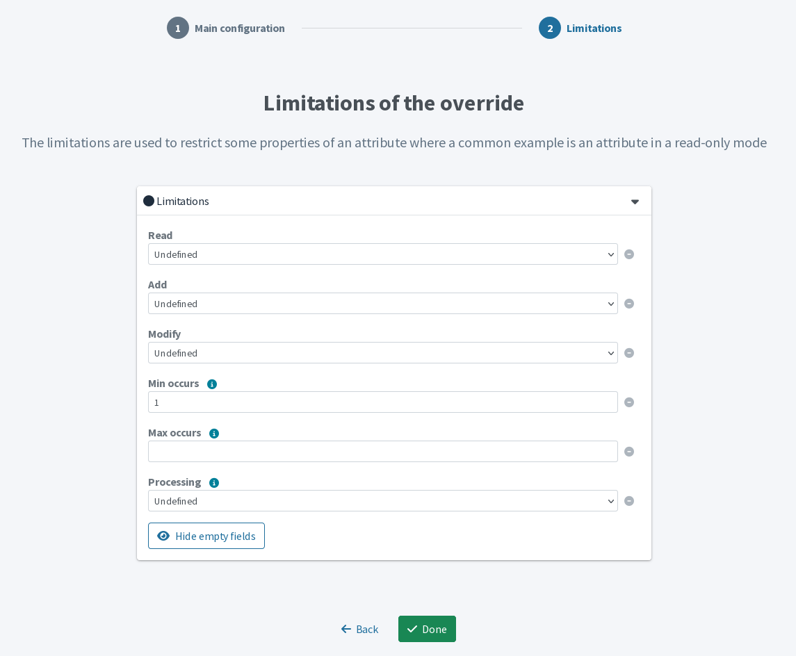

= Adjust advanced mapping options
:page-nav-title: Advanced Mappings
:page-toc: top
:experimental:
:page-since: "4.8"
:page-description: Adjust advanced mapping settings for finer control over the data manipulation rules you define using the mappings.

Adjust advanced mapping settings for finer control over the data manipulation rules you define using the mappings.

Refer to xref:/midpoint/reference/admin-gui/resource-wizard/object-type/mapping/[] for information on the basic mapping setup.

.Configuration menu in resource accounts list as an entry point to the mapping rules wizard
image::mapping-rules-setup-entry-point-via-accounts-configure-menu.webp["Configuration menu in resource accounts list as an entry point to the mapping rules wizard"]

== Configure advanced mapping options

In this guide, we expect you want to edit advanced settings of an existing mapping.
To create a new mapping, follow the steps in xref:/midpoint/reference/admin-gui/resource-wizard/object-type/mapping/[].

The advanced mapping configuration options are similar for both inbound and outbound mappings.
The most notable difference is in the options that the *Source* option provides because the relevant attributes differ for inbound and outbound mappings.

To access advanced configuration options for your mappings:

. In icon:database[] *Resources* > icon:database[] *All Resources*, select your resource.
. In icon:male[] *Accounts*, click icon:cog[] btn:[Configure] > icon:retweet[] *Mappings*.
. Select the [.nowrap]#icon:arrow-right-to-bracket[] *Inbound*# or [.nowrap]#icon:arrow-right-from-bracket[] *Outbound*# mappings tab.
. Click [.nowrap]#icon:edit[] btn:[Edit]# at the far right of the row with the mapping you wish to configure.
. In the two-screen wizard that opens, adjust the advanced mapping options as needed.

.Enter advanced mapping settings by clicking the Edit button on the row with the particular mapping

=== 1. Main configuration

* *From resource attribute* (inbound mappings), *To resource attribute* (outbound mappings): This is the same field you see in the basic xref:/midpoint/reference/admin-gui/resource-wizard/object-type/mapping/[mapping configuration screen].
* *Strength*: Define how aggressively the mapping is applied.
    Refer to xref:/midpoint/reference/expressions/mappings/#_mapping_strength[] for details.
* *Use for*: You can limit mappings to specific operational contexts—correlation and synchronization.
    For example, you can use a resource attribute only to correlate accounts, or transform values differently during correlation and synchronization (e.g., strip phone number prefixes when correlating and then synchronize the value _As is_ to another attribute).
    This option is applicable only to inbound mappings.
    ** _Synchronization_: Use the mapping for xref:/midpoint/reference/admin-gui/resource-wizard/object-type/synchronization/[synchronization], i.e., the initial import, reconciliation, or live synchronization.
    ** _Correlation_: Use the mapping for xref:/midpoint/reference/admin-gui/resource-wizard/object-type/correlation/[correlation], e.g., to match resource objects to focal objects without actually importing the attribute value.
        See an example of an xref:/midpoint/reference/correlation/#example-4-correlation-for-outbound-resources[inbound mapping defined for correlation].
* *Source*: Define additional attributes to be used as an input for the mapping.
    This option gives you more power for writing custom scripts and conditions by extending the range of usable attributes.
    ** For inbound mappings, this option augments the basic *From resource attribute* option with focus-related properties.
    ** For outbound mappings, the option provides the same choices as in the basic mapping configuration.
    ** Refer to xref:/midpoint/reference/expressions/mappings/#sources[] for details.
* *Target*: This is the same field you see in the basic xref:/midpoint/reference/admin-gui/resource-wizard/object-type/mapping/[mapping configuration screen] but it contains additional attributes related to the focus.
    This field shows only for inbound mappings.
    For outbound mappings, its equivalent is *To resource attribute* offering attributes available on the resource.
    Refer to xref:/midpoint/reference/expressions/mappings/#target[] for details.
* *Condition*: Control the mapping usage dynamically with a custom script in which you can define a specific xref:/midpoint/reference/expressions/mappings/condition/[condition].
    The mapping is used when the condition evaluates to `true`.
    For example, you may want to apply your mapping only if a user has a specific role or status.

.Advanced mapping options wizard screen with the main settings

=== 2. Optional configuration

These are the options on the second wizard screen:

* *Authoritative*: Control whether the mapping can remove values.
    An authoritative mapping is allowed to delete values that it previously wrote, while a non‑authoritative mapping never removes anything it has added.
    Refer to xref:/midpoint/reference/expressions/mappings/#authoritative[] for details.
* *Exclusive*: Define how many mappings may handle the target property:
    ** _True_: The mapping is exclusive to the selected target property.
        Using the same target property in a different mapping will cause an error.
    ** _False_: You can use the selected target property in other mappings as well (default).
* *Channel*: Limit the mapping to a specific xref:/midpoint/reference/concepts/channel.adoc[channel].
If empty, the mapping applies to all channels.
* *Except channel*: Define a channel in which the mapping is _not_ applied.

NOTE: The _Undefined_ value available in various options applies the defaults as defined in the xref:/midpoint/reference/resources/resource-schema[].

.Advanced mapping options wizard screen with the optional settings

[[advanced_attribute_override]]
== Configure extended attribute override options

In addition to the xref:/midpoint/reference/admin-gui/resource-wizard/object-type/mapping/index.adoc#attribute_override[basic attribute override settings], you can use a more advanced configuration.

. In your xref:/midpoint/reference/admin-gui/resource-wizard/object-type/mapping/[resource mappings], click [.nowrap]#icon:shuffle[] btn:[Attribute overrides]#.
. Click [.nowrap]#icon:edit[] btn:[Edit]# at the far right of the row with the override you wish to configure.
. In the two-screen wizard that opens, adjust the advanced override options as needed.

.Enter advanced attribute override options by clicking the Edit button on the row with the particular override

=== 1. Configuration of the override

* *Help*: Define the help text displayed as a tooltip whenever the attribute appears in midPoint (e.g., `givenName` on the user details screen).
* *Exclusive strong*: Define how can _normal_ and _strong_ mappings contribute to the final value of the attribute (applies to multi-value attributes).
    ** _True_: Outputs of only strong mappings are used. If there is no strong mapping, normal mappings are used.
    ** _False_: Both strong and normal mapping outputs are merged to populate the attribute.
    ** Refer to xref:/midpoint/reference/resources/resource-configuration/schema-handling/attributes/exclusive-strong/[] for details.
* *Read replace mode*: Helps you work around the connector behavior in case that add, delete, and replace operations are processed in a non-standard manner.
    For example, when a connector treats a replace operation as a merge operation instead, i.e., it adds a new value but does not remove the old value.
    ** When set to _true_, modifications to the attribute are executed as a replace operation.
    ** Refer to xref:/midpoint/reference/resources/resource-configuration/schema-handling/attributes/read-replace-and-modification-priority/[] for details.
* *Fetch strategy*: Define whether to always explicitly request the attribute from the resource, or expect that it will be provided by the connector only if necessary.
    Refer to xref:/midpoint/reference/resources/resource-configuration/schema-handling/attributes/fetch-strategy/[] for details.
* *Matching rule*: Select a matching rule that compares attribute values.
    As the default matching rule is a case-sensitive literal comparison, this can be used to prevent unnecessary updating of values in resources that are case-insensitive.
    Refer to xref:/midpoint/reference/concepts/matching-rules/[] for details.
* *Volatility incoming operation*: Define for which operations (_Add_, _Modify_, or _Delete_) the attribute value can change in midPoint without midPoint initiating the change.
    Incoming volatility means that the attribute in question is the volatile one, i.e., it depends on other attributes.
    For example, if you construct email addresses from user names in midPoint, you can use this option to tell midPoint to expect a change in the email address attribute when a user name changes.
    Refer to xref:/midpoint/reference/resources/resource-configuration/schema-handling/volatility/[] for details.
* *Volatility outgoing operation*: Define which operations (_Add_, _Modify_, or _Delete_) may the attribute trigger on other attributes.
    Outgoing volatility means that the attribute in question is the volatility source for other (volatile) attributes, i.e., those other attributes depend on it.

.The first screen of the advanced attribute override wizard

=== 2. Limitations of the override

These are the options on the second wizard screen.
Refer to xref:/midpoint/reference/resources/resource-configuration/schema-handling/attributes/limitations/[] for details.

* *Read*, *Add*, *Modify*: Specify allowed operations regarding the attribute.
    ** You can use these restrictions to prevent data corruption when working with a resource that may contain invalid data.
    ** Default is _True_, i.e., allow.
* *Min occurs*, *Max occurs*: Define if the attribute is mandatory, and if it is single/multi-value by overriding the resource schema definition of xref:/midpoint/reference/resources/resource-schema/index.adoc#object-class[minOccurs and maxOccurs].
* *Processing*: Specify the manner of processing:
    ** _Ignore_: The attribute is not processed at all.
    ** _Minimal_: The basic data structure of the attribute is maintained and the attribute values can be logged.
        You can process the attribute and the underlying data structure using a custom code.
        However, all built-in automatic processing, presentation, transformation, or any similar processing is skipped.
// TODO: Do we not have any detailed documentation on attribute processing? @dakle 2026-01-11

NOTE: The _Undefined_ value available in various options applies the defaults as defined in the xref:/midpoint/reference/resources/resource-schema[].

.The limitations screen of the advanced attribute override wizard

