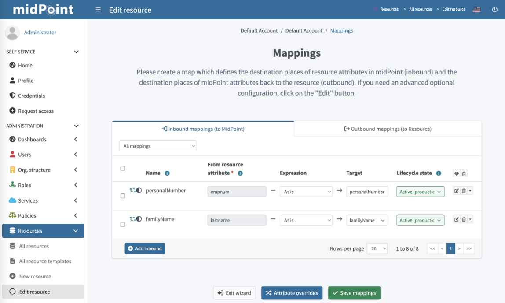

= Resource Wizard: Advanced Object Type Mappings
:page-nav-title: Advanced Mappings
:page-toc: top
:experimental:
:page-since: "4.9"

This describes advanced object mapping configuration.

For basic options and a general description of mappings, refer to xref:/midpoint/reference/admin-gui/resource-wizard/object-type/mapping/[].

[[advanced_inbound_mappings]]
== Advanced Inbound Mappings

In addition to the xref:/midpoint/reference/admin-gui/resource-wizard/object-type/mapping/index.adoc#inbound_mappings[basic inbound mapping settings], you can use a more advanced configuration:

[#use_inbound_for_correlation]
. Go to icon:database[] *Resources* > icon:database[] *All resources* > *your_resource* > icon:male[] *Accounts* > icon:cog[] *Configure* > icon:retweet[] *Mappings*.

. For an existing inbound mapping, click icon:edit[] *Edit*, and configure:

    * *Strength*: Defines how aggressively the mapping is applied:
        ** _Strong_: Always enforces source values.
        For single-value attributes, the source value replaces the target value, while for multi-value attributes, source values are added to target values.
        ** _Normal_: Applies source values only if they have changed (not during reconciliation).
        If the target was modified manually, then the source value does not overwrite the target value.
        ** _Weak_: Applies the source value only if the target has no value.
    * *Use for*: Defines operations in which the mapping is applied.
    This enables you to define different mappings for different contexts.
    For example, when fetching user numbers from a resource, you may want to match them exactly during correlation, however, during synchronization, you may want to normalize them (e.g. strip prefixes).
        ** _Synchronization_: Uses the mapping for xref:/midpoint/reference/admin-gui/resource-wizard/object-type/synchronization/[synchronization], e.g. during initial import, reconciliation, or live synchronization.
        ** _Correlation_: Uses the mapping for xref:/midpoint/reference/admin-gui/resource-wizard/object-type/correlation/[correlation].
        See xref:/midpoint/reference/correlation/#example-4-correlation-for-outbound-resources[an example of inbound mapping defined for correlation].
        ** _All_: Uses the mapping during both synchronization and correlation.
    * *Source*: Defines a midPoint property that is used as input for the mapping.
    This complements the source property defined in *From resource attribute*, and provides you with more room for writing custom scripts by extending the range of usable objects also to midPoint properties.
    * *Condition*: Enables you to control the mapping usage dynamically with a custom script in which you can define a specific xref:/midpoint/reference/expressions/mappings/condition/[condition].
    The mapping is used if the condition evaluates to `true`.
    For example, you may want to apply your mapping only if a user has a specific role or status.
. Click btn:[Next: Optional] and configure:

    * *Authoritative*: Controls how mapping treats changes in source values:
        ** _True_: Always updates the target values with the source values, if they are different.
        This is typically used when there is only one source and you want your target values to always be up-to-date.
        ** _False_: Does not update non-empty target values when source values change.
        Use this option if you have multiple sources, or if you want to retain custom changes of your target values.
    * *Exclusive*: Defines how many mappings a target property can have:
        ** _True_: Treats the mapping as exclusive to the selected target property.
        Using the same target property in a different mapping would trigger an error.
        ** _False_: Enables you to use the selected target property also in other mappings (default).
    * *Channel*: Limits the mapping to a specific xref:/midpoint/reference/concepts/channel.adoc[channel] in which it is applied.
    If no channels are entered, the mapping is applied for all channels.
    * *Except channel*: Defines a xref:/midpoint/reference/concepts/channel.adoc[channel] to which the mapping is not applied.
. Click icon:check[] btn:[Done] to save the changes.

NOTE: The _Undefined_ option that is available in various settings applies the default defined in the xref:/midpoint/reference/resources/resource-schema[Resource Schema XSD].

[[advanced_outbound_mappings]]
== Advanced Outbound Mappings
To set up your outbound mappings, go to icon:database[] *Resources* > icon:database[] *All resources* > *your_resource* > icon:male[] *Accounts* > icon:cog[] *Configure* > icon:retweet[] *Mappings* > icon:arrow-right-from-bracket[] *Outbound mappings (to Resource)*.

The available settings are the same as for <<advanced_inbound_mappings,inbound mappings>>.
The difference is that while inbound mappings control data transfer between source systems and midPoint, outbound mappings control data transfer from midPoint to target systems, such as LDAP.

[[advanced_attribute_override]]
== Advanced Attribute Override

In addition to the xref:/midpoint/reference/admin-gui/resource-wizard/object-type/mapping/index.adoc#attribute_override[standard attribute override settings], you can use a more advanced configuration:

. Go to icon:database[] *Resources* > icon:database[] *All resources* > *your_resource* > icon:male[] *Accounts* > icon:cog[] *Configure* > icon:retweet[] *Mappings*.
. Select icon:arrow-right-to-bracket[] *Inbound mappings (to midPoint)* or icon:arrow-right-from-bracket[] *Outbound mappings (to Resource)*.
. Click icon:shuffle[] btn:[Attribute overrides].
. For an existing override, click icon:edit[] *Edit*.
. On the Main configuration page, configure:
    * *Help*: Defines the help text displayed via a tooltip icon whenever the attribute appears in midPoint, such as the user details screen for standard attributes like given name.
    * *Exclusive strong*: Defines how multi-value attributes are treated in the mapping.
        ** _True_: If the attribute contains at least one strong value, only strong values are used. If there are no strong values, normal values are used.
        ** _False_: Both strong and normal values are merged to produce the final set of values.
    * *Read replace mode*: Helps you workaround the connector behavior in case the add, delete, and replace operations are processed in a non-standard manner.
    For example, when a connector treats a replace operation as a merge operation instead, i.e. when it adds a new value but does not remove the old value.
        ** _True_: Modifications to the attribute are executed only as a REPLACE operation.
        This means that if an ADD or DELETE VALUE operation is requested, midPoint fetches the object state, computes the expected result, and writes it to the resource object using a REPLACE VALUE operation.
        ** _False_: The REPLACE operation is not forced.
    * *Fetch strategy*: Defines when and how midPoint fetches the attribute:
        ** _Implicit_: MidPoint expects that the attribute is implicitly returned by the connector in each fetch request (default).
        ** _Explicit_: MidPoint requests the attribute in each fetch request.
        Use this for attributes that the connector does not return by default but which you want to see in midPoint.
        ** _Minimal_: Fetches the attribute only if it is necessary.
        Use this for values that may cause performance overhead, such as lists of members of large groups, or large binary attributes.
    * *Matching rule*: Selects a matching rule that compares attribute values.
    As the default matching rule is a case-sensitive literal comparison, this can be used to prevent unnecessary updating of values in resources that are case-insensitive.
    For example, as email addresses are often used as case-insensitive, you can use this option to treat email addresses from your input, where they are case-sensitive, as case-insensitive.
    * *Volatility incoming operation*: Defines for which operation (_Add_, _Modify_, or _Delete_) the attribute can change in midPoint without an explicit request from midPoint.
    Changes like these occur when the configured attribute depends on a different attribute.
    For example, if you construct email addresses from user names in midPoint, you can use this option to tell midPoint to expect a change in the email address attribute when a user name changes.
    * *Volatility outgoing operation*: Defines for which operation (_Add_, _Modify_, or _Delete_) a change in a midPoint attribute can cause a change in an attribute outside of midPoint.
. Click btn:[Next: Limitations], and on the Limitations page configure:
    * *Read*/*Add*/*Modify*: When set to _False_, disables the respective operation for the attribute.
    You can use these restrictions for example to prevent data corruption when working with a resource that may contain invalid data.
    By default (_Undefined_), these operations are allowed.
    * *Min/Max occurs*: Defines if the attribute is mandatory, and if it is single/multi-valued by overriding the resource schema definition of xref:/midpoint/reference/resources/resource-schema/index.adoc#object-class[minOccurs and maxOccurs].
    * *Processing*: Specifies the depth of processing:
        ** _Ignore_: The attribute is not processed at all.
        ** _Minimal_: The attribute basic data structure is maintained and the attribute values can be logged.
        You can process the attribute and the underlying data structure using a custom code.
        However, all built-in automatic processing, presentation, transformation, or any similar processing is skipped.
. Click icon:check[] btn:[Done] to save the configuration.

NOTE: The _Undefined_ option that is available in various settings applies the default defined in the xref:/midpoint/reference/resources/resource-schema[Resource Schema XSD].