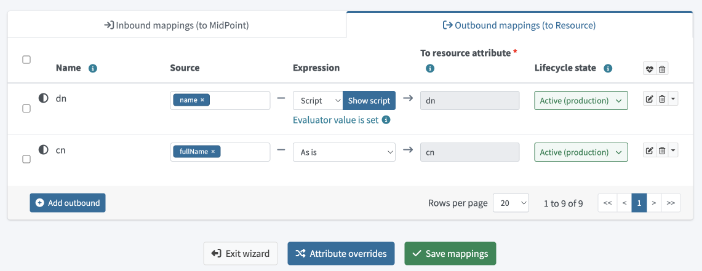

= Resource wizard: Object type mappings
:page-nav-title: Mappings
:page-toc: top
:experimental:
:page-since: "4.9"

Mapping is a mechanism that takes input properties from the source, transforms them, and insers the result into another property that is then used by a resource.
In other words, mapping allows you to use the data from your source systems, such as HR applications, and adapt them so that you can use them in your target systems, such as LDAP.

To access mappings, click icon:database[] *Resources* > icon:database[] *All resources* > *your_resource* > icon:male[] *Accounts* > icon:cog[] *Configure* > icon:retweet[] *Mappings*.

image::step-2-mappings-inbound.png[link=step-2-mappings-inbound.png, 100%, title=Table of inbound mappings]

For a more technical description, see also the following pages:

* xref:/midpoint/reference/resources/resource-configuration/schema-handling/[Resource Schema Handling]
* xref:/midpoint/reference/expressions/mappings/[Mappings]
* xref:/midpoint/reference/expressions/[MidPoint Expressions and Mappings]
* xref:/midpoint/reference/expressions/mappings/inbound-mapping/[Inbound mappings]
* xref:/midpoint/reference/expressions/mappings/outbound-mapping/[Outbound mappings]

[[inbound_mappings]]
== Inbound Mappings

Inbound mapping transforms data from authoritative sources to midPoint. Typically, it is used to populate new user objects with data from an HR system.
See the xref:/midpoint/reference/expressions/mappings/inbound-mapping/[inbound mappings] page for more details.

To add a new inbound mapping:

. Click icon:circle-plus[] btn:[Add inbound].
. Configure the following: +
* *Name* of the mapping. While not mandatory, this is convenient during troubleshooting and when using xref:/midpoint/reference/resources/resource-configuration/inheritance/[resource template inheritance].
* *From resource attribute* defines the resource attribute that is used as input for the mapping.
* *Expression* specifies how the source attribute is used.
You can choose from the following xref:/midpoint/reference/expressions/expressions/[expression types]:
** _As is_ (default) copies the value from the resource attribute to the midPoint target property.
** _Literal_ allows you to specify a constant value upon clicking btn:[Show values].
** _Script_ allows you to write a more complex behavior using a xref:/midpoint/reference/expressions/expressions/[midPoint expression] (by default in Groovy) upon clicking btn:[Show script].
** _Generate_ allows you to generate a random string using a xref:/midpoint/reference/security/credentials/password-policy/#value-policy[value policy].
This is typically used for generating passwords. Upon clicking btn:[Show generate], you can choose from the following options in the Mode menu:
*** _Undefined_ generates passwords without specific constraints based on the default random generation method.
*** _Policy_ requires you to select a value policy that controls the password generation.
*** _Universal Unique Identifier_ generates passwords in the form of a Universal Unique Identifier (UUID).
This is useful when you need passwords that are guaranteed to be unique and not easily guessable.
** _Path_ specifies a data path to a specific attribute or property in the resource object upon clicking btn:[Show path].
For example, if you want to create an inbound mapping for an attribute like `fullname`, and you want it to derive it from the `givenName` and `familyName` attributes, you can set the path to
`givenName + ' ' + familyName`
* *Target* defines the midPoint property that should be used to store the value generated by the inbound mapping.
* *Lifecycle state* defines the lifecycle state of the mapping.
This can be used during xref:/midpoint/reference/admin-gui/simulations/[Simulations], e.g. specifying lifecycle state as `Proposed` will be used only to simulate the mapping, `Draft` disables the mapping, etc.
+
Alternatively, you can use <<advanced_mappings,advanced configuration options>> by clicking the icon:edit[] btn:[Edit] button:
. Click icon:check[] btn:[Save mappings]

You can delete a mapping by clicking the btn:[Delete] button.

Click btn:[Attribute overrides] if you need to <<attribute_override,override attribute>> visibility or other behavior.

TIP: You can test new mappings without influencing the real data by setting their *Lifecycle state* to `Proposed` and use xref:/midpoint/reference/admin-gui/simulations/[Simulations].

[[advanced_mappings]]
=== Advanced Inbound Mappings
[%autowidth, cols="a,a", frame=none, grid=none, role=center]
|===
| image::step-2-mappings-inbound-detail-main.png[link=step-2-mappings-inbound-detail-main.png, 100%, title=Main configuration of inbound mapping (complex view)]
| image::step-2-mappings-inbound-detail-optional.png[link=step-2-mappings-inbound-detail-optional.png, 100%, title=Optional configuration of inbound mapping (complex view)]
|===

[#use_inbound_for_correlation]
In addition to the already described options, this advanced view allows you to configure also:

* *Strength* which defines how aggressively the mapping should be applied:
** _Undefined_ applies the default defined in the xref:/midpoint/reference/resources/resource-schema[Resource Schema XSD].
** _Strong_ always enforces the particular values.
** _Normal_ applies the mapping if there is a change in the source properties.
This is used to implement the _last change wins_ strategy.
If the source value was modified in midPoint, then the mapping is applied, and the target is modified.
If the target is modified directly, then the mapping does not overwrite the target value.
** _Weak_ applies the mapping only if the target has no value.
* *Use for*
** _Undefined_ applies the default defined in the xref:/midpoint/reference/resources/resource-schema[Resource Schema XSD].
** _Synchronization_ uses the mapping for synchronization, e.g. during initial import, reconciliation, or live synchronization tasks.
** _Correlation_ uses the mapping for correlation.
See an example of how you can define inbound mappings to be used in correlation when an item correlator is used, even for target resources where you typically have no inbound mappings - xref:/midpoint/reference/correlation/#example-4-correlation-for-outbound-resources[correlation-only inbound mapping example].
** _All_ uses the mapping during both synchronization and correlation.
* *Source* defines a midPoint property that is used as input for the mapping.
This extends the range of usable objects and provides you with more room in writing custom scripts.
* *Condition* allows you to control if the mapping is used or not dynamically, based on a specific condition.
The mapping is used if the conditions evaluates to `true`.
For example, you may want to apply your mapping only if a user has a specific role or status.

And, upon clicking btn:[Next: Optional], you can also specify:

* *Authoritative* controls how mapping treats changes in source values:
** _Undefined_ applies the default defined in the xref:/midpoint/reference/resources/resource-schema[Resource Schema XSD].
** _True_ always updates the target values with the source values, if they are different.
This is typically used when there is only one source and you want your values to be up-to-date.
** _False_ does not update non-empty target values when source values change.
Use this option if you have multiple sources, or if you want to retain custom changes of your target values.
* *Exclusive* defines how many mappings a target property has: 
** _Undefined_ applies the default defined in the xref:/midpoint/reference/resources/resource-schema[Resource Schema XSD].
** _True_ treats the mapping as exclusive to the selected target property.
Using the same target property in a different mapping would trigger an error.
** _False_ (default) allows you to use the selected target property also in other mappings.
* *Channel* limits the mapping to a specific channel in which it is applied.
If no channels are entered, the mapping is applied for all channels.
* *Except channel* defines a channel to which the mapping is not applied.

== Outbound Mappings

Outbound mappings are used to populate target resource attribute values by midPoint properties.

To add and outbound mapping:

. Click btn:[Add outbound].
. Configure the individual settings.
The available options are the same as for <<inbound_mappings,inbound mappings>>.
The difference is that while the inbound mappings control data transfer between source systems and midPoint, the outbound mappings control data transfer from midPoint to target systems, such as LDAP.
. Click icon:check[] btn:[Save mappings]

TIP: You can test new mappings without influencing the real data by setting their *Lifecycle state* to `Proposed` and use xref:/midpoint/reference/admin-gui/simulations/[Simulations].

Click btn:[Attribute overrides] if you need to <<attribute_override,override attribute>> visibility or other behavior.

See the xref:/midpoint/reference/expressions/mappings/outbound-mapping/[outbound mappings] page for more details.

[[attribute_override]]
== Attribute override

Attribute configuration can be xref:/midpoint/reference/resources/resource-configuration/schema-handling/attributes/[overridden] beyond the context of the mappings.
This is used to override the following attribute parameters:

* *Ref* - The path of the item that the definition describes.
The path must point to an object property or to an attribute in the resource schema that belongs to the respective object class.
* *Display name* of the attribute.
* *Description* of the attribute.
* *Mandatory field* defines if the attribute is mandatory (_True_) or not (_False_).
* *Multi-value* defines if the attribute can contain multiple values (_True_) or only a single value (_False_).
* *Tolerant* defines how different values are tolerated.
If set to _True_, values set outside of midPoint, or outside the object template mappings, are allowed.
In such a case, synchronization only removes values that are assigned by midPoint or template mappings, while extra native values are tolerated.
If set to _False_, extra values are not tolerated.
When midPoint detects such a value, e.g. during a reconciliation, it removes it.
* *Lifecycle state* defines the lifecycle state of the attribute.

{empty} +
[%autowidth, cols="a,a", frame=none, grid=none, role=center]
|===

2+| image::step-2-mappings-override.png[link=step-2-mappings-override.png, 100%, title=Table of attribute overrides]

| image::step-2-mappings-override-detail-basic.png[link=step-2-mappings-override-detail-basic.png, 100%, title=Detailed configuration of attribute override configuration]
| image::step-2-mappings-override-detail-limitations.png[link=step-2-mappings-override-detail-limitations.png, 100%, title=Detailed configuration of attribute override - limitations configuration]
|===

include::../../limitation-all.adoc[]

include::../../see-also.adoc[]
