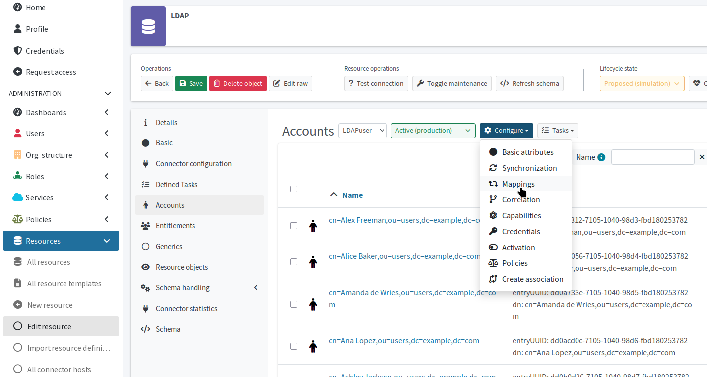
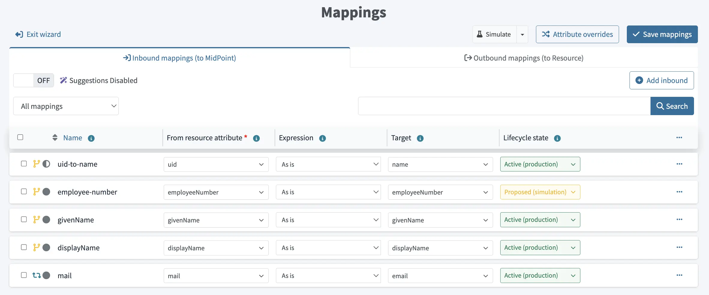
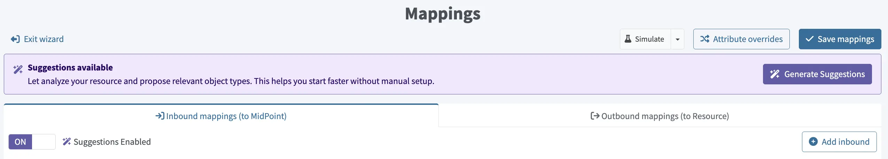
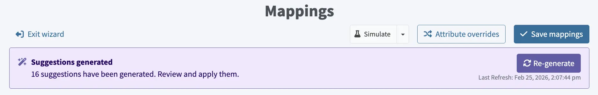
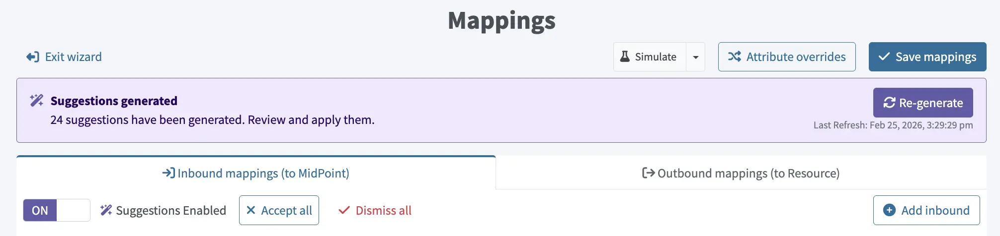
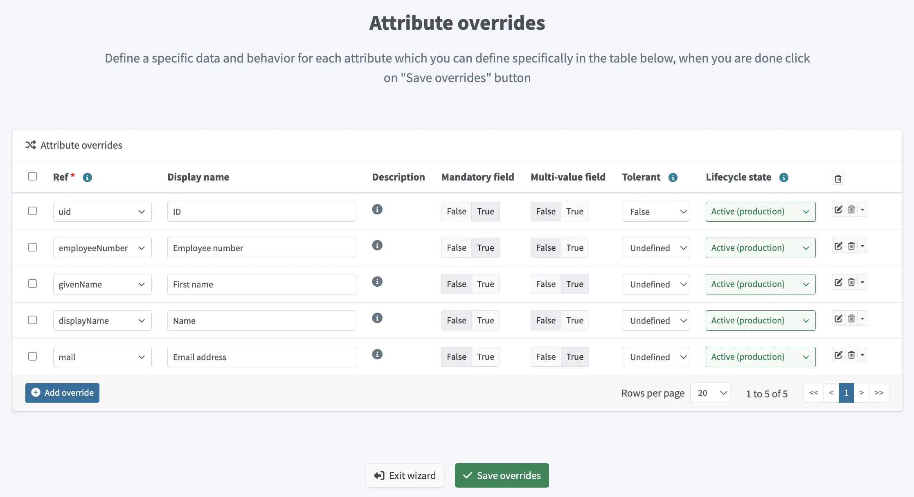

= Configure object type mappings
:page-nav-title: Mappings
:page-toc: top
:experimental:
:page-since: "4.8"
:page-keywords: mapping, inbound mapping, outbound mapping, attribute overrides
:page-description: Configure mappings to define how midPoint manages and transforms data you need to exchange among various systems connected to it.

Mapping is a mechanism that takes input properties from a source, transforms them, and inserts the result into a target property.
In other words, mappings are your means of data transformation and exchange among various systems you have connected to midPoint.

Refer to xref:/midpoint/reference/expressions/[] for more details on the topic.

[[inbound_mappings]]
[[outbound_mappings]]
== Inbound vs. outbound mappings

There are two complementary kinds of mapping rules, inbound and outbound.

*Inbound mappings* transfer data from xref:/midpoint/reference/schema/focus-and-projections/[projections] (e.g., accounts) on the resource side to xref:/midpoint/reference/schema/focus-and-projections/[focal objects] (e.g., users) on the midPoint side.
They map data in the direction which points _into_ midPoint.
For example, you can use inbound mappings to populate midPoint user attributes with data from your remote application, such as an HR system.

*Outbound mappings* define how to populate the resource-side object attributes with the values from focal object attributes in midPoint.
They map data in the direction which points _out of_ midPoint.

For each mapping (of either direction), you need to define:

* A *name* which should be descriptive and has to be unique across the whole midPoint xref:/glossary/#resource[resource].
* A *source* attribute, the value of which serves as the input for the mapping rule.
* A *target* property to which the mapping sends its output.
* An *expression* declaring how to handle the input value.
* A *lifecycle state*.

For inbound mappings, the source is an attribute in the resource and the target is a focus property in midPoint.
Conversely, for outbound mappings, the source is in midPoint and the target is in the resource.

[[configure-mapping-rules]]
== Configure mappings

To configure mappings in a midPoint resource:

. In icon:database[] *Resources* > icon:database[] *All Resources*, select your resource.
. In icon:male[] *Accounts*, click icon:cog[] btn:[Configure] > icon:retweet[] *Mappings*.

+
.Configuration menu in the resource account list as an entry point to the mapping rules wizard

+
The mapping configuration screen contains two tabs:

* [.nowrap]#icon:arrow-right-to-bracket[] *Inbound mappings* (to midPoint)#
* [.nowrap]#icon:arrow-right-from-bracket[] *Outbound mappings* (to resource)#

+
.A list of configured inbound mappings

. Select a tab according to which direction you need to configure.

. You can:

* Create mappings manually by clicking [.nowrap]#icon:circle-plus[] btn:[Add inbound]# or [.nowrap]#icon:circle-plus[] btn:[Add outbound]#.
* Use an artificial intelligence (AI) assistant to help you create mappings - See <<use-ai-to-generate-mappings>> and then return here to continue modifying the AI suggested mappings if needed.

. Configure the mapping:

* *Name*: Name your mapping descriptively.
    This is convenient during troubleshooting and when using xref:/midpoint/reference/resources/resource-configuration/inheritance/[resource template inheritance].
* *From resource attribute* (inbound mapping): Select a resource attribute that is used as an input for the mapping.
* *Source* (outbound mapping): Select a midPoint focus property to be used as an input for the mapping.
* *Expression*: Select how to handle the source attribute value.
    Refer to xref:/midpoint/reference/expressions/expressions/#expression-evaluators[] for more details.
    ** _As is_ (default): Copy values without changes.
    ** _Literal_: Specify one or more constant values upon clicking btn:[Show values].
    ** _Script_: Define a more complex behavior using a script upon clicking btn:[Show script].
    ** _Generate_: Generate a random string.
        You can use this to generate passwords.
        Click btn:[Show generate] to select the mode:
        *** _Policy_: Generate a password abiding a default or explicitly selected xref:/midpoint/reference/security/credentials/password-policy/[password policy].
        *** _Universally Unique Identifier_: Generate a random unique identifier (UUID).
// The UUID mode does not take any policy, selected or not, into account. The related schema docs: https://github.com/Evolveum/midpoint/blob/a6d3e857d2f989822d157f06dce84cc4be55d4b3/infra/schema/src/main/resources/xml/ns/public/common/common-core-3.xsd#L6525 @dakle 2026-01-13
    ** _Path_: Reference a property or a variable upon clicking btn:[Show path].
* *Target* (inbound mapping): Select a midPoint property in which to store the mapping output.
* *To resource attribute* (outbound mapping): Select a resource property in which to store the mapping output.
* *Lifecycle state*: Select the xref:/midpoint/reference/concepts/object-lifecycle/[lifecycle state] of the mapping.

. To check that your mapping configuration works as expected, you can run a <<simulation,simulation>>.
. Click [.nowrap]#icon:check[] btn:[Save mappings]# to save your configuration.

[TIP]
====
Use the buttons at the far right of the mapping list rows to delete, rename, or duplicate rules, and to access xref:/midpoint/reference/admin-gui/resource-wizard/object-type/mapping/advanced-mappings/[advanced mapping configuration].
====

=== Mapping types

For faster orientation, individual mappings are marked with icons that represent their type. +
See xref:/midpoint/reference/admin-gui/resource-wizard/object-type/mapping/advanced-mappings/#main-configuration[advanced mapping configuration].

.Mapping type icons
[%autowidth]
|===
| Icon | Mapping type

| icon:retweet[role=teal]
| Standard mapping (*Use for* set to _Undefined_ or _All_).

| icon:code-branch[role=olive]
| Mapping used for correlation (*Use for* set to _Correlation_).

| icon:rotate[role=olive]
| Mapping used for synchronization (*Use for* set to _Synchronization_).

| icon:circle[style=solid]
| Mapping with *Strength* set to _Strong_.

| icon:circle-half-stroke[]
| Mapping with *Strength* set to _Normal_.

| icon:circle[style=regular]
| Mapping with *Strength* set to _Weak_.

|===

[[use-ai-to-generate-mappings]]
== Use AI to generate mappings
To configure mappings faster and more efficiently, use the midPoint AI assistant to generate mappings based on your resource and midPoint schema.

. Click [.nowrap]#icon:wand-magic-sparkles[] btn:[Suggestions Disabled]# to enable the AI assistant.
If you have not yet configured any mappings, this toggle will not be visible, and you can continue to the next step.
. Click the [.nowrap]#icon:wand-magic-sparkles[] btn:[Generate suggestions]# button to generate mapping suggestions based on the actual data in your resource.
The AI assistant will prompt you to select the data you want to analyze, such as your schema.
To ensure maximum security, no authentication credentials or passwords are shared in the process.
. Inspect the generated suggestions.
Suggestions marked in blue are generated using heuristics based on the resource and midPoint schema, while those marked in purple are generated by the AI assistant.
You will be able to see more details about the suggestions, such as used expressions, later after accepting them.
. Take action on the generated suggestions:
** [.nowrap]#icon:check[] btn:[Accept]# them so that you can open them for editing.
By accepting at this point, you are only accepting the mapping suggestions, and you still remain in control as you will be able to review and modify the suggested mappings before saving them.
** [.nowrap]#icon:x[] btn:[Dismiss]# the suggestions if you do not want to use them at all.

+
If you have dismissed some suggestions by mistake, or have made changes you are not happy with, you can always remove the corrupted mappings and click [.nowrap]#icon:arrows-rotate[] btn:[Re-generate]# to get new suggestions.

+

+
TIP: [.nowrap]#icon:check[] btn:[Accept all]# suggestions so that you can review and edit them all at once.

. Once you have accepted or dismissed the suggestions, you can continue <<configure-mapping-rules,configuring the mappings>>.
. [.nowrap]#icon:check[] btn:[Save mappings]# to save your configuration when done.

[[simulation]]
== Simulate mappings

After you set up your mappings, you can run a simulation to check how they work with the actual data in your resource.

In mappings list, at the top of the page:

. Click [.nowrap]#icon:flask[] btn:[Simulate]#.
. Select the environment you want to run the simulation in, and click [.nowrap]#icon:check[] btn:[Save and execute]#.
. Wait for the simulation to finish, and check the results.
+
TIP: You can always review the simulation results in your mappings by clicking the dropdown menu for [.nowrap]#icon:flask[] btn:[Simulate]#.

[[attribute_override]]
== Attribute overrides

Attribute configuration can be overridden beyond the context of the mappings to give you more maneuvering space, for example to override the default connector behavior.
Attribute overrides apply to any use of the overridden attributes;
you cannot override an attribute only for outbound mappings, for instance.

Refer to xref:/midpoint/reference/resources/resource-configuration/schema-handling/attributes/[] and the nested articles for details.

To configure attribute overrides:

. In icon:database[] *Resources* > icon:database[] *All Resources*, select your resource.
. In icon:male[] *Accounts*, click icon:cog[] btn:[Configure] > icon:retweet[] *Mappings*.
. Click [.nowrap]#icon:shuffle[] btn:[Attribute overrides]#
. To add a new override, click [.nowrap]#icon:circle-plus[] btn:[Add override]#.

[NOTE]
====
By default, all attributes that are or have been used in a mapping rule are listed on the attribute overrides screen.
====

.List of configured attribute overrides

These are the options you can configure for an attribute override:

* *Ref*: Select the attribute to override.
* *Display name*: Specify the display name of the attribute.
* *Description*: Define the description of the attribute.
* *Mandatory field*: Specify if the attribute is mandatory (_True_) or not (_False_).
* *Multi-value field*: Define if the attribute can contain multiple values (_True_) or only a single value (_False_).
* *Tolerant*: Define whether values of a foreign origin are tolerated.
    ** When an attribute is tolerant, midPoint will _tolerate_ values it has not provisioned itself, e.g., those set directly in the resource.
    ** When an attribute is not tolerant, midPoint will proactively remove during a reconciliation any value that that does not originate from midPoint.
* *Lifecycle state*: Select the xref:/midpoint/reference/concepts/object-lifecycle/[lifecycle state] of the attribute.

Click icon:check[] btn:[Save overrides] to save your changes.

[TIP]
====
Use the buttons at the far right of the attribute override list rows to delete or duplicate overrides, and to access xref:/midpoint/reference/admin-gui/resource-wizard/object-type/mapping/advanced-mappings/#advanced_attribute_override[advanced attribute override configuration].
====

include::../../limitation-all.adoc[]

include::../../see-also.adoc[]
