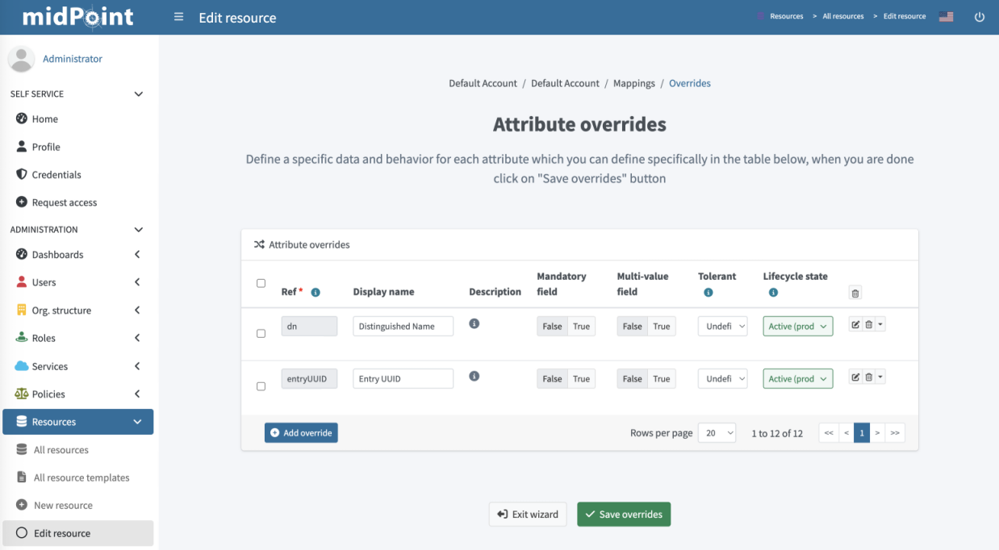

= Resource Wizard: Object Type Mappings
:page-nav-title: Mappings
:page-toc: top
:experimental:
:page-since: "4.9"

Mapping is a mechanism that takes input properties from the source, transforms them, and inserts the result into another property that is then used by a resource.
In other words, mapping enables you to use the data from your source systems, such as HR applications, and adapt them so that you can use them in your target systems, such as LDAP.

To access mappings, click icon:database[] *Resources* > icon:database[] *All resources* > *your_resource* > icon:male[] *Accounts* > icon:cog[] *Configure* > icon:retweet[] *Mappings*.

Mappings are composed of two complementary parts:

* *<<inbound_mappings,Inbound mappings>>*: Control the transfer of data from source systems to midPoint objects.
* *<<outbound_mappings,Outbound mappings>>*: Control the transfer of data from midPoint objects to target systems.

For a more in-depth description, see the following pages:

* xref:/midpoint/reference/admin-gui/resource-wizard/object-type/mapping/advanced-mappings.adoc[]
* xref:/midpoint/reference/resources/resource-configuration/schema-handling/[]
* xref:/midpoint/reference/expressions/mappings/[]
* xref:/midpoint/reference/expressions/[]

[[inbound_mappings]]
== Inbound Mappings
Inbound mapping transforms data from authoritative sources to midPoint. Typically, it is used to populate new user objects with data from an HR system.

image::step-2-mappings-inbound.png[link=step-2-mappings-inbound.png, 100%, title=Table of inbound mappings]

To add an inbound mapping:

. Go to icon:database[] *Resources* > icon:database[] *All resources* > *your_resource* > icon:male[] *Accounts* > icon:cog[] *Configure* > icon:retweet[] *Mappings*.
. Click icon:circle-plus[] btn:[Add inbound].
. Configure the following: +
    * *Name*: Name of the mapping. This is convenient during troubleshooting and when using xref:/midpoint/reference/resources/resource-configuration/inheritance/[resource template inheritance].
    * *From resource attribute*: Defines a resource attribute that is used as input for the mapping.
    * *Expression*: Specifies how the source attribute is used. + 
    Refer to xref:/midpoint/reference/expressions/expressions/#expression-evaluators[] for more details.
        ** _As is_ (default): Copies values from the resource attribute to the midPoint target property.
        ** _Literal_: Enables you to specify a constant value upon clicking btn:[Show values].
        ** _Script_: Enables you to define a more complex behavior using a xref:/midpoint/reference/expressions/expressions/[midPoint expression] (by default in Groovy) upon clicking btn:[Show script].
        ** _Generate_: Enables you to generate a random string using a xref:/midpoint/reference/security/credentials/password-policy/#value-policy[value policy].
        This is typically used for generating passwords. Upon clicking btn:[Show generate], you can choose from the following options in the *Mode* menu:
            *** _Policy_: Selects a value policy that controls the password generation.
            *** _Universal Unique Identifier_: Generates passwords in the form of a Universal Unique Identifier (UUID).
            This is useful when you need passwords that are guaranteed to be unique and not easily guessable.
        ** _Path_: Specifies a data path to a specific attribute or property in the resource object upon clicking btn:[Show path].
        For example, if you want to create an inbound mapping for an attribute like `fullname`, and you want to derive it from the `givenName` and `familyName` attributes, you can set the path to `givenName + ' ' + familyName`.
    * *Target*: Defines a midPoint property that is used to store the value generated by the inbound mapping.
    * *Lifecycle state*: Defines the xref:/midpoint/reference/concepts/object-lifecycle/[lifecycle state] of the mapping.
    This can be used for xref:/midpoint/reference/admin-gui/simulations/[Simulations].
    For example, if you set the lifecycle state to `Proposed`, it will only be used to simulate the mapping without influencing the real data.
    Alternatively, setting the lifecycle state to `Draft` disables the mapping, etc.
. Click icon:check[] btn:[Save mappings]

You can access xref:/midpoint/reference/admin-gui/resource-wizard/object-type/mapping/advanced-mappings.adoc#advanced_inbound_mappings[advanced inbound mapping configuration] by clicking its icon:edit[] *Edit* icon.

You can delete a mapping by clicking the icon:trash-alt[] *Delete* icon.

Click icon:[shuffle] btn:[Attribute overrides] if you need to <<attribute_override,override attribute>> visibility or other behavior.

[[outbound_mappings]]
== Outbound Mappings

Outbound mappings are used to populate target resource attribute values by midPoint properties.

image::step-2-mappings-outbound.png[link=step-2-mappings-outbound.png, 100%, title=Table of outbound mappings]

To add an outbound mapping:

. Go to icon:database[] *Resources* > icon:database[] *All resources* > *your_resource* > icon:male[] *Accounts* > icon:cog[] *Configure* > icon:retweet[] *Mappings* > icon:arrow-right-from-bracket[] *Outbound mappings (to Resource)*.
. Click btn:[Add outbound].
. Configure the individual settings.
The available settings are the same as for <<inbound_mappings,inbound mappings>>.
The difference is that while inbound mappings control data transfer between source systems and midPoint, outbound mappings control data transfer from midPoint to target systems, such as LDAP.
. Click icon:check[] btn:[Save mappings]

You can access xref:/midpoint/reference/admin-gui/resource-wizard/object-type/mapping/advanced-mappings.adoc#advanced_outbound_mappings[advanced outbound mapping configuration] by clicking the icon:edit[] *Edit* icon.

TIP: You can test new mappings without influencing the real data by setting their *Lifecycle state* to _Proposed_ and use xref:/midpoint/reference/admin-gui/simulations/[Simulations].

Click icon:[shuffle] btn:[Attribute overrides] if you need to <<attribute_override,override attribute>> visibility or other behavior.

[[attribute_override]]
== Attribute Override

Attribute configuration can be overridden beyond the context of the mappings to give you more maneuvering space, for example to override the default connector behavior.
For more details on attributes, see the xref:/midpoint/reference/resources/resource-configuration/schema-handling/attributes/[] page.

. On the inbound/outbound mappings page, click icon:[shuffle] btn:[Attribute overrides].
You can then override the following attribute parameters:

    * *Ref*: Specifies the path to the attribute.
The path must point to an object property or to an attribute in the resource schema that belongs to the respective object class.
    * *Display name*: Defines the display name of the attribute.
    * *Description*: Defines the description of the attribute.
    * *Mandatory field*: Defines if the attribute is mandatory (_True_) or not (_False_).
    * *Multi-value*: Defines if the attribute can contain multiple values (_True_) or only a single value (_False_).
    * *Tolerant*: Defines how different values are tolerated.
    If set to _True_, values set outside of midPoint, or outside the object template mappings, are allowed.
    In such a case, synchronization only removes values that are assigned by midPoint or template mappings, while other values that exist in the resource but are not assigned or provisioned by midPoint are tolerated.
    If set to _False_, these other values are not tolerated.
    When midPoint detects them, e.g. during a reconciliation, it removes them.
    * *Lifecycle state*: Defines the xref:/midpoint/reference/concepts/object-lifecycle/[lifecycle state] of the attribute.
. Click icon:check[] btn:[Save overrides] to save your changes.

You can access xref:/midpoint/reference/admin-gui/resource-wizard/object-type/mapping/advanced-mappings.adoc#advanced_attribute_override[advanced attribute override configuration] by clicking the icon:edit[] *Edit* icon.

include::../../limitation-all.adoc[]

include::../../see-also.adoc[]
